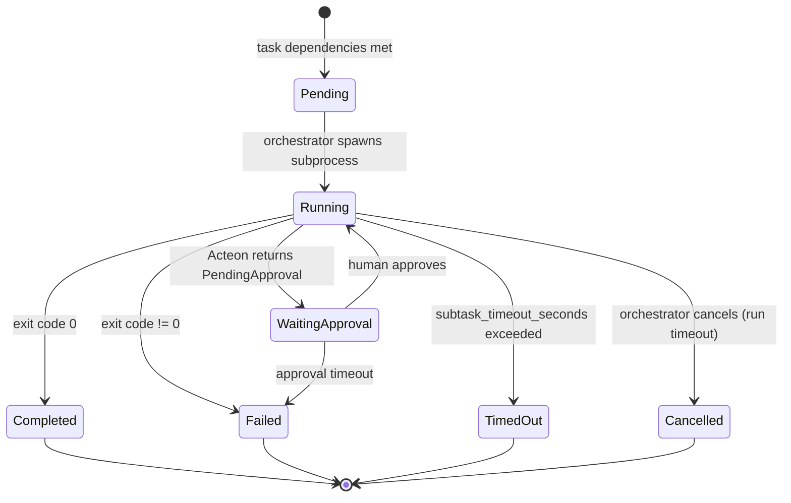

# Agent Swarm Orchestrator — Architecture

## Overview

The `acteon-swarm` crate implements a generic multi-agent orchestration system inspired by hierarchical agent delegation patterns. Rather than implementing LLM orchestration directly, it composes three existing systems — Acteon for safety/workflow, TesseraiDB for knowledge, and the Claude Agent SDK for agent execution — into a cohesive swarm controller.

### Design Principles

1. **No API keys** — agents run through the Claude Agent SDK, which uses the user's existing Claude Code authentication. The orchestrator never handles LLM credentials.
2. **Safety by default** — every agent tool call is gated through Acteon before execution. Fail-closed: if Acteon is unreachable, the action is blocked.
3. **Knowledge sharing, not message passing** — agents do not communicate directly. They share knowledge through TesseraiDB's semantic memory, queried by topic similarity rather than explicit addressing.
4. **Plan-execute-refine** — plans are not fixed. A lightweight refiner runs after each subtask and can adjust the remaining plan based on results.
5. **Orchestrator-driven** — the Rust binary drives all lifecycle decisions. Agents are stateless subprocesses that execute a single subtask and exit.

## Component Architecture

```
┌─────────────────────────────────────────────────────────┐
│                   acteon-swarm CLI                       │
│                                                         │
│  ┌──────────┐  ┌──────────────┐  ┌───────────────────┐ │
│  │ Planner  │  │ Orchestrator │  │ Role Registry     │ │
│  │          │  │              │  │                   │ │
│  │ gatherer │  │ engine       │  │ builtins (5)     │ │
│  │ validator│  │ spawner      │  │ custom (TOML)    │ │
│  │          │  │ monitor      │  │ prompt builder   │ │
│  │          │  │ refiner      │  │                   │ │
│  └──────────┘  └──────┬───────┘  └───────────────────┘ │
│                       │                                  │
│  ┌────────────────────┼────────────────────────────────┐│
│  │ Integration Layer  │                                ││
│  │                    │                                ││
│  │  ┌─────────────┐  │  ┌──────────────────────────┐  ││
│  │  │ Acteon      │  │  │ TesseraiDB               │  ││
│  │  │             │  │  │                          │  ││
│  │  │ rules.rs    │  │  │ client.rs (reqwest)      │  ││
│  │  │ quota_mgr   │  │  │ twins.rs (run/session)   │  ││
│  │  │ audit_watch  │  │  │ semantic.rs (memory)     │  ││
│  │  └──────┬──────┘  │  └──────────┬───────────────┘  ││
│  └─────────┼─────────┼────────────┼────────────────────┘│
└────────────┼─────────┼────────────┼──────────────────────┘
             │         │            │
             ▼         ▼            ▼
      ┌──────────┐ ┌────────┐ ┌──────────┐
      │ Acteon   │ │ Claude │ │TesseraiDB│
      │ Server   │ │ Agent  │ │ Server   │
      │          │ │ SDK    │ │          │
      └──────────┘ └────────┘ └──────────┘
```

## Data Model

### `SwarmPlan`

The plan is the central artifact — produced by plan gathering, validated, approved, and then executed:

```rust
pub struct SwarmPlan {
    pub id: String,
    pub objective: String,
    pub scope: SwarmScope,         // working dir, limits, approval requirements
    pub success_criteria: Vec<String>,
    pub tasks: Vec<SwarmTask>,     // ordered by dependencies
    pub agent_roles: Vec<String>,
    pub estimated_actions: u64,    // for quota sizing
    pub created_at: DateTime<Utc>,
    pub approved_at: Option<DateTime<Utc>>,
}

pub struct SwarmTask {
    pub id: String,
    pub name: String,
    pub description: String,
    pub assigned_role: String,     // must exist in RoleRegistry
    pub subtasks: Vec<SwarmSubtask>,
    pub depends_on: Vec<String>,   // task IDs (forms a DAG)
    pub priority: u32,
}

pub struct SwarmSubtask {
    pub id: String,
    pub name: String,
    pub description: String,
    pub prompt: String,            // actual prompt sent to the agent
    pub allowed_tools: Option<Vec<String>>,  // override role defaults
    pub timeout_seconds: u64,
}
```

The dependency graph between tasks must be a DAG. The validator uses DFS cycle detection before execution.

### `AgentRole`

Roles define agent capabilities. The `system_prompt_template` is a MiniJinja template rendered with task/subtask context:

```rust
pub struct AgentRole {
    pub name: String,
    pub description: String,
    pub system_prompt_template: String,  // MiniJinja: {{ task.name }}, {{ subtask.prompt }}
    pub allowed_tools: Vec<String>,      // Claude Code tool names
    pub can_delegate_to: Vec<String>,
    pub max_concurrent_instances: usize,
}
```

### `SwarmRun`

Runtime state of an active execution:

```rust
pub struct SwarmRun {
    pub id: String,
    pub plan_id: String,
    pub status: SwarmRunStatus,      // Initializing → Running → Completed/Failed/TimedOut
    pub started_at: DateTime<Utc>,
    pub finished_at: Option<DateTime<Utc>>,
    pub task_status: HashMap<String, TaskRunStatus>,
    pub metrics: RunMetrics,         // actions, blocks, agents, refinements
}
```

## Agent Lifecycle



### Spawn Sequence

1. **Workspace setup**: Generate `.claude/settings.json` with `PreToolUse`/`PostToolUse`/Stop hooks pointing to `acteon-swarm-hook`
2. **System prompt**: Render the role's MiniJinja template with task and subtask context
3. **Agent SDK bridge**: If `agent-bridge.mjs` is found, spawn via Node.js for streaming NDJSON. Otherwise fall back to `claude -p` with `--output-format stream-json`
4. **Environment**: Set `ACTEON_URL`, `ACTEON_AGENT_ROLE`, `SWARM_RUN_ID`, `SWARM_TASK_ID`, `SWARM_SUBTASK_ID`, `SWARM_AGENT_ID`

### Hook Binary

`acteon-swarm-hook` is a compiled Rust binary (not a bash script) with three subcommands:

| Subcommand | Hook Type | Behavior |
|------------|-----------|----------|
| `gate` | `PreToolUse` | Dispatch to Acteon `/v1/dispatch`. Exit 0 (allow) or 2 (block). Fail-closed. |
| `record` | `PostToolUse` (async) | Store episodic memory in TesseraiDB. Always exit 0. |
| `complete` | Stop (async) | Mark session twin as complete. Always exit 0. |

The gate subcommand replicates the logic from `examples/agent-swarm-coordination/hooks/acteon-gate.sh` but in Rust, with native JSON parsing and dual Acteon + TesseraiDB integration.

## Orchestration Engine

### Dependency Graph Traversal

The engine maintains three data structures:

- **Task DAG**: built from `SwarmTask.depends_on` fields via topological sort
- **Completed set**: task IDs that have finished successfully
- **Run status map**: per-task status (Pending/Running/Completed/Failed/Skipped)

Each iteration of the main loop:

1. Find tasks where all `depends_on` entries are in the completed set
2. Execute them sequentially (parallel execution is a planned enhancement)
3. After each subtask: run the refiner, update the completed set

### Plan Refinement

The refiner is a lightweight `claude -p` invocation that receives:

- The just-completed subtask's output
- A summary of remaining tasks

It produces one of four actions:

- **Continue** — no changes
- **SkipTasks** — remove tasks that are no longer needed
- **AddTasks** — insert recovery or follow-up tasks
- **Reprioritize** — reorder remaining tasks

This enables adaptive execution without re-planning the entire swarm.

### Timeout and Cancellation

- **Per-subtask**: `timeout_seconds` on `SwarmSubtask` (default 300s)
- **Per-run**: `max_duration_minutes` on `SwarmDefaults` (default 60min)
- **Quota**: Acteon quota blocks actions when budget is exhausted

On timeout, the orchestrator stops spawning new agents and waits for running ones to complete or be killed.

## TesseraiDB Integration

### Twin Model

```
SwarmRun twin                     AgentSession twin
┌─────────────────────┐          ┌────────────────────────┐
│ id: swarm-run-{id}  │          │ id: swarm-agent-{id}   │
│ type: SwarmRun       │◄────────│ type: AgentSession      │
│ objective: "..."     │   runs  │ role: "coder"           │
│ status: running      │         │ task_id: "task-2"       │
│ task_ids: [...]      │         │ status: running         │
└─────────────────────┘          └────────────────────────┘
```

Twins provide structured entity tracking. Semantic memories provide the unstructured knowledge layer. Together they give both queryable state and topic-based search.

### Memory Flow

```
Agent action (Write file)
    │
    ├── PreToolUse → acteon-swarm-hook gate → Acteon (allow/block)
    │
    └── PostToolUse → acteon-swarm-hook record → TesseraiDB
            │
            └── Semantic Memory {
                  type: episodic,
                  agent_id: "...",
                  content: "Created src/handler.rs with GET /users endpoint",
                  topics: ["file-creation", "rust", "api-endpoint"],
                  confidence: 1.0
                }
```

Other agents query these memories via `POST /api/v1/semantic-memory/search` before starting their work, enabling implicit coordination without direct message passing.

## Safety Architecture

### Defense in Depth

```
Layer 0: Hard blocks (destructive commands, credential access)
Layer 1: Approval gates (git push, package install)
Layer 2: Rate limiting (per-agent + swarm-wide throttle)
Layer 3: Deduplication (cross-agent file write coordination)
Layer 4: Quota budget (actions per run)
Layer 5: Timeout (per-subtask + per-run)
Layer 6: Monitor (stuck/runaway agent detection)
```

### Tenant Isolation

Each swarm run uses a unique tenant: `swarm-{run_id}`. This means:

- Throttle counters are per-run (concurrent runs don't interfere)
- Dedup state is per-run
- Quota budgets are per-run
- Audit trails can be queried per-run

### Fail-Closed Design

If any safety component is unreachable:

- **Acteon down**: hook returns exit 2 (block all actions)
- **TesseraiDB down**: memory recording is skipped (agent continues without knowledge sharing)
- **Agent SDK unavailable**: falls back to direct `claude -p`

The asymmetry is intentional: safety is mandatory, knowledge sharing is optional.

## Testing Strategy

| Level | What | How |
|-------|------|-----|
| Unit | Plan validation, topological sort, cycle detection | `cargo test -p acteon-swarm --lib` (42 tests) |
| Unit | Role registry, prompt rendering | Direct function calls with test fixtures |
| Unit | Monitor alerts, dedup key generation | State machine tests |
| Integration | Full orchestration loop | Mock Acteon + TesseraiDB HTTP servers + mock agent spawner |
| E2E | Live execution | Requires running Acteon + TesseraiDB + Claude Code |

## Future Work

- **Parallel task execution**: spawn agents for independent tasks concurrently (currently sequential)
- **Agent delegation**: allow an agent to spawn sub-agents for its subtasks
- **Persistent sessions**: resume interrupted swarm runs from TesseraiDB state
- **MCP server**: expose swarm state as MCP tools for querying from within agent sessions
- **Web UI**: dashboard showing live swarm execution, agent status, and knowledge graph
