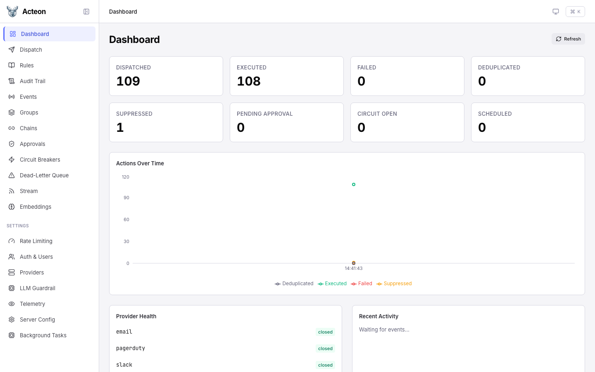

# Dashboard

The dashboard provides a real-time overview of your Acteon gateway's health and activity.

## Metric Cards

The top section displays key counters that update on every refresh:

| Metric | Description |
|--------|-------------|
| **Dispatched** | Total actions received by the gateway |
| **Executed** | Actions successfully sent to a provider |
| **Failed** | Actions that failed during execution |
| **Deduplicated** | Actions dropped by deduplication rules |
| **Suppressed** | Actions blocked by suppression rules |
| **Pending Approval** | Actions waiting for human approval |
| **Circuit Open** | Number of circuit breakers currently open |
| **Scheduled** | Actions waiting for their scheduled start time |

Click any metric card to navigate to the relevant detail page (e.g., clicking **Suppressed** takes you to the Audit Trail filtered by suppressed outcomes).

## Actions Over Time

A time-series chart shows action throughput broken down by outcome category:

- **Executed** (green) -- successfully delivered actions
- **Deduplicated** (gray) -- actions dropped by dedup rules
- **Failed** (red) -- execution failures
- **Suppressed** (amber) -- actions blocked by rules

The chart auto-refreshes with the dashboard polling interval.

## Provider Health

The bottom-left panel shows registered providers and their current circuit breaker state:

- **closed** -- normal operation
- **open** -- circuit tripped, actions are rejected or routed to fallback
- **half_open** -- recovery probe in progress

## Recent Activity

The bottom-right panel shows a live feed of dispatched events via Server-Sent Events (SSE). Events appear as they flow through the gateway.

## Refresh

Click the **Refresh** button in the top-right corner to manually reload all dashboard data. The dashboard also auto-refreshes every 15 seconds.
