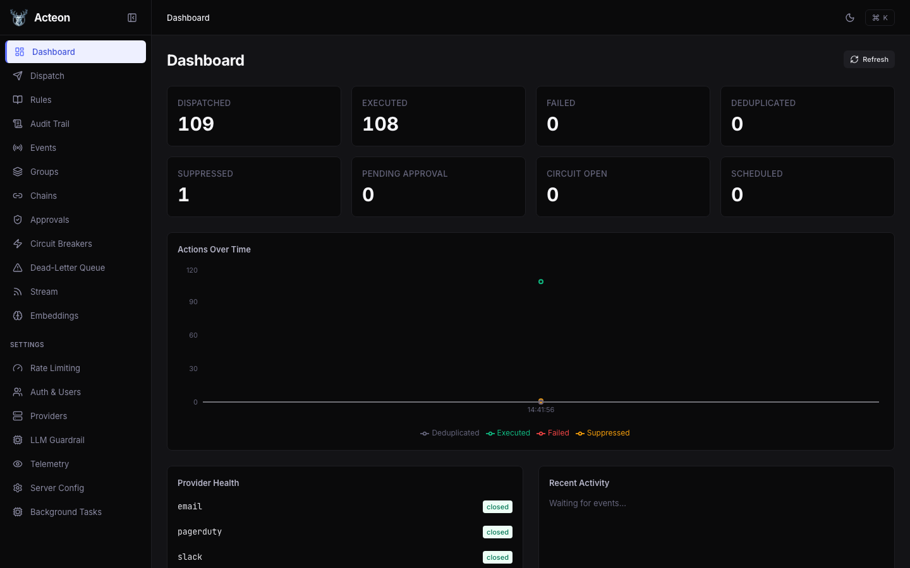

# Admin UI

Acteon ships with a built-in web-based admin dashboard for monitoring, inspecting, and managing your action gateway in real time. The UI connects to the same REST API used by the client SDKs.


## Features

<div class="grid" markdown>

<div class="card" markdown>
### [Dashboard](dashboard.md)
Real-time metrics, action throughput charts, provider health, and recent activity feed.
</div>

<div class="card" markdown>
### [Operations](operations.md)
Dispatch actions, browse rules, inspect the audit trail, manage approvals, and monitor chains.
</div>

<div class="card" markdown>
### [Settings](settings.md)
View server configuration, manage providers and circuit breakers, and toggle dark mode.
</div>

</div>

## Quick Start

The admin UI is served by the Acteon server. No separate installation is required.

### Development Mode

To run the UI locally with hot-reload for development:

```bash
# Terminal 1: Start the Acteon server
cargo run -p acteon-server -- -c examples/simulation.toml

# Terminal 2: Start the Vite dev server (proxies API to port 8080)
cd ui
npm install
npm run dev
```

The dev server starts at [http://localhost:5173](http://localhost:5173) and proxies all API calls to the backend on port 8080.

### Production Mode

In production, build the UI as static assets and serve them with the Acteon server or behind a reverse proxy:

```bash
cd ui
npm run build        # Outputs to ui/dist/
```

!!! tip
    The dev server proxy is configured in `ui/vite.config.ts`. All `/v1/*`, `/admin/*`, `/health`, and `/metrics` paths are forwarded to the backend.

## Dark Mode

The UI supports system-detected, light, and dark color schemes. Toggle between them on the **Settings > Server Config** page.



## Keyboard Shortcuts

| Shortcut | Action |
|----------|--------|
| ++cmd+k++ | Open command palette |
| ++escape++ | Close dialogs and drawers |

The command palette provides quick navigation to any page by typing its name.
