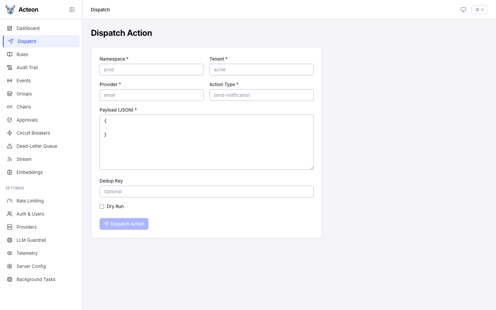
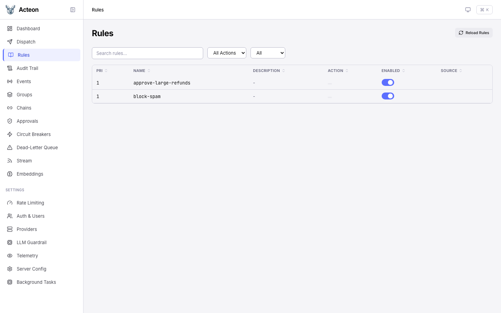
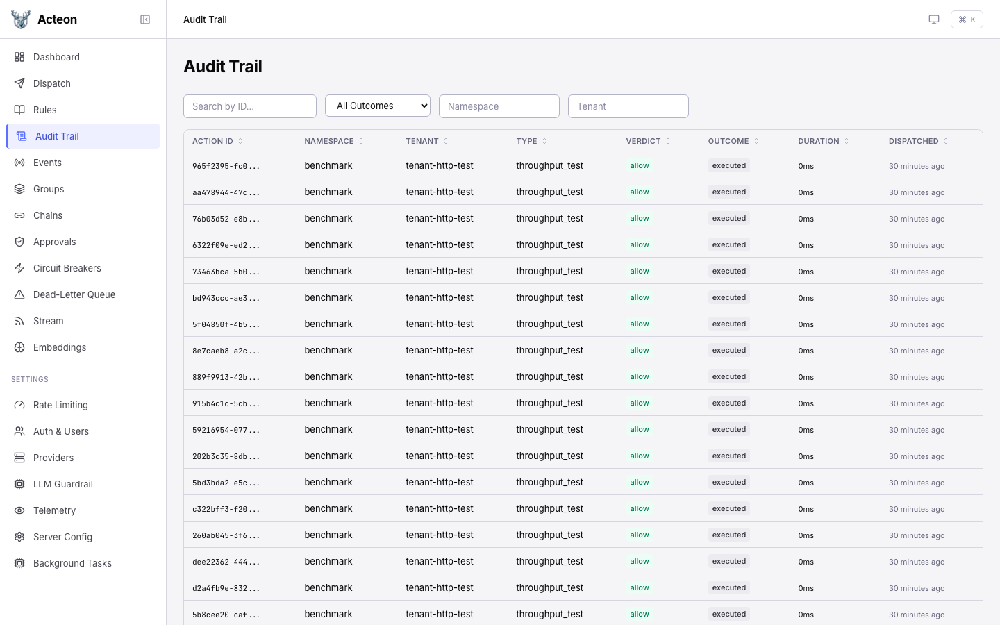
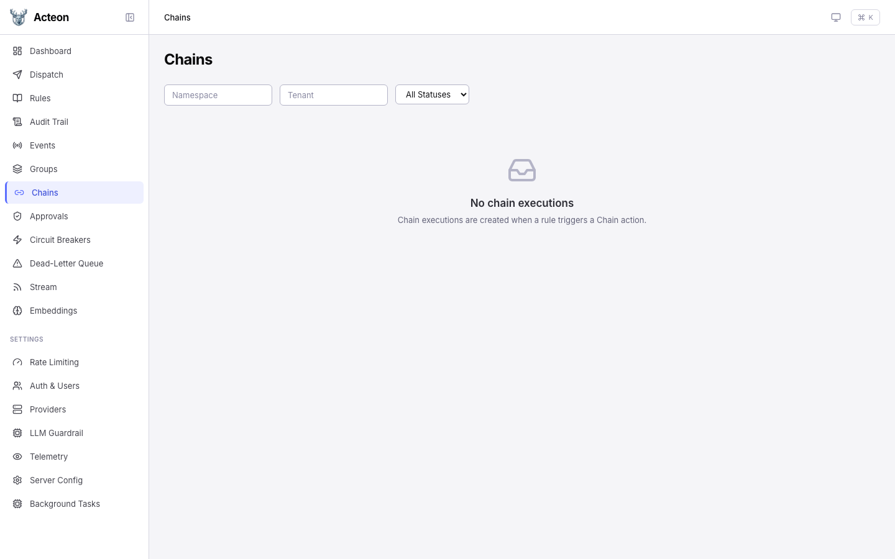
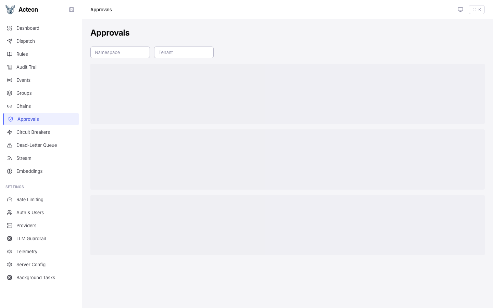
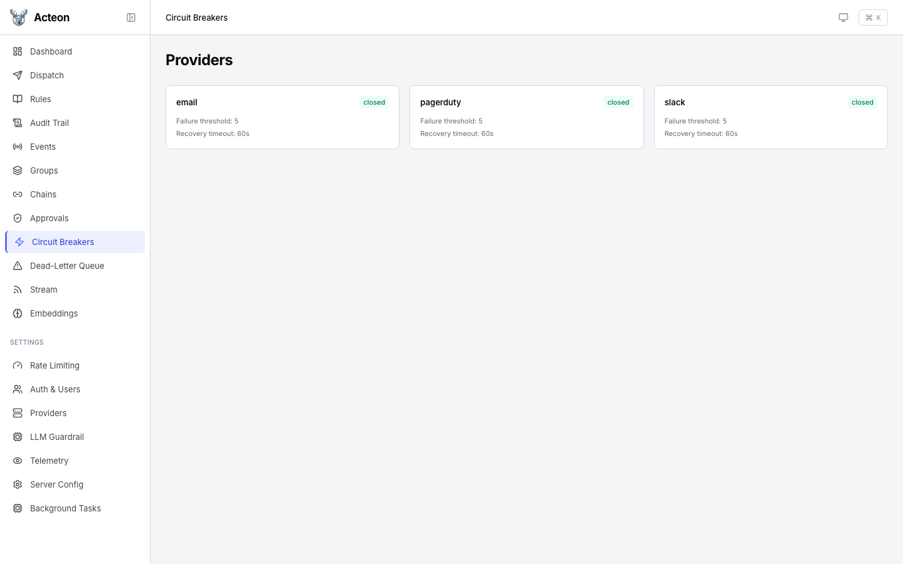
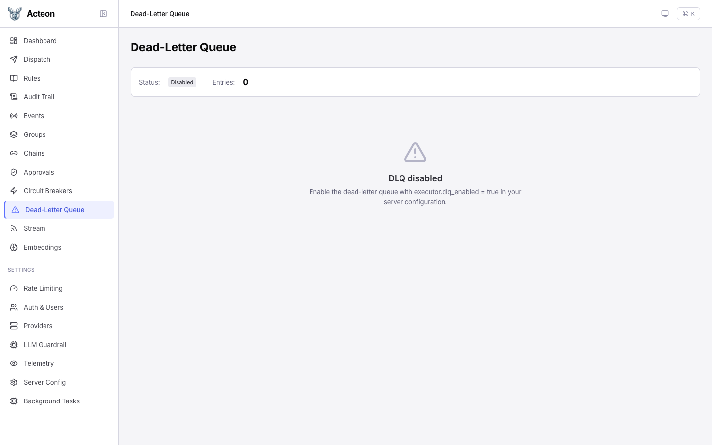
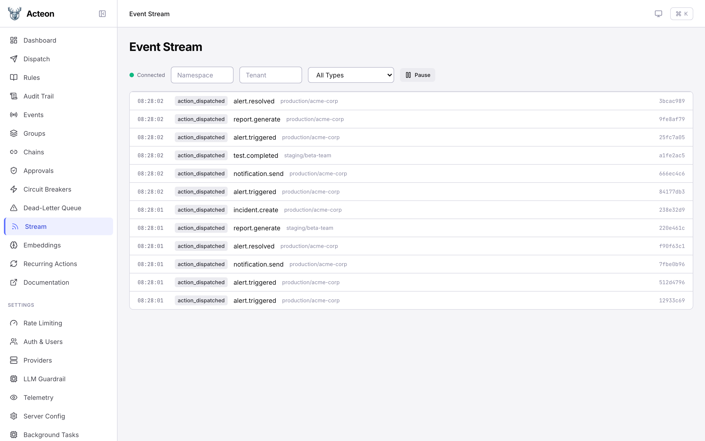

# Operations

The operations pages let you interact with the gateway: dispatching actions, inspecting rules, browsing the audit trail, managing approvals, and monitoring chains.

## Dispatch

Send actions through the gateway directly from the UI. Fill in the required fields and click **Dispatch**.

| Field | Required | Description |
|-------|----------|-------------|
| **Namespace** | Yes | Logical grouping for the action |
| **Tenant** | Yes | Tenant identifier |
| **Provider** | Yes | Target provider name |
| **Action Type** | Yes | Type of action to dispatch |
| **Payload** | Yes | JSON payload body |
| **Dedup Key** | No | Deduplication key |
| **Fingerprint** | No | Event fingerprint for state machines |
| **Dry Run** | No | Toggle to simulate without executing |

!!! tip
    Enable **Dry Run** to test rule evaluation without actually sending the action to a provider. The response shows what *would* happen.

## Rules

Browse all loaded rules with their priority, action type, and enabled status. The rules page provides:

- **Search** -- filter rules by name
- **Filter by source** -- YAML, CEL, or API-defined rules
- **Filter by action type** -- show only rules matching a specific type
- **Reload** -- click the reload button to re-read rules from disk

## Audit Trail

The audit trail shows a paginated, filterable log of every action and its outcome.

### Filters

- **Namespace**, **Tenant**, **Provider**, **Action Type** -- text filters
- **Outcome** -- filter by executed, suppressed, deduplicated, failed, etc.
- **Verdict** -- filter by the rule verdict (allow, suppress, etc.)
- **Date range** -- filter by dispatch time

### Detail Drawer

Click any audit row to open a detail drawer showing:

- Full action metadata and timing
- Rule verdict and matched rule name
- Outcome details and provider response
- Action payload (if stored)
- **Replay** button to re-dispatch the same action

## Chains

Monitor active and completed [task chains](../features/chains.md). The chain list shows:

- Chain name and ID
- Current step progress
- Status (running, completed, failed, cancelled)
- Timing information

Click a chain to view step-by-step execution details, including per-step status, response data, and the execution path for branching chains.

## Approvals

Review pending [human approval](../features/approvals.md) requests. Each approval card shows:

- The action that triggered the approval
- Which rule required approval
- Expiration countdown
- **Approve** and **Reject** buttons

## Circuit Breakers

View registered providers and their circuit breaker states. Click a provider card to open a detail drawer where you can:

- View circuit breaker thresholds and recovery timeout
- **Trip** -- force-open the circuit (rejects all actions)
- **Reset** -- force-close the circuit (resume normal operation)

## Dead-Letter Queue

Browse actions that failed after exhausting all retries. The DLQ page lets you inspect failures and replay them.

## Event Stream

A live event stream powered by SSE. Watch actions flow through the gateway in real time with filters for namespace, tenant, and event type. Use the **Pause** / **Resume** button to freeze the stream for inspection.
