# Operations

The operations pages let you interact with the gateway: dispatching actions, inspecting rules, browsing the audit trail, managing approvals, and monitoring chains.

## Alerting

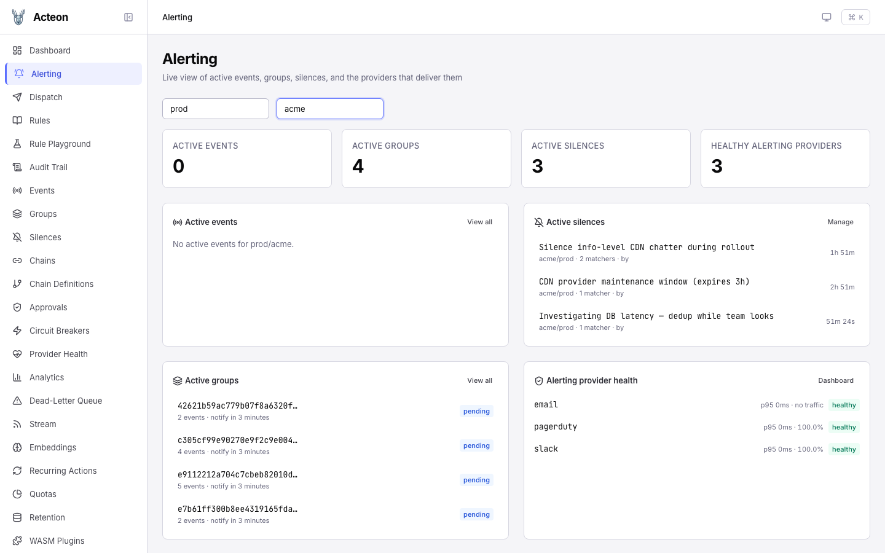

The **Alerting** page is a unified command center for on-call workflows. It surfaces the four alerting primitives that would otherwise live on separate pages in a single view.

At the top, enter a **namespace** and **tenant** to scope the events and groups cards (silences and provider health load without filters). Four stat cards summarize the current state, and the panels below expand each one into a live list. The screenshot above shows the `prod / acme` scope with:

- **0 active events** — the empty state, because no `state_machine` rule is matching this namespace/tenant. When the lifecycle is tracked, this card fills with firing events and a state badge per row.
- **4 active groups** — the `group-alerts-by-service` rule has batched incoming alerts into 4 pending groups (checkout-api: 5 events, payment-service: 4 events, auth-service: 2 events, events-consumer: 2 events). Each row links through to the **Groups** page.
- **3 active silences** — CDN provider maintenance window, an `info`-level CDN chatter silence (regex), and a "postgres-primary investigating" silence. Each row shows the matcher count, who created it, and a countdown to its end time.
- **3 healthy alerting providers** — `email`, `pagerduty`, `slack`, all reporting `closed` circuit breakers, with p95 latency and success-rate rollups from the provider metrics snapshot.

### Panel contents

| Card | Data source | Filter scope | Empty state |
|------|-------------|--------------|-------------|
| Active events | `GET /v1/events` | Requires `namespace` + `tenant` | "Enter a namespace and tenant to load active events" |
| Active groups | `GET /v1/groups` | Requires `namespace` + `tenant` | "Enter a namespace and tenant to load active groups" |
| Active silences | `GET /v1/silences` | Auto-injects single-tenant scope; otherwise filters post-hoc to the caller's tenant grants | "No active silences" |
| Alerting provider health | `GET /v1/providers/health` | Filtered to known alerting provider names | Link to Settings → Providers |

### What the API returns

The stat cards and lists render the same JSON the REST API emits. The active groups card maps directly from:

```json
// GET /v1/groups?namespace=prod&tenant=acme
{
  "total": 4,
  "groups": [
    {
      "group_id": "d3e78396-ccfa-41a4-a9e3-cfa8a62f2268",
      "group_key": "e9112212a704c7cbeb82010d1917a65c0266ae72fa3037e6c6bb0629cf247ffd",
      "event_count": 5,
      "state": "pending",
      "notify_at": "2026-04-12T00:48:28.860743+00:00",
      "created_at": "2026-04-12T00:39:03.654291+00:00"
    }
    // …three more groups
  ]
}
```

The provider health card maps from:

```json
// GET /v1/providers/health
{
  "providers": [
    {
      "provider": "pagerduty",
      "healthy": true,
      "circuit_breaker_state": "closed",
      "total_requests": 4,
      "successes": 4,
      "failures": 0,
      "success_rate": 100.0,
      "avg_latency_ms": 0.0515,
      "p50_latency_ms": 0.032,
      "p95_latency_ms": 0.128,
      "p99_latency_ms": 0.128
    }
    // …slack, email, etc.
  ]
}
```

A provider is classified as *alerting-oriented* when its name matches any of: `opsgenie`, `pagerduty`, `victorops`, `splunk`, `pushover`, `telegram`, `wechat`, `slack`, `discord`, `teams`, `twilio`, `email`, `webhook`, `sns`. Storage, LLM, and compute providers are intentionally hidden from this card.

!!! tip
    Use this page as the first thing you open during an incident — it shows you which events are firing, which groups are batching them up, which silences are already in place, and whether the delivery channels are healthy.

## Silences

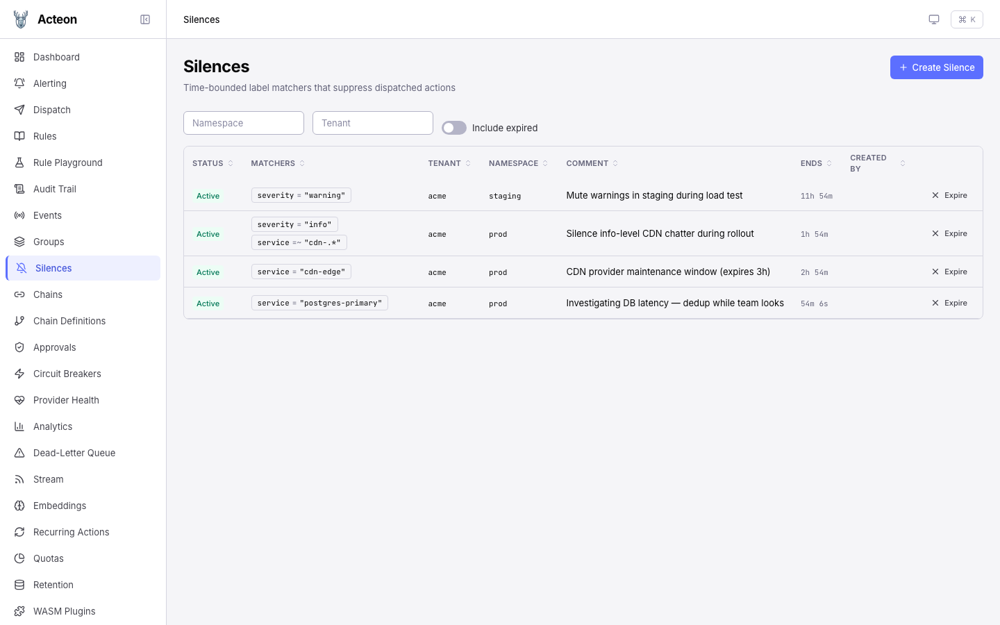

Silences are time-bounded label matchers that suppress dispatched actions during maintenance windows or incident response. The **Silences** page provides full CRUD against the `/v1/silences` REST API. The screenshot above shows 4 active silences across the `prod` and `staging` namespaces — three covering CDN / Postgres service labels for incident response, and one broad `severity = warning` silence in `staging` for a load test. Each row shows:

| Column | Description |
|---|---|
| **Status** | `Active` / `Expired` badge. Expired rows only appear with the *Include expired* toggle on. |
| **Matchers** | Each matcher rendered as a `name op "value"` pill (`=` / `!=` / `=~` / `!~`). Multiple matchers are AND-ed. |
| **Tenant** / **Namespace** | Scope the silence applies to. Hierarchical — a silence on `acme` covers `acme.us-east`. |
| **Comment** | Free-form text recorded at creation; shown in audit records when the silence intercepts a dispatch. |
| **Ends** | Countdown to end time for active silences, relative timestamp for expired. |
| **Created by** | Identity of the caller that created the silence (from the auth context). |

Click the **Expire** action on any row for immediate soft-expire, or click the row itself to open the detail drawer, where you can extend the silence by any number of additional minutes — the new end time is anchored to the current `ends_at` (not to `now`), so extending a silence with 8h left by "60 minutes" gives you 9h, not 1h.

### Creating a silence

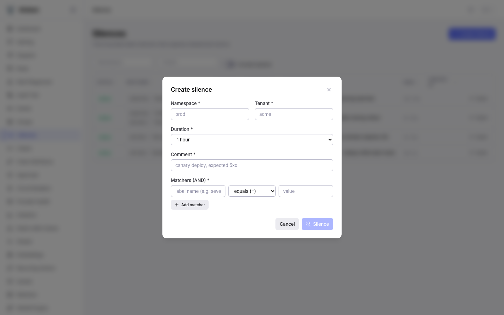

The **Create Silence** modal covers the full create flow in one pass:

| Field | Required | Notes |
|---|---|---|
| **Namespace** | Yes | Logical grouping; must be covered by the caller's grants. |
| **Tenant** | Yes | Tenant the silence applies to. Hierarchical — see above. |
| **Duration** | Yes | Preset dropdown: `15 minutes`, `1 hour`, `2 hours`, `4 hours`, `8 hours`, `1 day`, `1 week`. Sent as `duration_seconds`; the backend computes `ends_at = starts_at + duration`. |
| **Comment** | Yes | Required for audit-trail context. Shown in the list and in `audit` records referencing the silence. |
| **Matchers** | Yes (≥1) | Each row is a `{name, op, value}` triple. Click **Add matcher** to AND another matcher onto the silence. Regex matchers are capped at 256 characters and 64 KB compiled DFA to prevent ReDoS. |

The request body matches the `/v1/silences` POST shape exactly:

```json
// POST /v1/silences
{
  "namespace": "prod",
  "tenant": "acme",
  "matchers": [
    { "name": "service", "op": "regex", "value": "cdn-.*" },
    { "name": "severity", "op": "equal", "value": "info" }
  ],
  "duration_seconds": 7200,
  "comment": "Silence info-level CDN chatter during rollout"
}
```

And the response — which is what the row in the list view is populated from:

```json
{
  "id": "019d7f1e-774b-7020-818f-339f243b4089",
  "namespace": "prod",
  "tenant": "acme",
  "matchers": [
    { "name": "service", "op": "regex", "value": "cdn-.*" },
    { "name": "severity", "op": "equal", "value": "info" }
  ],
  "starts_at": "2026-04-12T00:36:36.297488Z",
  "ends_at":   "2026-04-12T02:36:36.297488Z",
  "created_by": "operator@acme.example",
  "comment": "Silence info-level CDN chatter during rollout",
  "created_at": "2026-04-12T00:36:36.297488Z",
  "updated_at": "2026-04-12T00:36:36.297488Z",
  "active": true
}
```

!!! warning "Matchers are immutable"
    The extend / edit flow only changes `ends_at` and `comment`. To change matchers you must expire the silence and create a new one. This keeps audit trail references stable — an action suppressed by silence `019d7f1e-…` will always resolve back to the same matcher set.

See [Silences](../features/silences.md) for the matcher semantics, regex limits, and HA sync timing.

## Dispatch

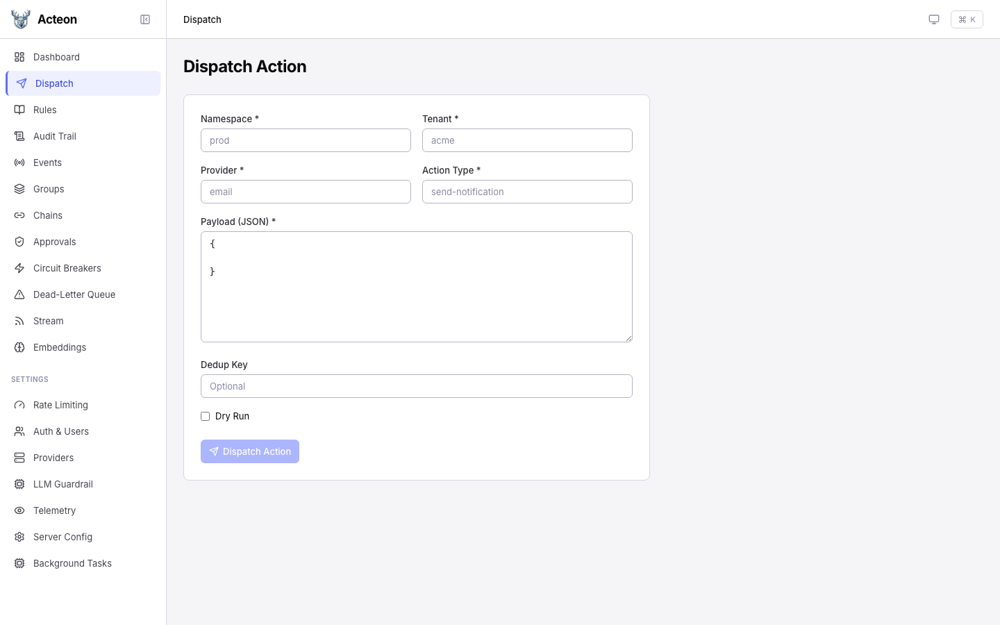

Send actions through the gateway directly from the UI. Fill in the required fields and click **Dispatch**.

| Field | Required | Description |
|-------|----------|-------------|
| **Namespace** | Yes | Logical grouping for the action |
| **Tenant** | Yes | Tenant identifier |
| **Provider** | Yes | Target provider name |
| **Action Type** | Yes | Type of action to dispatch |
| **Payload** | Yes | JSON payload body |
| **Dedup Key** | No | Deduplication key |
| **Fingerprint** | No | Event fingerprint for state machines |
| **Dry Run** | No | Toggle to simulate without executing |

!!! tip
    Enable **Dry Run** to test rule evaluation without actually sending the action to a provider. The response shows what *would* happen.

## Rule Playground

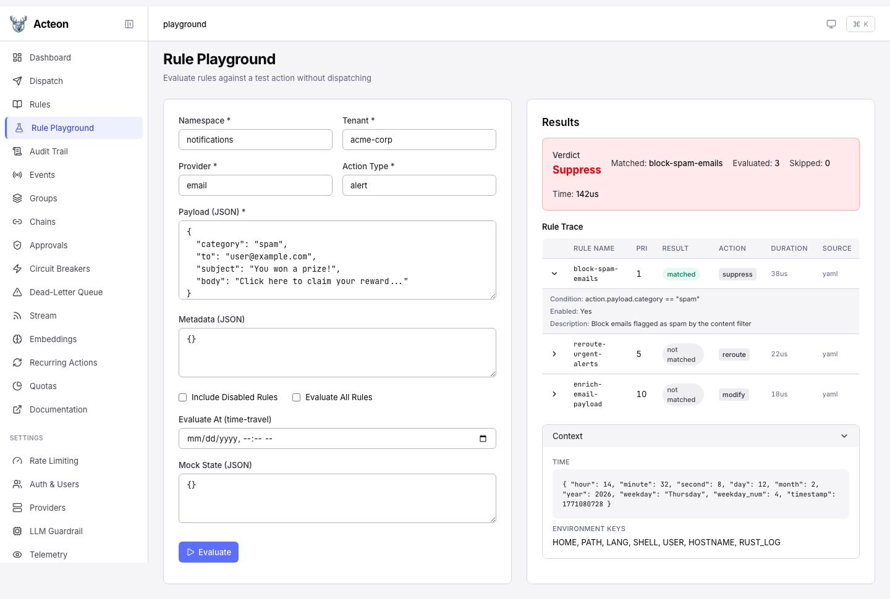

Test how rules evaluate against a synthetic action without dispatching. The playground shows a per-rule trace with verdict, match result, timing, and condition details.

- **Evaluate All** -- force evaluation of every rule, even after the first match
- **Include Disabled** -- show disabled rules as skipped entries in the trace
- **Time-Travel** -- override the evaluation clock for time-sensitive rules
- **Mock State** -- provide state key overrides for state-dependent conditions
- **Modified Payload** -- when the verdict is `modify`, preview the resulting payload

See [Rule Playground](../features/rule-playground.md) for full documentation.

## Rules

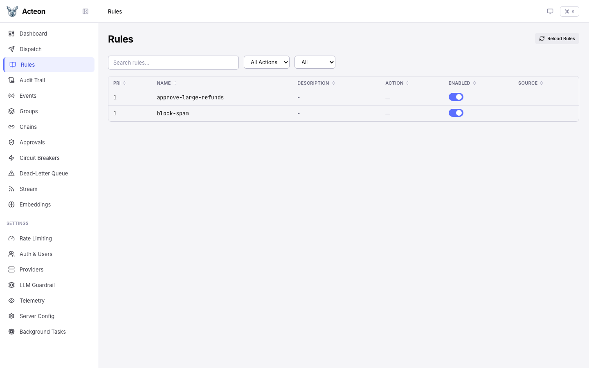

Browse all loaded rules with their priority, action type, and enabled status. The rules page provides:

- **Search** -- filter rules by name
- **Filter by source** -- YAML, CEL, or API-defined rules
- **Filter by action type** -- show only rules matching a specific type
- **Reload** -- click the reload button to re-read rules from disk

## Audit Trail

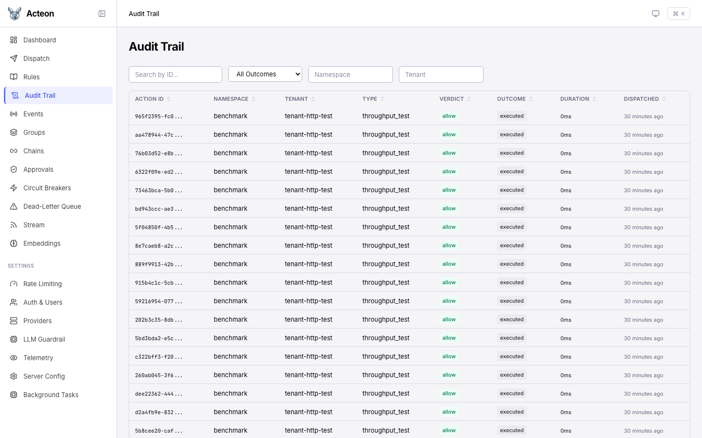

The audit trail shows a paginated, filterable log of every action and its outcome.

### Filters

- **Namespace**, **Tenant**, **Provider**, **Action Type** -- text filters
- **Outcome** -- filter by executed, suppressed, deduplicated, failed, etc.
- **Verdict** -- filter by the rule verdict (allow, suppress, etc.)
- **Date range** -- filter by dispatch time

### Detail Drawer

Click any audit row to open a detail drawer showing:

- Full action metadata and timing
- Rule verdict and matched rule name
- Outcome details and provider response
- Action payload (if stored)
- **Replay** button to re-dispatch the same action

## Chains

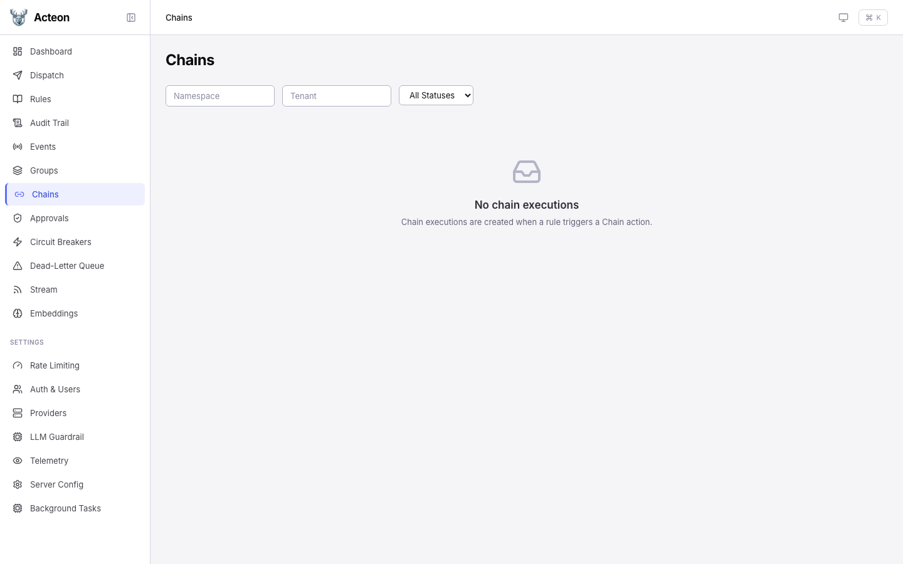

Monitor active and completed [task chains](../features/chains.md). The chain list shows:

- Chain name and ID
- Current step progress
- Status (running, completed, failed, cancelled)
- Timing information

Click a chain to view step-by-step execution details, including per-step status, response data, and the execution path for branching chains.

## Approvals

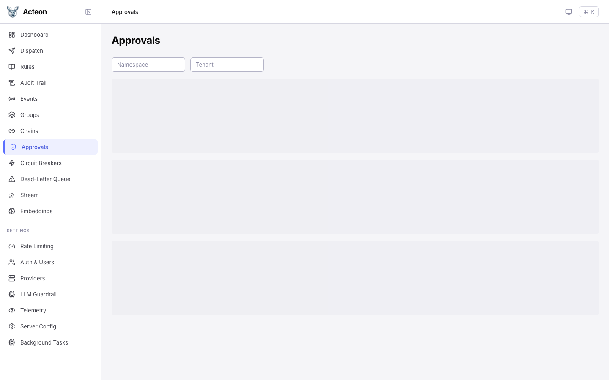

Review pending [human approval](../features/approvals.md) requests. Each approval card shows:

- The action that triggered the approval
- Which rule required approval
- Expiration countdown
- **Approve** and **Reject** buttons

## Circuit Breakers

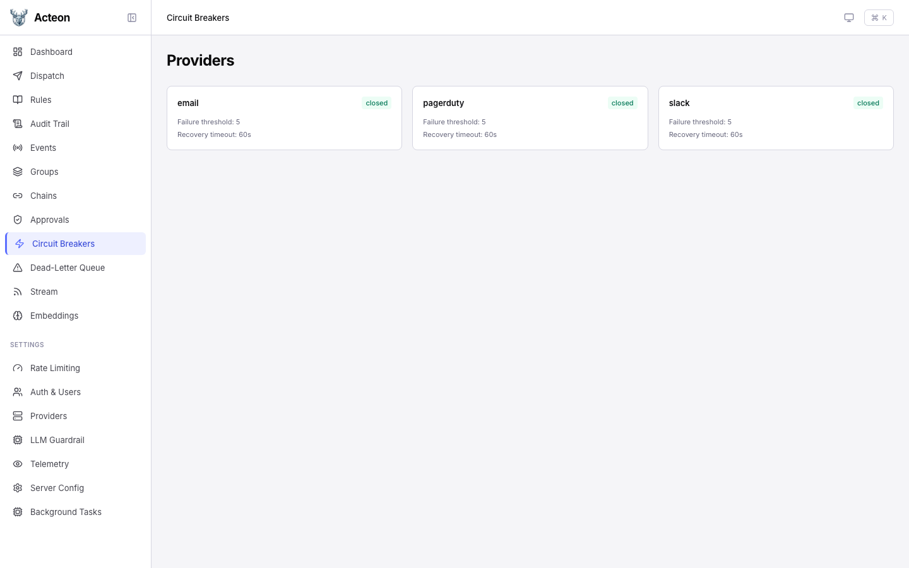

View registered providers and their circuit breaker states. Click a provider card to open a detail drawer where you can:

- View circuit breaker thresholds and recovery timeout
- **Trip** -- force-open the circuit (rejects all actions)
- **Reset** -- force-close the circuit (resume normal operation)

## Dead-Letter Queue

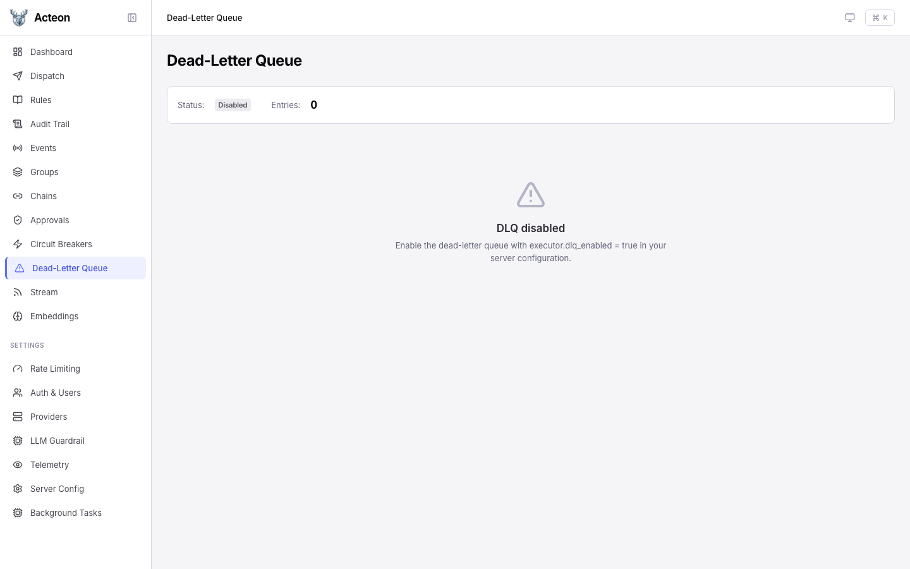

Browse actions that failed after exhausting all retries. The DLQ page lets you inspect failures and replay them.

## Recurring Actions

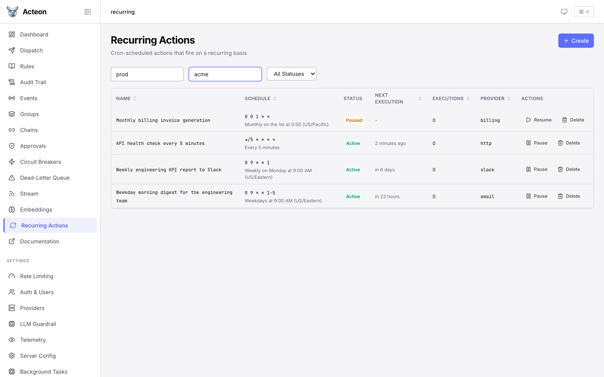

Manage [recurring actions](../features/recurring-actions.md) -- cron-scheduled actions that fire on a recurring basis. The list view shows all recurring actions filtered by namespace and tenant, with their schedule, status, next execution time, and execution count.

### Creating a Recurring Action

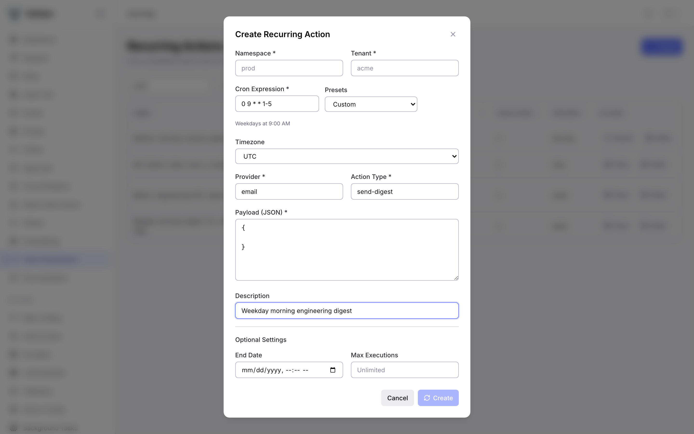

Click **Create** to open the creation dialog. Fill in the namespace, tenant, cron expression (with preset shortcuts), timezone, provider, action type, and JSON payload. Optional settings include a description, end date, and maximum execution limit.

### Viewing Details

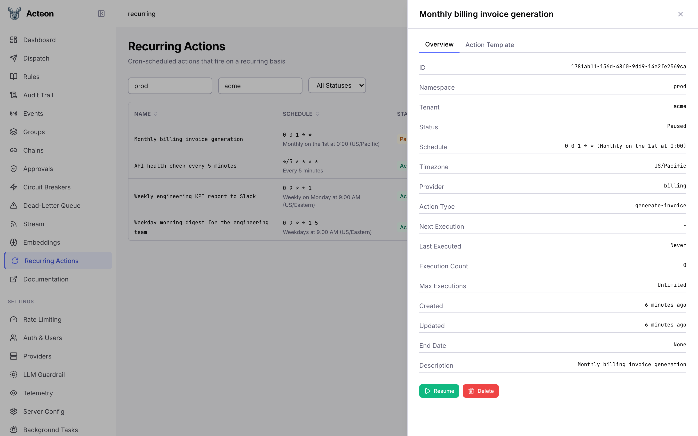

Click any row to open the detail drawer. The **Overview** tab shows all fields including schedule, timezone, provider, execution count, and timestamps. The **Action Template** tab displays the JSON payload and metadata. Use the **Pause/Resume** and **Delete** buttons to manage the action lifecycle.

## Compliance Status

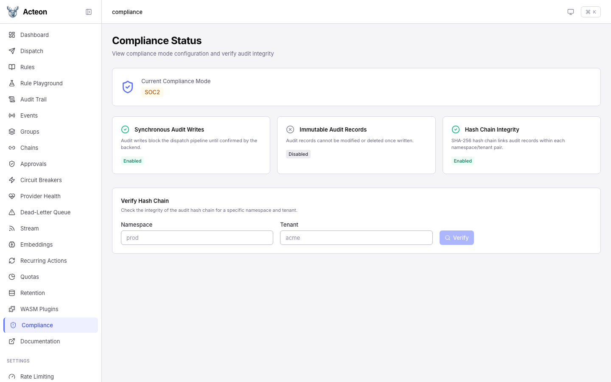

View the current [compliance mode](../features/compliance-mode.md) and feature status. The page shows:

- **Mode badge** -- the active compliance mode (SOC2, HIPAA, or None)
- **Feature cards** -- status of synchronous audit writes, immutable audit records, and hash chain integrity

In HIPAA mode, all three features are enabled:

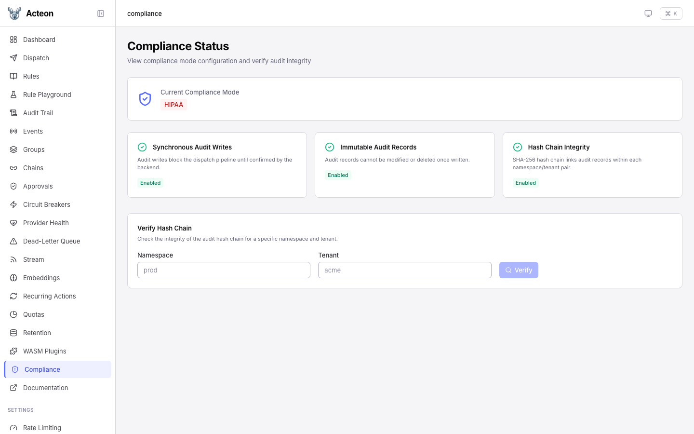

### Verifying Hash Chain Integrity

When hash chaining is enabled, the verification panel lets you check the integrity of the audit chain for any namespace/tenant pair.

A valid chain:

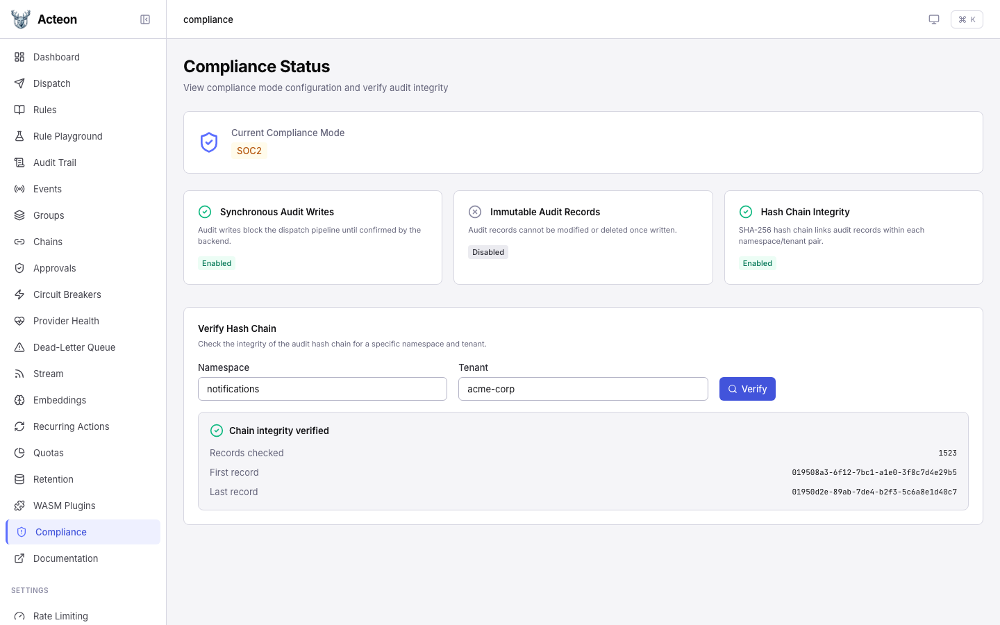

A broken chain highlights the first record where integrity was lost:

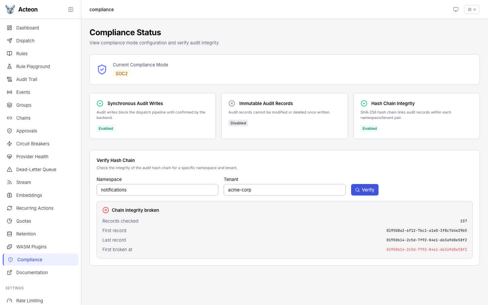

See [Compliance Mode](../features/compliance-mode.md) for full documentation.

## Event Stream

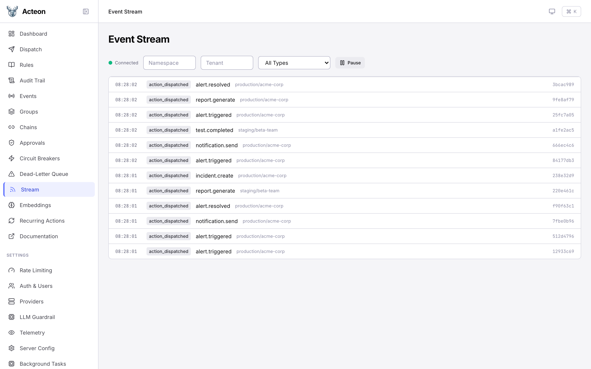

A live event stream powered by SSE. Watch actions flow through the gateway in real time with filters for namespace, tenant, and event type. Use the **Pause** / **Resume** button to freeze the stream for inspection.
