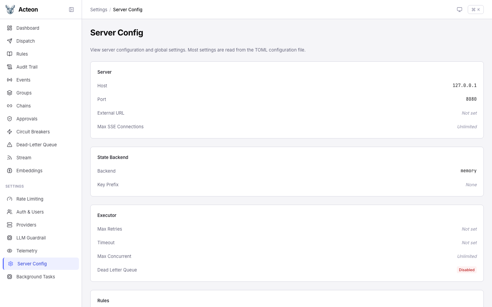
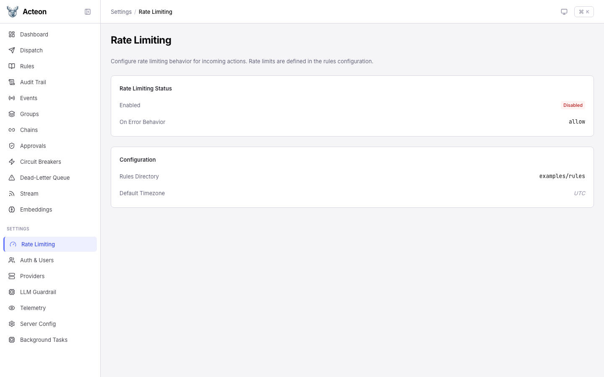
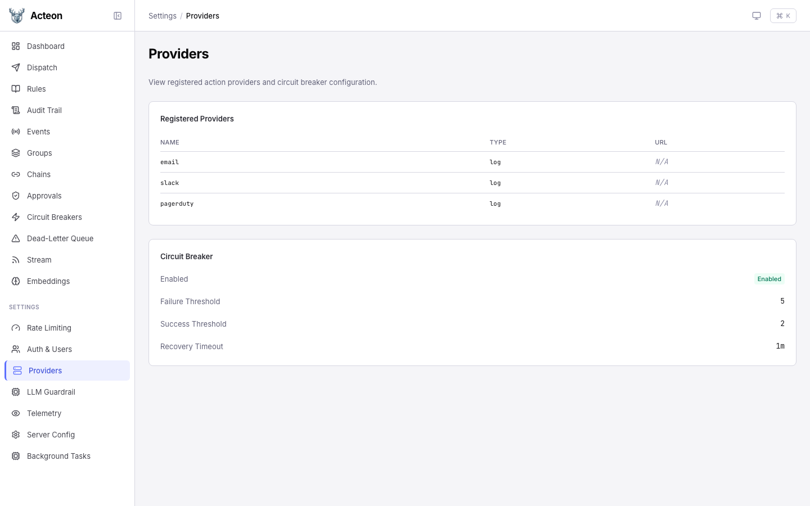
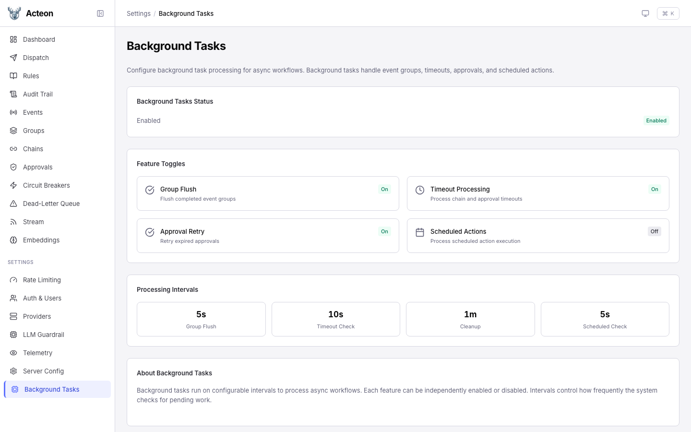

# Settings

The settings section provides a read-only view of the server's runtime configuration. Settings are loaded from the `acteon.toml` file at startup.

!!! note
    The settings pages display a **sanitized snapshot** of the configuration. Secrets such as API keys, connection passwords, and header values are never exposed. Instead, the UI shows indicators like "API Key Configured: Yes/No".

## Server Config



The main settings page shows configuration cards for each subsystem:

| Section | What it shows |
|---------|---------------|
| **Server** | Bind host, port, external URL, max SSE connections |
| **State Backend** | Backend type (memory, Redis, PostgreSQL, etc.), key prefix |
| **Executor** | Max retries, timeout, concurrency limits, DLQ status |
| **Rules** | Rules directory path, default timezone |
| **Audit** | Enabled status, backend, TTL, payload storage, redaction config |
| **Chains** | Max concurrent advances, completed chain TTL, chain definitions |
| **Theme** | Switch between System, Light, and Dark color schemes |

## Rate Limiting



View rate limiting status and the error behavior policy (`allow` or `deny` when the state store is unavailable).

## Auth & Users

View authentication status, config file path, and whether file-watch mode is active for automatic config reloading.

## Providers



A table of registered providers showing name, type, and URL. Below it, the global circuit breaker configuration with failure/success thresholds and recovery timeout. Providers with per-provider overrides are listed separately.

## LLM Guardrail

View LLM guardrail configuration including the API endpoint, model, API key status, fail-open mode, and model parameters (temperature, max tokens, timeout). If a default policy is configured, a truncated preview is shown. Per-action-type policy overrides are listed by key.

When the [embedding provider](../features/semantic-routing.md) is enabled, its configuration is shown here as well.

## Telemetry

View [OpenTelemetry](../features/distributed-tracing.md) configuration: endpoint, service name, protocol, sampling ratio, and exporter timeout.

## Background Tasks



View the status of background processing features:

- **Group Flush** -- flush completed event groups
- **Timeout Processing** -- process chain and approval timeouts
- **Approval Retry** -- retry expired approvals
- **Scheduled Actions** -- execute actions at their scheduled time

Each feature can be independently enabled or disabled. Below the toggles, processing interval cards show how frequently each background job runs.

## API Endpoint

All settings data comes from a single endpoint:

```
GET /admin/config
```

The response is a sanitized `ConfigSnapshot` that masks secrets:

- API keys become `has_api_key: true/false`
- Connection URLs become `has_url: true/false`
- Provider headers become `header_count: 3`
- Policy text is truncated to 100 characters
- Circuit breaker provider overrides show only names
