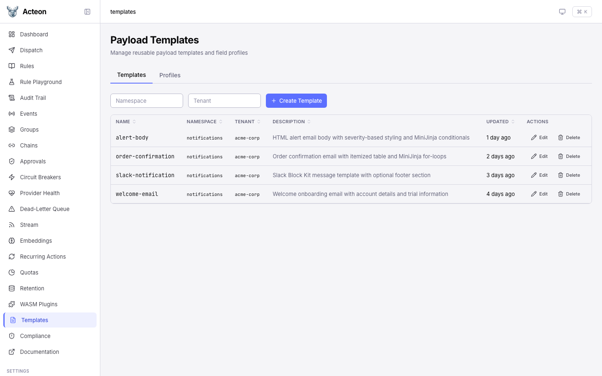
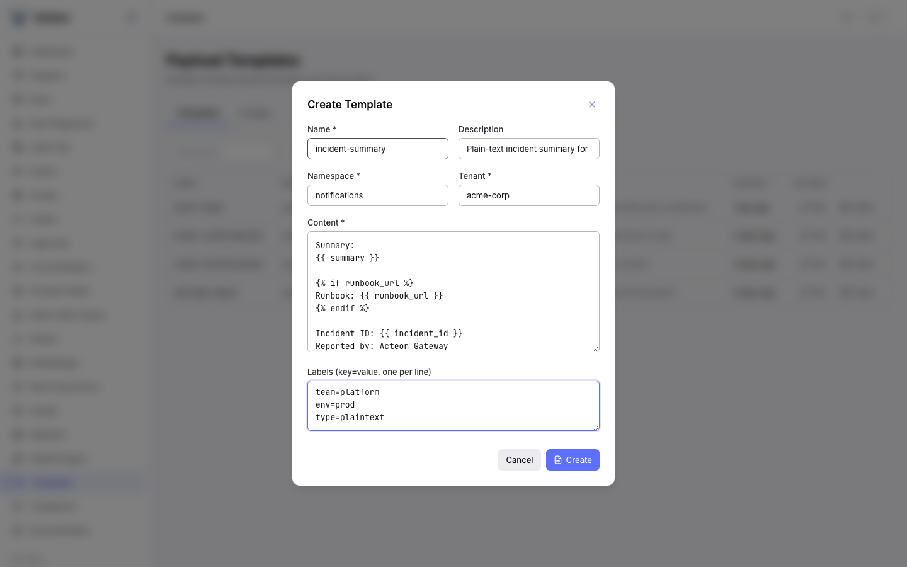
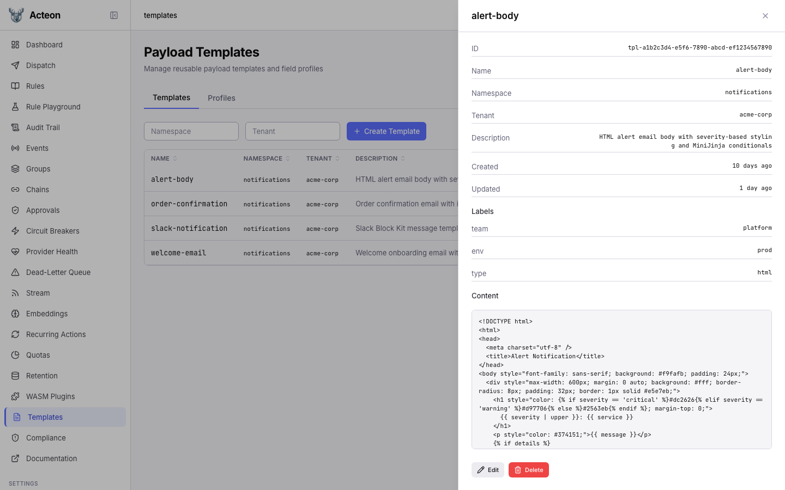
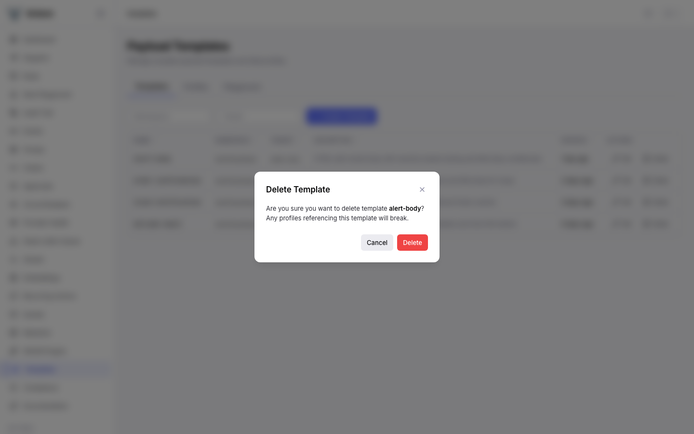
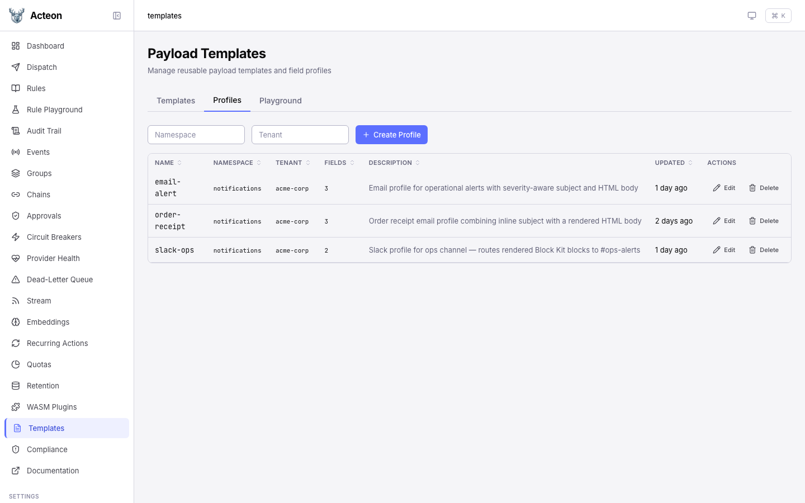
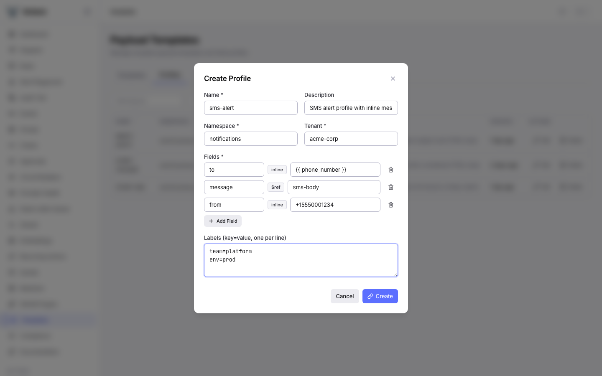
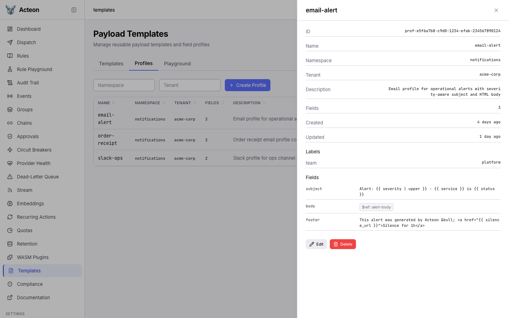

# Templates

The Templates page lets you manage payload templates and profiles through the admin UI. It provides a two-tab layout: **Templates** for managing reusable content blocks, and **Profiles** for composing field mappings that wire templates into action payloads. For background on the template system, see [Payload Templates](../features/payload-templates.md).

## Templates Tab

The Templates tab displays all stored templates in a sortable data table. Each row shows the template name, namespace, tenant, description, and last-updated timestamp.

### Browsing Templates

Use the namespace and tenant filters at the top of the page to narrow the list. The table columns are sortable -- click a column header to reorder. When no templates exist for the current filter, the page shows an empty state with a prompt to create your first template.

### Creating a Template

Click the **Create Template** button to open the creation modal.

Fill in the following fields:

| Field | Required | Description |
|-------|----------|-------------|
| **Name** | Yes | Unique identifier (alphanumeric, hyphens, underscores, dots; max 128 chars) |
| **Description** | No | Human-readable description of the template's purpose |
| **Namespace** | Yes | Namespace scope for the template |
| **Tenant** | Yes | Tenant scope for the template |
| **Content** | Yes | MiniJinja template body with variable placeholders like `{{ name }}` |
| **Labels** | No | Key-value labels for organization (one per line, `key=value` format) |

The content field accepts full MiniJinja syntax including variables, conditionals, loops, and filters. The server validates syntax on save -- invalid MiniJinja is rejected with an error message.

Click **Create** to save. The new template appears in the list immediately.

### Viewing Template Details

Click any row in the templates table to open the detail drawer on the right side of the page.

The drawer shows:

- **ID** -- the system-generated UUID
- **Name**, **Namespace**, **Tenant** -- scope identifiers
- **Description** -- the template's purpose
- **Created** and **Updated** -- timestamps
- **Labels** -- all attached labels displayed as badges (e.g., team, env, type)
- **Content** -- the full MiniJinja template body in a scrollable preview

### Editing and Deleting Templates

To edit a template, open the detail drawer and click the **Edit** button. The drawer switches to an editable form where you can modify the description, content, and labels.

To delete a template, click the **Delete** button. A confirmation dialog appears warning that deleting a template may break profiles that reference it via `$ref`.

If any profile currently references the template, the server returns a 409 Conflict error. You must update or remove the referencing profiles before deletion.

## Profiles Tab

Switch to the **Profiles** tab to manage template profiles. Profiles map payload field names to template content -- either inline MiniJinja strings or `$ref` references to stored templates.

### Browsing Profiles

The profiles table shows each profile's name, namespace, tenant, field count, and description. Like the templates table, it supports namespace and tenant filtering and column sorting.

### Creating a Profile

Click **Create Profile** to open the creation modal with the dynamic field builder.

Fill in the profile metadata (name, namespace, tenant, description), then use the field builder to define payload field mappings. For each field:

1. Enter the **field name** (the key that will be merged into the action payload)
2. Choose the field type:
   - **Inline** -- type a MiniJinja expression directly (e.g., `{{ phone_number }}`)
   - **$ref** -- enter the name of a stored template to reference
3. Enter the value (either the inline MiniJinja string or the template name)

Click **Add Field** to add more rows. The example above shows three fields: `to` as an inline value using `{{ phone_number }}`, `message` as a `$ref` to the `sms-body` template, and `from` as a static inline value.

The server validates that every `$ref` target exists as a stored template in the same namespace and tenant scope.

### Viewing Profile Details

Click a profile row to open the detail drawer.

The drawer shows the profile metadata and a **Fields** section listing each field mapping. Inline fields display their MiniJinja value directly, while `$ref` fields show a badge like `$ref: alert-body` indicating the referenced template.

### Editing and Deleting Profiles

Editing and deleting profiles works the same as templates. Open the detail drawer and use the **Edit** or **Delete** buttons. Profile deletion does not have referential integrity constraints -- you can delete a profile even if actions reference it by name (though those actions will fail at dispatch time if the profile is missing).

## Understanding Inline vs $ref Fields

The distinction between inline and `$ref` fields is the key concept in the template system:

- **Inline fields** contain MiniJinja expressions directly in the profile. They are self-contained and simple to set up, but the content lives only in that profile. Use inline fields for short, profile-specific values like email subjects or static strings.

- **$ref fields** point to a stored template by name. The gateway loads the referenced template's content at render time. Use `$ref` for longer content blocks (email bodies, formatted messages) that you want to reuse across multiple profiles or update independently.

A single profile can mix both types freely. For example, an email profile might use an inline field for `subject` and a `$ref` field for `body`.

When you update a stored template, every profile that references it via `$ref` picks up the change automatically -- no profile edits needed.

## Tips

- **Start with templates, then build profiles.** Create your reusable content blocks as templates first, then wire them into profiles. This avoids `$ref` validation errors during profile creation.
- **Use labels for organization.** Attach labels like `team=platform`, `env=production`, or `type=email` to templates for easier filtering and auditing.
- **Preview before deploying.** Use the [render preview API](../features/payload-templates.md#preview-rendering) to test how a profile renders against sample data before dispatching real actions.
- **Name templates descriptively.** Names like `alert-body` or `order-confirmation-html` make it clear what the template produces and where it is used.
- **Keep inline values short.** If an inline field grows beyond a single line, consider extracting it into a stored template with a `$ref`. This improves readability and enables reuse.
