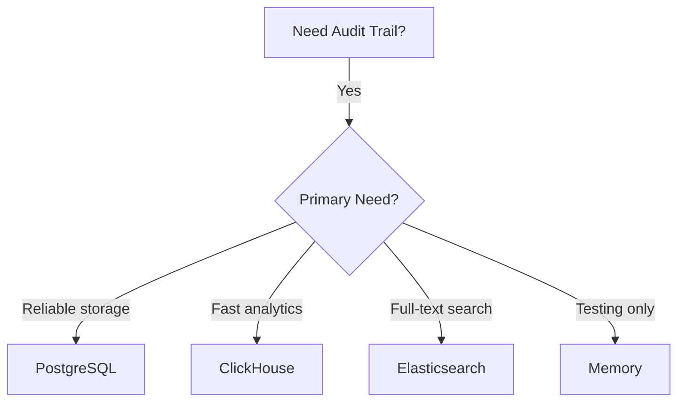

# Audit Backends

Audit backends store the searchable history of every action dispatched through Acteon. All backends implement the `AuditStore` trait.

## AuditStore Trait

```rust
#[async_trait]
pub trait AuditStore: Send + Sync + 'static {
    async fn record(&self, record: AuditRecord) -> Result<String>;
    async fn get_by_action_id(&self, action_id: &str) -> Result<Option<AuditRecord>>;
    async fn query(&self, query: &AuditQuery) -> Result<AuditPage>;
    async fn cleanup_expired(&self) -> Result<usize>;
}
```

## Backend Comparison

| Feature | PostgreSQL | ClickHouse | Elasticsearch |
|---------|-----------|------------|---------------|
| **Persistence** | ACID | Eventual | Eventual |
| **Query Speed** | Fast (indexed) | Very fast (columnar) | Very fast (inverted index) |
| **Full-Text Search** | Limited | No | Yes |
| **Aggregations** | SQL-based | Native, fast | Native, flexible |
| **TTL Cleanup** | Background job | Background job | Index Lifecycle Mgmt |
| **Throughput** | ~28,000/s | ~970/s | Varies |
| **Best For** | General production | Analytics | Search-heavy |

## Choosing a Backend



### PostgreSQL Audit

Best for most production deployments. Provides ACID guarantees, indexed queries, and automatic TTL cleanup.

[PostgreSQL Audit Details](postgres-audit.md)

### ClickHouse Audit

Best for analytics-heavy workloads. Columnar storage enables fast aggregations over large datasets.

[ClickHouse Audit Details](clickhouse-audit.md)

### Elasticsearch Audit

Best for search-heavy workloads. Full-text search across all fields with flexible query syntax.

[Elasticsearch Audit Details](elasticsearch-audit.md)

## Common Configuration

All audit backends share these base settings:

```toml
[audit]
enabled = true                     # Must be true to record
backend = "postgres"               # Backend type
prefix = "acteon_"                 # Table/index prefix
ttl_seconds = 2592000              # 30-day retention
cleanup_interval_seconds = 3600    # Hourly cleanup
store_payload = true               # Include action payloads

[audit.redact]
enabled = false                    # Field redaction
fields = ["password", "token"]     # Fields to redact
placeholder = "[REDACTED]"         # Replacement text
```
