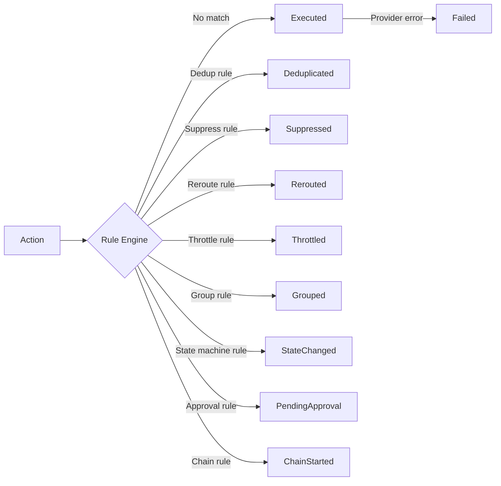

# Actions & Outcomes

The **Action** is the fundamental unit of work in Acteon. Every request to the gateway creates an action that flows through the dispatch pipeline and produces an **ActionOutcome**.

## The Action Type

An `Action` represents a request to perform some operation via an external provider:

```rust
pub struct Action {
    pub id: ActionId,              // Auto-generated UUID v4
    pub namespace: Namespace,      // Logical grouping (e.g., "notifications")
    pub tenant: TenantId,          // Multi-tenant isolation (e.g., "tenant-1")
    pub provider: ProviderId,      // Target provider (e.g., "email")
    pub action_type: String,       // Discriminator (e.g., "send_email")
    pub payload: serde_json::Value,// Arbitrary JSON payload
    pub metadata: ActionMetadata,  // Key-value labels
    pub dedup_key: Option<String>, // Deduplication identifier
    pub status: Option<String>,    // State machine state
    pub fingerprint: Option<String>, // Event correlation
    pub starts_at: Option<DateTime<Utc>>,  // Event lifecycle start
    pub ends_at: Option<DateTime<Utc>>,    // Event lifecycle end
    pub created_at: DateTime<Utc>, // Creation timestamp
}
```

### Creating Actions

Use the builder pattern:

```rust
use acteon_core::Action;
use serde_json::json;

let action = Action::new(
    "notifications",           // namespace
    "tenant-1",               // tenant
    "email",                  // provider
    "send_email",             // action_type
    json!({                   // payload
        "to": "user@example.com",
        "subject": "Welcome!",
        "body": "Hello, world!"
    }),
)
.with_dedup_key("welcome-user@example.com")
.with_metadata(ActionMetadata {
    labels: HashMap::from([
        ("priority".into(), "high".into()),
        ("campaign".into(), "onboarding".into()),
    ]),
})
.with_status("firing")
.with_fingerprint("alert-cluster1-cpu");
```

### JSON Representation

When sending actions via the API:

```json
{
  "namespace": "notifications",
  "tenant": "tenant-1",
  "provider": "email",
  "action_type": "send_email",
  "payload": {
    "to": "user@example.com",
    "subject": "Welcome!"
  },
  "dedup_key": "welcome-user@example.com",
  "metadata": {
    "labels": {
      "priority": "high"
    }
  }
}
```

### Field Reference

| Field | Required | Description |
|-------|----------|-------------|
| `namespace` | Yes | Logical grouping for isolation |
| `tenant` | Yes | Multi-tenant identifier |
| `provider` | Yes | Target provider name |
| `action_type` | Yes | Action discriminator for rule matching |
| `payload` | Yes | Arbitrary JSON payload passed to the provider |
| `dedup_key` | No | Key for deduplication (same key = same action) |
| `metadata.labels` | No | Key-value labels for rule matching and grouping |
| `status` | No | Current state (for state machine rules) |
| `fingerprint` | No | Event correlation identifier |
| `starts_at` | No | Event lifecycle start time |
| `ends_at` | No | Event lifecycle end time |

### Identity Types

Acteon uses **newtypes** for all identifiers to prevent accidental mixing:

| Type | Description | Example |
|------|-------------|---------|
| `Namespace` | Logical namespace | `"notifications"` |
| `TenantId` | Tenant identifier | `"tenant-1"` |
| `ActionId` | UUID v4 action ID | Auto-generated |
| `ProviderId` | Provider name | `"email"` |

## The ActionOutcome Type

Every dispatch produces exactly one `ActionOutcome`:

```rust
pub enum ActionOutcome {
    Executed(ProviderResponse),
    Deduplicated,
    Suppressed { rule: String },
    Rerouted { original_provider: String, new_provider: String, response: ProviderResponse },
    Throttled { retry_after: Duration },
    Failed(ActionError),
    Grouped { group_id: String, group_size: usize, notify_at: DateTime<Utc> },
    StateChanged { fingerprint: String, previous_state: String, new_state: String, notify: bool },
    PendingApproval { approval_id: String, expires_at: DateTime<Utc>, approve_url: String, reject_url: String, notification_sent: bool },
    ChainStarted { chain_id: String, chain_name: String, total_steps: usize, first_step: String },
}
```

### Outcome Variants



| Outcome | Description | When It Happens |
|---------|-------------|-----------------|
| `Executed` | Provider executed the action successfully | Action passed all rules and was dispatched |
| `Deduplicated` | Action was already processed | Same `dedup_key` within TTL window |
| `Suppressed` | Action was blocked by a rule | Matches a `suppress` rule condition |
| `Rerouted` | Action was sent to a different provider | Matches a `reroute` rule |
| `Throttled` | Action hit rate limit | Exceeds `max_count` in `window_seconds` |
| `Failed` | Provider returned an error after all retries | All retry attempts exhausted |
| `Grouped` | Action was added to an event group | Matches a `group` rule |
| `StateChanged` | Event transitioned to a new state | Matches a `state_machine` rule |
| `PendingApproval` | Waiting for human approval | Matches a `require_approval` rule |
| `ChainStarted` | Multi-step chain initiated | Matches a `chain` rule |

## The ProviderResponse Type

Successful executions include a `ProviderResponse`:

```rust
pub struct ProviderResponse {
    pub status: ResponseStatus,     // Success | Failure | Partial
    pub body: serde_json::Value,    // Response payload
    pub headers: HashMap<String, String>,  // Response metadata
}
```

## The ActionKey Type

Internally, Acteon uses an `ActionKey` for state store operations:

```rust
pub struct ActionKey {
    pub namespace: Namespace,
    pub tenant: TenantId,
    pub action_id: ActionId,
    pub discriminator: Option<String>,
}
```

The canonical form is: `namespace:tenant:action_id[:discriminator]`

This key is used for:

- Deduplication checks
- Distributed lock acquisition
- State store lookups
- Audit record correlation
