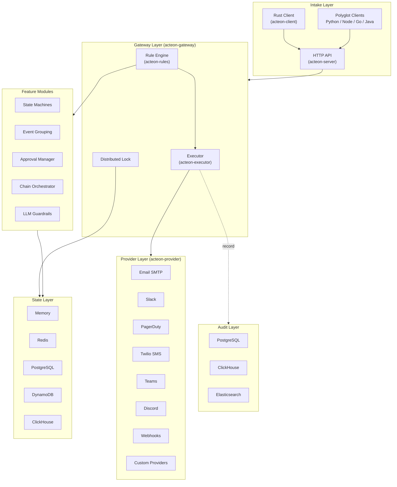
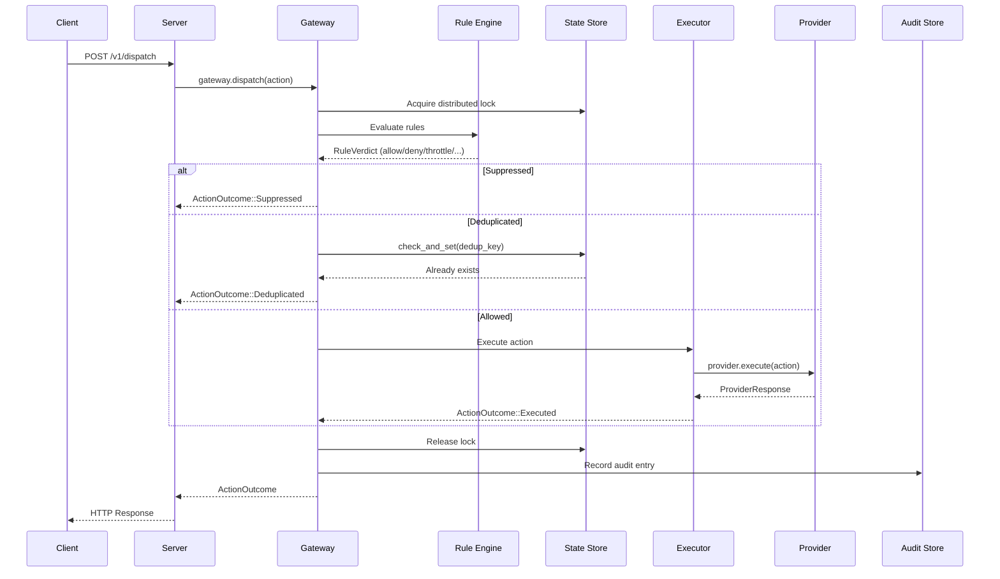

# Architecture

Acteon follows a **modular, crate-based architecture** where each component can be used independently or composed together. The system is organized as a Rust workspace with logical groupings.

## High-Level Overview

## Crate Organization

All crates live under the `crates/` directory with logical groupings:

### Core Components

| Crate | Package | Description |
|-------|---------|-------------|
| `crates/core` | `acteon-core` | Shared types: `Action`, `ActionOutcome`, newtypes, state machine configs |
| `crates/gateway` | `acteon-gateway` | Central orchestration — lock, rules, execution, grouping, state machines |
| `crates/server` | `acteon-server` | HTTP server (Axum) with Swagger UI and OpenAPI |
| `crates/client` | `acteon-client` | Native Rust HTTP client for the Acteon API |
| `crates/executor` | `acteon-executor` | Action execution with retries, backoff, and concurrency limits |
| `crates/provider` | `acteon-provider` | Provider trait definitions and registry |
| `crates/simulation` | `acteon-simulation` | Testing framework with mock providers and failure injection |

### State Backends

| Crate | Package | Description |
|-------|---------|-------------|
| `crates/state/state` | `acteon-state` | Abstract `StateStore` and `DistributedLock` traits |
| `crates/state/memory` | `acteon-state-memory` | In-memory backend (single-process) |
| `crates/state/redis` | `acteon-state-redis` | Redis backend (distributed) |
| `crates/state/postgres` | `acteon-state-postgres` | PostgreSQL backend (ACID) |
| `crates/state/dynamodb` | `acteon-state-dynamodb` | AWS DynamoDB backend |
| `crates/state/clickhouse` | `acteon-state-clickhouse` | ClickHouse backend (analytics) |

### Audit Backends

| Crate | Package | Description |
|-------|---------|-------------|
| `crates/audit/audit` | `acteon-audit` | Abstract `AuditStore` trait |
| `crates/audit/memory` | `acteon-audit-memory` | In-memory audit (testing) |
| `crates/audit/postgres` | `acteon-audit-postgres` | PostgreSQL audit (persistent) |
| `crates/audit/clickhouse` | `acteon-audit-clickhouse` | ClickHouse audit (analytics) |
| `crates/audit/elasticsearch` | `acteon-audit-elasticsearch` | Elasticsearch audit (search) |

### Rules Frontends

| Crate | Package | Description |
|-------|---------|-------------|
| `crates/rules/rules` | `acteon-rules` | Rule engine IR and evaluation |
| `crates/rules/yaml` | `acteon-rules-yaml` | YAML rule file parser |
| `crates/rules/cel` | `acteon-rules-cel` | CEL expression support |

### Integrations

| Crate | Package | Description |
|-------|---------|-------------|
| `crates/integrations/email` | `acteon-email` | Email/SMTP provider via Lettre |
| `crates/integrations/slack` | `acteon-slack` | Slack message provider |
| `crates/integrations/pagerduty` | `acteon-pagerduty` | PagerDuty Events API v2 provider |
| `crates/integrations/twilio` | `acteon-twilio` | Twilio SMS provider |
| `crates/integrations/teams` | `acteon-teams` | Microsoft Teams incoming webhooks |
| `crates/integrations/discord` | `acteon-discord` | Discord webhook provider |
| `crates/integrations/webhook` | `acteon-webhook` | Generic HTTP webhook provider |
| `crates/llm` | `acteon-llm` | LLM-based guardrail evaluation |

## Data Flow

Every action follows a consistent path through the system:

## Design Principles

1. **Type Safety** — Strong typing with newtypes (`Namespace`, `TenantId`, `ActionId`, `ProviderId`) prevents field confusion at compile time.

2. **Trait-Based Abstraction** — Every pluggable component (`StateStore`, `AuditStore`, `DynProvider`) is defined as an async trait, enabling backend swapping without code changes.

3. **Zero Unsafe Code** — The workspace forbids `unsafe` code via `#![forbid(unsafe_code)]`.

4. **Pipeline Model** — Actions flow through a linear pipeline (intake → rules → execution → audit), making the system predictable and debuggable.

5. **Backend Independence** — State and audit backends are fully independent. Any state backend can be combined with any audit backend.

6. **Hot Reload** — Rules and auth configuration can be reloaded at runtime without server restarts.
