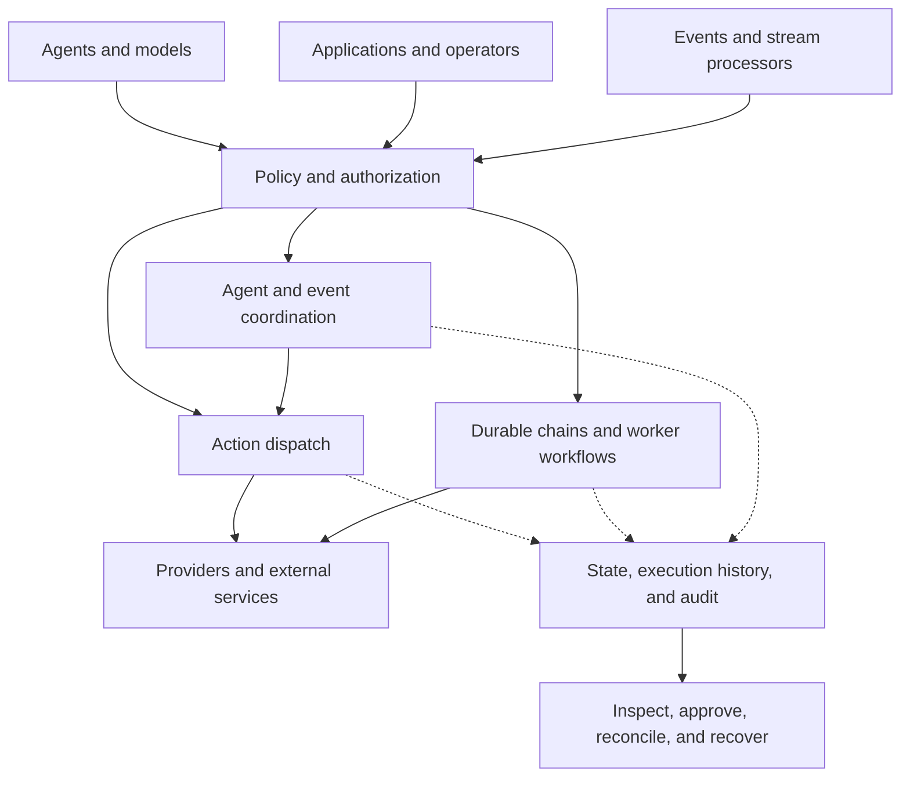

# The Acteon platform

**Acteon is an execution and governance platform for AI agents and deterministic
operations.** It turns requests, events, and decisions into actions governed by
identity, policy, durable execution, and operational evidence.

The same platform can route a notification, run an order workflow, coordinate
agents, or turn telemetry into an incident response. Applications supply intent.
Acteon supplies the mechanisms to authorize it, execute it, inspect it, and
recover it.

## One platform, composable responsibilities

This is a map of responsibilities. Different interfaces enter different parts of
the platform: dispatch executes actions, workflows coordinate worker code, and
the bus carries messages and stream progress. Their detailed authorization and
recovery behavior is documented with each capability.

## The vocabulary

| Concept | Meaning |
|---|---|
| **Action** | A request to perform an operation, carrying a namespace, tenant, provider, action type, and payload |
| **Policy** | The identity, permission, rule, quota, and approval decisions that govern an operation |
| **Provider** | The integration that performs an action: a webhook, cloud service, notification channel, governed model, or custom implementation |
| **Execution** | Tracked work that can span steps, retries, timers, signals, and worker tasks |
| **Agent** | A process that reasons or acts; it can use Acteon's interfaces, register for discovery, and participate in conversations |
| **Stream stage** | A typed processor that saves state, source positions, and outputs together under a fenced lease |
| **Evidence** | The outcomes, receipts, histories, audit records, and telemetry available to explain and operate the work |

The **action gateway** is Acteon's dispatch engine. It remains central to the
platform: it evaluates rules and executes providers. Durable workflows, agent
coordination, and managed streams extend the platform around that engine.

## Choose the right starting point

- [Execution model](execution-model.md): choose an action, chain, worker task, workflow, or stream stage.
- [Governance model](governance.md): define authority, constrain behavior, and preserve evidence.
- [Architecture](architecture.md): understand the server, engines, workers, providers, and persistence boundaries.
- [Actions and outcomes](actions.md): learn the request and result types used by dispatch.
- [Dispatch pipeline](pipeline.md), [rules](rules.md), and [providers](providers.md): follow an action through the gateway.

## What you bring

Acteon provides the server and operational interfaces, orchestration primitives,
policy engine, and integrations. You configure credentials, rules, storage,
retention, and provider endpoints. Worker code runs in your worker processes;
model runtimes run at your configured endpoints. Optional agent and bus features
have their own runtime requirements.

Start with the [local quick start](../getting-started/quickstart.md), then follow
the [adoption paths](../getting-started/index.md) for your workload.
