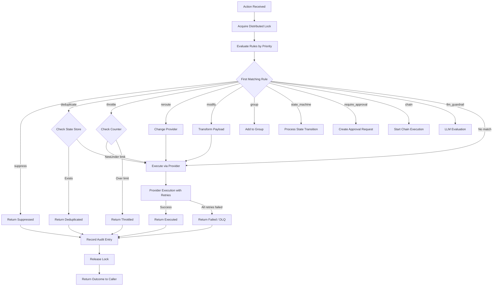
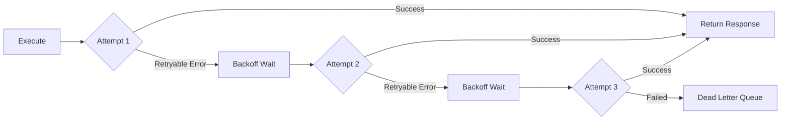
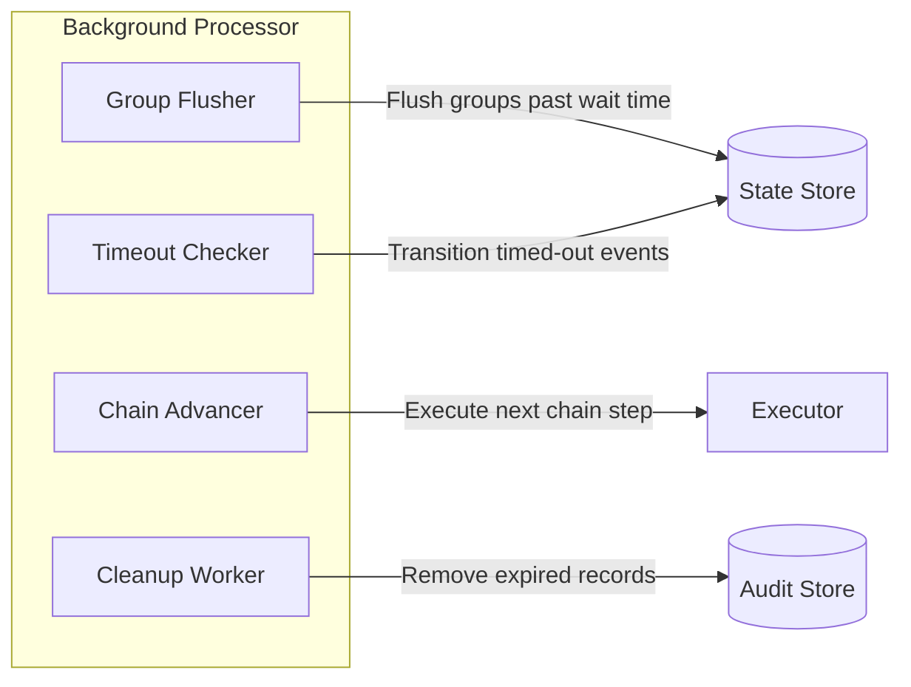

# The Dispatch Pipeline

Every action in Acteon flows through a well-defined pipeline. Understanding this pipeline is key to predicting how your rules and providers will interact.

## Pipeline Overview



## Step-by-Step Walkthrough

### 1. Action Intake

The action enters the system through the HTTP API (`POST /v1/dispatch`) or directly via the Rust `Gateway::dispatch()` method. The action is validated and assigned a UUID if one isn't provided.

### 2. Distributed Lock Acquisition

If any deduplication rules are configured, the gateway acquires a distributed lock keyed by the action's namespace, tenant, and dedup key. This prevents concurrent processing of duplicate actions.

```
Lock key: "{namespace}:{tenant}:{dedup_key}"
```

!!! info "Lock Behavior by Backend"
    - **Memory**: Perfect mutex (single process)
    - **Redis**: Strong locking (single instance)
    - **PostgreSQL**: ACID-guaranteed locks
    - **DynamoDB**: Conditional writes
    - **ClickHouse**: No locking (eventual consistency)

### 3. Rule Evaluation

Rules are evaluated in **ascending priority order** (lower number = higher priority). The first matching rule determines the action type:

```yaml
rules:
  - name: block-spam       # priority: 1  (evaluated first)
  - name: dedup-emails     # priority: 10 (evaluated second)
  - name: throttle-api     # priority: 20 (evaluated third)
```

Each rule's condition is evaluated against the action. If the condition matches, the rule's action is applied. If no rule matches, the action proceeds directly to execution.

### 4. Rule Action Processing

Depending on the matched rule type:

| Rule Action | Pipeline Behavior |
|-------------|-------------------|
| **Suppress** | Immediately returns `Suppressed` — action is blocked |
| **Deduplicate** | Checks state store for existing entry. If found, returns `Deduplicated`. If not, marks as seen and continues to execution |
| **Throttle** | Increments counter in state store. If over limit, returns `Throttled` with `retry_after` hint |
| **Reroute** | Changes the target provider, then continues to execution |
| **Modify** | Applies payload transformations, then continues to execution |
| **Group** | Adds action to an event group. If group is ready, flushes. Returns `Grouped` |
| **State Machine** | Computes fingerprint, checks/updates state. Returns `StateChanged` |
| **Require Approval** | Creates approval record with HMAC-signed URLs. Returns `PendingApproval` |
| **Chain** | Initiates multi-step chain. Executes first step. Returns `ChainStarted` |
| **LLM Guardrail** | Sends action to LLM for evaluation. Blocks if flagged |

### 5. Provider Execution

The executor dispatches the action to the target provider with:

- **Concurrency limiting** via semaphore (`max_concurrent`)
- **Retry logic** with configurable backoff strategy
- **Timeout** per execution attempt (`execution_timeout`)



#### Retry Strategies

| Strategy | Behavior |
|----------|----------|
| **Exponential Backoff** | `initial_delay * 2^attempt`, capped at `max_delay` |
| **Constant** | Fixed delay between retries |
| **Linear** | `initial_delay + increment * attempt` |

### 6. Audit Recording

After the outcome is determined, an audit record is created containing:

- Action metadata (namespace, tenant, provider, action_type)
- Rule verdict (which rule matched and why)
- Outcome (executed, suppressed, deduplicated, etc.)
- Timing information (dispatch time, completion time, duration)
- Optional payload (if `store_payload` is enabled)

### 7. Lock Release

The distributed lock is released, allowing other instances to process the same action key.

### 8. Response

The `ActionOutcome` is returned to the caller as an HTTP response or Rust return value.

## Background Processing

Several features involve asynchronous background work:



| Task | Description | Trigger |
|------|-------------|---------|
| **Group Flusher** | Sends consolidated notifications for ready groups | `group_flush_timeout_ms` |
| **Timeout Checker** | Transitions events that have been in a state too long | State machine `timeouts` config |
| **Chain Advancer** | Executes the next step in pending task chains | Previous step completion or delay |
| **Cleanup Worker** | Removes expired audit records | `cleanup_interval_seconds` |
