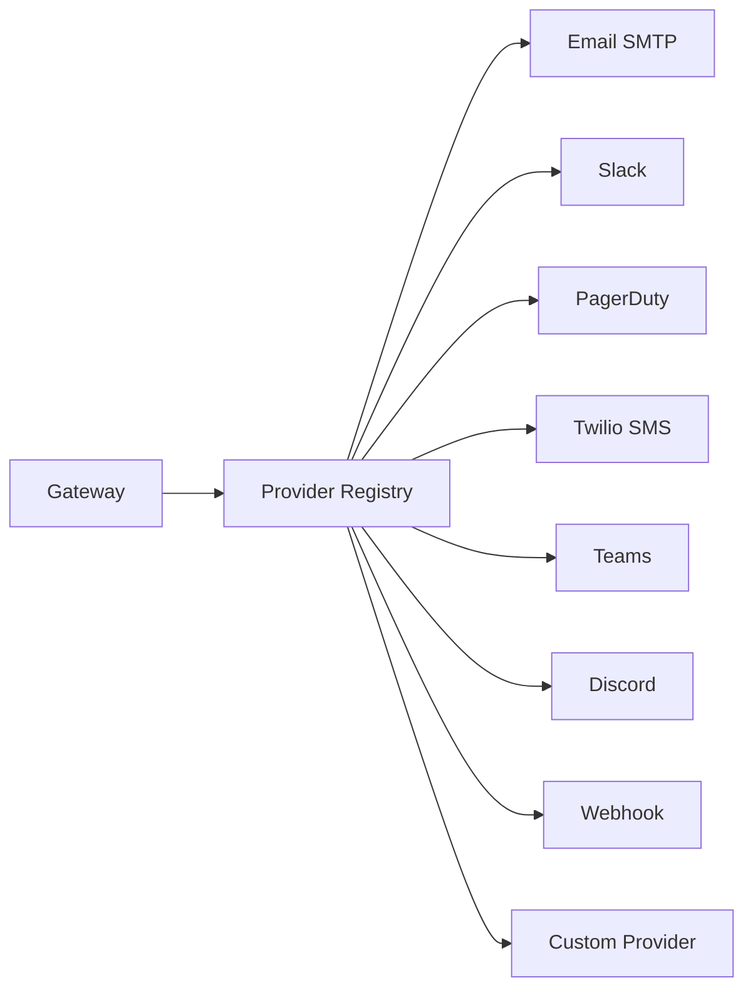

# Providers

Providers are the execution endpoints in Acteon. They receive actions and perform the actual work — sending emails, posting Slack messages, calling webhooks, or any custom operation.

## Provider Architecture



The gateway looks up the provider by the action's `provider` field and dispatches accordingly.

## Provider Traits

Acteon defines two provider traits:

### `Provider` (Strongly Typed)

```rust
pub trait Provider: Send + Sync {
    fn name(&self) -> &str;

    async fn execute(
        &self,
        action: &Action,
    ) -> Result<ProviderResponse, ProviderError>;

    async fn health_check(&self) -> Result<(), ProviderError>;
}
```

### `DynProvider` (Object-Safe)

For dynamic dispatch via trait objects:

```rust
#[async_trait]
pub trait DynProvider: Send + Sync {
    fn name(&self) -> &str;

    async fn execute(
        &self,
        action: &Action,
    ) -> Result<ProviderResponse, ProviderError>;

    async fn health_check(&self) -> Result<(), ProviderError>;
}
```

Any type implementing `Provider` automatically implements `DynProvider` through a blanket implementation.

## Implementing a Custom Provider

```rust
use acteon_provider::{DynProvider, ProviderError};
use acteon_core::{Action, ProviderResponse};
use async_trait::async_trait;

struct MyWebhookProvider {
    client: reqwest::Client,
    base_url: String,
}

#[async_trait]
impl DynProvider for MyWebhookProvider {
    fn name(&self) -> &str {
        "my-webhook"
    }

    async fn execute(
        &self,
        action: &Action,
    ) -> Result<ProviderResponse, ProviderError> {
        let response = self.client
            .post(&self.base_url)
            .json(&action.payload)
            .send()
            .await
            .map_err(|e| ProviderError::Connection(e.to_string()))?;

        if response.status().is_success() {
            let body = response.json().await
                .unwrap_or(serde_json::json!({}));
            Ok(ProviderResponse::success(body))
        } else {
            Err(ProviderError::ExecutionFailed(
                format!("HTTP {}", response.status())
            ))
        }
    }

    async fn health_check(&self) -> Result<(), ProviderError> {
        self.client
            .get(format!("{}/health", self.base_url))
            .send()
            .await
            .map_err(|e| ProviderError::Connection(e.to_string()))?;
        Ok(())
    }
}
```

## Registering Providers

Register providers with the gateway via the builder:

```rust
use std::sync::Arc;

let gateway = GatewayBuilder::new()
    .provider(Arc::new(EmailProvider::new(smtp_config)))
    .provider(Arc::new(SlackProvider::new(slack_config)))
    .provider(Arc::new(PagerDutyProvider::new(pagerduty_config)))
    .provider(Arc::new(TwilioProvider::new(twilio_config)))
    .provider(Arc::new(TeamsProvider::new(teams_config)))
    .provider(Arc::new(DiscordProvider::new(discord_config)))
    .provider(Arc::new(MyWebhookProvider {
        client: reqwest::Client::new(),
        base_url: "https://api.example.com".into(),
    }))
    .build()?;
```

Actions are routed to providers by matching the action's `provider` field to the provider's `name()`.

## Built-in Providers

### Email (SMTP)

The `acteon-email` crate provides an SMTP provider via the Lettre library.

**Expected payload:**

```json
{
  "to": "recipient@example.com",
  "cc": ["cc@example.com"],
  "bcc": ["bcc@example.com"],
  "subject": "Email subject",
  "body": "Email body (text or HTML)",
  "from": "sender@example.com"
}
```

### Slack

The `acteon-slack` crate provides a Slack messaging provider.

**Expected payload:**

```json
{
  "channel": "#notifications",
  "text": "Message text",
  "blocks": []
}
```

### PagerDuty

The `acteon-pagerduty` crate provides a PagerDuty Events API v2 provider for incident management. It supports triggering, acknowledging, and resolving incidents.

**Configuration:**

Single service (routing key only):

```rust
let config = PagerDutyConfig::single_service("PABC123", "your-routing-key");
```

Multiple services:

```rust
let config = PagerDutyConfig::new()
    .with_service("PABC123", "routing-key-1")
    .with_service("PXYZ789", "routing-key-2")
    .with_default_service("PABC123");
```

When multiple services are configured, each action payload can specify a `service_id` to target a specific service. If omitted, the default service is used. With a single service, `service_id` is optional.

**Trigger payload:**

```json
{
  "event_action": "trigger",
  "service_id": "PABC123",
  "summary": "CPU usage exceeded 90% on web-01",
  "severity": "critical",
  "source": "monitoring",
  "component": "web-01",
  "group": "production",
  "class": "cpu",
  "dedup_key": "web-01/cpu-high",
  "custom_details": { "cpu_percent": 95.2 },
  "images": [{ "src": "https://example.com/graph.png", "alt": "CPU graph" }],
  "links": [{ "href": "https://example.com/runbook", "text": "Runbook" }]
}
```

**Acknowledge/resolve payload:**

```json
{
  "event_action": "acknowledge",
  "dedup_key": "web-01/cpu-high"
}
```

| Field | Required | Default | Description |
|-------|----------|---------|-------------|
| `event_action` | Yes | — | `"trigger"`, `"acknowledge"`, or `"resolve"` |
| `service_id` | No | Config default | PagerDuty service ID to route the event to |
| `summary` | Trigger only | — | Brief description of the event |
| `severity` | No | Config default | `"critical"`, `"error"`, `"warning"`, or `"info"` |
| `source` | No | Config default | Event source (e.g. hostname or service) |
| `dedup_key` | Ack/resolve | — | Deduplication key for correlating events |
| `component` | No | — | Logical grouping component |
| `group` | No | — | Logical grouping (e.g. `"production"`) |
| `class` | No | — | Event class/type (e.g. `"cpu"`) |
| `custom_details` | No | — | Arbitrary key-value details |
| `images` | No | — | Images to display in the incident |
| `links` | No | — | Links to display in the incident |

### Twilio (SMS)

The `acteon-twilio` crate provides an SMS provider via the Twilio REST API.

**Expected payload:**

```json
{
  "to": "+15559876543",
  "body": "Your verification code is 123456",
  "from": "+15551234567",
  "media_url": "https://example.com/image.jpg"
}
```

| Field | Required | Default | Description |
|-------|----------|---------|-------------|
| `to` | Yes | — | Destination phone number (E.164 format) |
| `body` | Yes | — | Message body text |
| `from` | No | Config default | Sender phone number (E.164 format) |
| `media_url` | No | — | URL of media to attach (MMS) |

### Microsoft Teams

The `acteon-teams` crate provides a Microsoft Teams provider via incoming webhooks.

**MessageCard payload:**

```json
{
  "text": "Deployment complete",
  "title": "CI/CD Pipeline",
  "summary": "Build #42 passed",
  "theme_color": "00FF00"
}
```

**Adaptive Card payload:**

```json
{
  "adaptive_card": {
    "type": "AdaptiveCard",
    "version": "1.4",
    "body": [{"type": "TextBlock", "text": "Hello!"}]
  }
}
```

At least one of `text` or `adaptive_card` must be provided.

### Discord

The `acteon-discord` crate provides a Discord provider via webhooks.

**Expected payload:**

```json
{
  "content": "Build passed!",
  "embeds": [{
    "title": "Build #42",
    "description": "All tests passed",
    "color": 65280,
    "fields": [{"name": "Branch", "value": "main", "inline": true}],
    "footer": {"text": "CI/CD"}
  }],
  "username": "Acteon Bot",
  "avatar_url": "https://example.com/avatar.png",
  "tts": false
}
```

At least one of `content` or `embeds` must be provided.

### Webhook

The `acteon-webhook` crate provides a generic HTTP webhook provider for dispatching actions to any HTTP endpoint. It supports configurable HTTP methods, authentication (Bearer, Basic, API key, HMAC-SHA256), custom headers, and flexible payload modes.

**Configuration:**

```rust
use acteon_webhook::{WebhookConfig, WebhookProvider, AuthMethod, HttpMethod, PayloadMode};

// Simple webhook
let provider = WebhookProvider::new(
    WebhookConfig::new("https://api.example.com/webhook")
);

// Webhook with authentication and custom settings
let provider = WebhookProvider::new(
    WebhookConfig::new("https://api.example.com/webhook")
        .with_method(HttpMethod::Put)
        .with_auth(AuthMethod::Bearer("your-token".into()))
        .with_header("X-Custom-Header", "value")
        .with_payload_mode(PayloadMode::PayloadOnly)
        .with_timeout_secs(10)
);

// Webhook with HMAC signing
let provider = WebhookProvider::new(
    WebhookConfig::new("https://api.example.com/webhook")
        .with_auth(AuthMethod::HmacSha256 {
            secret: "your-secret".into(),
            header: "X-Signature".into(),
        })
);
```

**Expected payload:**

```json
{
  "url": "https://hooks.example.com/endpoint",
  "method": "POST",
  "body": {
    "message": "Server is down",
    "severity": "critical"
  },
  "headers": {
    "X-Custom-Header": "value"
  }
}
```

**Client SDK helpers** make constructing webhook payloads easy:

=== "Rust"

    ```rust
    use acteon_client::webhook;

    let action = webhook::action("notifications", "tenant-1")
        .url("https://hooks.example.com/alert")
        .body(serde_json::json!({"message": "Server down"}))
        .header("X-Custom", "value")
        .build();
    ```

=== "Python"

    ```python
    from acteon_client import create_webhook_action

    action = create_webhook_action(
        namespace="notifications",
        tenant="tenant-1",
        url="https://hooks.example.com/alert",
        body={"message": "Server down"},
        headers={"X-Custom": "value"},
    )
    ```

=== "TypeScript"

    ```typescript
    import { createWebhookAction } from "@acteon/client";

    const action = createWebhookAction(
      "notifications", "tenant-1",
      "https://hooks.example.com/alert",
      { message: "Server down" },
      { headers: { "X-Custom": "value" } }
    );
    ```

=== "Go"

    ```go
    action := acteon.NewWebhookAction(
        "notifications", "tenant-1",
        "https://hooks.example.com/alert",
        map[string]any{"message": "Server down"},
    ).WithWebhookHeaders(map[string]string{"X-Custom": "value"})
    ```

=== "Java"

    ```java
    Action action = WebhookAction.builder()
        .namespace("notifications")
        .tenant("tenant-1")
        .url("https://hooks.example.com/alert")
        .body(Map.of("message", "Server down"))
        .header("X-Custom", "value")
        .build();
    ```

| Field | Required | Default | Description |
|-------|----------|---------|-------------|
| `url` | Yes | — | Target URL for the webhook request |
| `method` | No | `POST` | HTTP method (`GET`, `POST`, `PUT`, `PATCH`, `DELETE`) |
| `body` | Yes | — | JSON body to send to the endpoint |
| `headers` | No | — | Additional HTTP headers |

**Authentication methods:**

| Method | Description |
|--------|-------------|
| `Bearer(token)` | `Authorization: Bearer <token>` header |
| `Basic { username, password }` | HTTP Basic authentication |
| `ApiKey { header, value }` | Custom header with API key value |
| `HmacSha256 { secret, header }` | HMAC-SHA256 signature of the request body |

**Payload modes:**

| Mode | Description |
|------|-------------|
| `FullAction` | Sends the entire serialized `Action` as the request body |
| `PayloadOnly` | Sends only `action.payload` as the request body |

## Provider Errors

| Error | Retryable | Description |
|-------|-----------|-------------|
| `ExecutionFailed(msg)` | No | Permanent provider error |
| `Timeout(msg)` | Yes | Execution timed out |
| `Connection(msg)` | Yes | Network connectivity failure |
| `RateLimited` | Yes | Provider rate limit hit |
| `Configuration(msg)` | No | Invalid provider configuration |

The executor retries **retryable** errors up to `max_retries` times with the configured backoff strategy. Non-retryable errors immediately return `ActionOutcome::Failed`.

## Provider Response

```rust
// Success response
ProviderResponse::success(json!({"message_id": "abc123"}))

// Failure response
ProviderResponse::failure(json!({"error": "invalid recipient"}))
```

## Health Checks

Providers implement `health_check()` for monitoring. The server's `/health` endpoint aggregates provider health status.
