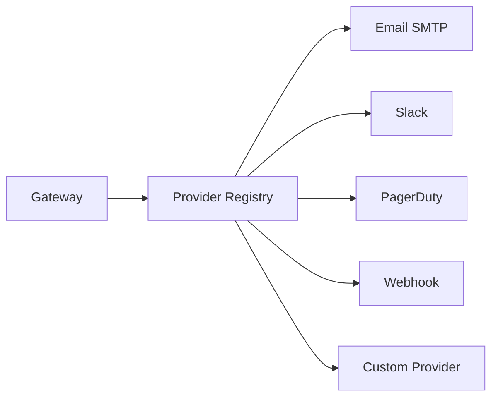

# Providers

Providers are the execution endpoints in Acteon. They receive actions and perform the actual work — sending emails, posting Slack messages, calling webhooks, or any custom operation.

## Provider Architecture



The gateway looks up the provider by the action's `provider` field and dispatches accordingly.

## Provider Traits

Acteon defines two provider traits:

### `Provider` (Strongly Typed)

```rust
pub trait Provider: Send + Sync {
    fn name(&self) -> &str;

    async fn execute(
        &self,
        action: &Action,
    ) -> Result<ProviderResponse, ProviderError>;

    async fn health_check(&self) -> Result<(), ProviderError>;
}
```

### `DynProvider` (Object-Safe)

For dynamic dispatch via trait objects:

```rust
#[async_trait]
pub trait DynProvider: Send + Sync {
    fn name(&self) -> &str;

    async fn execute(
        &self,
        action: &Action,
    ) -> Result<ProviderResponse, ProviderError>;

    async fn health_check(&self) -> Result<(), ProviderError>;
}
```

Any type implementing `Provider` automatically implements `DynProvider` through a blanket implementation.

## Implementing a Custom Provider

```rust
use acteon_provider::{DynProvider, ProviderError};
use acteon_core::{Action, ProviderResponse};
use async_trait::async_trait;

struct MyWebhookProvider {
    client: reqwest::Client,
    base_url: String,
}

#[async_trait]
impl DynProvider for MyWebhookProvider {
    fn name(&self) -> &str {
        "my-webhook"
    }

    async fn execute(
        &self,
        action: &Action,
    ) -> Result<ProviderResponse, ProviderError> {
        let response = self.client
            .post(&self.base_url)
            .json(&action.payload)
            .send()
            .await
            .map_err(|e| ProviderError::Connection(e.to_string()))?;

        if response.status().is_success() {
            let body = response.json().await
                .unwrap_or(serde_json::json!({}));
            Ok(ProviderResponse::success(body))
        } else {
            Err(ProviderError::ExecutionFailed(
                format!("HTTP {}", response.status())
            ))
        }
    }

    async fn health_check(&self) -> Result<(), ProviderError> {
        self.client
            .get(format!("{}/health", self.base_url))
            .send()
            .await
            .map_err(|e| ProviderError::Connection(e.to_string()))?;
        Ok(())
    }
}
```

## Registering Providers

Register providers with the gateway via the builder:

```rust
use std::sync::Arc;

let gateway = GatewayBuilder::new()
    .provider(Arc::new(EmailProvider::new(smtp_config)))
    .provider(Arc::new(SlackProvider::new(slack_token)))
    .provider(Arc::new(PagerDutyProvider::new(pagerduty_config)))
    .provider(Arc::new(MyWebhookProvider {
        client: reqwest::Client::new(),
        base_url: "https://api.example.com".into(),
    }))
    .build()?;
```

Actions are routed to providers by matching the action's `provider` field to the provider's `name()`.

## Built-in Providers

### Email (SMTP)

The `acteon-email` crate provides an SMTP provider via the Lettre library.

**Expected payload:**

```json
{
  "to": "recipient@example.com",
  "cc": ["cc@example.com"],
  "bcc": ["bcc@example.com"],
  "subject": "Email subject",
  "body": "Email body (text or HTML)",
  "from": "sender@example.com"
}
```

### Slack

The `acteon-slack` crate provides a Slack messaging provider.

**Expected payload:**

```json
{
  "channel": "#notifications",
  "text": "Message text",
  "blocks": []
}
```

### PagerDuty

The `acteon-pagerduty` crate provides a PagerDuty Events API v2 provider for incident management. It supports triggering, acknowledging, and resolving incidents.

**Trigger payload:**

```json
{
  "event_action": "trigger",
  "summary": "CPU usage exceeded 90% on web-01",
  "severity": "critical",
  "source": "monitoring",
  "component": "web-01",
  "group": "production",
  "class": "cpu",
  "dedup_key": "web-01/cpu-high",
  "custom_details": { "cpu_percent": 95.2 },
  "images": [{ "src": "https://example.com/graph.png", "alt": "CPU graph" }],
  "links": [{ "href": "https://example.com/runbook", "text": "Runbook" }]
}
```

**Acknowledge/resolve payload:**

```json
{
  "event_action": "acknowledge",
  "dedup_key": "web-01/cpu-high"
}
```

| Field | Required | Default | Description |
|-------|----------|---------|-------------|
| `event_action` | Yes | — | `"trigger"`, `"acknowledge"`, or `"resolve"` |
| `summary` | Trigger only | — | Brief description of the event |
| `severity` | No | Config default | `"critical"`, `"error"`, `"warning"`, or `"info"` |
| `source` | No | Config default | Event source (e.g. hostname or service) |
| `dedup_key` | Ack/resolve | — | Deduplication key for correlating events |
| `component` | No | — | Logical grouping component |
| `group` | No | — | Logical grouping (e.g. `"production"`) |
| `class` | No | — | Event class/type (e.g. `"cpu"`) |
| `custom_details` | No | — | Arbitrary key-value details |
| `images` | No | — | Images to display in the incident |
| `links` | No | — | Links to display in the incident |

## Provider Errors

| Error | Retryable | Description |
|-------|-----------|-------------|
| `ExecutionFailed(msg)` | No | Permanent provider error |
| `Timeout(msg)` | Yes | Execution timed out |
| `Connection(msg)` | Yes | Network connectivity failure |
| `RateLimited` | Yes | Provider rate limit hit |
| `Configuration(msg)` | No | Invalid provider configuration |

The executor retries **retryable** errors up to `max_retries` times with the configured backoff strategy. Non-retryable errors immediately return `ActionOutcome::Failed`.

## Provider Response

```rust
// Success response
ProviderResponse::success(json!({"message_id": "abc123"}))

// Failure response
ProviderResponse::failure(json!({"error": "invalid recipient"}))
```

## Health Checks

Providers implement `health_check()` for monitoring. The server's `/health` endpoint aggregates provider health status.
