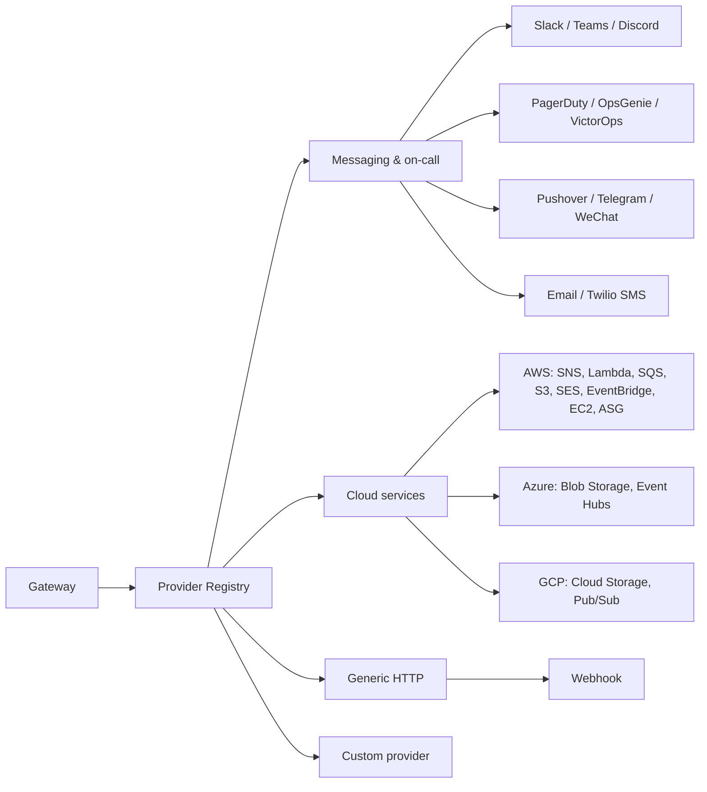

# Providers

Providers are the execution endpoints in Acteon. They receive actions and perform the actual work — sending emails, posting Slack messages, calling webhooks, or any custom operation.

## Provider Architecture


```mermaid
flowchart LR
    G[Gateway] --> R[Provider Registry]
    R --> M[Messaging & on-call]
    R --> C[Cloud services]
    R --> GEN[Generic HTTP]
    R --> CUST[Custom provider]
    M --> M1[Slack / Teams / Discord]
    M --> M2[PagerDuty / OpsGenie / VictorOps]
    M --> M3[Pushover / Telegram / WeChat]
    M --> M4[Email / Twilio SMS]
    C --> C1[AWS: SNS, Lambda, SQS, S3, SES, EventBridge, EC2, ASG]
    C --> C2[Azure: Blob Storage, Event Hubs]
    C --> C3[GCP: Cloud Storage, Pub/Sub]
    GEN --> GEN1[Webhook]
```

The gateway looks up the provider by the action's `provider` field and dispatches accordingly. All providers — whether built-in or user-written — implement the same `Provider` trait and participate uniformly in circuit breaking, health checks, per-provider metrics, and tenant quotas.

## Provider Traits

Acteon defines two provider traits:

### `Provider` (Strongly Typed)

```rust
pub trait Provider: Send + Sync {
    fn name(&self) -> &str;

    async fn execute(
        &self,
        action: &Action,
    ) -> Result<ProviderResponse, ProviderError>;

    async fn health_check(&self) -> Result<(), ProviderError>;
}
```

### `DynProvider` (Object-Safe)

For dynamic dispatch via trait objects:

```rust
#[async_trait]
pub trait DynProvider: Send + Sync {
    fn name(&self) -> &str;

    async fn execute(
        &self,
        action: &Action,
    ) -> Result<ProviderResponse, ProviderError>;

    async fn health_check(&self) -> Result<(), ProviderError>;
}
```

Any type implementing `Provider` automatically implements `DynProvider` through a blanket implementation.

## Implementing a Custom Provider

```rust
use acteon_provider::{DynProvider, ProviderError};
use acteon_core::{Action, ProviderResponse};
use async_trait::async_trait;

struct MyWebhookProvider {
    client: reqwest::Client,
    base_url: String,
}

#[async_trait]
impl DynProvider for MyWebhookProvider {
    fn name(&self) -> &str {
        "my-webhook"
    }

    async fn execute(
        &self,
        action: &Action,
    ) -> Result<ProviderResponse, ProviderError> {
        let response = self.client
            .post(&self.base_url)
            .json(&action.payload)
            .send()
            .await
            .map_err(|e| ProviderError::Connection(e.to_string()))?;

        if response.status().is_success() {
            let body = response.json().await
                .unwrap_or(serde_json::json!({}));
            Ok(ProviderResponse::success(body))
        } else {
            Err(ProviderError::ExecutionFailed(
                format!("HTTP {}", response.status())
            ))
        }
    }

    async fn health_check(&self) -> Result<(), ProviderError> {
        self.client
            .get(format!("{}/health", self.base_url))
            .send()
            .await
            .map_err(|e| ProviderError::Connection(e.to_string()))?;
        Ok(())
    }
}
```

## Registering Providers

Register providers with the gateway via the builder:

```rust
use std::sync::Arc;

let gateway = GatewayBuilder::new()
    .provider(Arc::new(EmailProvider::new(smtp_config)))
    .provider(Arc::new(SlackProvider::new(slack_config)))
    .provider(Arc::new(PagerDutyProvider::new(pagerduty_config)))
    .provider(Arc::new(OpsGenieProvider::new(opsgenie_config)))
    .provider(Arc::new(TwilioProvider::new(twilio_config)))
    .provider(Arc::new(TeamsProvider::new(teams_config)))
    .provider(Arc::new(DiscordProvider::new(discord_config)))
    .provider(Arc::new(TelegramProvider::new(telegram_config)))
    .provider(Arc::new(MyWebhookProvider {
        client: reqwest::Client::new(),
        base_url: "https://api.example.com".into(),
    }))
    .build()?;
```

Actions are routed to providers by matching the action's `provider` field to the provider's `name()`. Most real deployments register providers declaratively from TOML via `[[providers]]` blocks rather than building them in Rust — see [Configuration](../getting-started/configuration.md) for the TOML schema.

!!! note "Cloud providers are feature-gated"
    AWS, Azure, and GCP providers live in the `acteon-aws`, `acteon-azure`, and `acteon-gcp` crates and are gated behind individual Cargo feature flags on `acteon-server` (e.g. `aws-sns`, `azure-blob`, `gcp-pubsub`). The default `cargo build` does not compile any of them. Pick the flags you need, or use the `aws-all` / `azure-all` / `gcp-all` group flags. See the [AWS](../features/aws-providers.md), [Azure](../features/azure-providers.md), and [GCP](../features/gcp-providers.md) feature pages for the full flag table and IAM / auth setup.

## Built-in Providers

Acteon ships with built-in providers organized into four categories. Every provider below is a first-class citizen: uniform circuit breaking, health checks, per-provider metrics, tenant quotas, W3C trace context propagation, and `ENC[...]` encrypted-secret support where applicable.

### Messaging and on-call

Providers that deliver human-facing notifications — chat messages, SMS, push notifications, and incident paging. Widely-used providers ship in the default `acteon-server` binary. Niche or regional providers are opt-in behind a Cargo feature flag so the default build does not pull in integrations most deployments will never touch — enable individual flags or use the `extras-alerting` group flag to turn them all on.

| Provider | Crate | `type` | Default build? | Transport / Auth | Feature docs |
|---|---|---|---|---|---|
| Email (SMTP) | `acteon-email` | `email` | ✅ Default | SMTP (Lettre) with STARTTLS / TLS | [Native providers](../features/native-providers.md) |
| Slack | `acteon-slack` | `slack` | ✅ Default | Bot token or incoming webhook | [Native providers](../features/native-providers.md) |
| Microsoft Teams | `acteon-teams` | `teams` | ✅ Default | Incoming webhook URL | [Native providers](../features/native-providers.md) |
| Twilio (SMS / MMS) | `acteon-twilio` | `twilio` | ✅ Default | Account SID + Auth Token (HTTP Basic) | [Native providers](../features/native-providers.md) |
| PagerDuty | `acteon-pagerduty` | `pagerduty` | ✅ Default | Events API v2 routing key | [Native providers](../features/native-providers.md) |
| Discord | `acteon-discord` | `discord` | `--features discord` | Webhook URL | [Native providers](../features/native-providers.md) |
| OpsGenie | `acteon-opsgenie` | `opsgenie` | `--features opsgenie` | Alert API v2 integration key (US / EU regions) | [OpsGenie](../features/opsgenie.md) |
| VictorOps / Splunk On-Call | `acteon-victorops` | `victorops` | `--features victorops` | REST endpoint routing key | [VictorOps](../features/victorops.md) |
| Pushover | `acteon-pushover` | `pushover` | `--features pushover` | App token + user / group key | [Pushover](../features/pushover.md) |
| Telegram Bot | `acteon-telegram` | `telegram` | `--features telegram` | Bot token + chat ID | [Telegram](../features/telegram.md) |
| WeChat Work (企业微信) | `acteon-wechat` | `wechat` | `--features wechat` | Corp ID + corp secret + agent ID (lazy token refresh) | [WeChat Work](../features/wechat.md) |

!!! note "How opt-in flags behave"
    If you run a binary compiled without the relevant feature and put `type = "opsgenie"` in your TOML config, the server fails fast at startup with an actionable error: `provider 'X': unknown type 'opsgenie'. Hint: enable the 'opsgenie' feature on acteon-server (cargo build --features opsgenie)`. No silent fallthrough.

### AWS cloud services

AWS providers are gated behind individual Cargo feature flags on `acteon-server` so the default build doesn't pay the cost of eight AWS SDK crates. Enable `aws-all` for the full set, or pick individual flags. See [AWS providers](../features/aws-providers.md) for config, payload shapes, and IAM requirements.

| Provider `type` | AWS service | Feature flag | Use case |
|---|---|---|---|
| `aws-sns` | Simple Notification Service | `aws-sns` | Publish to topics (fan-out to email/SMS/Lambda/HTTP) |
| `aws-lambda` | Lambda | `aws-lambda` | Synchronous or async function invocation |
| `aws-eventbridge` | EventBridge | `aws-eventbridge` | Publish custom events to event buses |
| `aws-sqs` | Simple Queue Service | `aws-sqs` | Enqueue messages for async processing |
| `aws-s3` | S3 | `aws-s3` | Write objects, trigger event notifications |
| `aws-ses` | Simple Email Service | `aws-ses` | Send transactional / bulk email |
| `aws-ec2` | EC2 | `aws-ec2` | Start / stop / reboot instances (ops automation) |
| `aws-autoscaling` | Auto Scaling | `aws-autoscaling` | Trigger scaling actions |

### Azure and GCP

| Provider `type` | Cloud service | Feature flag | Feature docs |
|---|---|---|---|
| `azure-blob` | Azure Blob Storage | `azure-blob` | [Azure providers](../features/azure-providers.md) |
| `azure-eventhubs` | Azure Event Hubs | `azure-eventhubs` | [Azure providers](../features/azure-providers.md) |
| `gcp-storage` | Google Cloud Storage | `gcp-storage` | [GCP providers](../features/gcp-providers.md) |
| `gcp-pubsub` | Google Cloud Pub/Sub | `gcp-pubsub` | [GCP providers](../features/gcp-providers.md) |

### Generic and testing

| Provider | Crate | `type` | Purpose |
|---|---|---|---|
| Webhook | `acteon-webhook` | `webhook` | Generic HTTP dispatcher — Bearer / Basic / API key / HMAC-SHA256 auth, custom headers, configurable method, payload modes |
| Log | `acteon-provider` (built-in) | `log` | Writes the dispatched action to the tracing log at INFO. Ships with every Acteon binary and is the default target in most example configs. Ideal for local dev, tests, and dry runs. |
| Recording | `acteon-simulation` | — | Test-only in-memory provider that captures every dispatched action for assertions. Used by the simulation harness — see [Simulation & Testing](../examples/simulation.md). |

!!! tip "Custom providers"
    None of these lists are exhaustive for *your* deployment — any type implementing `Provider` / `DynProvider` can be registered alongside the built-ins. Acteon routes to providers purely by the `name()` returned from the trait implementation, so a custom Rust provider is indistinguishable from a built-in one to the gateway and rule engine.

---

The rest of this page drills into a representative subset of payload shapes. For the remaining providers, follow the feature-doc links in the tables above.

### Email (SMTP)

The `acteon-email` crate provides an SMTP provider via the Lettre library.

**Expected payload:**

```json
{
  "to": "recipient@example.com",
  "cc": ["cc@example.com"],
  "bcc": ["bcc@example.com"],
  "subject": "Email subject",
  "body": "Email body (text or HTML)",
  "from": "sender@example.com"
}
```

### Slack

The `acteon-slack` crate provides a Slack messaging provider.

**Expected payload:**

```json
{
  "channel": "#notifications",
  "text": "Message text",
  "blocks": []
}
```

### PagerDuty

The `acteon-pagerduty` crate provides a PagerDuty Events API v2 provider for incident management. It supports triggering, acknowledging, and resolving incidents.

**Configuration:**

Single service (routing key only):

```rust
let config = PagerDutyConfig::single_service("PABC123", "your-routing-key");
```

Multiple services:

```rust
let config = PagerDutyConfig::new()
    .with_service("PABC123", "routing-key-1")
    .with_service("PXYZ789", "routing-key-2")
    .with_default_service("PABC123");
```

When multiple services are configured, each action payload can specify a `service_id` to target a specific service. If omitted, the default service is used. With a single service, `service_id` is optional.

**Trigger payload:**

```json
{
  "event_action": "trigger",
  "service_id": "PABC123",
  "summary": "CPU usage exceeded 90% on web-01",
  "severity": "critical",
  "source": "monitoring",
  "component": "web-01",
  "group": "production",
  "class": "cpu",
  "dedup_key": "web-01/cpu-high",
  "custom_details": { "cpu_percent": 95.2 },
  "images": [{ "src": "https://example.com/graph.png", "alt": "CPU graph" }],
  "links": [{ "href": "https://example.com/runbook", "text": "Runbook" }]
}
```

**Acknowledge/resolve payload:**

```json
{
  "event_action": "acknowledge",
  "dedup_key": "web-01/cpu-high"
}
```

| Field | Required | Default | Description |
|-------|----------|---------|-------------|
| `event_action` | Yes | — | `"trigger"`, `"acknowledge"`, or `"resolve"` |
| `service_id` | No | Config default | PagerDuty service ID to route the event to |
| `summary` | Trigger only | — | Brief description of the event |
| `severity` | No | Config default | `"critical"`, `"error"`, `"warning"`, or `"info"` |
| `source` | No | Config default | Event source (e.g. hostname or service) |
| `dedup_key` | Ack/resolve | — | Deduplication key for correlating events |
| `component` | No | — | Logical grouping component |
| `group` | No | — | Logical grouping (e.g. `"production"`) |
| `class` | No | — | Event class/type (e.g. `"cpu"`) |
| `custom_details` | No | — | Arbitrary key-value details |
| `images` | No | — | Images to display in the incident |
| `links` | No | — | Links to display in the incident |

### Twilio (SMS)

The `acteon-twilio` crate provides an SMS provider via the Twilio REST API.

**Expected payload:**

```json
{
  "to": "+15559876543",
  "body": "Your verification code is 123456",
  "from": "+15551234567",
  "media_url": "https://example.com/image.jpg"
}
```

| Field | Required | Default | Description |
|-------|----------|---------|-------------|
| `to` | Yes | — | Destination phone number (E.164 format) |
| `body` | Yes | — | Message body text |
| `from` | No | Config default | Sender phone number (E.164 format) |
| `media_url` | No | — | URL of media to attach (MMS) |

### Microsoft Teams

The `acteon-teams` crate provides a Microsoft Teams provider via incoming webhooks.

**MessageCard payload:**

```json
{
  "text": "Deployment complete",
  "title": "CI/CD Pipeline",
  "summary": "Build #42 passed",
  "theme_color": "00FF00"
}
```

**Adaptive Card payload:**

```json
{
  "adaptive_card": {
    "type": "AdaptiveCard",
    "version": "1.4",
    "body": [{"type": "TextBlock", "text": "Hello!"}]
  }
}
```

At least one of `text` or `adaptive_card` must be provided.

### Discord

The `acteon-discord` crate provides a Discord provider via webhooks.

**Expected payload:**

```json
{
  "content": "Build passed!",
  "embeds": [{
    "title": "Build #42",
    "description": "All tests passed",
    "color": 65280,
    "fields": [{"name": "Branch", "value": "main", "inline": true}],
    "footer": {"text": "CI/CD"}
  }],
  "username": "Acteon Bot",
  "avatar_url": "https://example.com/avatar.png",
  "tts": false
}
```

At least one of `content` or `embeds` must be provided.

### Webhook

The `acteon-webhook` crate provides a generic HTTP webhook provider for dispatching actions to any HTTP endpoint. It supports configurable HTTP methods, authentication (Bearer, Basic, API key, HMAC-SHA256), custom headers, and flexible payload modes.

**Configuration:**

```rust
use acteon_webhook::{WebhookConfig, WebhookProvider, AuthMethod, HttpMethod, PayloadMode};

// Simple webhook
let provider = WebhookProvider::new(
    WebhookConfig::new("https://api.example.com/webhook")
);

// Webhook with authentication and custom settings
let provider = WebhookProvider::new(
    WebhookConfig::new("https://api.example.com/webhook")
        .with_method(HttpMethod::Put)
        .with_auth(AuthMethod::Bearer("your-token".into()))
        .with_header("X-Custom-Header", "value")
        .with_payload_mode(PayloadMode::PayloadOnly)
        .with_timeout_secs(10)
);

// Webhook with HMAC signing
let provider = WebhookProvider::new(
    WebhookConfig::new("https://api.example.com/webhook")
        .with_auth(AuthMethod::HmacSha256 {
            secret: "your-secret".into(),
            header: "X-Signature".into(),
        })
);
```

**Expected payload:**

```json
{
  "url": "https://hooks.example.com/endpoint",
  "method": "POST",
  "body": {
    "message": "Server is down",
    "severity": "critical"
  },
  "headers": {
    "X-Custom-Header": "value"
  }
}
```

**Client SDK helpers** make constructing webhook payloads easy:

=== "Rust"

    ```rust
    use acteon_client::webhook;

    let action = webhook::action("notifications", "tenant-1")
        .url("https://hooks.example.com/alert")
        .body(serde_json::json!({"message": "Server down"}))
        .header("X-Custom", "value")
        .build();
    ```

=== "Python"

    ```python
    from acteon_client import create_webhook_action

    action = create_webhook_action(
        namespace="notifications",
        tenant="tenant-1",
        url="https://hooks.example.com/alert",
        body={"message": "Server down"},
        headers={"X-Custom": "value"},
    )
    ```

=== "TypeScript"

    ```typescript
    import { createWebhookAction } from "@acteon/client";

    const action = createWebhookAction(
      "notifications", "tenant-1",
      "https://hooks.example.com/alert",
      { message: "Server down" },
      { headers: { "X-Custom": "value" } }
    );
    ```

=== "Go"

    ```go
    action := acteon.NewWebhookAction(
        "notifications", "tenant-1",
        "https://hooks.example.com/alert",
        map[string]any{"message": "Server down"},
    ).WithWebhookHeaders(map[string]string{"X-Custom": "value"})
    ```

=== "Java"

    ```java
    Action action = WebhookAction.builder()
        .namespace("notifications")
        .tenant("tenant-1")
        .url("https://hooks.example.com/alert")
        .body(Map.of("message", "Server down"))
        .header("X-Custom", "value")
        .build();
    ```

| Field | Required | Default | Description |
|-------|----------|---------|-------------|
| `url` | Yes | — | Target URL for the webhook request |
| `method` | No | `POST` | HTTP method (`GET`, `POST`, `PUT`, `PATCH`, `DELETE`) |
| `body` | Yes | — | JSON body to send to the endpoint |
| `headers` | No | — | Additional HTTP headers |

**Authentication methods:**

| Method | Description |
|--------|-------------|
| `Bearer(token)` | `Authorization: Bearer <token>` header |
| `Basic { username, password }` | HTTP Basic authentication |
| `ApiKey { header, value }` | Custom header with API key value |
| `HmacSha256 { secret, header }` | HMAC-SHA256 signature of the request body |

**Payload modes:**

| Mode | Description |
|------|-------------|
| `FullAction` | Sends the entire serialized `Action` as the request body |
| `PayloadOnly` | Sends only `action.payload` as the request body |

## Provider Errors

| Error | Retryable | Description |
|-------|-----------|-------------|
| `ExecutionFailed(msg)` | No | Permanent provider error |
| `Timeout(msg)` | Yes | Execution timed out |
| `Connection(msg)` | Yes | Network connectivity failure |
| `RateLimited` | Yes | Provider rate limit hit |
| `Configuration(msg)` | No | Invalid provider configuration |

The executor retries **retryable** errors up to `max_retries` times with the configured backoff strategy. Non-retryable errors immediately return `ActionOutcome::Failed`.

## Provider Response

```rust
// Success response
ProviderResponse::success(json!({"message_id": "abc123"}))

// Failure response
ProviderResponse::failure(json!({"error": "invalid recipient"}))
```

## Health Checks

Providers implement `health_check()` for monitoring. The server's `/health` endpoint aggregates provider health status.
