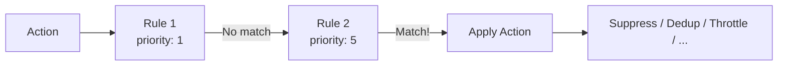

# Rule System

Rules are the heart of Acteon's control plane. They define conditions under which actions are transformed, blocked, or redirected before reaching external providers.

## How Rules Work



1. Rules are sorted by **ascending priority** (lower number = higher priority)
2. Each rule's **condition** is evaluated against the action
3. The **first matching rule** determines the action type
4. If no rule matches, the action is executed normally

## Rule Structure

Every rule has three parts:

```yaml
rules:
  - name: rule-name           # Unique identifier
    priority: 10               # Lower = evaluated first
    description: "Optional"    # Human-readable description

    condition:                 # When does this rule apply?
      field: action.action_type
      eq: "send_email"

    action:                    # What happens when it matches?
      type: deduplicate
      ttl_seconds: 300
```

## Conditions

### Single Field Match

```yaml
condition:
  field: action.action_type
  eq: "send_email"
```

### All (AND)

All conditions must be true:

```yaml
condition:
  all:
    - field: action.action_type
      eq: "send_email"
    - field: action.payload.priority
      eq: "high"
```

### Any (OR)

At least one condition must be true:

```yaml
condition:
  any:
    - field: action.provider
      eq: "email"
    - field: action.provider
      eq: "sms"
```

### Negation (NOT)

```yaml
condition:
  not:
    field: action.action_type
    eq: "internal"
```

### Nested Logic

Combine `all`, `any`, and `not` freely:

```yaml
condition:
  all:
    - field: action.action_type
      eq: "send_email"
    - any:
        - field: action.payload.priority
          eq: "high"
        - field: action.payload.priority
          eq: "urgent"
    - not:
        field: action.metadata.skip_rules
        eq: "true"
```

## Condition Operators

| Operator | Description | Example |
|----------|-------------|---------|
| `eq` | Exact string match | `eq: "send_email"` |
| `contains` | Substring match | `contains: "@"` |
| `starts_with` | Prefix match | `starts_with: "cluster_"` |
| `ends_with` | Suffix match | `ends_with: "@test.com"` |
| `regex` | Regular expression | `regex: "^alert_.*_critical$"` |
| `gt` | Greater than (numeric) | `gt: 100` |
| `gte` | Greater than or equal | `gte: 50` |
| `lt` | Less than | `lt: 10` |
| `lte` | Less than or equal | `lte: 0` |

## Field Paths

Rules can match on any part of the action:

| Path | Description | Example |
|------|-------------|---------|
| `action.namespace` | Namespace | `"notifications"` |
| `action.tenant` | Tenant ID | `"tenant-1"` |
| `action.provider` | Provider name | `"email"` |
| `action.action_type` | Action type | `"send_email"` |
| `action.id` | Action UUID | — |
| `action.status` | Current state | `"firing"` |
| `action.payload.field` | Payload field (JSON path) | `action.payload.to` |
| `action.payload.nested.field` | Nested payload field | `action.payload.user.email` |
| `action.metadata.key` | Metadata label | `action.metadata.priority` |

## Rule Actions

### Suppress

Block the action entirely:

```yaml
action:
  type: suppress
  reason: "Maintenance window"  # Optional reason
```

### Deduplicate

Prevent duplicate processing:

```yaml
action:
  type: deduplicate
  ttl_seconds: 300              # Dedup window (5 minutes)
```

### Throttle

Rate-limit actions:

```yaml
action:
  type: throttle
  max_count: 100                # Max actions per window
  window_seconds: 60            # Window size
  message: "Rate limited"       # Optional message
```

### Reroute

Redirect to a different provider:

```yaml
action:
  type: reroute
  target_provider: "sms"        # New provider
```

### Modify

Transform the payload:

```yaml
action:
  type: modify
  changes:
    tracking_enabled: true
    source: "acteon-gateway"
```

### Group

Batch related events:

```yaml
action:
  type: group
  group_by:
    - metadata.cluster
    - metadata.severity
  group_wait_seconds: 60
  group_interval_seconds: 300
  max_group_size: 100
```

### State Machine

Track event lifecycle:

```yaml
action:
  type: state_machine
  state_machine: alert          # References [[state_machines]] config
  fingerprint_fields:
    - action_type
    - metadata.cluster
    - metadata.service
```

### Require Approval

Gate on human approval:

```yaml
action:
  type: require_approval
  message: "Production deployment requires approval"
  ttl_seconds: 3600
```

### Chain

Start a multi-step workflow:

```yaml
action:
  type: chain
  chain_name: "search-summarize-email"
```

### LLM Guardrail

Evaluate with an LLM:

```yaml
action:
  type: llm_guardrail
  evaluator_name: "content-safety"
  block_on_flag: true
  send_to: "review-queue"
```

## Expression Functions

Rules can call dynamic functions for state-aware conditions:

```yaml
condition:
  call: has_active_event
  args: [cluster_down, action.metadata.cluster]
```

| Function | Description |
|----------|-------------|
| `has_active_event(event_type, label_value)` | Check if an active event exists |
| `get_event_state(fingerprint)` | Get current state of an event |
| `event_in_state(fingerprint, state)` | Check if event is in a specific state |

These enable **inhibition** patterns — suppressing dependent alerts when a parent alert is active.

## Rule Hot Reload

When a `rules.directory` is configured, Acteon watches the directory for changes and automatically reloads rules. You can also trigger a manual reload:

```bash
curl -X POST http://localhost:8080/v1/rules/reload
```

## See Also

- [YAML Rule Reference](../api/rule-reference.md) — complete syntax reference
- [Deduplication](../features/deduplication.md) — how dedup rules work in practice
- [Event Grouping](../features/event-grouping.md) — grouping rule details
- [State Machines](../features/state-machines.md) — state machine rule details
