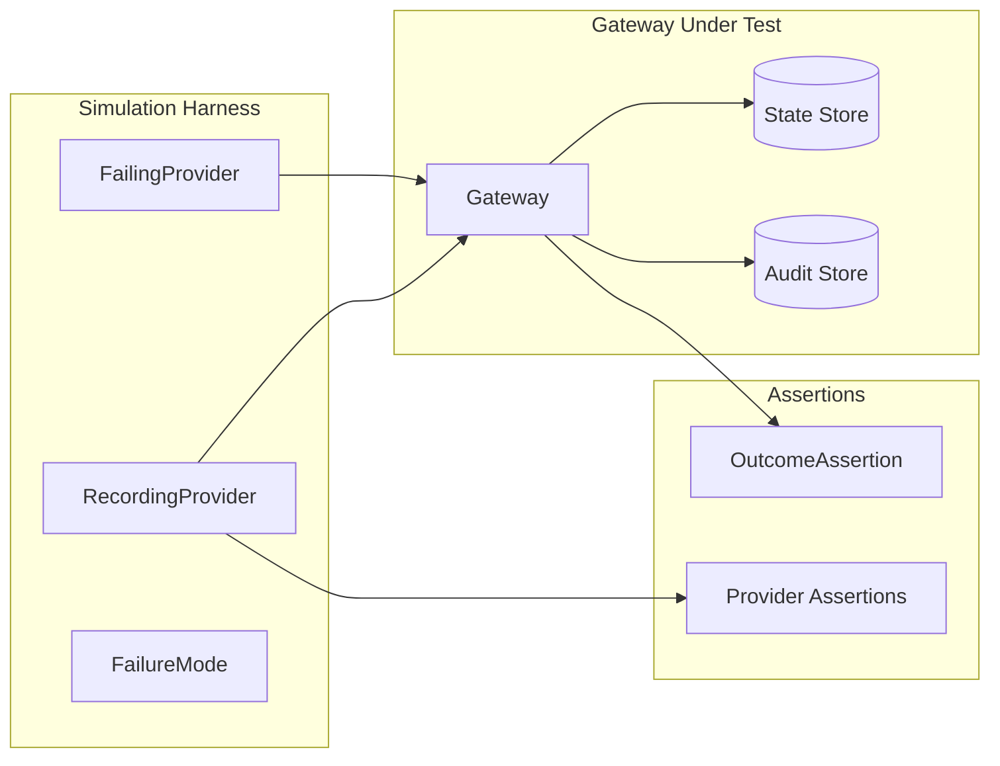

# Simulation & Testing

The `acteon-simulation` crate provides comprehensive end-to-end testing tools for the Acteon gateway.

## Overview



## Quick Start

```rust
use acteon_simulation::prelude::*;
use acteon_core::Action;

#[tokio::test]
async fn test_basic() {
    let harness = SimulationHarness::start(
        SimulationConfig::builder()
            .nodes(1)
            .add_recording_provider("email")
            .add_rule_yaml(r#"
                rules:
                  - name: dedup
                    condition:
                      field: action.action_type
                      eq: "notify"
                    action:
                      type: deduplicate
                      ttl_seconds: 60
            "#)
            .build()
    ).await.unwrap();

    let action = Action::new("ns", "t1", "email", "notify", json!({}))
        .with_dedup_key("key");

    harness.dispatch(&action).await.unwrap().assert_executed();
    harness.dispatch(&action).await.unwrap().assert_deduplicated();
    harness.provider("email").unwrap().assert_called(1);

    harness.teardown().await.unwrap();
}
```

## RecordingProvider

Captures all provider calls for verification:

```rust
let provider = Arc::new(RecordingProvider::new("email"));

// With simulated latency
let slow = Arc::new(RecordingProvider::new("api").with_delay(Duration::from_millis(100)));

// With failure injection
let flaky = Arc::new(RecordingProvider::new("flaky")
    .with_failure_mode(FailureMode::EveryN(5)));

// With custom response logic
let smart = Arc::new(RecordingProvider::new("smart")
    .with_response_fn(|action| {
        Ok(ProviderResponse::success(json!({"processed": true})))
    }));

// Assertions
provider.assert_called(1);
provider.assert_not_called();
provider.assert_called_at_least(5);

// Inspect calls
for call in provider.calls() {
    println!("Action: {}", call.action.id);
}

// Reset
provider.clear();
```

### FailureMode Options

| Mode | Description |
|------|-------------|
| `FailureMode::None` | Never fail (default) |
| `FailureMode::Always` | Always fail |
| `FailureMode::FirstN(n)` | Fail first N calls |
| `FailureMode::EveryN(n)` | Fail every Nth call |
| `FailureMode::Probabilistic(p)` | Fail with probability p |

## FailingProvider

Simulates specific error types:

```rust
// Connection error (retryable)
let failing = FailingProvider::connection_error("webhook", "Connection refused");

// Timeout (retryable)
let timeout = FailingProvider::timeout("api", Duration::from_secs(30));

// Rate limited (retryable)
let limited = FailingProvider::rate_limited("api");

// Execution error (non-retryable)
let broken = FailingProvider::execution_failed("broken", "Internal error");

// Transient: fail first N, then recover
let recovering = FailingProvider::execution_failed("flaky", "Temp error")
    .fail_until(3);
```

## OutcomeAssertion

Fluent assertions for dispatch results:

```rust
harness.dispatch(&action).await.unwrap()
    .assert_executed();      // Provider executed
    .assert_deduplicated();  // Was deduplicated
    .assert_suppressed();    // Was suppressed
    .assert_throttled();     // Was throttled
    .assert_failed();        // Provider failed
    .assert_grouped();       // Added to group
    .assert_state_changed(); // State transitioned
    .assert_pending_approval(); // Needs approval
    .assert_chain_started(); // Chain initiated
    .assert_dry_run();       // Dry-run verdict returned
```

### Dry-Run Dispatch

```rust
// Dry-run: evaluate rules without executing
let outcome = harness.dispatch_dry_run(&action).await.unwrap();
outcome.assert_dry_run();
// Provider was NOT called
harness.provider("email").unwrap().assert_not_called();
```

## Test Scenarios

### Deduplication

```rust
let action = Action::new("ns", "t1", "email", "notify", json!({}))
    .with_dedup_key("unique");
harness.dispatch(&action).await.unwrap().assert_executed();
harness.dispatch(&action).await.unwrap().assert_deduplicated();
harness.provider("email").unwrap().assert_called(1);
```

### Suppression

```rust
let spam = Action::new("ns", "t1", "email", "spam", json!({}));
harness.dispatch(&spam).await.unwrap().assert_suppressed();
harness.provider("email").unwrap().assert_not_called();
```

### Throttling

```rust
for i in 0..15 {
    let action = Action::new("ns", "t1", "sms", "alert", json!({"seq": i}));
    let outcome = harness.dispatch(&action).await.unwrap();
    if i < 10 {
        outcome.assert_executed();
    } else {
        outcome.assert_throttled();
    }
}
```

### Failure Recovery

```rust
let recovering = FailingProvider::execution_failed("api", "Temp")
    .fail_until(2);

// First 2 calls fail, third succeeds (with retries)
let action = Action::new("ns", "t1", "api", "call", json!({}));
let outcome = harness.dispatch(&action).await.unwrap();
// With max_retries >= 2, this will eventually execute
```

### Multi-Node Concurrent Dispatch

```rust
let harness = SimulationHarness::multi_node_memory(3).await.unwrap();

let action = Action::new("ns", "t1", "email", "notify", json!({}))
    .with_dedup_key("concurrent-key");

// Dispatch to all 3 nodes concurrently
let futures: Vec<_> = (0..3)
    .map(|i| harness.dispatch_to(i, &action))
    .collect();

let outcomes = futures::future::join_all(futures).await;
let executed = outcomes.iter()
    .filter(|o| matches!(o.as_ref().unwrap().outcome(), ActionOutcome::Executed(_)))
    .count();

assert_eq!(executed, 1); // Only one node executes
```

## Running Backend-Specific Simulations

### Prerequisites

```bash
# Redis
docker run -d --name acteon-redis -p 6379:6379 redis:7-alpine

# PostgreSQL
docker run -d --name acteon-postgres -p 5433:5432 \
  -e POSTGRES_PASSWORD=postgres postgres:16-alpine

# ClickHouse
docker run -d --name acteon-clickhouse -p 8123:8123 \
  clickhouse/clickhouse-server:latest

# DynamoDB Local
docker run -d --name acteon-dynamodb -p 8000:8000 \
  amazon/dynamodb-local:latest
```

### Single Backend Simulations

```bash
cargo run -p acteon-simulation --example redis_simulation --features redis
cargo run -p acteon-simulation --example postgres_simulation --features postgres
cargo run -p acteon-simulation --example clickhouse_simulation --features clickhouse
cargo run -p acteon-simulation --example dynamodb_simulation --features dynamodb
```

### Dry-Run Simulation

```bash
cargo run -p acteon-simulation --example dry_run_simulation
```

Tests dry-run dispatch across multiple rule types:

- **Allow verdict** — No rules match, action would be allowed
- **Suppression verdict** — Rule would suppress the action
- **Rerouting verdict** — Rule would reroute to a different provider
- **Batch dry-run** — Multiple actions evaluated without executing
- **Provider not called** — Verifies no side effects during dry-run

### Webhook Simulation

```bash
cargo run -p acteon-simulation --example webhook_simulation
```

Tests webhook dispatch, rerouting to webhooks, and deduplication of webhook calls:

- **Basic dispatch** — Action sent directly to webhook provider
- **Rerouting** — Actions rerouted from email to webhook based on rules
- **Deduplication** — Duplicate webhook calls are blocked

### Mixed Backend Simulations

```bash
# Redis state + PostgreSQL audit
cargo run -p acteon-simulation --example mixed_backends_simulation \
  --features "redis,postgres" -- redis-postgres

# Redis state + ClickHouse audit
cargo run -p acteon-simulation --example mixed_backends_simulation \
  --features "redis,clickhouse" -- redis-clickhouse
```

## Benchmarks

```bash
cargo bench -p acteon-simulation --bench throughput
cargo bench -p acteon-simulation --bench latency
```

See [Performance Guide](../reference/performance.md) for benchmark results.
