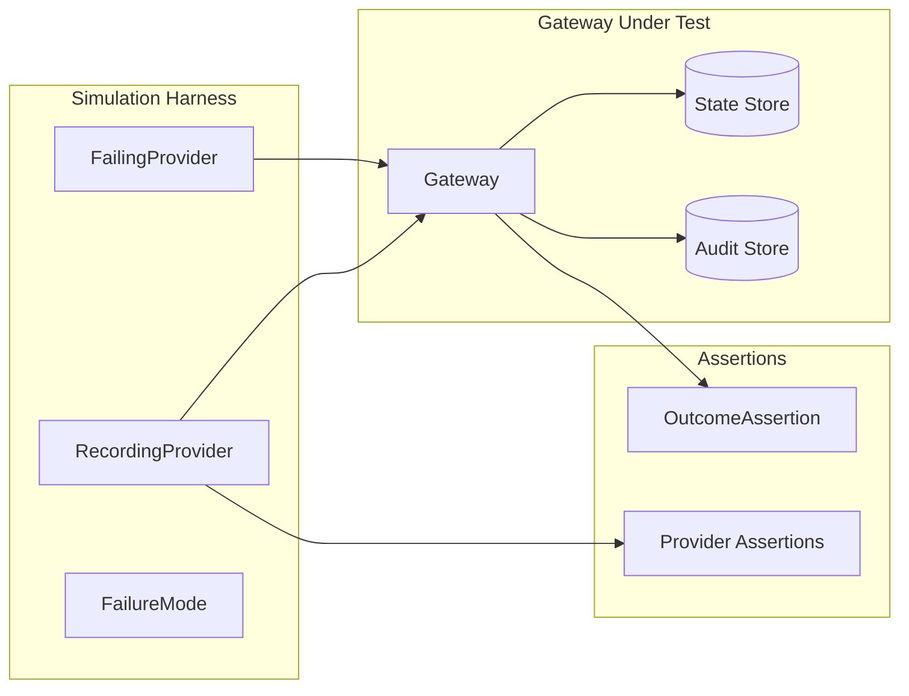

# Simulation & Testing

The `acteon-simulation` crate provides comprehensive end-to-end testing tools for the Acteon gateway.

## Reproducible scenario evaluations

Run the versioned kernel and product-workflow suites from the repository root:

```bash
scripts/ci/scenarios.sh memory
```

With disposable Redis and PostgreSQL URLs configured, run
`scripts/ci/scenarios.sh memory redis postgres`. Each suite writes a JSON report,
JUnit results, and a semantic trace, then verifies replay. The product portfolio
covers incident approval, refund acknowledgement loss, and scripted
prompt-injection attempts, with three seeded trials per workflow. Its fixed
scorecards report mandatory safety gates separately from weighted diagnostic
scores. Negative tests verify that removed protections fail those gates.

Artifacts are saved under `scenario-results/<backend>/<suite>/{first,replay}`.
Version 2 replay requires the original executable and compiled lockfile
fingerprints. These scripted trials use real state/lock backends and controlled
effect providers; they do not virtualize database clocks or certify behavior
under process crashes. See the repository's
[scenario guide](https://github.com/penserai/acteon/tree/main/scenarios) for the
manifest and grading contracts.

## Overview


```mermaid
flowchart LR
    subgraph Simulation Harness
        RC[RecordingProvider]
        FP[FailingProvider]
        FM[FailureMode]
    end

    subgraph Gateway Under Test
        GW[Gateway]
        ST[(State Store)]
        AU[(Audit Store)]
    end

    subgraph Assertions
        OA[OutcomeAssertion]
        PA[Provider Assertions]
    end

    RC --> GW
    FP --> GW
    GW --> ST
    GW --> AU
    GW --> OA
    RC --> PA
```

## Quick Start

```rust
use acteon_simulation::prelude::*;
use acteon_core::Action;

#[tokio::test]
async fn test_basic() {
    let harness = SimulationHarness::start(
        SimulationConfig::builder()
            .nodes(1)
            .add_recording_provider("email")
            .add_rule_yaml(r#"
                rules:
                  - name: dedup
                    condition:
                      field: action.action_type
                      eq: "notify"
                    action:
                      type: deduplicate
                      ttl_seconds: 60
            "#)
            .build()
    ).await.unwrap();

    let action = Action::new("ns", "t1", "email", "notify", json!({}))
        .with_dedup_key("key");

    harness.dispatch(&action).await.unwrap().assert_executed();
    harness.dispatch(&action).await.unwrap().assert_deduplicated();
    harness.provider("email").unwrap().assert_called(1);

    harness.teardown().await.unwrap();
}
```

## RecordingProvider

Captures all provider calls for verification:

```rust
let provider = Arc::new(RecordingProvider::new("email"));

// With simulated latency
let slow = Arc::new(RecordingProvider::new("api").with_delay(Duration::from_millis(100)));

// With failure injection
let flaky = Arc::new(RecordingProvider::new("flaky")
    .with_failure_mode(FailureMode::EveryN(5)));

// With custom response logic
let smart = Arc::new(RecordingProvider::new("smart")
    .with_response_fn(|action| {
        Ok(ProviderResponse::success(json!({"processed": true})))
    }));

// Assertions
provider.assert_called(1);
provider.assert_not_called();
provider.assert_called_at_least(5);

// Inspect calls
for call in provider.calls() {
    println!("Action: {}", call.action.id);
}

// Reset
provider.clear();
```

### FailureMode Options

| Mode | Description |
|------|-------------|
| `FailureMode::None` | Never fail (default) |
| `FailureMode::Always` | Always fail |
| `FailureMode::FirstN(n)` | Fail first N calls |
| `FailureMode::EveryN(n)` | Fail every Nth call |
| `FailureMode::Probabilistic(p)` | Fail with probability p |

## FailingProvider

Simulates specific error types:

```rust
// Connection error (retryable)
let failing = FailingProvider::connection_error("webhook", "Connection refused");

// Timeout (retryable)
let timeout = FailingProvider::timeout("api", Duration::from_secs(30));

// Rate limited (retryable)
let limited = FailingProvider::rate_limited("api");

// Execution error (non-retryable)
let broken = FailingProvider::execution_failed("broken", "Internal error");

// Transient: fail first N, then recover
let recovering = FailingProvider::execution_failed("flaky", "Temp error")
    .fail_until(3);
```

## OutcomeAssertion

Fluent assertions for dispatch results:

```rust
harness.dispatch(&action).await.unwrap()
    .assert_executed();      // Provider executed
    .assert_deduplicated();  // Was deduplicated
    .assert_suppressed();    // Was suppressed
    .assert_throttled();     // Was throttled
    .assert_failed();        // Provider failed
    .assert_grouped();       // Added to group
    .assert_state_changed(); // State transitioned
    .assert_pending_approval(); // Needs approval
    .assert_chain_started(); // Chain initiated
    .assert_dry_run();       // Dry-run verdict returned
```

### Dry-Run Dispatch

```rust
// Dry-run: evaluate rules without executing
let outcome = harness.dispatch_dry_run(&action).await.unwrap();
outcome.assert_dry_run();
// Provider was NOT called
harness.provider("email").unwrap().assert_not_called();
```

## Test Scenarios

### Deduplication

```rust
let action = Action::new("ns", "t1", "email", "notify", json!({}))
    .with_dedup_key("unique");
harness.dispatch(&action).await.unwrap().assert_executed();
harness.dispatch(&action).await.unwrap().assert_deduplicated();
harness.provider("email").unwrap().assert_called(1);
```

### Suppression

```rust
let spam = Action::new("ns", "t1", "email", "spam", json!({}));
harness.dispatch(&spam).await.unwrap().assert_suppressed();
harness.provider("email").unwrap().assert_not_called();
```

### Throttling

```rust
for i in 0..15 {
    let action = Action::new("ns", "t1", "sms", "alert", json!({"seq": i}));
    let outcome = harness.dispatch(&action).await.unwrap();
    if i < 10 {
        outcome.assert_executed();
    } else {
        outcome.assert_throttled();
    }
}
```

### Failure Recovery

```rust
let recovering = FailingProvider::execution_failed("api", "Temp")
    .fail_until(2);

// First 2 calls fail, third succeeds (with retries)
let action = Action::new("ns", "t1", "api", "call", json!({}));
let outcome = harness.dispatch(&action).await.unwrap();
// With max_retries >= 2, this will eventually execute
```

### Multi-Node Concurrent Dispatch

```rust
let harness = SimulationHarness::multi_node_memory(3).await.unwrap();

let action = Action::new("ns", "t1", "email", "notify", json!({}))
    .with_dedup_key("concurrent-key");

// Dispatch to all 3 nodes concurrently
let futures: Vec<_> = (0..3)
    .map(|i| harness.dispatch_to(i, &action))
    .collect();

let outcomes = futures::future::join_all(futures).await;
let executed = outcomes.iter()
    .filter(|o| matches!(o.as_ref().unwrap().outcome(), ActionOutcome::Executed(_)))
    .count();

assert_eq!(executed, 1); // Only one node executes
```

## Running Backend-Specific Simulations

### Prerequisites

```bash
# Redis
docker run -d --name acteon-redis -p 6379:6379 redis:7-alpine

# PostgreSQL
docker run -d --name acteon-postgres -p 5433:5432 \
  -e POSTGRES_PASSWORD=postgres postgres:16-alpine

# DynamoDB Local
docker run -d --name acteon-dynamodb -p 8000:8000 \
  amazon/dynamodb-local:latest
```

### Single Backend Simulations

```bash
cargo run -p acteon-simulation --example redis_simulation --features redis
cargo run -p acteon-simulation --example postgres_simulation --features postgres
cargo run -p acteon-simulation --example dynamodb_simulation --features dynamodb
```

### Dry-Run Simulation

```bash
cargo run -p acteon-simulation --example dry_run_simulation
```

Tests dry-run dispatch across multiple rule types:

- **Allow verdict** — No rules match, action would be allowed
- **Suppression verdict** — Rule would suppress the action
- **Rerouting verdict** — Rule would reroute to a different provider
- **Batch dry-run** — Multiple actions evaluated without executing
- **Provider not called** — Verifies no side effects during dry-run

### Time-Based Rules Simulation

```bash
cargo run -p acteon-simulation --example time_based_simulation
```

Tests time-based rule conditions using `time.*` fields:

- **Temporal suppression** — Rules using `time.year` to conditionally suppress actions
- **Business hours pattern** — Demonstrates `time.hour` and `time.weekday_num` conditions
- **Combined conditions** — Time fields combined with action field conditions
- **Dry-run with time** — Dry-run evaluation of time-based rules

### Webhook Simulation

```bash
cargo run -p acteon-simulation --example webhook_simulation
```

Tests webhook dispatch, rerouting to webhooks, and deduplication of webhook calls:

- **Basic dispatch** — Action sent directly to webhook provider
- **Rerouting** — Actions rerouted from email to webhook based on rules
- **Deduplication** — Duplicate webhook calls are blocked

### Mixed Backend Simulations

```bash
# Redis state + PostgreSQL audit
cargo run -p acteon-simulation --example mixed_backends_simulation \
  --features "redis,postgres" -- redis-postgres

# Redis state + ClickHouse audit
cargo run -p acteon-simulation --example mixed_backends_simulation \
  --features "redis,clickhouse" -- redis-clickhouse
```

## Benchmarks

```bash
cargo bench -p acteon-simulation --bench throughput
cargo bench -p acteon-simulation --bench latency
```

See [Performance Guide](../reference/performance.md) for benchmark results.


### Virtual deadline evaluation

`scenarios/deadlines.json` runs the `deadline_safety` scenario with a shared manual
clock and the real gateway/executor/memory implementations. It covers exact dedup,
approval, lease, and execution boundaries, plus seeded outage/recovery scheduling.
It rejects remote backends because their TTL clocks are not virtualized.

```bash
cargo run --locked -p acteon-simulation --features swarm --bin acteon-scenario -- \
  --manifest scenarios/deadlines.json --output scenario-results/deadlines/first
target/debug/acteon-scenario --replay scenario-results/deadlines/first/report.json \
  --output scenario-results/deadlines/replay
```

The embedding APIs are `GatewayBuilder::clock`, `MemoryStateStore::with_clock`,
`MemoryDistributedLock::with_clock`, and
`acteon_simulation::scheduler::DeterministicScheduler`. Share one `ManualClock`
instance across them. Background worker loops and external I/O require further
adapters; this suite does not virtualize an entire server process.

### Explicit worker ticks and task time

`BackgroundProcessorBuilder::clock` and `TaskEngine::with_clock` share the gateway's
clock. `BackgroundProcessor::tick(BackgroundJob)` executes one enabled worker
cycle without advancing time. `scenarios/workers.json` exercises this API, task
liveness, and polling with a manual clock; `scripts/ci/scenarios.sh memory` runs
and replays it alongside the existing suites. Remote TTLs and process scheduling
remain outside this clock domain. See [the worker lifecycle contract](https://github.com/penserai/acteon/blob/main/docs/worker-lifecycle.md).

### Durable scheduling and deployment recovery

`scenarios/scheduling.json` adds manual-time deployment restart/checkpoint and
workflow-timer evidence, plus scheduled-action redelivery after a failed outcome
write. It checks discovery repair, stale ownership, downstream idempotency, and
tenant quota isolation. Run it with the same `acteon-scenario --manifest` and
`--replay` commands above. See [the recovery contract](../../durable-scheduling.md)
for receipt consumption, upgrade requirements, and untested crash windows.

### Worker queue recovery

`scenarios/queues.json` exercises interrupted enqueue repair, retry acknowledgement
loss, ownership and tenant isolation, terminal cleanup, and encrypted records on
memory, Redis, and PostgreSQL. The same manifest/replay commands apply. The CI
script runs twelve suite/backend pairs and preserves their executable. See
[worker queue recovery](../../queue-recovery.md) for the write-fault adapter,
manual-clock race contracts, and remaining terminal-handoff gap.
