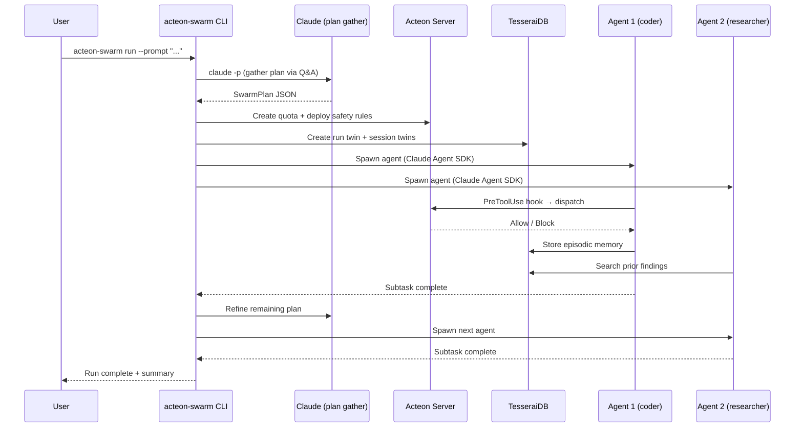
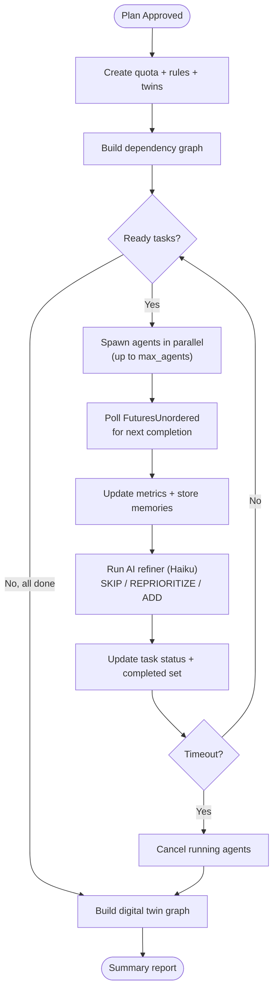
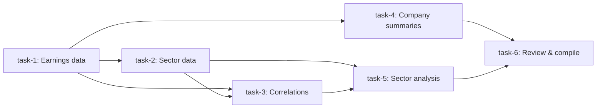
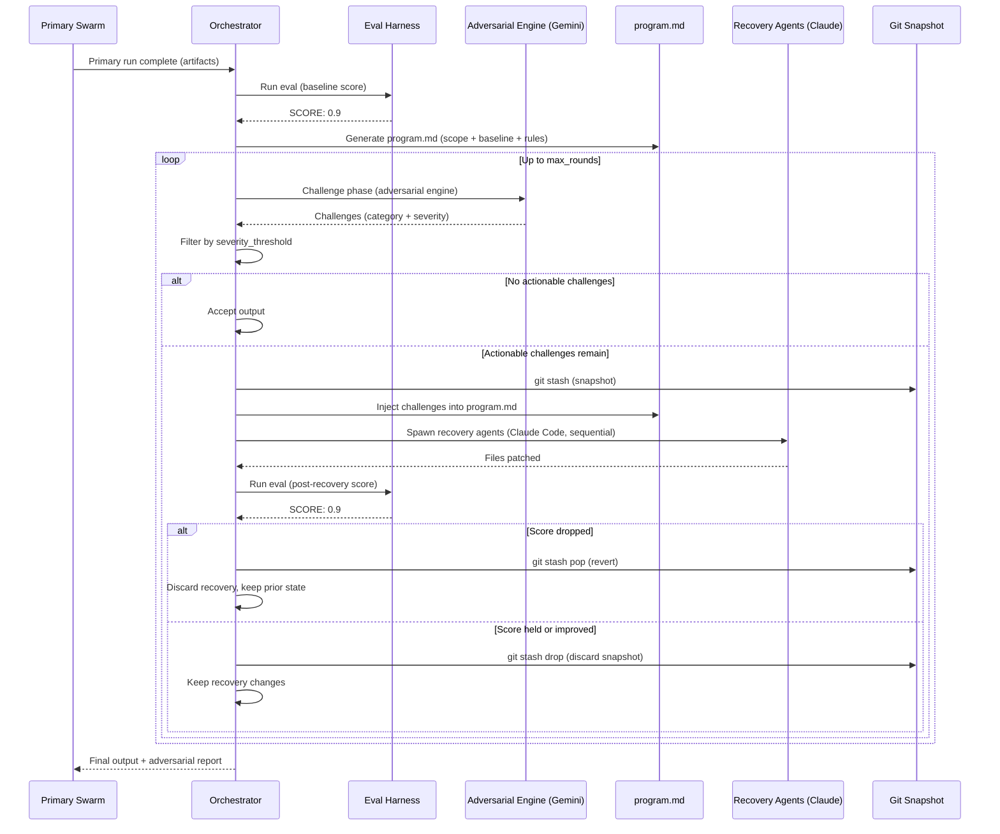

# Agent Swarm Orchestrator

The `acteon-swarm` crate provides a generic multi-agent swarm system that decomposes complex objectives into tasks, assigns them to specialist agents, and executes them with **parallel task execution**, **AI-powered plan refinement**, and **cross-agent knowledge sharing**. It combines three systems:

- **Acteon** — workflow orchestration, safety rules, quotas, and audit trail
- **TesseraiDB** — knowledge graph, semantic memory, and digital twin modeling of the swarm
- **Claude Code** — agent execution using existing Claude Code subscription (no API keys)

### Key Capabilities

| Feature | Description |
|---------|-------------|
| **Parallel execution** | Independent tasks run concurrently via `FuturesUnordered`, bounded by `max_agents` and per-role limits |
| **AI refiner** | After each task, Haiku analyzes results and can skip, reprioritize, or add tasks mid-flight |
| **Memory reuse** | Prior findings from TesseraiDB are injected into agent prompts — within and across runs |
| **Digital twin graph** | Each run produces a full RDF knowledge graph with typed relationships |
| **5 built-in roles** | Planner, Coder, Researcher, Reviewer, Executor — each with role-specific tools and prompts |

### Example Runs

| Use Case | Engine | Agents | Duration | Output |
|----------|--------|--------|----------|--------|
| [News Harvesting](https://github.com/penserai/acteon/tree/main/examples/swarm-news-harvesting) | Claude | 9/9 | ~28 min | 16KB briefing on EU AI regulation |
| [Stock Analysis](https://github.com/penserai/acteon/tree/main/examples/swarm-stock-analysis) | Claude | 12 | ~20 min | Per-company earnings analyses |
| [Security Audit](https://github.com/penserai/acteon/tree/main/examples/swarm-pentest) | Claude | 28 | ~25 min | Vulnerability reports for Acteon itself |
| [Framework Research](https://github.com/penserai/acteon/tree/main/examples/swarm-deep-research) | Claude | 16 | ~20 min | 7 agent framework analyses |
| [LLM Survey](https://github.com/penserai/acteon/tree/main/examples/swarm-gemini-llm-survey) | **Gemini** | 8/8 | ~7 min | 7 open source LLM analyses |
| [Posit Clone MVP](https://github.com/penserai/acteon/tree/main/examples/swarm-posit-clone) | Claude + Gemini adversarial | 7 + 5 recovery | ~35 min | Web IDE MVP with autoresearch-style fixes |

## How It Works



1. The user provides a high-level objective
2. `acteon-swarm` gathers a structured plan via interactive Q&A with Claude
3. The plan is decomposed into tasks with dependencies, each assigned to a specialist role
4. Acteon receives safety rules and a per-run quota
5. Agents are spawned via the configured engine (Claude Code or Gemini CLI)
6. Every agent tool call flows through an Acteon hook for policy enforcement
7. Agents store findings in TesseraiDB; other agents can search before acting
8. After each subtask, a refiner evaluates results and may adjust the remaining plan
9. When all tasks complete, a summary report is produced

## Architecture

```
acteon-swarm CLI
  │
  ├── plan gather     (claude -p / gemini -p → SwarmPlan JSON)
  ├── plan approve    (user reviews and approves)
  └── run             (execute approved plan)
        │
        ├── Acteon Server ── rules, audit, quotas, chains
        ├── TesseraiDB ──── twins, semantic memory, lineage
        │
        ├── Agent 1 (claude/gemini session) ── hooks → Acteon
        ├── Agent 2 (claude/gemini session) ── hooks → TesseraiDB
        └── Agent N ...
```

### Supported Engines

| Engine | CLI | Plan Gather | Agent Execution | Refiner |
|--------|-----|------------|-----------------|---------|
| **Claude** (default) | `claude -p` | `--json-schema` structured output | `--model sonnet` | `--model haiku` |
| **Gemini** | `gemini -p` | markdown JSON extraction | `--yolo` auto-approval | `--model flash` |

Switch engines via the `engine` field in `swarm.toml`:

```toml
[defaults]
engine = "gemini"   # or "claude" (default)
```

### Components

| Component | Purpose |
|-----------|---------|
| `acteon-swarm` binary | CLI orchestrator: plan gathering, execution loop, monitoring |
| `acteon-swarm-hook` binary | Lightweight hook handler for tool gating (both engines) |
| Acteon server | Safety rules, cross-agent dedup, throttling, approval gates, audit |
| TesseraiDB server | Knowledge graph (twins), semantic memory (findings), lineage |

## Installation

### Prerequisites

- **Rust 1.88+** — builds the `acteon-swarm` and `acteon-swarm-hook` binaries
- **Claude Code** or **Gemini CLI** — at least one must be installed and authenticated:
  - Claude: `claude` CLI in PATH ([install](https://docs.anthropic.com/en/docs/claude-code))
  - Gemini: `gemini` CLI in PATH ([install](https://github.com/google-gemini/gemini-cli))
- **Acteon server** — running instance (see [Getting Started](../getting-started/quickstart.md))
- **TesseraiDB server** — running instance

### Build

```bash
# Build the swarm binaries
cargo build -p acteon-swarm --release

# Verify
./target/release/acteon-swarm --help
./target/release/acteon-swarm-hook --help
```

### Configuration

Create a `swarm.toml` in your working directory:

=== "Claude Engine (default)"

    ```toml title="swarm.toml"
    [acteon]
    endpoint = "http://localhost:8080"
    namespace = "swarm"

    [tesserai]
    endpoint = "http://localhost:8081"
    tenant_id = "swarm-default"

    [defaults]
    engine = "claude"          # Uses claude -p --model sonnet
    max_agents = 8
    max_duration_minutes = 60
    subtask_timeout_seconds = 900
    enable_refiner = true      # AI refiner uses haiku

    [safety]
    require_plan_approval = true
    ```

=== "Gemini Engine"

    ```toml title="swarm.toml"
    [acteon]
    endpoint = "http://localhost:8080"
    namespace = "swarm"

    [tesserai]
    endpoint = "http://localhost:8081"
    tenant_id = "swarm-default"

    [defaults]
    engine = "gemini"          # Uses gemini -p --yolo
    max_agents = 8
    max_duration_minutes = 60
    subtask_timeout_seconds = 900
    enable_refiner = true      # AI refiner uses flash

    [safety]
    require_plan_approval = true
    ```

### Engine Comparison

| | Claude | Gemini |
|-|--------|--------|
| **Speed** | ~2-5 min/subtask | ~1-2 min/subtask |
| **Detail** | Deep analysis, structured tables | Concise summaries |
| **File writing** | Native | Requires `--yolo` flag |
| **Web research** | WebSearch/WebFetch tools | google_web_search/web_fetch |
| **Cost** | Claude Code subscription | Free (Gemini CLI) |
| **Refiner model** | Haiku (fast, cheap) | Flash (fast, free) |

## Agent Roles

Five built-in roles define what each agent can do:

| Role | Tools | Purpose |
|------|-------|---------|
| **planner** | Read, Glob, Grep | Analyze codebase, decompose tasks (read-only) |
| **coder** | Read, Write, Edit, Bash, Glob, Grep | Write/modify code, run builds and tests |
| **researcher** | Read, Glob, Grep, WebFetch, WebSearch | Web research, documentation lookup |
| **reviewer** | Read, Glob, Grep | Code review, identify issues (read-only) |
| **executor** | Bash, Read, Glob, Grep | Run commands, tests, deployments |

### Custom Roles

Define additional roles in `swarm.toml`:

```toml title="swarm.toml"
[[roles]]
name = "data-analyst"
description = "Analyzes datasets and produces summaries"
system_prompt_template = """
You are a data analysis specialist.
Task: {{ task.name }} — {{ task.description }}
Subtask: {{ subtask.name }} — {{ subtask.description }}

Analyze data files, compute statistics, and produce clear summaries.
"""
allowed_tools = ["Bash", "Read", "Glob", "Grep", "Write"]
can_delegate_to = ["researcher"]
max_concurrent = 2
```

## Safety Model

Every agent tool call flows through Acteon for policy enforcement via the `acteon-swarm-hook gate` command. The hook:

1. Maps Claude Code tools to action types (`Bash` → `execute_command`, `Write`/`Edit` → `write_file`, etc.)
2. Builds a dedup key (file-path-based for writes, session-scoped for others)
3. POSTs to Acteon `/v1/dispatch`
4. Returns exit code 0 (allow) or 2 (block)

### Default Rules

Each swarm run deploys these safety rules automatically:

| Priority | Rule | Action |
|----------|------|--------|
| 1 | Block destructive commands (`rm -rf`, `mkfs`, `dd`) | Suppress |
| 1 | Block credential file access (`.env`, `.ssh`) | Suppress |
| 3 | Approval gate for `git push`, package installs | RequestApproval |
| 5 | Per-agent throttle (12 commands/min) | Throttle |
| 6 | Cross-agent file write dedup (120s TTL) | Deduplicate |
| 7 | Swarm-wide throttle (30/min) | Throttle |
| 15 | Allow normal operations | Allow |
| 100 | Default deny | Suppress |

### Per-Run Quota

Each run creates an Acteon quota scoped to its tenant (`swarm-{run_id}`):

- Max actions = `estimated_actions × 1.5` (50% buffer)
- Window = `max_duration_minutes × 60` seconds
- Overage behavior: block

## Knowledge Sharing (TesseraiDB)

Agents share knowledge through TesseraiDB's semantic memory system:

### What Gets Stored

| Entity | Type | When |
|--------|------|------|
| Swarm run | JSON Twin (`SwarmRun`) | At run start |
| Agent session | JSON Twin (`AgentSession`) | At agent spawn |
| Agent action | Semantic Memory (episodic) | After each tool call (`PostToolUse` hook) |
| Key finding | Semantic Memory (semantic) | When agent discovers something important |

### Cross-Agent Coordination

- Before writing a file, agents can check if another agent already modified it
- Before researching a topic, agents can search prior findings to avoid duplicate work
- The episodic memory trail provides a complete audit of every agent action

## CLI Reference

### Plan Gathering

```bash
# Interactive Q&A to produce a structured plan
acteon-swarm plan gather --prompt "Build a REST API with auth and tests"

# Review the plan
acteon-swarm plan show --plan plan.json

# Approve for execution
acteon-swarm plan approve --plan plan.json
```

### Execution

```bash
# Execute an approved plan (uses engine from swarm.toml)
acteon-swarm run --plan plan.json

# Gather and run in one step (skip approval)
acteon-swarm run --prompt "Analyze this codebase" --auto-approve

# Run with Gemini engine (set in swarm.toml)
# [defaults]
# engine = "gemini"
acteon-swarm run --prompt "Survey open source LLMs" --auto-approve

# Monitor a running swarm
acteon-swarm status --run <run-id>

# Cancel a running swarm
acteon-swarm cancel --run <run-id>
```

### Environment Variables

| Variable | Description | Default |
|----------|-------------|---------|
| `ACTEON_URL` | Acteon gateway endpoint | `http://localhost:8080` |
| `ACTEON_AGENT_KEY` | API key for Acteon | None |
| `TESSERAI_URL` | TesseraiDB endpoint | `http://localhost:8081` |

## Plan Structure

A `SwarmPlan` consists of tasks with dependencies, each containing subtasks assigned to roles:

```json
{
  "id": "plan-abc123",
  "objective": "Build a REST API for user management",
  "scope": {
    "working_directory": "/home/user/project",
    "max_agents": 3,
    "max_duration_minutes": 30
  },
  "success_criteria": [
    "All endpoints return correct responses",
    "Tests pass with >80% coverage"
  ],
  "tasks": [
    {
      "id": "task-1",
      "name": "Research existing patterns",
      "assigned_role": "researcher",
      "subtasks": [
        {
          "id": "task-1-sub-1",
          "name": "Analyze project structure",
          "prompt": "Explore the project and document the existing patterns...",
          "timeout_seconds": 120
        }
      ],
      "depends_on": []
    },
    {
      "id": "task-2",
      "name": "Implement endpoints",
      "assigned_role": "coder",
      "subtasks": [...],
      "depends_on": ["task-1"]
    },
    {
      "id": "task-3",
      "name": "Write tests",
      "assigned_role": "coder",
      "subtasks": [...],
      "depends_on": ["task-2"]
    }
  ],
  "agent_roles": ["researcher", "coder"],
  "estimated_actions": 75
}
```

## Execution Flow (Parallel)



Independent tasks run concurrently via `FuturesUnordered`, bounded by:
- `max_agents` (from `swarm.toml`, default 8)
- Per-role `max_concurrent_instances` (e.g., coder: 3, researcher: 2)
- Priority sorting (lower priority number = higher priority)

### AI-Powered Plan Refinement

After each task completes, the orchestrator invokes `claude --model haiku` with a 60-second timeout to analyze the output and decide:

- **CONTINUE** — no changes needed
- **SKIP: task-id1, task-id2** — remove tasks that are no longer necessary
- **REPRIORITIZE: task-id=N** — reorder remaining tasks based on discoveries

The refiner also sees `can_delegate_to` rules from the role registry, allowing it to suggest spawning new tasks for delegated roles (e.g., a coder's output triggers a researcher follow-up).

Configurable via `enable_refiner = true/false` in `swarm.toml`.

### Digital Twin Graph

After the run completes, the orchestrator builds a full relationship graph in TesseraiDB:

```
SwarmRun ──hasTask──→ SwarmTask ──assignedTo──→ AgentSession
    │                     │                         │
    │                     └──dependsOn──→ SwarmTask  ├──produced──→ EpisodicMemory
    │                                               └──discovered──→ SemanticMemory
    └──hasAgent──→ AgentSession
```

Each entity is a typed twin with full properties. The graph is queryable via SPARQL and visualizable in TesseraiDB's UI.

## Tutorial: News Harvesting Swarm

This tutorial walks through creating an agent swarm that researches recent news about a topic and produces a structured briefing.

### Objective

Harvest recent news about "AI regulation in the European Union", analyze key developments, and produce a structured markdown briefing with sources.

### Step 1: Configure

```toml title="swarm.toml"
[acteon]
endpoint = "http://localhost:8080"
namespace = "swarm"

[tesserai]
endpoint = "http://localhost:8081"
tenant_id = "news-harvester"

[defaults]
max_agents = 3
max_duration_minutes = 20
subtask_timeout_seconds = 180
quota_max_actions = 200

[safety]
require_plan_approval = true
# No file writes to system paths
blocked_commands = ["rm -rf.*", "sudo.*"]
```

### Step 2: Gather the Plan

```bash
acteon-swarm plan gather \
  --prompt "Research recent news about AI regulation in the European Union. \
Find at least 5 recent developments, analyze their implications, \
and produce a structured markdown briefing with sources, key quotes, \
and a timeline of events. Save the output to briefing.md"
```

Claude will ask clarifying questions like:
- What time range counts as "recent"? (e.g., last 30 days)
- Should we focus on specific EU bodies (Commission, Parliament)?
- Should we include analysis of industry reactions?

The gathered plan might look like:

```
Plan: Research EU AI regulation news (plan-eu-ai-reg)
Status: PENDING
Estimated actions: 120

Tasks (4):
  [task-1] Web research — gather sources (role: researcher)
    - [task-1-sub-1] Search for EU AI Act developments
    - [task-1-sub-2] Search for industry reactions
    - [task-1-sub-3] Search for enforcement actions
  [task-2] Deep analysis (role: researcher) [depends: task-1]
    - [task-2-sub-1] Read and summarize top articles
    - [task-2-sub-2] Extract key quotes and dates
  [task-3] Write briefing (role: coder) [depends: task-2]
    - [task-3-sub-1] Create structured markdown document
    - [task-3-sub-2] Add timeline visualization
  [task-4] Review briefing (role: reviewer) [depends: task-3]
    - [task-4-sub-1] Check accuracy and completeness
```

### Step 3: Review and Approve

```bash
# Review the plan
acteon-swarm plan show --plan plan.json

# Approve it
acteon-swarm plan approve --plan plan.json
```

### Step 4: Execute

```bash
acteon-swarm run --plan plan.json
```

The swarm executes:

1. **Researcher agent** searches the web for EU AI regulation news using `WebSearch` and `WebFetch` tools. Each search goes through Acteon (throttled to 12/min). Findings are stored as semantic memories in TesseraiDB.

2. **Researcher agent** (task-2) reads the first agent's findings from TesseraiDB before starting — avoids re-searching the same sources. Produces detailed summaries with extracted quotes and dates.

3. **Coder agent** writes `briefing.md` using findings from TesseraiDB. Cross-agent file write dedup ensures only one agent writes to the file at a time.

4. **Reviewer agent** reads the briefing (read-only tools) and reports on accuracy, missing sources, or factual issues. If issues are found, the refiner may add a fix-up task.

### Step 5: Results

```bash
acteon-swarm status --run <run-id>
```

Output:
```
Swarm run: abc123
  Total dispatched: 87
  Executed: 72
  Suppressed: 3
  Throttled: 8
  Deduplicated: 2
  Pending approval: 0
  Quota exceeded: 0
  Rerouted: 2
```

The final `briefing.md` contains a structured report with sections, sources, a timeline, and key quotes — assembled by multiple specialist agents coordinating through TesseraiDB.

## Tutorial: Stock Market Analysis Swarm

This tutorial demonstrates an agent swarm that analyzes stock market interactions — correlations between sectors, earnings impacts, and cross-market effects.

### Objective

Analyze how recent earnings reports from major tech companies (Apple, Microsoft, Google, Amazon) affected related sectors (semiconductors, cloud providers, ad tech), and produce an analysis with correlation observations and a sector impact map.

### Step 1: Configure

```toml title="swarm.toml"
[acteon]
endpoint = "http://localhost:8080"
namespace = "swarm"

[tesserai]
endpoint = "http://localhost:8081"
tenant_id = "stock-analysis"

[defaults]
max_agents = 4
max_duration_minutes = 30
subtask_timeout_seconds = 240
quota_max_actions = 300

[safety]
require_plan_approval = true
blocked_commands = ["curl.*api\\.trading.*", "pip install.*"]

[[roles]]
name = "data-analyst"
description = "Analyzes financial data and produces structured reports"
system_prompt_template = """
You are a financial data analysis specialist.
Task: {{ task.name }} — {{ task.description }}
Subtask: {{ subtask.name }}

Analyze financial data objectively. Cite sources for all claims.
Do NOT provide investment advice or recommendations.
Focus on observable correlations and factual reporting.
"""
allowed_tools = ["Bash", "Read", "Write", "Edit", "Glob", "Grep", "WebFetch", "WebSearch"]
max_concurrent = 2
```

!!! warning
    This tutorial is for educational and analytical purposes only. The swarm produces factual analysis of publicly available market data — it does not provide investment advice or execute trades.

### Step 2: Gather the Plan

```bash
acteon-swarm plan gather \
  --prompt "Analyze how Q4 2025 earnings reports from Apple, Microsoft, \
Google, and Amazon affected related market sectors. Research the earnings \
results, sector reactions (semiconductors, cloud, ad tech), and \
cross-market correlations. Produce a structured analysis with: \
(1) per-company earnings summary, (2) sector impact analysis, \
(3) cross-company correlation observations, (4) a sector interaction map. \
Save to analysis/"
```

Claude will ask:
- Should we include pre/post earnings price movements?
- Which semiconductor companies to track (NVIDIA, AMD, TSMC)?
- Should we analyze options market reactions too?
- What format for the sector interaction map (Mermaid diagram, table)?

The plan might decompose into:

```
Plan: Q4 2025 Tech Earnings Sector Analysis (plan-q4-earnings)
Status: PENDING
Estimated actions: 200

Tasks (6):
  [task-1] Gather earnings data (role: researcher)
    - [task-1-sub-1] Research Apple Q4 2025 earnings
    - [task-1-sub-2] Research Microsoft Q4 2025 earnings
    - [task-1-sub-3] Research Google Q4 2025 earnings
    - [task-1-sub-4] Research Amazon Q4 2025 earnings
  [task-2] Gather sector data (role: researcher) [depends: task-1]
    - [task-2-sub-1] Research semiconductor sector reactions
    - [task-2-sub-2] Research cloud provider sector reactions
    - [task-2-sub-3] Research ad tech sector reactions
  [task-3] Analyze correlations (role: data-analyst) [depends: task-1, task-2]
    - [task-3-sub-1] Cross-company earnings comparison
    - [task-3-sub-2] Sector-to-earnings correlation analysis
  [task-4] Write per-company summaries (role: coder) [depends: task-1]
    - [task-4-sub-1] Create analysis/companies/ directory and summaries
  [task-5] Write sector analysis (role: data-analyst) [depends: task-2, task-3]
    - [task-5-sub-1] Create analysis/sectors/ reports
    - [task-5-sub-2] Generate sector interaction map (Mermaid)
  [task-6] Review and compile (role: reviewer) [depends: task-4, task-5]
    - [task-6-sub-1] Review all documents for accuracy
    - [task-6-sub-2] Compile final analysis/README.md
```

### Step 3: Approve and Execute

```bash
acteon-swarm plan approve --plan plan.json
acteon-swarm run --plan plan.json
```

### Step 4: How the Swarm Coordinates

The dependency graph drives parallel execution:



**Agent coordination through TesseraiDB:**

1. **Researcher agents** (task-1) run four subtasks sequentially, each storing structured earnings data as semantic memories:
   ```
   Memory: "Apple Q4 2025: Revenue $124.3B (+8% YoY), EPS $2.40..."
   Topics: [apple, earnings, q4-2025, revenue]
   Confidence: 1.0
   ```

2. **Researcher agents** (task-2) query TesseraiDB before starting: "What earnings guidance did Apple give for cloud spending?" — retrieves task-1's findings to avoid duplicate searches.

3. **Data analyst** (task-3) searches all semantic memories across agents to find cross-company patterns. Stores correlation findings:
   ```
   Memory: "Strong correlation between MSFT cloud guidance and AMD server chip demand..."
   Topics: [correlation, microsoft, amd, cloud, semiconductors]
   ```

4. **Coder agent** (task-4) writes per-company markdown files. The cross-agent dedup rule prevents conflicts if the data-analyst is also writing to `analysis/`.

5. **Data analyst** (task-5) generates the sector interaction map as a Mermaid diagram, pulling from correlation findings in TesseraiDB.

6. **Reviewer** (task-6) reads all produced files. If it finds factual inconsistencies, the refiner may add a correction task.

### Step 5: Output Structure

```
analysis/
├── README.md                    # Compiled executive summary
├── companies/
│   ├── apple-q4-2025.md         # Per-company earnings analysis
│   ├── microsoft-q4-2025.md
│   ├── google-q4-2025.md
│   └── amazon-q4-2025.md
├── sectors/
│   ├── semiconductors.md        # Sector reaction analysis
│   ├── cloud-providers.md
│   └── ad-tech.md
├── correlations.md              # Cross-company correlation report
└── sector-map.md                # Mermaid interaction diagram
```

### Step 6: Audit Trail

Query the Acteon audit trail to see what happened:

```bash
acteon-swarm status --run <run-id>
```

```
Swarm run: def456
  Total dispatched: 156
  Executed: 128
  Suppressed: 5
  Throttled: 14
  Deduplicated: 4
  Pending approval: 0
  Quota exceeded: 0
  Rerouted: 5
```

The 5 suppressed actions were blocked by safety rules (an agent tried to install a Python package). The 4 deduplicated actions were cross-agent writes to the same analysis file. The 14 throttled actions hit the per-agent rate limit during intensive web research bursts.

## Monitoring and Observability

### Acteon Audit Trail

Every agent action is recorded in Acteon's audit log with:

- Action ID, namespace, tenant (`swarm-{run_id}`)
- Tool name, action type, agent role
- Outcome (executed, suppressed, throttled, deduplicated)
- Matched rule name
- Timing information

### TesseraiDB Lineage

TesseraiDB maintains a lineage graph showing:

- Which agent produced which finding
- How findings were used by downstream agents
- The provenance chain from raw research to final output

### Swarm Monitor

The built-in monitor detects:

- **Stuck agents** — repeated identical tool calls (5+ times)
- **Runaway agents** — action rate exceeding 20/minute
- **Timeout risk** — approaching the run deadline

## Testing

### Unit Tests

```bash
cargo test -p acteon-swarm --lib
```

Covers: plan validation, cycle detection, topological sort, role registry, prompt rendering, monitor alerts, config parsing.

### Integration Test (Mock Servers)

For testing without live Acteon/TesseraiDB instances, create a plan programmatically and use mock agents:

```rust
use acteon_swarm::config::SwarmConfig;
use acteon_swarm::planner::validate_plan;
use acteon_swarm::roles::RoleRegistry;
use acteon_swarm::types::plan::*;

let plan = SwarmPlan {
    id: "test-plan".into(),
    objective: "Integration test".into(),
    scope: SwarmScope {
        working_directory: "/tmp/test".into(),
        max_agents: 2,
        max_duration_minutes: 5,
        ..Default::default()
    },
    tasks: vec![/* ... */],
    // ...
};

let roles = RoleRegistry::with_builtins();
let warnings = validate_plan(&plan, &roles.names()).unwrap();
```

## Adversarial Loop with Eval Harness (Autoresearch Pattern)

After the primary swarm completes its objective, an optional **adversarial phase** critiques the output using a separate LLM engine, then the primary engine recovers by addressing the valid challenges. This design is inspired by [Karpathy's autoresearch](https://github.com/karpathy/autoresearch) pattern, which distills autonomous improvement into three primitives: an **editable asset** (the workspace), a **scalar metric** (the eval score), and **time-boxed cycles** (timeouts). The adversarial critique adds a fourth dimension that autoresearch does not have: **cross-model blind-spot detection**. By pitting a separate engine (e.g., Gemini) against the primary engine (e.g., Claude), the system surfaces assumptions and failure modes that a single model would never flag on its own output.

### Sequence



1. The primary swarm runs to completion as normal.
2. The eval harness runs to establish a **baseline score**.
3. A `program.md` constraint doc is generated and injected into recovery prompts.
4. The orchestrator hands the output to the adversarial engine for critique.
5. Challenges below `severity_threshold` are filtered out.
6. A git snapshot is taken before recovery begins.
7. The primary engine spawns recovery agents (real Claude Code agents that edit files) to address each actionable challenge.
8. The eval harness runs again. If the score drops, the recovery is reverted via `git stash pop`. If the score holds or improves, the snapshot is discarded and changes are kept.
9. If unresolved challenges remain and rounds are left, the loop repeats.
10. A final adversarial report is persisted alongside the swarm output.

### Eval Harness

The eval harness provides the scalar metric that drives the keep/revert decision. Configure it in `swarm.toml`:

```toml
[eval_harness]
enabled = true
command = "cargo test && cargo clippy"
timeout_seconds = 300
pass_threshold = 0.7
```

| Parameter | Type | Default | Description |
|-----------|------|---------|-------------|
| `enabled` | bool | `false` | Enable the eval harness |
| `command` | string | *required* | Shell command to run as the eval (tests, lints, custom scripts) |
| `timeout_seconds` | u64 | `300` | Maximum time for the eval command to complete |
| `pass_threshold` | f64 | `0.7` | Minimum score to consider the run passing |

**Score signals.** The harness parses stdout for structured score lines:

| Signal | Format | Example |
|--------|--------|---------|
| Explicit score | `SCORE: <f64>` | `SCORE: 0.85` |
| Test pass rate | `PASS: <n>/<total>` | `PASS: 42/50` (yields 0.84) |
| Warning count | `WARNINGS: <n>` | `WARNINGS: 3` (penalty applied) |

**Fallback.** If no structured signal is found, the harness uses the exit code: `0` maps to `1.0`, non-zero maps to `0.0`.

**Git snapshot/revert behavior.** Before recovery agents start editing files, the orchestrator runs `git stash` to snapshot the workspace. After recovery, the eval runs again:

- If the post-recovery score is **lower** than the baseline, the orchestrator runs `git stash pop` to revert all recovery changes.
- If the post-recovery score is **equal or higher**, the orchestrator runs `git stash drop` to discard the snapshot and keep the changes.

### program.md

The orchestrator auto-generates a `program.md` constraint document that is injected into every recovery agent's prompt. It serves as the shared contract between the eval harness and the recovery agents.

**Contents:**

- Plan scope (working directory, objective, success criteria)
- Eval harness configuration and baseline score
- Inviolable rules:
    - Do not modify the eval command or its test files
    - Do not delete or skip existing tests
    - Do not introduce new dependencies without justification
    - Do not modify files outside the working directory
- Current round number and remaining budget
- Challenges assigned to this recovery agent

The `program.md` is regenerated after each eval run with the updated baseline score, ensuring recovery agents always work against the latest state.

### Recovery Modes

Recovery agents can operate in two modes, controlled by the `recovery_mode` setting:

| Mode | Behavior |
|------|----------|
| `fix` (default) | Spawns real Claude Code agents that **edit files** sequentially, one per actionable challenge. Each agent receives the challenge description and `program.md` as context. |
| `analyze` | Text-only analysis (the original behavior). Recovery agents produce written recommendations but do not modify any files. Useful for dry-run review. |

The `max_recovery_agents` setting caps how many actionable challenges get assigned a recovery agent per round. If there are more actionable challenges than the cap, they are prioritized by severity (highest first).

### Configuration

Enable adversarial mode with the eval harness in `swarm.toml`:

```toml
[adversarial]
enabled = true
engine = "gemini"
max_rounds = 2
max_agents = 3
challenge_timeout_seconds = 300
recovery_timeout_seconds = 600
severity_threshold = 0.5
recovery_mode = "fix"
max_recovery_agents = 5

[eval_harness]
enabled = true
command = "cargo test && cargo clippy"
timeout_seconds = 300
pass_threshold = 0.7
```

#### Adversarial Parameters

| Parameter | Type | Default | Description |
|-----------|------|---------|-------------|
| `enabled` | bool | `false` | Enable the adversarial challenge-recovery loop |
| `engine` | string | `"gemini"` | LLM engine for the adversarial phase (`"claude"` or `"gemini"`) |
| `max_rounds` | u32 | `2` | Maximum challenge-recovery iterations before accepting the output |
| `max_agents` | u32 | `3` | Maximum concurrent adversarial agents during the challenge phase |
| `challenge_timeout_seconds` | u64 | `300` | Timeout for each challenge phase |
| `recovery_timeout_seconds` | u64 | `600` | Timeout for each recovery phase |
| `severity_threshold` | f64 | `0.5` | Minimum severity score for a challenge to be actionable (0.0 - 1.0) |
| `recovery_mode` | string | `"fix"` | Recovery behavior: `"fix"` (edit files) or `"analyze"` (text-only) |
| `max_recovery_agents` | u32 | `5` | Maximum number of recovery agents spawned per round |

#### Eval Harness Parameters

| Parameter | Type | Default | Description |
|-----------|------|---------|-------------|
| `enabled` | bool | `false` | Enable the eval harness |
| `command` | string | *required* | Shell command to run as the eval |
| `timeout_seconds` | u64 | `300` | Maximum time for the eval command |
| `pass_threshold` | f64 | `0.7` | Minimum score to consider the run passing |

### CLI Flags

Override adversarial and eval settings from the command line:

```bash
# Enable adversarial mode for a single run
acteon-swarm run --plan plan.json --adversarial

# Specify the adversarial engine
acteon-swarm run --plan plan.json --adversarial --adversarial-engine gemini

# Limit to a single challenge-recovery round
acteon-swarm run --plan plan.json --adversarial --adversarial-rounds 1

# Set recovery mode from CLI
acteon-swarm run --plan plan.json --adversarial --recovery-mode fix

# Configure eval harness from CLI
acteon-swarm run --plan plan.json --adversarial \
  --eval-command "cargo test && cargo clippy" \
  --eval-timeout 300 \
  --eval-threshold 0.7
```

| Flag | Description |
|------|-------------|
| `--adversarial` | Enable adversarial mode (overrides `adversarial.enabled` in config) |
| `--adversarial-engine <ENGINE>` | Set the adversarial engine (`claude` or `gemini`) |
| `--adversarial-rounds <N>` | Maximum number of challenge-recovery rounds |
| `--recovery-mode <MODE>` | Recovery behavior: `fix` or `analyze` |
| `--eval-command <CMD>` | Shell command for the eval harness |
| `--eval-timeout <SECONDS>` | Timeout for the eval command |
| `--eval-threshold <FLOAT>` | Minimum passing score (0.0 - 1.0) |

### Challenge Categories

Adversarial agents evaluate the primary output across five categories:

| Category | Description |
|----------|-------------|
| **correctness** | Logic errors, wrong assumptions, incorrect implementations |
| **security** | Missing input validation, unsafe subprocess handling, credential exposure |
| **performance** | Blocking I/O on async paths, unnecessary allocations, missing caching |
| **completeness** | Missing features, unhandled edge cases, incomplete error handling |
| **style** | Framework mismatches, non-idiomatic patterns, inconsistent conventions |

### Severity Levels

Each challenge is assigned a severity score. The `severity_threshold` setting determines which challenges are actionable:

| Level | Score | Description |
|-------|-------|-------------|
| **Low** | 0.25 | Minor style issues, optional improvements |
| **Medium** | 0.5 | Functional gaps that should be addressed |
| **High** | 0.75 | Significant bugs or security concerns |
| **Critical** | 1.0 | Blocking defects that must be fixed |

With the default threshold of `0.5`, only Medium, High, and Critical challenges trigger recovery.

### Report Persistence

After the adversarial loop completes, a JSON report is saved to the working directory:

```
adversarial-report-<run-id>.json
```

The report contains:

- All challenges raised across every round (category, severity, description)
- Which challenges were filtered out by the severity threshold
- Recovery actions taken and whether each challenge was resolved
- Per-round timing and agent counts
- Eval scores (baseline and post-recovery for each round)
- Git snapshot decisions (kept or reverted)
- Final accept/reject status

### Example: Posit Clone MVP

A real-world test run demonstrates the full autoresearch-style adversarial loop:

**Primary phase:** Claude engine, 7 agents, all completed. Produced 47 files implementing a Posit (RStudio) web IDE clone MVP -- including a notebook editor, code execution backend, file browser, and terminal emulator.

**Eval baseline:** `SCORE: 0.9` (tests passing, clippy clean).

**Adversarial phase:** Gemini engine identified 8 challenges, of which 5 exceeded the severity threshold and were actionable:

| # | Category | Severity | Finding |
|---|----------|----------|---------|
| 1 | correctness | High (0.75) | Kernel sessions are stateless -- each cell execution starts a fresh process, losing variable state between cells |
| 2 | performance | High (0.75) | Blocking `std::process::Command` calls on async Tokio runtime -- will stall the event loop under load |
| 3 | completeness | Medium (0.5) | No WebSocket support for streaming cell output -- users see results only after execution completes |
| 4 | completeness | Medium (0.5) | File browser lacks rename and delete operations |
| 5 | performance | Medium (0.5) | Terminal emulator spawns a new shell per keystroke instead of maintaining a persistent PTY session |

Three challenges were filtered out (severity below 0.5): two Low-severity style suggestions and one Low-severity documentation gap.

**Recovery phase:** 5 Claude Code recovery agents spawned (one per actionable challenge), running sequentially with `program.md` injected. All 5 completed and resolved their assigned challenges:

- `kernel.rs` +322 lines: persistent kernel sessions with variable state across cells
- `ws.rs`: WebSocket streaming for cell output
- `NotebookEditor.tsx`: frontend wired to WebSocket streaming
- File browser: rename and delete operations added
- Terminal: persistent PTY session management

**Eval post-recovery:** `SCORE: 0.9` (held, no regression).

**Git decision:** Snapshot discarded, recovery changes kept.

**Final result:** `accepted=true`, 12 total agents (7 primary + 5 recovery), 0 failed.

## See Also

- [Task Chains](chains.md) -- Acteon's chain execution model
- [Deduplication](deduplication.md) -- cross-agent file write dedup
- [Throttling](throttling.md) -- per-agent and swarm-wide rate limiting
- [Tenant Usage Quotas](tenant-usage-quotas.md) -- per-run quota budgets
- [WASM Rule Plugins](wasm-plugins.md) -- custom safety rules
- [Adversarial Loop with Eval Harness](#adversarial-loop-with-eval-harness-autoresearch-pattern) -- cross-engine critique and recovery
- [Karpathy's autoresearch](https://github.com/karpathy/autoresearch) -- the pattern that inspired the eval harness
