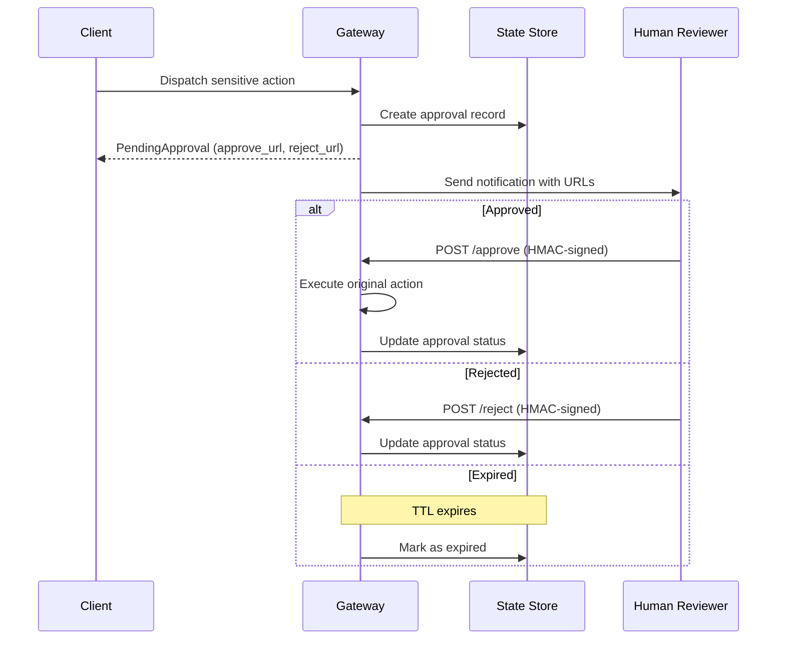
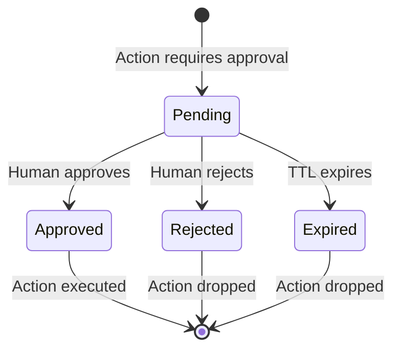

# Human Approvals

The approval system enables human-in-the-loop workflows. Sensitive actions are held pending until a human approves or rejects them via signed URLs.

## How It Works



1. An action matching a `require_approval` rule creates an approval record
2. HMAC-signed approve/reject URLs are generated
3. A notification is sent to reviewers
4. The action is held until approved, rejected, or expired

## Rule Configuration

```yaml title="rules/approvals.yaml"
rules:
  - name: approve-production-deploys
    priority: 1
    description: "Production deployments require human approval"
    condition:
      all:
        - field: action.action_type
          eq: "deploy"
        - field: action.metadata.environment
          eq: "production"
    action:
      type: require_approval
      message: "Production deployment requires approval"
      ttl_seconds: 3600
```

### Parameters

| Parameter | Type | Required | Description |
|-----------|------|----------|-------------|
| `message` | string | Yes | Message shown to the reviewer |
| `ttl_seconds` | u64 | No | Time before the approval expires (default: 1 hour) |
| `notification_targets` | list | No | Where to send approval notifications |
| `auto_approve_conditions` | list | No | Conditions for automatic approval |

## Response

```json
{
  "outcome": "pending_approval",
  "approval_id": "apr-abc123",
  "expires_at": "2026-01-15T11:00:00Z",
  "approve_url": "/v1/approvals/ns/tenant-1/apr-abc123/approve?sig=...",
  "reject_url": "/v1/approvals/ns/tenant-1/apr-abc123/reject?sig=...",
  "notification_sent": true
}
```

## Approval URLs

Approval and rejection URLs are HMAC-signed to prevent tampering. The signature includes:

- Namespace and tenant
- Approval ID
- Expiration timestamp
- Action: "approve" or "reject"

### Approving an Action

```bash
curl -X POST "http://localhost:8080/v1/approvals/ns/tenant-1/apr-abc123/approve?sig=SIGNATURE&expires_at=TIMESTAMP"
```

### Rejecting an Action

```bash
curl -X POST "http://localhost:8080/v1/approvals/ns/tenant-1/apr-abc123/reject?sig=SIGNATURE&expires_at=TIMESTAMP"
```

## API Endpoints

### List Pending Approvals

```bash
curl "http://localhost:8080/v1/approvals?namespace=ns&tenant=tenant-1"
```

### Get Approval Status

```bash
curl "http://localhost:8080/v1/approvals/ns/tenant-1/apr-abc123"
```

## Approval States



## Client SDK Support

=== "Rust"

    ```rust
    // Approve
    client.approve("ns", "tenant-1", "apr-abc123", "sig", "expires_at").await?;

    // Reject
    client.reject("ns", "tenant-1", "apr-abc123", "sig", "expires_at").await?;

    // List pending
    let approvals = client.list_approvals("ns", "tenant-1").await?;

    // Get status
    let status = client.get_approval("ns", "tenant-1", "apr-abc123").await?;
    ```

## Use Cases

- **Production deployments** — require team lead approval
- **Financial transactions** — require manager sign-off above threshold
- **Data deletion** — require compliance team approval
- **Access grants** — require security team approval
