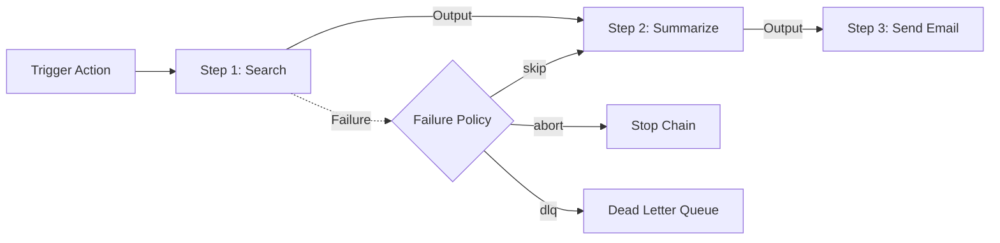
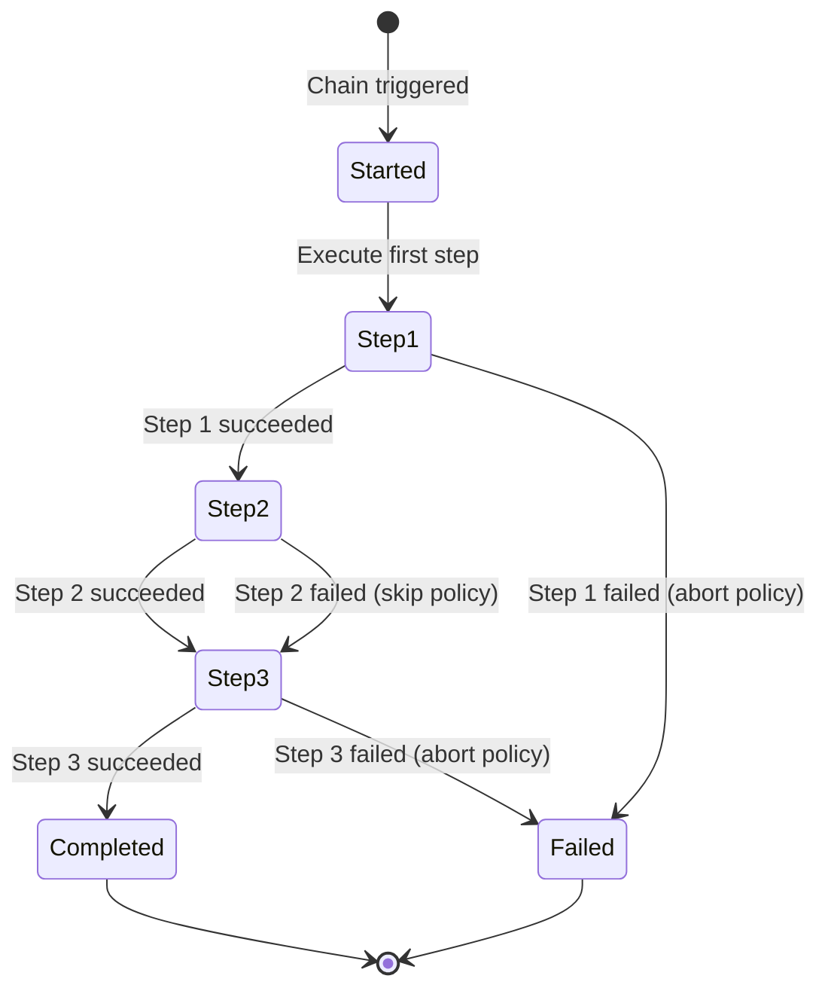

# Task Chains

Task chains orchestrate multi-step workflows where each step's output feeds into the next. Chains support configurable failure policies, delays between steps, and payload templating.

## How It Works



1. An action matching a `chain` rule triggers the chain
2. The first step executes with the original action's context
3. Each subsequent step receives the previous step's output via template variables
4. On failure, the configured policy determines what happens

## Configuration

### Chain Definition in acteon.toml

```toml title="acteon.toml"
[[chains]]
name = "search-summarize-email"
on_failure = "abort"
timeout_seconds = 604800        # 7 days

[[chains.steps]]
name = "search"
provider = "search-api"
action_type = "web_search"

[[chains.steps]]
name = "summarize"
provider = "llm"
action_type = "summarize"
delay_seconds = 2               # Wait 2s between steps

[[chains.steps]]
name = "send-email"
provider = "email"
action_type = "send_email"
on_failure = "dlq"              # Per-step failure policy
```

### Rule That Activates the Chain

```yaml title="rules/chains.yaml"
rules:
  - name: research-pipeline
    priority: 5
    condition:
      field: action.action_type
      eq: "research_request"
    action:
      type: chain
      chain_name: "search-summarize-email"
```

## Chain Step Configuration

| Parameter | Type | Required | Description |
|-----------|------|----------|-------------|
| `name` | string | Yes | Step identifier |
| `provider` | string | Yes | Target provider for this step |
| `action_type` | string | Yes | Action type for this step |
| `payload_template` | object | No | Payload template with variable substitution |
| `on_failure` | string | No | Per-step failure policy: `"abort"`, `"skip"`, `"dlq"` |
| `delay_seconds` | u64 | No | Delay before executing this step |

## Payload Templates

Templates support variable substitution from the chain context:

| Variable | Description |
|----------|-------------|
| `{{origin.field}}` | Field from the original triggering action |
| `{{prev.field}}` | Field from the previous step's response |
| `{{steps.NAME.field}}` | Field from a specific step's response |
| `{{chain_id}}` | Unique chain execution ID |
| `{{step_index}}` | Current step index (0-based) |

### Example Template

```toml
[[chains.steps]]
name = "send-email"
provider = "email"
action_type = "send_email"
payload_template = '''
{
  "to": "{{origin.payload.requester_email}}",
  "subject": "Research results for: {{origin.payload.query}}",
  "body": "{{steps.summarize.body.summary}}"
}
'''
```

## Failure Policies

### Chain-Level Policy

| Policy | Description |
|--------|-------------|
| `abort` | Stop the chain and send to dead letter queue |
| `abort_no_dlq` | Stop the chain without DLQ |

### Step-Level Policy

| Policy | Description |
|--------|-------------|
| `abort` | Stop the entire chain |
| `skip` | Skip this step, continue to next |
| `dlq` | Send failed step to DLQ, continue chain |

## Chain Lifecycle



## Background Execution

Chains execute asynchronously via the background processor:

1. The initial action triggers `ChainStarted`
2. The background processor monitors chain readiness
3. When a step completes (or its delay expires), the next step executes
4. The chain advances until all steps complete or a failure stops it

## Response

```json
{
  "outcome": "chain_started",
  "chain_id": "chn-abc123",
  "chain_name": "search-summarize-email",
  "total_steps": 3,
  "first_step": "search"
}
```

## Sub-Chains

A chain step can invoke another chain by name instead of dispatching to a provider. This enables reusable workflow components — for example, a standard "escalate-and-notify" chain shared across multiple parent chains.

See [Sub-Chains](sub-chains.md) for full documentation.

## Use Cases

### Research Pipeline

Search → Summarize → Email results:

```toml
[[chains]]
name = "research"
[[chains.steps]]
name = "search"
provider = "search-api"
action_type = "search"
[[chains.steps]]
name = "summarize"
provider = "llm"
action_type = "summarize"
[[chains.steps]]
name = "notify"
provider = "email"
action_type = "send_email"
```

### Deployment Pipeline

Build → Test → Deploy → Notify:

```toml
[[chains]]
name = "deploy"
on_failure = "abort"
[[chains.steps]]
name = "build"
provider = "ci"
action_type = "build"
[[chains.steps]]
name = "test"
provider = "ci"
action_type = "test"
[[chains.steps]]
name = "deploy"
provider = "k8s"
action_type = "deploy"
[[chains.steps]]
name = "notify"
provider = "slack"
action_type = "post_message"
on_failure = "skip"
```
