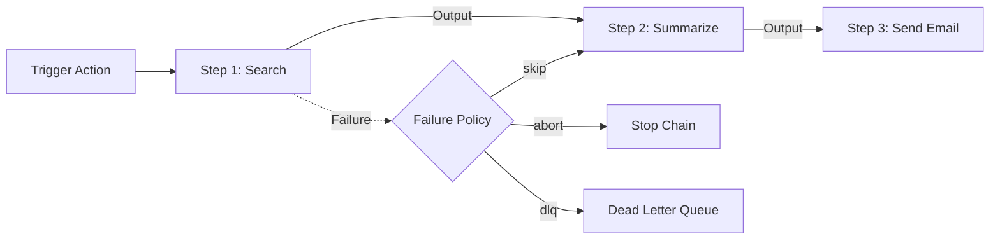
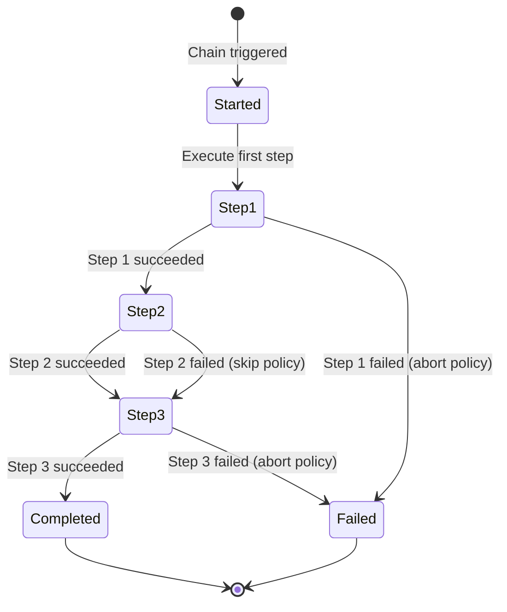

# Task Chains

Task chains orchestrate multi-step workflows where each step's output feeds into the next. Chains support configurable failure policies, delays between steps, and payload templating.

## How It Works


```mermaid
flowchart LR
    A[Trigger Action] --> B[Step 1: Search]
    B -->|Output| C[Step 2: Summarize]
    C -->|Output| D[Step 3: Send Email]

    B -.->|Failure| E{Failure Policy}
    E -->|abort| F[Stop Chain]
    E -->|skip| C
    E -->|dlq| G[Dead Letter Queue]
```

1. An action matching a `chain` rule triggers the chain
2. The first step executes with the original action's context
3. Each subsequent step receives the previous step's output via template variables
4. On failure, the configured policy determines what happens

## Configuration

### Chain Definition in acteon.toml

```toml title="acteon.toml"
[[chains]]
name = "search-summarize-email"
on_failure = "abort"
timeout_seconds = 604800        # 7 days

[[chains.steps]]
name = "search"
provider = "search-api"
action_type = "web_search"

[[chains.steps]]
name = "summarize"
provider = "llm"
action_type = "summarize"
delay_seconds = 2               # Wait 2s between steps

[[chains.steps]]
name = "send-email"
provider = "email"
action_type = "send_email"
on_failure = "dlq"              # Per-step failure policy
```

### Rule That Activates the Chain

```yaml title="rules/chains.yaml"
rules:
  - name: research-pipeline
    priority: 5
    condition:
      field: action.action_type
      eq: "research_request"
    action:
      type: chain
      chain_name: "search-summarize-email"
```

## Chain Step Configuration

| Parameter | Type | Required | Description |
|-----------|------|----------|-------------|
| `name` | string | Yes | Step identifier |
| `provider` | string | Provider steps | Target provider for a direct provider step |
| `action_type` | string | Provider steps | Action type for a direct provider step |
| `payload_template` | object | No | Payload template with variable substitution |
| `on_failure` | string | No | Per-step failure policy: `"abort"`, `"skip"`, `"dlq"` |
| `delay_seconds` | u64 | No | Delay before executing this step |
| `dispatch` | object | No | Emit a new Action through the full Acteon policy pipeline; contains its own required `provider` and `action_type` |

## Payload Templates

Templates support variable substitution from the chain context:

| Variable | Description |
|----------|-------------|
| `{{origin.field}}` | Field from the original triggering action |
| `{{prev.field}}` | Field from the previous step's response |
| `{{steps.NAME.field}}` | Field from a specific step's response |
| `{{chain_id}}` | Unique chain execution ID |
| `{{step_index}}` | Current step index (0-based) |

### Example Template

```toml
[[chains.steps]]
name = "send-email"
provider = "email"
action_type = "send_email"
payload_template = '''
{
  "to": "{{origin.payload.requester_email}}",
  "subject": "Research results for: {{origin.payload.query}}",
  "body": "{{steps.summarize.body.summary}}"
}
'''
```

## Failure Policies

### Chain-Level Policy

| Policy | Description |
|--------|-------------|
| `abort` | Stop the chain and send to dead letter queue |
| `abort_no_dlq` | Stop the chain without DLQ |

### Step-Level Policy

| Policy | Description |
|--------|-------------|
| `abort` | Stop the entire chain |
| `skip` | Skip this step, continue to next |
| `dlq` | Send failed step to DLQ, continue chain |

## Full-pipeline dispatch steps

A provider step calls its configured provider directly after applying the
chain executor's quota, retry, circuit-breaker, and audit controls. Use a
`dispatch` step when the result must become a new Action and pass through
Acteon's complete rule pipeline again:

```toml title="acteon.toml"
[[chains.definitions]]
name = "admit-and-route"

[[chains.definitions.steps]]
name = "route-verdict"
payload_template = { verdict = "{{origin.payload.verdict}}" }

[chains.definitions.steps.dispatch]
provider = "incident-router"
action_type = "detector.verdict"
dedup_key = "{{chain_id}}:detector.verdict"
inherit_metadata = true
```

The emitted Action is evaluated by rules, deduplication, throttling, quotas,
silences, approvals, schedules, chains, and provider routing. The step result
has a stable envelope that can be used by later templates and branches:

```json
{
  "outcome": "executed",
  "action_id": "chain-dispatch-...",
  "body": {"incident_id": "inc-123"}
}
```

Policy-terminal results such as `suppressed`, `deduplicated`,
`pending_approval`, `scheduled`, and `chain_started` complete the step and are
reported in `outcome`. Provider failures, throttling, open circuits, and
blocking quota results follow the step's retry and failure policy.

Acteon assigns a deterministic Action ID and, when `dedup_key` is omitted, a
stable key scoped to the chain execution, step, and attempt. An explicit
`dedup_key` template can keep the same key across retries when the downstream
operation provides stronger idempotency. Its template must resolve to a
non-empty string or the step fails before dispatch. Acteon deduplication still
requires a matching deduplication rule. Trace context and chain causality are
always propagated. Origin metadata is copied by default and can be disabled with
`inherit_metadata = false`. The `acteon.chain.*` causality labels are owned by
the gateway; values supplied on an external Action are discarded.

Dispatch steps may start other chains. Acteon links the child execution to its
parent and rejects repeated ancestry or more than eight chained dispatches.
Dispatch steps inside parallel groups are currently rejected; use top-level
dispatch steps or a sub-chain when a policy handoff follows parallel work.

## Chain Lifecycle


```mermaid
stateDiagram-v2
    [*] --> Started: Chain triggered
    Started --> Step1: Execute first step
    Step1 --> Step2: Step 1 succeeded
    Step1 --> Failed: Step 1 failed (abort policy)
    Step2 --> Step3: Step 2 succeeded
    Step2 --> Step3: Step 2 failed (skip policy)
    Step3 --> Completed: Step 3 succeeded
    Step3 --> Failed: Step 3 failed (abort policy)
    Completed --> [*]
    Failed --> [*]
```

## Background Execution

Chains execute asynchronously via the background processor:

1. The initial action triggers `ChainStarted`
2. The background processor monitors chain readiness
3. When a step completes (or its delay expires), the next step executes
4. The chain advances until all steps complete or a failure stops it

## Response

```json
{
  "outcome": "chain_started",
  "chain_id": "chn-abc123",
  "chain_name": "search-summarize-email",
  "total_steps": 3,
  "first_step": "search"
}
```

## Sub-Chains

A chain step can invoke another chain by name instead of dispatching to a provider. This enables reusable workflow components — for example, a standard "escalate-and-notify" chain shared across multiple parent chains.

See [Sub-Chains](sub-chains.md) for full documentation.

## Use Cases

### Research Pipeline

Search → Summarize → Email results:

```toml
[[chains]]
name = "research"
[[chains.steps]]
name = "search"
provider = "search-api"
action_type = "search"
[[chains.steps]]
name = "summarize"
provider = "llm"
action_type = "summarize"
[[chains.steps]]
name = "notify"
provider = "email"
action_type = "send_email"
```

### Deployment Pipeline

Build → Test → Deploy → Notify:

```toml
[[chains]]
name = "deploy"
on_failure = "abort"
[[chains.steps]]
name = "build"
provider = "ci"
action_type = "build"
[[chains.steps]]
name = "test"
provider = "ci"
action_type = "test"
[[chains.steps]]
name = "deploy"
provider = "k8s"
action_type = "deploy"
[[chains.steps]]
name = "notify"
provider = "slack"
action_type = "post_message"
on_failure = "skip"
```
