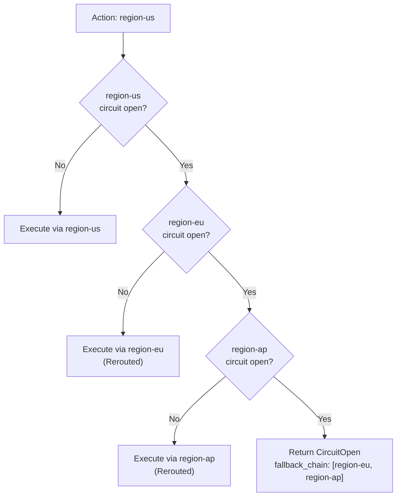

# Circuit Breaker

Circuit breakers protect your system against cascading failures by automatically stopping requests to unhealthy providers. When a provider fails repeatedly, the circuit "opens" and requests are rejected immediately (or rerouted to a fallback) until the provider recovers.

Unlike rule-based features (deduplication, suppression, etc.), circuit breakers operate at the **infrastructure level** and apply automatically to every request targeting a provider — no rules required.

## How It Works


### States

| State | Behavior |
|-------|----------|
| **Closed** | Normal operation. Requests flow through to the provider. Failures are counted. |
| **Open** | Provider is unhealthy. Requests are rejected immediately with `CircuitOpen` (or rerouted to a fallback). |
| **HalfOpen** | Recovery probe. A single request is allowed through to test provider health. Additional requests are rejected until the probe completes. |

### Transition Rules

- **Closed -> Open**: After `failure_threshold` consecutive retryable failures (connection errors, timeouts). Non-retryable errors (validation, auth) do not count.
- **Open -> HalfOpen**: After `recovery_timeout` elapses since the last failure.
- **HalfOpen -> Closed**: After `success_threshold` consecutive successful probes.
- **HalfOpen -> Open**: On any probe failure.

## Configuration

### TOML (Server)

```toml title="acteon.toml"
# ─── Circuit Breaker ────────────────────────────────────
[circuit_breaker]
enabled = true
failure_threshold = 5        # Consecutive failures to open
success_threshold = 2        # Consecutive successes to close
recovery_timeout_seconds = 60 # Seconds before probing

# Per-provider overrides
[circuit_breaker.providers.email]
failure_threshold = 10
recovery_timeout_seconds = 120
fallback_provider = "webhook"

[circuit_breaker.providers.sms]
fallback_provider = "push-notification"
```

### Parameters

#### Default (applies to all providers)

| Parameter | Type | Default | Description |
|-----------|------|---------|-------------|
| `enabled` | bool | `false` | Enable circuit breakers |
| `failure_threshold` | u32 | `5` | Consecutive failures before opening |
| `success_threshold` | u32 | `2` | Consecutive successes in `HalfOpen` to close |
| `recovery_timeout_seconds` | u64 | `60` | Seconds in `Open` before probing |

#### Per-provider overrides

| Parameter | Type | Required | Description |
|-----------|------|----------|-------------|
| `failure_threshold` | u32 | No | Override default failure threshold |
| `success_threshold` | u32 | No | Override default success threshold |
| `recovery_timeout_seconds` | u64 | No | Override default recovery timeout |
| `fallback_provider` | string | No | Provider to reroute to when circuit is open |

Per-provider fields inherit from the defaults when not specified.

### Rust API

```rust
use acteon_gateway::{GatewayBuilder, CircuitBreakerConfig};
use std::time::Duration;

let gateway = GatewayBuilder::new()
    .state(state)
    .lock(lock)
    // Default circuit breaker for all providers
    .circuit_breaker(CircuitBreakerConfig {
        failure_threshold: 5,
        success_threshold: 2,
        recovery_timeout: Duration::from_secs(60),
        fallback_provider: None,
    })
    // Per-provider override with fallback
    .circuit_breaker_provider("email", CircuitBreakerConfig {
        failure_threshold: 10,
        success_threshold: 2,
        recovery_timeout: Duration::from_secs(120),
        fallback_provider: Some("webhook".to_string()),
    })
    .provider(email_provider)
    .provider(webhook_provider)
    .build()?;
```

## Fallback Routing

When a provider's circuit opens and a `fallback_provider` is configured, traffic is automatically rerouted to the fallback instead of being rejected.


### Recursive Fallback Chains

Fallback chains are resolved **recursively**. If the fallback's circuit is also open and it has its own fallback configured, the gateway continues walking the chain until it finds a healthy provider or exhausts the chain. This enables multi-region failover scenarios where multiple providers can be chained.



#### Example: Multi-Region Failover

```toml title="acteon.toml"
[circuit_breaker]
enabled = true

[circuit_breaker.providers.region-us]
fallback_provider = "region-eu"

[circuit_breaker.providers.region-eu]
fallback_provider = "region-ap"
```

```rust
let gateway = GatewayBuilder::new()
    .state(state)
    .lock(lock)
    .circuit_breaker(CircuitBreakerConfig {
        failure_threshold: 5,
        success_threshold: 2,
        recovery_timeout: Duration::from_secs(60),
        fallback_provider: None,
    })
    .circuit_breaker_provider("region-us", CircuitBreakerConfig {
        fallback_provider: Some("region-eu".to_string()),
        ..CircuitBreakerConfig::default()
    })
    .circuit_breaker_provider("region-eu", CircuitBreakerConfig {
        fallback_provider: Some("region-ap".to_string()),
        ..CircuitBreakerConfig::default()
    })
    .provider(us_provider)
    .provider(eu_provider)
    .provider(ap_provider)
    .build()?;
```

When `region-us` and `region-eu` are both down, traffic cascades automatically to `region-ap`. The `Rerouted` outcome reports the final destination:

```json
{
  "outcome": "Rerouted",
  "original_provider": "region-us",
  "new_provider": "region-ap",
  "response": { "status": "success", "body": {} }
}
```

If all providers in the chain are open, the `CircuitOpen` outcome includes every fallback that was attempted:

```json
{
  "outcome": "CircuitOpen",
  "provider": "region-us",
  "fallback_chain": ["region-eu", "region-ap"]
}
```

### Build-Time Validation

Fallback provider names and chains are validated at build time. The gateway returns a configuration error if a `fallback_provider`:

- References a provider that isn't registered
- References itself (self-referencing fallback)
- Creates a cycle (e.g., A→B→C→A)

## Probe Limiting (Thundering Herd Prevention)

In `HalfOpen` state, only **one probe request** is allowed at a time. This prevents a burst of requests from overwhelming a recovering provider.

- When a probe is in flight, additional requests are rejected with `CircuitOpen`.
- If the probe succeeds, the probe slot is released and the next request can probe again (until `success_threshold` is met).
- If the probe fails, the circuit reopens and the recovery timeout restarts.
- Probes that don't complete within 30 seconds are considered stale and the slot is freed.

This works correctly across multiple gateway instances because probe state is tracked in the shared state store.

## Distributed State

Circuit breaker state is persisted in the configured state store (`StateStore`) and mutations are serialized via the distributed lock (`DistributedLock`). This means:

- **Multiple gateway instances** share the same view of provider health.
- When one instance detects a provider failure, all instances see the circuit open.
- Probe coordination works across instances — only one instance sends the probe.

| Backend | Circuit Breaker Accuracy |
|---------|-------------------------|
| Memory | Perfect (single process only) |
| Redis | Perfect (distributed) |
| PostgreSQL | Perfect (distributed) |

If the state store or lock is unavailable, circuit breakers **fail open** — requests are allowed through rather than being blocked.

## Response

When the circuit is open and no fallback is configured:

```json
{
  "outcome": "CircuitOpen",
  "provider": "email",
  "fallback_chain": []
}
```

When the circuit is open and the full fallback chain is exhausted:

```json
{
  "outcome": "CircuitOpen",
  "provider": "email",
  "fallback_chain": ["webhook", "sms"]
}
```

When the circuit is open and a fallback (direct or via chain) succeeds:

```json
{
  "outcome": "Rerouted",
  "original_provider": "email",
  "new_provider": "webhook",
  "response": {
    "status": "success",
    "body": {"sent": true}
  }
}
```

## Metrics

The gateway tracks circuit breaker activity:

| Metric | Description |
|--------|-------------|
| `circuit_open` | Requests rejected because the circuit was open (no fallback) |
| `circuit_fallbacks` | Requests rerouted to a fallback provider |
| `circuit_transitions` | Total state transitions (Closed->Open, Open->HalfOpen, etc.) |

## Example: Rust API with Simulation

```rust
use std::sync::Arc;
use std::time::Duration;

use acteon_core::ActionOutcome;
use acteon_gateway::{CircuitBreakerConfig, GatewayBuilder};
use acteon_simulation::provider::{FailureMode, RecordingProvider};
use acteon_state_memory::{MemoryDistributedLock, MemoryStateStore};

#[tokio::main]
async fn main() -> Result<(), Box<dyn std::error::Error>> {
    let state = Arc::new(MemoryStateStore::new());
    let lock = Arc::new(MemoryDistributedLock::new());

    let primary = Arc::new(
        RecordingProvider::new("email")
            .with_failure_mode(FailureMode::Always),
    );
    let fallback = Arc::new(RecordingProvider::new("webhook"));

    let gateway = GatewayBuilder::new()
        .state(state)
        .lock(lock)
        .circuit_breaker(CircuitBreakerConfig {
            failure_threshold: 3,
            success_threshold: 2,
            recovery_timeout: Duration::from_secs(60),
            fallback_provider: None,
        })
        .circuit_breaker_provider("email", CircuitBreakerConfig {
            failure_threshold: 3,
            success_threshold: 2,
            recovery_timeout: Duration::from_secs(60),
            fallback_provider: Some("webhook".to_string()),
        })
        .provider(primary.clone() as Arc<dyn acteon_provider::DynProvider>)
        .provider(fallback.clone() as Arc<dyn acteon_provider::DynProvider>)
        .build()?;

    // First 3 requests fail and trip the circuit
    for _ in 0..3 {
        let action = acteon_core::Action::new(
            "ns", "tenant", "email", "send", serde_json::json!({}),
        );
        let outcome = gateway.dispatch(action, None).await?;
        assert!(matches!(outcome, ActionOutcome::Failed(_)));
    }

    // Subsequent requests are rerouted to the webhook fallback
    let action = acteon_core::Action::new(
        "ns", "tenant", "email", "send", serde_json::json!({}),
    );
    let outcome = gateway.dispatch(action, None).await?;
    assert!(matches!(outcome, ActionOutcome::Rerouted { .. }));

    gateway.shutdown().await;
    Ok(())
}
```

!!! tip "Running the Full Simulation"
    A comprehensive 5-scenario simulation is included:
    ```bash
    cargo run -p acteon-simulation --example circuit_breaker_simulation
    ```
    It demonstrates basic circuit opening, fallback routing, full recovery lifecycle, independent per-provider circuits, and multi-level fallback chains.

## Design Notes

- Only **retryable errors** (connection failures, timeouts) count toward the failure threshold. Non-retryable errors like authentication failures or validation errors do not trip the circuit.
- `recovery_timeout = 0` is allowed and useful for testing — the circuit transitions to `HalfOpen` immediately.
- Circuit breakers are independent per provider. One provider's failures never affect another provider's circuit.
- The circuit breaker runs **before** the executor's retry logic. If the circuit is open, the request is rejected without any retry attempts.
