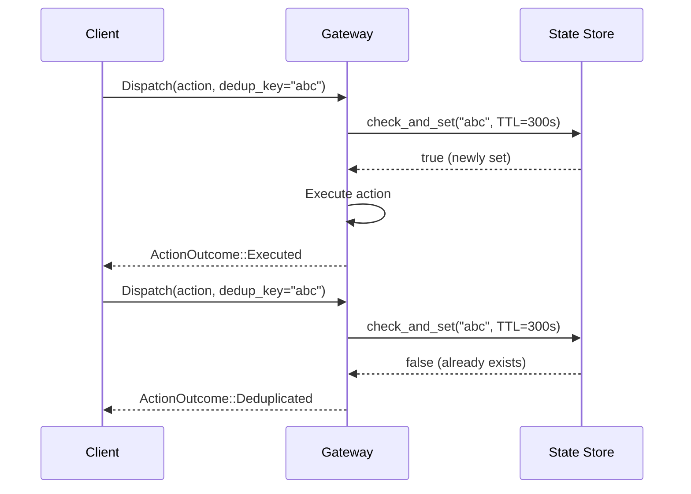

# Deduplication

Deduplication prevents the same action from being processed more than once within a configurable time window. This is essential for idempotent operations like sending emails, posting notifications, or triggering webhooks.

## How It Works



1. The action includes a `dedup_key` (set by the client or derived from the action)
2. The gateway checks the state store for an existing entry with that key
3. If the key exists within the TTL window, the action is **deduplicated**
4. If the key is new, the action is **executed** and the key is stored with a TTL

## Rule Configuration

```yaml title="rules/dedup.yaml"
rules:
  - name: dedup-emails
    priority: 10
    description: "Deduplicate email sends within 5 minutes"
    condition:
      all:
        - field: action.action_type
          eq: "send_email"
        - field: action.payload.to
          contains: "@"
    action:
      type: deduplicate
      ttl_seconds: 300
```

### Parameters

| Parameter | Type | Required | Description |
|-----------|------|----------|-------------|
| `ttl_seconds` | u64 | Yes | How long the dedup key is remembered |

## Client-Side Dedup Keys

The client sets the `dedup_key` on the action:

=== "Rust"

    ```rust
    let action = Action::new("ns", "tenant", "email", "send_email", json!({}))
        .with_dedup_key("welcome-user@example.com");
    ```

=== "curl"

    ```bash
    curl -X POST http://localhost:8080/v1/dispatch \
      -H "Content-Type: application/json" \
      -d '{
        "namespace": "ns",
        "tenant": "tenant-1",
        "provider": "email",
        "action_type": "send_email",
        "payload": {"to": "user@example.com"},
        "dedup_key": "welcome-user@example.com"
      }'
    ```

## Dedup Key Strategies

| Strategy | Key Format | Use Case |
|----------|-----------|----------|
| **Recipient-based** | `"email-{to}"` | One email per recipient |
| **Content-based** | `"notify-{subject}-{to}"` | One per unique message |
| **Time-based** | `"daily-report-{date}"` | One per time period |
| **Idempotency key** | `"req-{client_request_id}"` | HTTP idempotency |

## Distributed Behavior

Deduplication relies on the state backend for distributed coordination:

| Backend | Dedup Accuracy | Notes |
|---------|---------------|-------|
| Memory | Perfect | Single process only |
| Redis | Perfect | Strong locking |
| PostgreSQL | Perfect | ACID guarantees |
| DynamoDB | Perfect | Conditional writes |
| ClickHouse | ~80-90% | Eventual consistency — not recommended |

!!! warning "ClickHouse Limitation"
    ClickHouse uses `ReplacingMergeTree` which provides eventual consistency. Under concurrent load, 10-20% of duplicate actions may slip through. Use Redis or PostgreSQL for strict deduplication.

## Example: Testing Deduplication

```rust
use acteon_simulation::prelude::*;

const DEDUP_RULE: &str = r#"
rules:
  - name: dedup-notifications
    condition:
      field: action.action_type
      eq: "notify"
    action:
      type: deduplicate
      ttl_seconds: 60
"#;

#[tokio::test]
async fn test_dedup() {
    let harness = SimulationHarness::start(
        SimulationConfig::builder()
            .nodes(1)
            .add_recording_provider("email")
            .add_rule_yaml(DEDUP_RULE)
            .build()
    ).await.unwrap();

    let action = Action::new("ns", "t1", "email", "notify", json!({}))
        .with_dedup_key("unique-key");

    // First dispatch executes
    harness.dispatch(&action).await.unwrap().assert_executed();

    // Second dispatch is deduplicated
    harness.dispatch(&action).await.unwrap().assert_deduplicated();

    // Provider was called only once
    harness.provider("email").unwrap().assert_called(1);

    harness.teardown().await.unwrap();
}
```

## Audit Trail

Both executed and deduplicated actions are recorded in the audit trail:

```json
// First dispatch
{
  "action_id": "abc-123",
  "outcome": "executed",
  "verdict": "allow"
}

// Second dispatch
{
  "action_id": "def-456",
  "outcome": "deduplicated",
  "matched_rule": "dedup-notifications"
}
```
