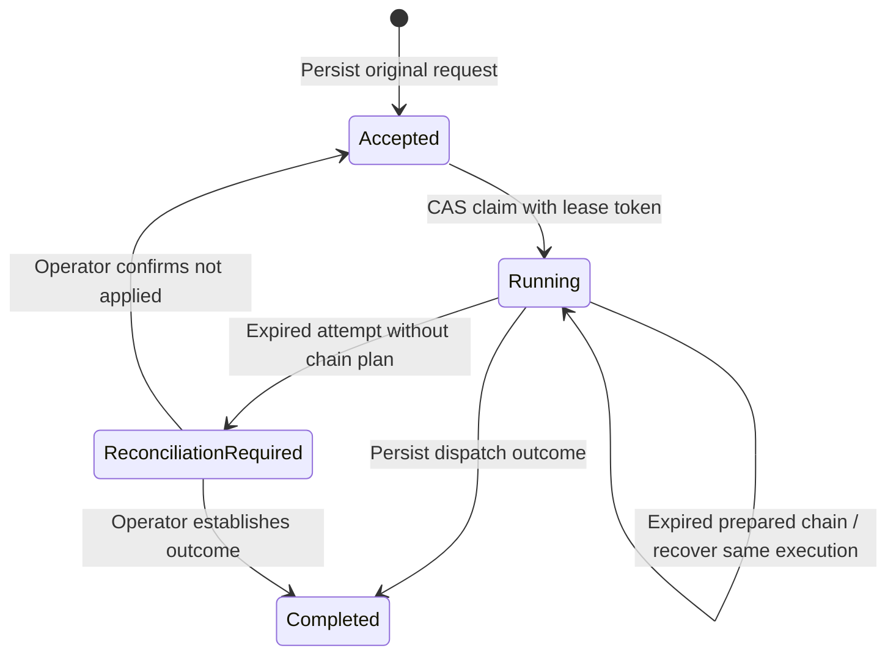

# Durable Dispatch Admission

Durable admission stores an Action's acceptance, original request, caller,
execution linkage, and outcome before acknowledging delivery. It composes with
the normal gateway rules, quotas, audit, providers, and chains. An idempotent
retry returns the original receipt instead of a generic “duplicate” result.

This is a gateway building block for any reliable receiver: stream outboxes,
webhooks, event bridges, or application workers. It does not require a
model-specific adapter or a second routing gateway.

## Lifecycle



`Completed` means that the **dispatch outcome** is durable. A `ChainStarted`
outcome accepts responsibility for a particular durable execution; it does not
mean that the chain's steps have finished. Failed provider outcomes are also
recorded and returned on retry, rather than silently reexecuted.

An attempt that expires without a prepared chain has uncertain effects. The
receipt moves to `ReconciliationRequired`; a retry never treats that state as
successful delivery or invokes the provider again automatically. Even a
pre-execution pipeline error is handled conservatively because the pipeline can
perform other state transitions before returning an error.

## Rust API

```rust
use acteon_core::Action;
use acteon_gateway::{DispatchAdmissionConfig, Gateway};
use serde_json::json;

async fn deliver(gateway: &Gateway) -> Result<(), Box<dyn std::error::Error>> {
    let action = Action::new(
        "observability", "acme", "verdict-audit", "detector.verdict",
        json!({"policy_band": "incident", "incident_key": "checkout:window:42"}),
    ).with_dedup_key("checkout:window:42");

    let result = gateway.dispatch_durable(
        action, None, DispatchAdmissionConfig::default(),
    ).await?;
    println!("replayed: {}", result.replayed);
    println!("receipt: {:?}", result.receipt.status);
    println!("outcome: {:?}", result.receipt.outcome());
    Ok(())
}
```

- `admit_dispatch` persists acceptance without invoking the dispatch pipeline.
  A caller or worker must later invoke `dispatch_durable` to process it; the
  library does not automatically install an inbox worker daemon.
- `dispatch_durable` accepts or reloads the receipt, claims an eligible attempt,
  and dispatches or recovers its prepared chain.
- `get_dispatch_receipt(namespace, tenant, key)` reads the current record and
  its authoritative StateStore CAS version.
- `resolve_dispatch_receipt(..., DispatchResolutionRequest)` applies an
  explicit operator decision. The request includes the observed version, trusted
  operator identity, and a nonempty explanation or evidence reference. A stale
  version cannot overwrite another worker. The receipt retains the previous
  failure and operator decision; history is bounded to 32 records and each reason
  to 1,024 bytes, within the overall receipt-size limit.

`DispatchResolution::Complete(outcome)` records an independently established
outcome without execution. `RetryNotApplied` returns an ambiguous receipt or a
recorded provider failure to `Accepted`. Before choosing it, confirm that the
effects did not occur **and stop the previous worker**: receipt fencing cannot
cancel an external provider call. Successful completed receipts and prepared
chain starts cannot be reset through this API.

These library APIs assume a trusted caller. A transport must enforce its own
permissions before dispatch, inspection, or resolution.

## HTTP dispatch

Use the existing endpoint with an explicit Action `dedup_key`:

```http
POST /v1/dispatch?durable=true
Content-Type: application/json
Authorization: Bearer <key>
```

The response wraps the receipt and replay flag:

```json
{
  "replayed": true,
  "receipt": {
    "schema_version": 1,
    "version": 4,
    "idempotency_key": "checkout:window:42",
    "status": {
      "state": "completed",
      "outcome": {
        "ChainStarted": {
          "chain_id": "<original-execution-id>",
          "chain_name": "observability-incident",
          "total_steps": 2,
          "first_step": "capture-diagnostics"
        }
      }
    }
  }
}
```

This abridged example omits the original Action, caller, digest, timestamps,
settings, and any prepared chain plan. Treat receipts as sensitive payloads.

| HTTP status | Meaning |
|---|---|
| `200` | Dispatch outcome recorded, including a recorded provider failure |
| `202` | Another live attempt owns dispatch; delivery has not completed |
| `409` | Request conflicts, ownership changed, or reconciliation is required |
| `400` | Invalid admission request, missing key, or incompatible mode |
| `500` | Storage, receipt-capacity, or pipeline failure; inspect the same key before deciding to retry |

Every retry still passes signature verification and grant authorization.
Action-ID replay protection permits the same durable key to retrieve its
receipt, while rejecting a different key or ordinary dispatch with that
protected ID. Durable mode cannot combine with dry-run and is not supported on
the batch endpoint. HTTP dispatch uses the default 120-second lease and 2 MiB
receipt bound; deployments needing different bounds currently use the Rust API.
Receipt inspection and operator resolution are Rust APIs;
a server operations API remains a separate follow-up.

## Identity, recovery, and storage

The key is scoped by namespace and tenant and hashed before storage. Admission
binds it to semantic Action fields and caller identity. Different payloads,
providers, action types, metadata, settings, or callers conflict. Fresh transport
Action IDs, creation timestamps, trace context, and signatures do not change
that binding; the original Action and caller remain in the receipt. JSON object
ordering does not change its digest, and floating-point JSON round trips retain
request identity.

Before creating an admitted chain, the gateway persists its execution ID,
processed origin Action, and selected chain definition. Recovery reuses that
plan and its pinned definition instead of reevaluating changed routing rules.
If chain state already exists, recovery repairs its discovery indexes and
returns the same execution ID. CAS creation prevents a stale creator from
resetting an existing execution. Start-history events use their own durable
receipt so a lost acknowledgement cannot allocate duplicate start events.

Receipts and admitted chain state have **no automatic TTL**. The retention
reaper also preserves chains linked to an admission receipt. Expiring chain state
while an acceptance receipt is unresolved could recreate a completed execution
on recovery. Plan storage maintenance explicitly; this first building block does
not provide automatic receipt garbage collection. Upgrade all gateway and chain
workers before enabling durable admission so every writer honors this retention.

Records use the gateway's `StateStore` CAS contract and configured payload
cryptography. Settings are pinned on first admission: the default ownership
lease is 120 seconds and the plaintext receipt limit is 2 MiB. Set the limit
below your backend's item-size limit and budget for the Action, chain plan, and
provider response. Oversized outcomes or failed storage acknowledgements can
leave an unresolved attempt; inspect the receipt using the same key. Keep worker
clocks synchronized and choose a lease covering the complete dispatch latency.

Admission leases fence receipt updates and are checked before verdict execution.
They do not undo effects. Executor/provider retry policy still applies separately.
An external receiver must honor idempotency keys or offer reconciliation to
establish the outcome of interrupted calls. Durable admission does not claim
exactly-once external effects.

See [Managed Stream Outbox](managed-stream-outbox.md) for delivery workers and
[Cascaded Neural Observability Detector](../guides/neural-observability-detector.md)
for the Kafka/Laya/Redis integration.
