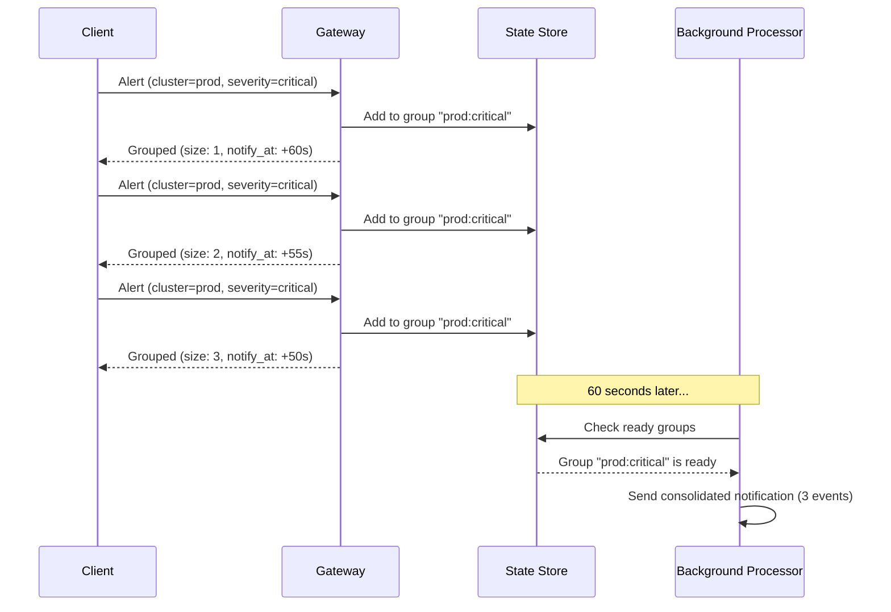
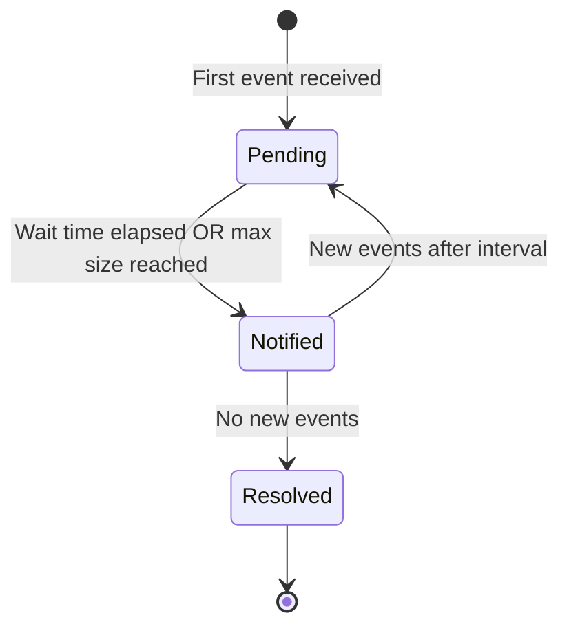

# Event Grouping

Event grouping batches related events together for consolidated notifications. Instead of sending one notification per event, Acteon collects events into groups and sends a single summary when the group is ready.

## How It Works



1. Events matching a group rule are collected into groups based on `group_by` fields
2. Each group has a configurable wait time before the first notification
3. After notification, a minimum interval prevents notification storms
4. Groups can also trigger when reaching `max_group_size`

## Rule Configuration

```yaml title="rules/grouping.yaml"
rules:
  - name: group-cluster-alerts
    priority: 5
    description: "Batch cluster alerts by cluster and severity"
    condition:
      field: action.action_type
      starts_with: "cluster_"
    action:
      type: group
      group_by:
        - metadata.cluster
        - metadata.severity
      group_wait_seconds: 60
      group_interval_seconds: 300
      max_group_size: 100
```

### Parameters

| Parameter | Type | Required | Description |
|-----------|------|----------|-------------|
| `group_by` | string[] | Yes | Fields to compute group key (events with same values are grouped) |
| `group_wait_seconds` | u64 | Yes | Wait time before first notification |
| `group_interval_seconds` | u64 | No | Minimum time between notifications |
| `max_group_size` | usize | No | Maximum events before forced flush |

## Group Key Computation

The group key is a hash of the `group_by` field values. Events with the same group key are placed in the same group:

```
Group key = SHA-256(metadata.cluster + metadata.severity)

Event A: cluster=prod, severity=critical → Group "abc123"
Event B: cluster=prod, severity=critical → Group "abc123"  (same group)
Event C: cluster=staging, severity=critical → Group "def456"  (different group)
```

## Group Lifecycle



| State | Description |
|-------|-------------|
| `Pending` | Accumulating events, waiting to notify |
| `Notified` | Notification sent, observing interval |
| `Resolved` | Group closed, no more events |

## EventGroup Type

```rust
pub struct EventGroup {
    pub group_id: String,
    pub group_key: String,
    pub labels: HashMap<String, String>,
    pub events: Vec<GroupedEvent>,
    pub notify_at: DateTime<Utc>,
    pub state: GroupState,
    pub created_at: DateTime<Utc>,
    pub updated_at: DateTime<Utc>,
}
```

Each event in the group:

```rust
pub struct GroupedEvent {
    pub action_id: ActionId,
    pub fingerprint: Option<String>,
    pub status: Option<String>,
    pub payload: serde_json::Value,
    pub received_at: DateTime<Utc>,
}
```

## API Endpoints

### List Groups

```bash
curl http://localhost:8080/v1/groups
```

### Get Group Details

```bash
curl http://localhost:8080/v1/groups/{group_key}
```

### Force Flush Group

Trigger immediate notification for a group:

```bash
curl -X DELETE http://localhost:8080/v1/groups/{group_key}
```

## Use Cases

### Alert Batching

Instead of receiving 50 individual alerts for a cluster failure, receive one consolidated notification:

```yaml
- name: batch-k8s-alerts
  condition:
    field: action.metadata.source
    eq: "kubernetes"
  action:
    type: group
    group_by:
      - metadata.cluster
      - metadata.namespace
    group_wait_seconds: 120
    max_group_size: 50
```

### Digest Notifications

Batch user activity notifications into periodic digests:

```yaml
- name: activity-digest
  condition:
    field: action.action_type
    eq: "user_activity"
  action:
    type: group
    group_by:
      - metadata.user_id
    group_wait_seconds: 3600
    group_interval_seconds: 86400
```

## Response

```json
{
  "outcome": "grouped",
  "group_id": "grp-abc123",
  "group_size": 5,
  "notify_at": "2026-01-15T10:05:00Z"
}
```
