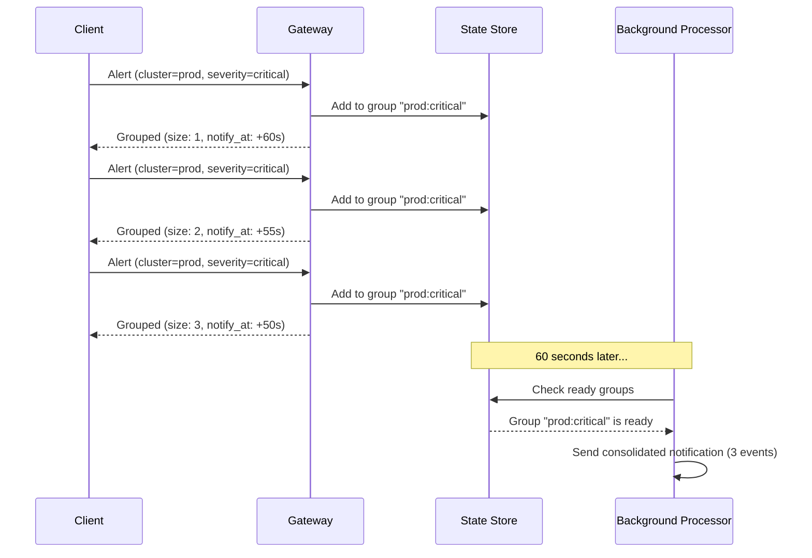
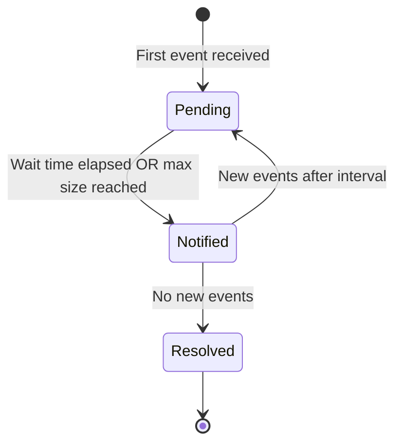

# Event Grouping

Event grouping batches related events together for consolidated notifications. Instead of sending one notification per event, Acteon collects events into groups and sends a single summary when the group is ready.

## How It Works


```mermaid
sequenceDiagram
    participant C as Client
    participant G as Gateway
    participant S as State Store
    participant BG as Background Processor

    C->>G: Alert (cluster=prod, severity=critical)
    G->>S: Add to group "prod:critical"
    G-->>C: Grouped (size: 1, notify_at: +60s)

    C->>G: Alert (cluster=prod, severity=critical)
    G->>S: Add to group "prod:critical"
    G-->>C: Grouped (size: 2, notify_at: +55s)

    C->>G: Alert (cluster=prod, severity=critical)
    G->>S: Add to group "prod:critical"
    G-->>C: Grouped (size: 3, notify_at: +50s)

    Note over BG,S: 60 seconds later...
    BG->>S: Check ready groups
    S-->>BG: Group "prod:critical" is ready
    BG->>BG: Send consolidated notification (3 events)
```

1. Events matching a group rule are collected into groups based on `group_by` fields
2. Each group has a configurable wait time before the first notification
3. After notification, a minimum interval prevents notification storms
4. Groups can also trigger when reaching `max_group_size`

## Rule Configuration

```yaml title="rules/grouping.yaml"
rules:
  - name: group-cluster-alerts
    priority: 5
    description: "Batch cluster alerts by cluster and severity"
    condition:
      field: action.action_type
      starts_with: "cluster_"
    action:
      type: group
      group_by:
        - metadata.cluster
        - metadata.severity
      group_wait_seconds: 60
      group_interval_seconds: 300
      # Omitting repeat_interval_seconds makes this an ephemeral
      # group — single flush, then the group is deleted.
      max_group_size: 100
```

### Persistent groups with repeat intervals

Setting `repeat_interval_seconds` turns the group into a **persistent** group
that behaves like an Alertmanager alert: it stays alive after the first
flush, re-batches new events using `group_interval_seconds`, and re-fires
on the repeat interval even with no new events as a "still firing"
reminder.

```yaml title="rules/persistent-grouping.yaml"
rules:
  - name: group-critical-alerts-persistent
    priority: 5
    condition:
      field: metadata.severity
      eq: critical
    action:
      type: group
      group_by:
        - metadata.cluster
        - metadata.service
      group_wait_seconds: 30        # Initial batching window
      group_interval_seconds: 300   # Re-batch new events 5 min apart
      repeat_interval_seconds: 3600 # Re-notify every hour even with no new events
      max_group_size: 100           # Drop oldest when full
```

### Parameters

| Parameter | Type | Required | Description |
|-----------|------|----------|-------------|
| `group_by` | string[] | Yes | Fields to compute group key (events with same values are grouped) |
| `group_wait_seconds` | u64 | Yes | Wait time from first event to first flush |
| `group_interval_seconds` | u64 | No | Wait between successive flushes when new events arrive. **Only honored on persistent groups** (those with `repeat_interval_seconds` set). On ephemeral groups the field is accepted for forward-compat but has no effect. |
| `repeat_interval_seconds` | u64 (Option) | No | When set, keeps the group alive after flush and forces a re-notification every N seconds even with no new events. Omit for ephemeral groups (single-flush). |
| `max_group_size` | usize | No | Maximum events held in the group. When at capacity the **oldest** event is dropped (FIFO). See the caveat below. |

!!! warning "Lossy FIFO caveat for `max_group_size`"
    When a persistent group fills to `max_group_size` and a new event
    arrives, Acteon drops the **oldest** event to make room. This can
    silently discard the events that *started* an incident — often the
    most diagnostically valuable ones — in favor of newer noise. The
    current policy is a pragmatic choice for bounded memory growth,
    but operators running long-lived persistent groups should:

    1. Size `max_group_size` generously relative to expected
       incident burst volume (e.g., 500–1000 for noisy infra-level
       events instead of the 100 default).
    2. Consider whether the underlying rule should use an ephemeral
       group (single flush) if the first events really are the most
       important and you don't need re-notification.
    3. Rely on the [audit trail](audit-trail.md) for forensic
       reconstruction — every dispatched action is recorded regardless
       of whether it survived the group cap.

    A future revision may expose a configurable drop policy
    (`drop_oldest` / `drop_newest` / `drop_middle`) per-rule. Track
    progress in the [Alertmanager parity master plan](https://github.com/penserai/acteon/blob/main/docs/design-alertmanager-parity.md).

### Ephemeral vs. persistent groups

| | Ephemeral (default) | Persistent (`repeat_interval_seconds` set) |
|---|---|---|
| `group_wait_seconds` | ✅ Honored | ✅ Honored |
| `group_interval_seconds` | ⚠️ Ignored (single flush) | ✅ Honored between flushes |
| `repeat_interval_seconds` | N/A (absent) | ✅ Forces re-fire with current events |
| `max_group_size` | ✅ Cap enforced | ✅ Cap enforced |
| After flush | Group deleted; next event starts a fresh `group_wait` cycle | Group kept alive; re-flushes on schedule |
| Use case | Batch a burst of related events into a single notification | On-call-style incident reminders: "X is still firing" |

Ephemeral groups match the pre-Phase-2 behavior exactly — existing rules
that don't set `repeat_interval_seconds` continue to work without any
change in semantics.

## Group Key Computation

The group key is a hash of the `group_by` field values. Events with the same group key are placed in the same group:

```
Group key = SHA-256(metadata.cluster + metadata.severity)

Event A: cluster=prod, severity=critical → Group "abc123"
Event B: cluster=prod, severity=critical → Group "abc123"  (same group)
Event C: cluster=staging, severity=critical → Group "def456"  (different group)
```

## Group Lifecycle


```mermaid
stateDiagram-v2
    [*] --> Pending: First event received
    Pending --> Notified: Wait time elapsed OR max size reached
    Notified --> Pending: New events after interval
    Notified --> Resolved: No new events
    Resolved --> [*]
```

| State | Description |
|-------|-------------|
| `Pending` | Accumulating events, waiting to notify |
| `Notified` | Notification sent, observing interval |
| `Resolved` | Group closed, no more events |

## EventGroup Type

```rust
pub struct EventGroup {
    pub group_id: String,
    pub group_key: String,
    pub labels: HashMap<String, String>,
    pub events: Vec<GroupedEvent>,
    pub notify_at: DateTime<Utc>,
    pub last_notified_at: Option<DateTime<Utc>>,
    pub state: GroupState,
    pub created_at: DateTime<Utc>,
    pub updated_at: DateTime<Utc>,
    // Phase 2: timing parameters captured from the rule at group creation.
    pub group_wait_seconds: u64,
    pub group_interval_seconds: u64,
    pub repeat_interval_seconds: Option<u64>,
    pub max_group_size: usize,
}
```

Each event in the group:

```rust
pub struct GroupedEvent {
    pub action_id: ActionId,
    pub fingerprint: Option<String>,
    pub status: Option<String>,
    pub payload: serde_json::Value,
    pub received_at: DateTime<Utc>,
}
```

## API Endpoints

### List Groups

```bash
curl http://localhost:8080/v1/groups
```

### Get Group Details

```bash
curl http://localhost:8080/v1/groups/{group_key}
```

### Force Flush Group

Trigger immediate notification for a group:

```bash
curl -X DELETE http://localhost:8080/v1/groups/{group_key}
```

## Use Cases

### Alert Batching

Instead of receiving 50 individual alerts for a cluster failure, receive one consolidated notification:

```yaml
- name: batch-k8s-alerts
  condition:
    field: action.metadata.source
    eq: "kubernetes"
  action:
    type: group
    group_by:
      - metadata.cluster
      - metadata.namespace
    group_wait_seconds: 120
    max_group_size: 50
```

### Digest Notifications

Batch user activity notifications into periodic digests:

```yaml
- name: activity-digest
  condition:
    field: action.action_type
    eq: "user_activity"
  action:
    type: group
    group_by:
      - metadata.user_id
    group_wait_seconds: 3600
    group_interval_seconds: 86400
```

## Response

```json
{
  "outcome": "grouped",
  "group_id": "grp-abc123",
  "group_size": 5,
  "notify_at": "2026-01-15T10:05:00Z"
}
```
