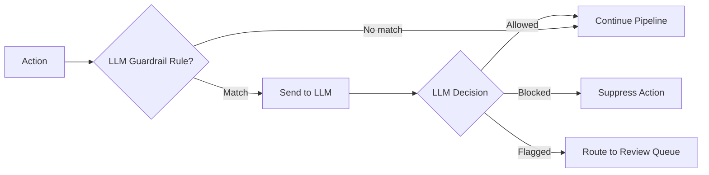

# LLM Guardrails

LLM guardrails use AI-powered evaluation to gate actions through content analysis. Actions can be blocked or flagged based on an LLM's assessment with configurable confidence thresholds.

## How It Works



1. An action matching an LLM guardrail rule is sent to the configured LLM endpoint
2. The LLM evaluates the action's payload against a system prompt
3. Based on the response (allowed/blocked) and the configured policy, the action proceeds or is blocked

## Configuration

### Server Configuration

```toml title="acteon.toml"
[llm_guardrail]
endpoint = "https://api.openai.com/v1/chat/completions"
model = "gpt-4"
api_key_env = "OPENAI_API_KEY"     # Read API key from environment
policy = "block"                    # "block" or "flag"
temperature = 0.0
max_tokens = 256
```

### Rule Configuration

```yaml title="rules/guardrails.yaml"
rules:
  - name: content-safety-check
    priority: 1
    description: "Check message content for policy violations"
    condition:
      field: action.action_type
      eq: "send_message"
    action:
      type: llm_guardrail
      evaluator_name: "content-safety"
      block_on_flag: true
      send_to: "review-queue"
```

### Parameters

| Parameter | Type | Required | Description |
|-----------|------|----------|-------------|
| `evaluator_name` | string | Yes | Identifier for the LLM evaluator |
| `block_on_flag` | bool | No | Whether to block the action when flagged |
| `send_to` | string | No | Provider to route flagged actions to |

## LLM Evaluator Interface

```rust
#[async_trait]
pub trait LlmEvaluator: Send + Sync {
    async fn evaluate(&self, action: &Action) -> Result<LlmGuardrailResponse>;
}

pub struct LlmGuardrailResponse {
    pub allowed: bool,           // Whether action passes
    pub reasoning: String,       // Explanation
    pub confidence: f32,         // 0.0 to 1.0
}
```

## Built-in Evaluators

| Evaluator | Description |
|-----------|-------------|
| `HttpLlmEvaluator` | Calls an OpenAI-compatible API |
| `MockLlmEvaluator` | Always allows (for testing) |
| `CapturingLlmEvaluator` | Captures all calls for test assertions |
| `FailingLlmEvaluator` | Simulates LLM failures |

## Policy Modes

### Block Mode

When `policy = "block"`, actions flagged by the LLM are suppressed:

```
Action → LLM says "not allowed" → ActionOutcome::Suppressed
```

### Flag Mode

When `policy = "flag"`, flagged actions are routed to a review queue:

```
Action → LLM says "not allowed" → Route to review-queue provider
```

## Use Cases

### Content Moderation

Check user-generated content before sending:

```yaml
- name: moderate-messages
  condition:
    field: action.action_type
    eq: "send_user_message"
  action:
    type: llm_guardrail
    evaluator_name: "content-safety"
    block_on_flag: true
```

### PII Detection

Flag actions containing personally identifiable information:

```yaml
- name: pii-check
  condition:
    field: action.provider
    eq: "external-api"
  action:
    type: llm_guardrail
    evaluator_name: "pii-detector"
    block_on_flag: false
    send_to: "compliance-review"
```

### Prompt Injection Prevention

Protect LLM-targeted actions from prompt injection:

```yaml
- name: prompt-injection-guard
  condition:
    field: action.provider
    eq: "llm-gateway"
  action:
    type: llm_guardrail
    evaluator_name: "injection-detector"
    block_on_flag: true
```
