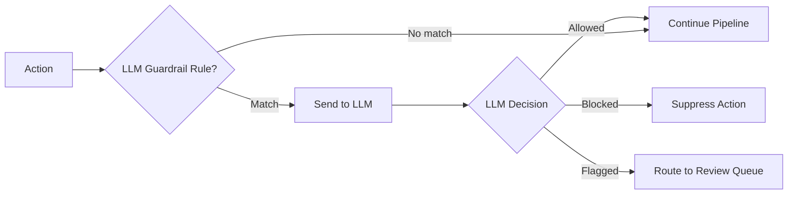

# LLM Guardrails

LLM guardrails use AI-powered evaluation to gate actions through content analysis. Actions can be blocked or flagged based on an LLM's assessment with configurable confidence thresholds.

## How It Works


```mermaid
flowchart LR
    A[Action] --> B{LLM Guardrail Rule?}
    B -->|Match| C[Send to LLM]
    C --> D{LLM Decision}
    D -->|Allowed| E[Continue Pipeline]
    D -->|Blocked| F[Suppress Action]
    D -->|Flagged| G[Route to Review Queue]
    B -->|No match| E
```

1. An action matching an LLM guardrail rule is sent to the configured LLM endpoint
2. The LLM evaluates the action's payload against a system prompt
3. Based on the response (allowed/blocked) and the configured policy, the action proceeds or is blocked

## Configuration

### Server Configuration

```toml title="acteon.toml"
[llm_guardrail]
endpoint = "https://api.openai.com/v1/chat/completions"
model = "gpt-4"
api_key_env = "OPENAI_API_KEY"     # Read API key from environment
policy = "block"                    # "block" or "flag"
temperature = 0.0
max_tokens = 256
```

### Rule Configuration

```yaml title="rules/guardrails.yaml"
rules:
  - name: content-safety-check
    priority: 1
    description: "Check message content for policy violations"
    condition:
      field: action.action_type
      eq: "send_message"
    action:
      type: llm_guardrail
      evaluator_name: "content-safety"
      block_on_flag: true
      send_to: "review-queue"
```

### Parameters

| Parameter | Type | Required | Description |
|-----------|------|----------|-------------|
| `evaluator_name` | string | Yes | Identifier for the LLM evaluator |
| `block_on_flag` | bool | No | Whether to block the action when flagged |
| `send_to` | string | No | Provider to route flagged actions to |

## LLM Evaluator Interface

```rust
#[async_trait]
pub trait LlmEvaluator: Send + Sync {
    async fn evaluate(&self, action: &Action) -> Result<LlmGuardrailResponse>;
}

pub struct LlmGuardrailResponse {
    pub allowed: bool,           // Whether action passes
    pub reasoning: String,       // Explanation
    pub confidence: f32,         // 0.0 to 1.0
}
```

## Built-in Evaluators

| Evaluator | Description |
|-----------|-------------|
| `HttpLlmEvaluator` | Calls an OpenAI-compatible API |
| `MockLlmEvaluator` | Always allows (for testing) |
| `CapturingLlmEvaluator` | Captures all calls for test assertions |
| `FailingLlmEvaluator` | Simulates LLM failures |

## Policy Modes

### Block Mode

When `policy = "block"`, actions flagged by the LLM are suppressed:

```
Action → LLM says "not allowed" → ActionOutcome::Suppressed
```

### Flag Mode

When `policy = "flag"`, flagged actions are routed to a review queue:

```
Action → LLM says "not allowed" → Route to review-queue provider
```

## Use Cases

### Content Moderation

Check user-generated content before sending:

```yaml
- name: moderate-messages
  condition:
    field: action.action_type
    eq: "send_user_message"
  action:
    type: llm_guardrail
    evaluator_name: "content-safety"
    block_on_flag: true
```

### PII Detection

Flag actions containing personally identifiable information:

```yaml
- name: pii-check
  condition:
    field: action.provider
    eq: "external-api"
  action:
    type: llm_guardrail
    evaluator_name: "pii-detector"
    block_on_flag: false
    send_to: "compliance-review"
```

### Prompt Injection Prevention

Protect LLM-targeted actions from prompt injection:

```yaml
- name: prompt-injection-guard
  condition:
    field: action.provider
    eq: "llm-gateway"
  action:
    type: llm_guardrail
    evaluator_name: "injection-detector"
    block_on_flag: true
```

## Failure Handling

When the LLM evaluator errors — timeout, HTTP failure, JSON parse error,
provider rate limit — the gateway must decide whether to let the action
through or block it. The `fail_open` parameter on `[llm_guardrail]`
controls that choice:

| Mode | Behavior on evaluator error | Counter that increments |
|---|---|---|
| `fail_open = false` (**default**, **fail-closed**) | Action is denied (`ActionOutcome::Suppressed`) with reason `"LLM guardrail unavailable: <error>"` | `acteon_llm_guardrail_errors_total` |
| `fail_open = true` (fail-open) | Action proceeds as if the guardrail allowed it | `acteon_llm_guardrail_errors_total` |

Either way, `acteon_llm_guardrail_errors_total` increments — the
counter measures evaluator availability, not the dispatch outcome. The
deny vs. allow decision is what `fail_open` flips.

**Why fail-closed is the default.** Operators who turn the guardrail on
are explicitly opting into a content-safety check. If the evaluator is
unreachable, the natural mental model is "the check didn't run, so the
action should be blocked." Fail-open delivers the opposite: the check
silently doesn't run and the action proceeds. An attacker who can force
evaluator timeouts (oversized prompts, prompt-injection that triggers a
long thought chain, regional outages) gets a free pass past the guard.

**When to set `fail_open = true`.** Override the default if the cost of
a missed action exceeds the cost of a security bypass — for example,
when the guardrail is an advisory check on an internal-only flow that
must not stall on third-party LLM availability. Document the choice in
your config (with a comment) so a future operator can tell the
deviation from default was deliberate.

```toml title="acteon.toml — explicit fail-open opt-in"
[llm_guardrail]
enabled = true
endpoint = "https://api.openai.com/v1/chat/completions"
api_key = "ENC[...]"
policy = "Internal advisory only — availability over correctness."
fail_open = true   # Deliberately fail-open: this guardrail is advisory
                   # and must not block the action if the LLM is down.
```

!!! warning "Migration note"
    Acteon ≤ 0.1.x defaulted `fail_open` to `true`. This release flips
    the default to `false` to align with the principle of least
    surprise for security-oriented deployments. If you were relying on
    the implicit fail-open behavior, set `fail_open = true` explicitly
    in your `acteon.toml` to preserve the old behavior.

## Monitoring

### Prometheus Metrics

The guardrail emits three counters via `GET /metrics/prometheus`
(and as JSON at `GET /metrics`):

| Metric | Counted on |
|---|---|
| `acteon_llm_guardrail_allowed_total` | Evaluator returned `Allow` (action passes through) |
| `acteon_llm_guardrail_denied_total` | Evaluator returned `Deny` or `Flag` + `block_on_flag=true` (action suppressed) |
| `acteon_llm_guardrail_errors_total` | Evaluator errored — timeout, HTTP failure from the LLM, JSON parse error on the response, etc. |

**Grafana.** The bundled `acteon-overview` dashboard has an
"LLM Guardrail" row with a decisions rate timeseries and a stat
panel for the totals.

**What to alert on.** Alerting on errors is the **primary**
security-critical signal, not the deny ratio. In fail-open
configurations the guardrail lets actions through when the
evaluator errors, so an attacker who can force timeouts (large
inputs, upstream LLM slowness) quietly bypasses the guard. The
deny ratio in that attack stays flat or even drops because
`denied` doesn't grow while `allowed` + `errors` keep going up.
Page on errors first:

```promql
rate(acteon_llm_guardrail_errors_total[5m]) > 0.1
```

For **baseline health** — is the evaluator denying about as often
as expected, or has something drifted? — compute deny prevalence
against *all evaluated traffic* (include errors in the
denominator). The `+ 1e-9` guards against division-by-zero
`NaN` during quiet periods, which Grafana would otherwise render
as "No Data" and hide the alert entirely:

```promql
rate(acteon_llm_guardrail_denied_total[5m])
  /
(rate(acteon_llm_guardrail_allowed_total[5m])
   + rate(acteon_llm_guardrail_denied_total[5m])
   + rate(acteon_llm_guardrail_errors_total[5m])
   + 1e-9) > 0.2
```

A sustained non-zero `denied` rate on rules targeting external
input surfaces (public webhooks, customer-facing dispatch) is
still worth investigating — prompt-injection attempts that the
evaluator successfully catches show up here — but treat it as a
secondary signal. The errors alert above is what catches an
actual bypass.
