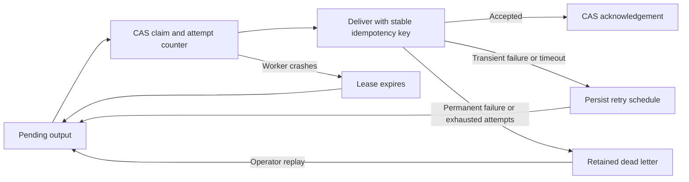

# Managed Stream Outbox

`StreamOutboxDispatcher` delivers outputs from a stream checkpoint with durable
leases, bounded retries, exponential backoff, dead-letter retention, and delivery
metrics. It is a reusable `acteon-bus` building block for any stream processor.

Delivery metadata lives in the same `StateStore` CAS record as processor state,
source positions, and pending outputs. It works with memory, Redis, PostgreSQL,
and DynamoDB. Workers sharing a processor key claim outputs atomically; they
never replace processor state from a stale local copy.

## Delivery lifecycle



A claim records a unique lease token, worker ID, expiry, and attempt count before
calling the receiver. Completion requires that token to remain current and
unexpired. A worker recovering an expired lease fences the previous worker's
acknowledgement. A crash during the last allowed attempt sends the output to
dead-letter storage after lease expiry rather than calling the receiver again.

The protocol provides **at-least-once delivery**. A receiver might accept an
output just before a timeout, cancellation, lease expiry, or failed checkpoint
write. Receivers must deduplicate using `StreamOutboxEntry.idempotency_key`.
Lease tokens fence state updates; they cannot undo downstream side effects.

## Attach workers

Open a separate `StreamCheckpointCoordinator` for each dispatcher worker using
the same processor key as the producer. Attaching the first worker persists the
delivery policy. Later workers must use an identical policy.

```rust
use acteon_bus::{
    BusMessage, BusOutboxDelivery, SharedBackend, StreamCheckpointCoordinator,
    StreamOutboxConfig, StreamOutboxDispatcher, StreamOutboxError,
};
use serde_json::Value;

async fn deliver_one(
    checkpoints: StreamCheckpointCoordinator<Value, BusMessage>,
    backend: SharedBackend,
) -> Result<(), StreamOutboxError> {
    let mut dispatcher = StreamOutboxDispatcher::initialize(
        checkpoints,
        "worker-1",
        StreamOutboxConfig::default(),
    ).await?;
    let receiver = BusOutboxDelivery::new(backend);
    let outcome = dispatcher.dispatch_once(&receiver).await?;
    println!("{outcome:?}");
    println!("{:?}", dispatcher.metrics().await?);
    Ok(())
}
```

`BusOutboxDelivery` publishes `BusMessage` payloads through any `BusBackend` and
sets the `idempotency-key` header from the outbox entry. It overrides a conflicting
payload header. Kafka does not deduplicate this header; downstream consumers must
honor it. Invalid topic names and serialization errors are permanent failures;
other bus errors are retryable, including missing topics that may be provisioned
later.

For Acteon action receivers, use [Durable Dispatch Admission](durable-dispatch.md)
to compose receipt replay with rules and chains. Return delivery success only
for a completed dispatch receipt; an in-progress or ambiguous receipt does not
establish acceptance of its operational effects.

For HTTP receivers or Acteon action dispatch, implement
`StreamOutboxDelivery<O>::deliver`. Forward the stable key, classify failures as
`StreamDeliveryError::Retryable` or `Permanent`, and return success only once the
receiver accepts responsibility for the output. Redact secrets from diagnostic
messages; persisted diagnostics are limited to 1,024 characters.

## Retries, leases, and shutdown

| Setting | Default | Behavior |
|---|---:|---|
| `lease_ms` | 30,000 | Exclusive claim duration |
| `delivery_timeout_ms` | 20,000 | Maximum time spent in the receiver call |
| `max_attempts` | 5 | Counts claims, including interrupted attempts |
| `initial_backoff_ms` | 1,000 | Delay after first transient failure |
| `max_backoff_ms` | 60,000 | Cap on exponential backoff |
| `max_dead_letters` | 10,000 | Maximum retained failed outputs |

The lease must exceed the receiver timeout. Allocate additional headroom for
state-store latency and keep worker clocks synchronized. Retry delays double
with each failed attempt and remain capped. Outputs waiting for backoff do not
block other ready outputs. Concurrent workers do not guarantee output ordering.

Use `run(receiver, poll_interval, cancellation)` for continuous polling. A
positive interval controls idle polling. Cancellation stops the loop and drops
an in-flight receiver future; its durable lease becomes eligible for recovery
once it expires. Store errors, persistent CAS contention, lost leases, and
capacity errors return to the caller so a supervisor can apply its restart and
alert policy. The library does not install a server daemon automatically.

## Dead letters and backpressure

`dead_letters()` exposes the last loaded retained failures, including the
original output, attempt count, failure timestamp, and bounded diagnostic.
Call `metrics().await` to refresh the worker's durable view before inspection.

- `replay_dead_letter(key)` atomically returns the entry to the pending outbox
  with the same key, original creation timestamp, and a fresh attempt budget.
- `discard_dead_letter(key)` explicitly removes a retained entry.

Replay respects pending-output capacity. Producers cannot enqueue a key that is
already dead-lettered; operators must replay or discard it first. Managed outputs
cannot be removed through the coordinator's manual `acknowledge_outputs` API.

When dead-letter storage is full, the dispatcher returns `DeadLetterCapacity`
and retains the failed output in pending storage. A permanent failure's terminal
status is persisted so that freeing capacity moves it to dead-letter storage
without invoking the receiver again. This backpressure requires operator action;
failed outputs are never silently dropped.

## Metrics and producer concurrency

`metrics()` returns durable counters for attempts, deliveries, scheduled retries,
dead letters, operator replays, and recovered leases. Gauges include pending,
leased, ready, retained dead-letter counts, and oldest pending age in milliseconds.
Connect these values to your metrics exporter; this library does not register
Prometheus series automatically. Alert on backlog age and dead-letter capacity.

Dispatcher mutations advance the same checkpoint generation as producer writes.
A producer may receive `StreamCheckpointError::Conflict`: reload and recompute
its proposed state transition against the newly loaded processor state before
retrying. Never retry by replacing the record with a stale snapshot. Managed
workers reload before each transition and retry CAS conflicts a bounded number
of times while preserving concurrent processor state and positions.

Each transition rewrites one checkpoint record. Keep processor state and queued
payloads within the backend's item-size limit, and shard processor keys when
throughput or contention requires it.

Version-one checkpoints remain readable and upgrade to version two when a
managed dispatcher is attached. Unmanaged checkpoints continue using version one. Upgrade all checkpoint-writing binaries before enabling this feature:
older readers reject version-two records. Version-two snapshots validate delivery
metadata, orphaned claims, duplicate keys, policy bounds, and dead-letter limits.

## Run a recovery example

```bash
cargo run -p acteon-bus --example managed_outbox
```

The example enqueues an output, invokes a real in-memory bus backend while its
receiver topic is absent, persists a retry, restarts the worker, creates the topic,
and delivers successfully. It checks the forwarded key and these results:

| Observation | Result |
|---|---:|
| Receiver attempts | 2 |
| Scheduled retries | 1 |
| Accepted outputs | 1 |
| Pending outputs after delivery | 0 |

See [Stream Checkpoints and Outbox](stream-checkpoints.md) for producer APIs and
[Event-Time Windows](event-time-windows.md) for a processor state machine.
