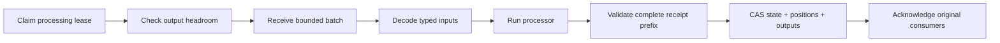

# Managed Stream Processing Stages

`acteon-bus::ManagedStreamStage` coordinates a typed processor with receipt-based
input and a durable checkpoint. Use it for event-time aggregation, classification,
enrichment, or inference that produces state and outbox entries.

The stage owns this sequence:



A processor receives a copy of checkpointed state and decoded inputs. It returns
`StreamStageTransition<S, O>` with new state and `StreamOutboxEntry<O>` outputs.
It cannot acknowledge input or write the checkpoint through this interface.
Deliver external effects through the [managed outbox](managed-stream-outbox.md).

## Source adapters

- `LiveStreamStageSource` wraps native acknowledged subscriptions. Configure one
  `StreamStageSubscription` per logical source, topic, and consumer group.
- `acteon-client::HttpStreamStageSource` wraps public HTTP receipt sessions.
  Enable the Rust client's `stream-processing` feature. Construct each
  `HttpStageSubscription` from a registered manual, receipt-required subscription.

Both constructors are lazy: consumers open when a leased worker receives input.
Standby and backpressured workers therefore do not acquire partitions. Both
adapters validate complete partition prefixes and acknowledge the consumers that
issued the receipts. Recovery creates new receipt capabilities. HTTP session open
request IDs survive ambiguous responses and cancellation; HTTP sessions still
require sticky routing to their owning server.

For HTTP input, `max_batch_records` must accommodate at least one record per
source. Keep processing and receipt lifetimes within Kafka's consumer poll budget
and the server's receipt/session limits.

## Drive a stage

The following shows the composition; `processor` implements
`StreamStageProcessor<Input, State, Output>` and `subscriptions` contains the
registered HTTP subscriptions:

```rust,ignore
use acteon_bus::{ManagedStreamStage, StreamStageConfig, StreamStageSource};
use acteon_client::{HttpStageSubscription, HttpStreamStageSource};
use tokio_util::sync::CancellationToken;

let definitions = subscriptions.iter()
    .map(|(name, subscription)| HttpStageSubscription::new(name.clone(), subscription))
    .collect::<Result<Vec<_>, _>>()?;
let mut source = HttpStreamStageSource::connect(client, definitions)?;
let mut stage = ManagedStreamStage::initialize(
    checkpoint, "worker-1", "processor-v1", source.identity(),
    StreamStageConfig::default(),
).await?;
let cancel = CancellationToken::new();
stage.run(&mut source, &processor, &cancel).await?;
```

`run` manages transient source recovery and sleeps during retries, lease contention,
and backpressure. It closes consumers on exit. `process_once` exposes outcomes for
custom drivers: idle, busy, backpressured, completed, retry scheduled, halted, and
cancelled. Custom drivers must close or recover their source when appropriate.

Initialize an independent checkpoint key for each processing stage. The persisted
policy binds its processor version and source identity; changing either, or the
configuration, is rejected. Include model/question/contract versions in the
processor version when they affect behavior. Migrate deliberately to a new key
rather than silently reinterpreting existing state.

## Bounds, retries, and recovery

`StreamStageConfig` bounds input count and serialized bytes, output count and
serialized bytes, callback duration, source/storage operations, retry attempts,
and backoff. The output high watermark reserves room for a maximum-sized batch
before polling or invoking the processor. It must fit the checkpoint capacity.
The processing lease must exceed the configured operation budget; configure enough
margin for storage contention. A worker whose lease expires cannot publish its
transition over a replacement worker.

Retryable processor failures persist their attempt count, source anchor, diagnostic,
and next-attempt time. Replacement workers retain that budget, including attempts
interrupted by a crash. Permanent processor failures, oversized outputs, and exhausted retry budgets
halt without acknowledging input. Malformed typed payloads and schema violations
halt by default; the opt-in quarantine policy retains them durably. The failed
anchor must reappear in a fresh retry batch; a different batch cannot reset its
budget. [Consume contracts and quarantine](stream-input-contracts.md) add an explicit
policy for retaining rejected inputs before advancing their positions. Processor
failures still use the retry/halt policy.

After a successful state/output checkpoint, failed acknowledgement leaves input
progress durable. Replayed broker positions are acknowledged without invoking the
processor again or emitting its outputs again. An acknowledgement error reports
the durable generation even if diagnostic bookkeeping fails. This coordinates
Kafka and the state store without a distributed transaction.

A callback interrupted **before** its checkpoint may run again. Model requests and
other callback effects therefore remain at least once across that boundary. Use
idempotent/read-only processors and outbox delivery for operational effects.
Cancellation during processing leaves state unadvanced; late cancellation after
processing and receipt validation drains the completed checkpoint and skips input
acknowledgement. Recovery then uses the saved positions.

`metrics().await` reloads durable counters for processing attempts, completed
batches, processed/recovered records, failures, retries, lease recovery,
acknowledgement failures, and completed-callback elapsed time. It also reports current
lease, retry, halt, generation, and output backlog information. The tenant-scoped
[operator HTTP APIs](stream-input-contracts.md#operator-http-apis) expose these
metrics, quarantine inspection/discard, and audited repair requests. Inspection
and enqueueing a repair do not acquire a processing lease
or connect to Kafka. The worker executes repairs under the existing lease; the
Rust SDK also supports these operations.

See the [cascading observability guide](../guides/neural-observability-detector.md)
for a real multi-source Kafka/Redis simulation using this stage and local Laya.
