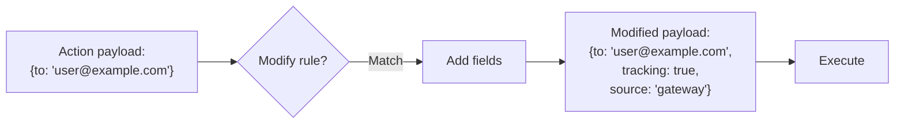

# Payload Modification

Payload modification transforms an action's payload before it reaches the provider. Use it for enrichment, normalization, redaction, or adding tracking metadata.

## How It Works



The modification rule adds or overwrites fields in the action's payload. The modified payload is what the provider receives.

## Rule Configuration

```yaml title="rules/modify.yaml"
rules:
  - name: add-tracking
    priority: 10
    description: "Add tracking metadata to all email actions"
    condition:
      field: action.action_type
      eq: "send_email"
    action:
      type: modify
      changes:
        tracking_enabled: true
        source: "acteon-gateway"
        version: "1.0"
```

### Parameters

| Parameter | Type | Required | Description |
|-----------|------|----------|-------------|
| `changes` | object | Yes | Key-value pairs to add/overwrite in the payload |

## Common Patterns

### Add Tracking Metadata

```yaml
- name: add-tracking
  condition:
    field: action.provider
    eq: "email"
  action:
    type: modify
    changes:
      tracking_enabled: true
      gateway_processed: true
      processed_by: "acteon"
```

### Normalize Fields

```yaml
- name: normalize-priority
  condition:
    field: action.payload.priority
    eq: "p1"
  action:
    type: modify
    changes:
      priority: "critical"
      priority_numeric: 1
```

### Enrich with Context

```yaml
- name: enrich-alerts
  condition:
    field: action.action_type
    eq: "alert"
  action:
    type: modify
    changes:
      environment: "production"
      region: "us-east-1"
      team: "platform"
```

## Combining with Other Rules

Modification rules can work alongside other rules. Since rules are evaluated by priority, you can modify the payload before other rules evaluate it:

```yaml
rules:
  # Priority 1: Modify first
  - name: add-tracking
    priority: 1
    condition:
      field: action.action_type
      eq: "send_email"
    action:
      type: modify
      changes:
        tracking_enabled: true

  # Priority 10: Then deduplicate
  - name: dedup-emails
    priority: 10
    condition:
      field: action.action_type
      eq: "send_email"
    action:
      type: deduplicate
      ttl_seconds: 300
```

## Response

Modified actions that execute successfully return a normal `Executed` outcome. The modification itself is transparent to the client — it only affects what the provider receives.

```json
{
  "outcome": "executed",
  "response": {
    "status": "success",
    "body": {"sent": true}
  }
}
```

The audit trail records that the action was modified, including which rule applied.
