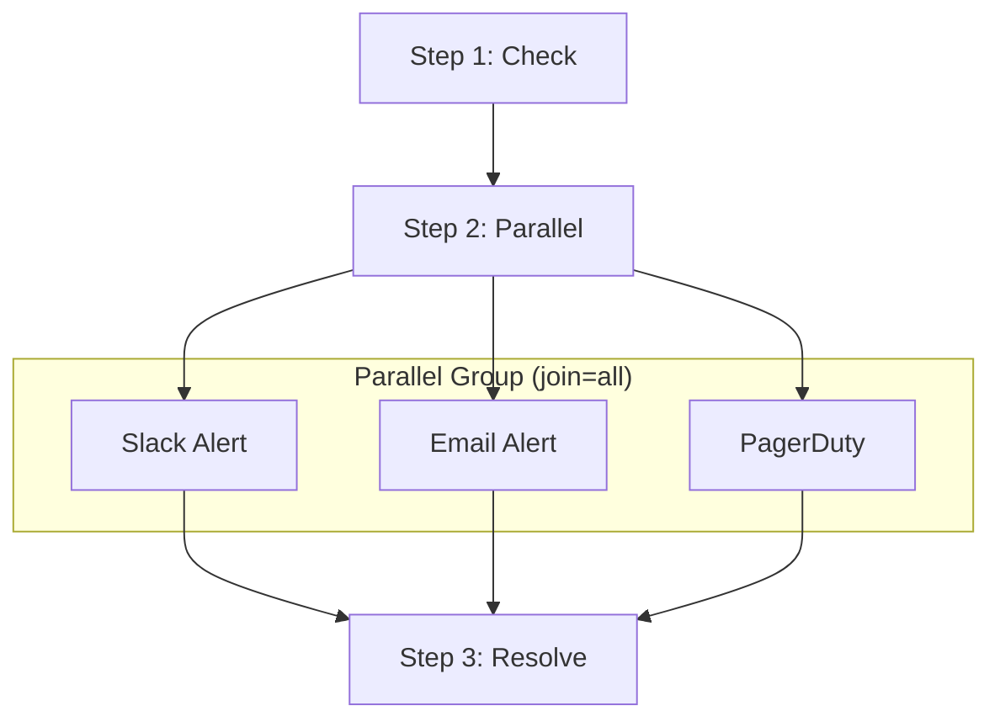

# Parallel Steps (Fan-out / Fan-in)

Parallel steps let a chain step fan out to multiple sub-steps that execute concurrently, then join the results before continuing. Use cases include simultaneous notifications (Slack + email + PagerDuty), parallel data enrichment, and scatter-gather patterns.

## How It Works



1. The chain reaches a parallel step
2. All sub-steps execute concurrently via the configured providers
3. Results are collected according to the **join policy**
4. If the group succeeds, the chain continues; if it fails, the chain's failure policy applies
5. Sub-step results are accessible via `{{steps.NAME.*}}` templates in subsequent steps

## Configuration

### TOML

```toml title="acteon.toml"
[[chains]]
name = "incident-response"
timeout_seconds = 3600

[[chains.steps]]
name = "check-severity"
provider = "monitoring-api"
action_type = "get_severity"

[[chains.steps]]
name = "notify-all"

[chains.steps.parallel]
join = "all"
on_failure = "fail_fast"
timeout_seconds = 30

[[chains.steps.parallel.steps]]
name = "slack-alert"
provider = "slack"
action_type = "post_message"
payload_template = { text = "Alert: {{origin.payload.alert_name}}" }

[[chains.steps.parallel.steps]]
name = "email-alert"
provider = "email"
action_type = "send"
payload_template = { subject = "Alert", body = "{{origin.payload.alert_name}}" }

[[chains.steps.parallel.steps]]
name = "page-oncall"
provider = "pagerduty"
action_type = "create_incident"
payload_template = { urgency = "high" }

[[chains.steps]]
name = "resolve"
provider = "ticketing"
action_type = "close_ticket"
```

### Programmatic (Rust)

```rust
use acteon_core::chain::{
    ChainConfig, ChainStepConfig, ParallelStepGroup,
    ParallelJoinPolicy, ParallelFailurePolicy,
};

let chain = ChainConfig::new("incident-response")
    .with_step(ChainStepConfig::new(
        "check-severity", "monitoring-api", "get_severity",
        serde_json::json!({}),
    ))
    .with_step(ChainStepConfig::new_parallel(
        "notify-all",
        ParallelStepGroup {
            steps: vec![
                ChainStepConfig::new(
                    "slack-alert", "slack", "post_message",
                    serde_json::json!({"text": "Alert fired"}),
                ),
                ChainStepConfig::new(
                    "email-alert", "email", "send",
                    serde_json::json!({"subject": "Alert"}),
                ),
                ChainStepConfig::new(
                    "page-oncall", "pagerduty", "create_incident",
                    serde_json::json!({"urgency": "high"}),
                ),
            ],
            join: ParallelJoinPolicy::All,
            on_failure: ParallelFailurePolicy::FailFast,
            timeout_seconds: Some(30),
        },
    ))
    .with_step(ChainStepConfig::new(
        "resolve", "ticketing", "close_ticket",
        serde_json::json!({}),
    ))
    .with_timeout(3600);
```

## Parallel Step Parameters

| Parameter | Type | Required | Description |
|-----------|------|----------|-------------|
| `name` | string | Yes | Parent step identifier |
| `parallel.steps` | array | Yes | Sub-steps to execute concurrently (at least 1) |
| `parallel.join` | string | No | Join policy: `"all"` (default) or `"any"` |
| `parallel.on_failure` | string | No | Failure policy: `"fail_fast"` (default) or `"best_effort"` |
| `parallel.timeout_seconds` | u64 | No | Timeout for the entire parallel group (default: 300s) |
| `branches` | array | No | Branch conditions evaluated on the merged result |
| `default_next` | string | No | Default next step when no branch matches |

!!! note
    `parallel`, `provider`, and `sub_chain` are mutually exclusive on a step.

## Join Policies

### `all` (default)

Waits for every sub-step to complete. The parent step succeeds only if **all** sub-steps succeed.

### `any`

Returns as soon as the **first** sub-step succeeds. Remaining sub-steps are cancelled. The parent step fails only if every sub-step fails.

## Failure Policies

### `fail_fast` (default)

Cancels remaining sub-steps on the first failure. Combined with `join: "all"`, the chain fails immediately when any sub-step fails.

### `best_effort`

Runs all sub-steps regardless of individual failures. Results are collected for all sub-steps before the join policy is evaluated.

## Result Access

After a parallel step completes, sub-step results are available in two ways:

### By Name (`{{steps.NAME.*}}`)

Individual sub-step results are stored and accessible by name in subsequent steps:

```toml
[[chains.steps]]
name = "summary"
provider = "slack"
action_type = "post_message"
payload_template = { text = "Risk={{steps.enrich.body.risk_score}} Owner={{steps.lookup.body.owner}}" }
```

### Merged Parent Result (`{{prev.*}}`)

The parent parallel step's result body is a JSON object keyed by sub-step name:

```json
{
  "enrich": { "risk_score": 85 },
  "lookup": { "owner": "team-infra" }
}
```

`{{prev.body.enrich.risk_score}}` resolves to `85`.

## Branching After Parallel Steps

Branches are supported on the **parent** parallel step (not on individual sub-steps). The branch condition evaluates the merged result body:

```toml
[[chains.steps]]
name = "gather"

[chains.steps.parallel]
join = "all"

[[chains.steps.parallel.steps]]
name = "severity-check"
provider = "checker"
action_type = "check"

[[chains.steps.branches]]
field = "body.severity-check.severity"
operator = "eq"
value = "critical"
target = "escalate"

[chains.steps]
default_next = "log-only"
```

## Timeout

Each parallel group has an optional `timeout_seconds`. If the group does not complete within this window, all remaining sub-steps are cancelled and the parent step is marked as failed.

The effective timeout is bounded by the chain-level `timeout_seconds` as well.

## DAG Visualization

The DAG API represents parallel steps as nodes with `parallel_children`:

```json
{
  "name": "notify-all",
  "node_type": "parallel",
  "parallel_join": "all",
  "parallel_children": [
    { "name": "slack-alert", "node_type": "step", "provider": "slack", "status": "completed" },
    { "name": "email-alert", "node_type": "step", "provider": "email", "status": "completed" },
    { "name": "page-oncall", "node_type": "step", "provider": "pagerduty", "status": "running" }
  ]
}
```

The Admin UI renders parallel groups as side-by-side nodes with a join policy badge.

## V1 Restrictions

- **No nested parallel**: A parallel sub-step cannot itself contain a `parallel` group
- **No sub-chains in parallel**: Sub-steps cannot invoke `sub_chain`
- **No branching on sub-steps**: Individual sub-steps cannot have `branches`; branching is only supported on the parent parallel step

These restrictions may be relaxed in future versions.

## See Also

- [Task Chains](chains.md) — base chain concepts, configuration, and failure policies
- [Sub-Chains](sub-chains.md) — invoking chains from within chains
