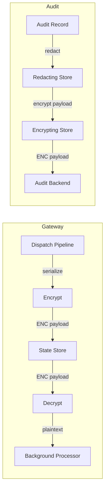

# Payload Encryption at Rest

Payload encryption protects sensitive action data stored in state and audit backends. When enabled, Acteon uses AES-256-GCM to encrypt action payloads before writing them to any backend and decrypts them transparently on read. This guards against database compromise, backup exposure, and unauthorized access to stored data.

## How It Works

Encryption happens at the gateway level, sitting between the application logic and the storage backends:



- **State store**: Scheduled actions, chain state, approval records, recurring actions, state machine entries (EventState, ActiveEvents, EventTimeout), and group metadata (including full event payloads and labels) are encrypted before `state.set()` and decrypted after `state.get()`.
- **Dead-letter queue**: The `EncryptingDeadLetterSink` wrapper encrypts action payloads before they enter the DLQ and decrypts them on drain. This applies to both in-memory and any future persistent DLQ backends.
- **Audit trail**: The `action_payload` field is encrypted; all other audit fields (namespace, tenant, outcome, timestamps) remain in plaintext so they are queryable.
- **Non-payload keys** (dedup markers, counters, locks, rate limits, indices, PendingGroups timestamps) are **not** encrypted -- they contain no sensitive payload data.
- **Providers** are unaffected -- they always receive plaintext payloads over HTTPS.

## Enabling Encryption

### 1. Generate an encryption key

The key must be a 64-character hex string (32 bytes, suitable for AES-256):

```bash
openssl rand -hex 32
# Example output: a1b2c3d4e5f6...  (64 hex characters)
```

### 2. Set the environment variable

**Single key (simple setup):**

```bash
export ACTEON_PAYLOAD_KEY="a1b2c3d4e5f6..."  # your 64-char hex key
```

**Multiple keys (key rotation):**

```bash
# First key encrypts, all keys decrypt. Format: kid:hex,kid:hex,...
export ACTEON_PAYLOAD_KEYS="k2:a1b2c3d4e5f6...,k1:f6e5d4c3b2a1..."
```

This is a **separate key** from `ACTEON_AUTH_KEY` (used for auth config encryption). They have different lifecycles and rotation needs.

### 3. Enable in configuration

```toml
[encryption]
enabled = true
```

If `encryption.enabled = true` but neither `ACTEON_PAYLOAD_KEY` nor `ACTEON_PAYLOAD_KEYS` is set, the server will fail to start with a clear error message.

## Key Rotation

Acteon supports seamless key rotation without downtime or data migration:

1. **Generate a new key**: `openssl rand -hex 32`
2. **Update the environment variable** to include both keys (new key first):
   ```bash
   export ACTEON_PAYLOAD_KEYS="k2:<new-key-hex>,k1:<old-key-hex>"
   ```
3. **Restart the server**. New data is encrypted with `k2`; old data encrypted with `k1` remains readable.
4. **Optionally remove the old key** once all stored data has been re-encrypted (e.g., after TTL expiration or a manual migration).

### Envelope Format

Encrypted values include a key identifier (`kid`) in the envelope:

```
ENC[AES256-GCM,kid:k2,data:<base64>,iv:<base64>,tag:<base64>]
```

Legacy envelopes without `kid` (created before key rotation was available) are handled by trying all configured keys in order.

### How Decryption Works

1. Extract `kid` from the `ENC[...]` envelope.
2. If `kid` matches a configured key, use that key directly.
3. If `kid` is not found (or missing in a legacy envelope), try all keys in order.
4. If no key can decrypt the data, return an error.

## Backward Compatibility

Encryption is **fully backward compatible**:

- **Existing unencrypted data** is readable after enabling encryption. The decryption layer detects whether a value is encrypted (matches `ENC[...]` pattern) and passes through plaintext values unchanged.
- **Legacy single-key envelopes** (without `kid`) are decryptable when the same key is included in `ACTEON_PAYLOAD_KEYS`.
- **Disabling encryption** after it was enabled means newly written values will be plaintext, but previously encrypted values will fail to decrypt (the key is no longer available). To safely disable, first re-encrypt all stored data as plaintext.
- **No SDK changes needed** -- encryption is server-side only. Clients send and receive plaintext payloads over HTTPS.

## Interaction with Redaction

When both redaction and encryption are enabled for audit records, the wrapping order is:

```
EncryptingAuditStore(RedactingAuditStore(InnerStore))
```

This means:
1. The raw audit record enters the pipeline
2. Redaction runs first on the plaintext payload (replacing sensitive fields with `***`)
3. The redacted payload is then encrypted before storage

On read, the reverse happens: decrypt first, then the caller sees the redacted plaintext.

## Configuration Reference

| Setting | Type | Default | Description |
|---------|------|---------|-------------|
| `encryption.enabled` | bool | `false` | Enable payload encryption at rest |
| `ACTEON_PAYLOAD_KEY` (env) | string | -- | 64-char hex AES-256 key (single-key mode) |
| `ACTEON_PAYLOAD_KEYS` (env) | string | -- | Comma-separated `kid:hex` pairs (multi-key rotation mode) |
