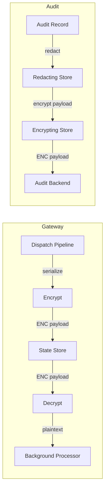

# Payload Encryption at Rest

Payload encryption protects sensitive action data stored in state and audit backends. When enabled, Acteon uses AES-256-GCM to encrypt action payloads before writing them to any backend and decrypts them transparently on read. This guards against database compromise, backup exposure, and unauthorized access to stored data.

## How It Works

Encryption happens at the gateway level, sitting between the application logic and the storage backends:



- **State store**: Scheduled actions, chain state, approval records, and recurring actions are encrypted before `state.set()` and decrypted after `state.get()`.
- **Audit trail**: The `action_payload` field is encrypted; all other audit fields (namespace, tenant, outcome, timestamps) remain in plaintext so they are queryable.
- **Non-payload keys** (dedup markers, counters, locks, rate limits, indices) are **not** encrypted -- they contain no sensitive payload data.
- **Providers** are unaffected -- they always receive plaintext payloads over HTTPS.

## Enabling Encryption

### 1. Generate an encryption key

The key must be a 64-character hex string (32 bytes, suitable for AES-256):

```bash
openssl rand -hex 32
# Example output: a1b2c3d4e5f6...  (64 hex characters)
```

### 2. Set the environment variable

```bash
export ACTEON_PAYLOAD_KEY="a1b2c3d4e5f6..."  # your 64-char hex key
```

This is a **separate key** from `ACTEON_AUTH_KEY` (used for auth config encryption). They have different lifecycles and rotation needs.

### 3. Enable in configuration

```toml
[encryption]
enabled = true
```

If `encryption.enabled = true` but `ACTEON_PAYLOAD_KEY` is not set, the server will fail to start with a clear error message.

## Envelope Format

Encrypted values use the same `ENC[AES256-GCM,data:<base64>,iv:<base64>,tag:<base64>]` envelope format used elsewhere in Acteon. This makes encrypted values easily identifiable in database dumps or backups.

## Backward Compatibility

Encryption is **fully backward compatible**:

- **Existing unencrypted data** is readable after enabling encryption. The decryption layer detects whether a value is encrypted (matches `ENC[...]` pattern) and passes through plaintext values unchanged.
- **Disabling encryption** after it was enabled means newly written values will be plaintext, but previously encrypted values will fail to decrypt (the key is no longer available). To safely disable, first re-encrypt all stored data as plaintext.
- **No SDK changes needed** -- encryption is server-side only. Clients send and receive plaintext payloads over HTTPS.

## Interaction with Redaction

When both redaction and encryption are enabled for audit records, the wrapping order is:

```
EncryptingAuditStore(RedactingAuditStore(InnerStore))
```

This means:
1. The raw audit record enters the pipeline
2. Redaction runs first on the plaintext payload (replacing sensitive fields with `***`)
3. The redacted payload is then encrypted before storage

On read, the reverse happens: decrypt first, then the caller sees the redacted plaintext.

## Limitations

- **No key rotation (v1)**: Changing `ACTEON_PAYLOAD_KEY` requires re-encrypting all stored data. This is documented as a known limitation for the initial release.
- **Field-level queries on payload**: Since the entire payload is encrypted, you cannot query or filter by payload fields in the state store. Audit queries on non-payload fields (namespace, tenant, outcome, etc.) work normally.
- **Performance**: Encryption adds a small per-operation overhead (AES-256-GCM is hardware-accelerated on modern CPUs). In benchmarks, the overhead is negligible compared to network I/O.

## Configuration Reference

| Setting | Type | Default | Description |
|---------|------|---------|-------------|
| `encryption.enabled` | bool | `false` | Enable payload encryption at rest |
| `ACTEON_PAYLOAD_KEY` (env) | string | -- | 64-char hex AES-256 key (required when enabled) |
