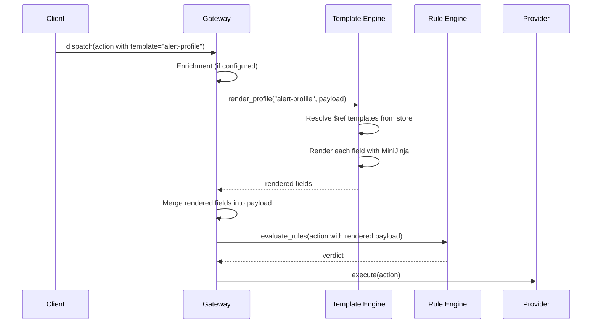

# Payload Templates

Payload templates let you define reusable, parameterized content that is
rendered into action payloads at dispatch time. Instead of hard-coding email
bodies, Slack messages, or webhook payloads in every dispatch call, you store
templates once and reference them by name. The gateway renders templates using
`MiniJinja` (a Jinja2-compatible engine) with the action payload as variables,
then merges the results back into the payload before rule evaluation.

Use cases include:

- **Consistent notification content** -- define email subject/body templates that all services share
- **Multi-channel formatting** -- one profile for Slack (Markdown), another for email (HTML), both referencing the same data
- **Dynamic content** -- loops, conditionals, and filters produce rich output from structured payload data
- **Separation of concerns** -- developers dispatch actions with raw data; operations teams manage the presentation layer

## How It Works



When the gateway encounters an action whose `template` field is set, it looks
up the matching template profile, renders every field mapping against the
action payload, and merges the rendered strings back into the payload. This
happens **after enrichment** and **before rule evaluation**, so rules see the
fully rendered payload.

## Two-Layer Model

Payload templates use a two-layer architecture:

### Templates (Layer 1 -- Pure Text)

A **template** is a named blob of `MiniJinja` text stored in the system. It
contains the raw template content with variable placeholders, loops,
conditionals, and filters. Templates are scoped to a namespace + tenant pair.

```json
{
  "name": "welcome-email-body",
  "namespace": "notifications",
  "tenant": "tenant-1",
  "content": "<html><body><h1>Welcome, {{ user_name }}!</h1><p>Thanks for joining {{ company }}.</p></body></html>",
  "description": "HTML body for the welcome email"
}
```

### Profiles (Layer 2 -- Field Wiring)

A **template profile** maps target payload field names to template content.
Each field is either an **inline** `MiniJinja` literal or a **`$ref`** to a
stored template by name. Profiles are also scoped to a namespace + tenant pair.

```json
{
  "name": "welcome-profile",
  "namespace": "notifications",
  "tenant": "tenant-1",
  "fields": {
    "subject": "Welcome, {{ user_name }}!",
    "body": { "$ref": "welcome-email-body" }
  }
}
```

When an action sets `"template": "welcome-profile"`, the gateway:

1. Looks up the profile `welcome-profile` in the same namespace + tenant scope
2. For the `subject` field -- renders the inline literal using the action payload
3. For the `body` field -- loads the stored template `welcome-email-body` and renders its content
4. Merges both rendered strings into the action payload as `payload.subject` and `payload.body`

This separation means you can reuse the same template across multiple profiles,
update template content without touching profiles, and mix inline and stored
content freely.

## MiniJinja Syntax

Templates use [MiniJinja](https://github.com/mitsuhiko/minijinja) syntax,
which is compatible with Jinja2/Nunjucks. The action payload is available as
the top-level context, so `{{ field }}` accesses `payload.field`.

### Variables

```
Hello {{ name }}, your order #{{ order_id }} is {{ status }}.
```

Nested objects are accessed with dot notation:

```
{{ user.name }} ({{ user.email }})
```

Missing variables render as empty strings by default (no error).

### Conditionals

```
URGENT: {{ message }}
```

```

  [CRITICAL] {{ title }}

  [WARN] {{ title }}

  [INFO] {{ title }}

```

### Loops

```
Affected hosts:

  - {{ host.name }} ({{ host.ip }})

```

Loop variables are available inside the block:

```
{{ item }}, 
```

### Filters

`MiniJinja` provides built-in filters:

```
{{ name | upper }}
{{ description | truncate(100) }}
{{ items | join(", ") }}
{{ payload | tojson }}
{{ timestamp | default("N/A") }}
```

### Whitespace Control

Use `-` to strip whitespace around blocks:

```

  {{ message }}

```

## Creating Templates via API

### `POST /v1/templates` -- Create a Template

```bash
curl -X POST http://localhost:8080/v1/templates \
  -H "Content-Type: application/json" \
  -d '{
    "name": "alert-body",
    "namespace": "monitoring",
    "tenant": "ops-team",
    "content": "<h1>{{ title }}</h1><p>Severity: {{ severity }}</p><p>{{ message }}</p><p><a href=\"{{ runbook_url }}\">Runbook</a></p>",
    "description": "HTML body for alert emails"
  }'
```

**Response (201):**

```json
{
  "id": "a1b2c3d4-...",
  "name": "alert-body",
  "namespace": "monitoring",
  "tenant": "ops-team",
  "content": "<h1>{{ title }}</h1>...",
  "description": "HTML body for alert emails",
  "created_at": "2026-02-19T10:00:00Z",
  "updated_at": "2026-02-19T10:00:00Z"
}
```

The server validates:

- **Name**: 1-128 characters, alphanumeric plus `-`, `_`, `.`
- **Content size**: Maximum 512 KB
- **Syntax**: The content must be valid `MiniJinja` syntax (missing variables are allowed, but syntax errors are rejected)

### `GET /v1/templates` -- List Templates

```bash
curl "http://localhost:8080/v1/templates?namespace=monitoring&tenant=ops-team"
```

### `PUT /v1/templates/{id}` -- Update a Template

```bash
curl -X PUT http://localhost:8080/v1/templates/a1b2c3d4-... \
  -H "Content-Type: application/json" \
  -d '{
    "content": "<h1>{{ title }} [{{ severity | upper }}]</h1><p>{{ message }}</p>"
  }'
```

### `DELETE /v1/templates/{id}` -- Delete a Template

Returns 409 Conflict if any profile references the template. Remove or update
the referencing profiles first.

```bash
curl -X DELETE http://localhost:8080/v1/templates/a1b2c3d4-...
```

## Creating Profiles via API

### `POST /v1/templates/profiles` -- Create a Profile

Profiles support two field types: **inline** (a plain string) and **`$ref`**
(a JSON object pointing to a stored template).

```bash
curl -X POST http://localhost:8080/v1/templates/profiles \
  -H "Content-Type: application/json" \
  -d '{
    "name": "alert-email-profile",
    "namespace": "monitoring",
    "tenant": "ops-team",
    "fields": {
      "subject": "[{{ severity | upper }}] {{ title }}",
      "body": { "$ref": "alert-body" },
      "footer": "Sent by Acteon at {{ now | default(\"unknown\") }}"
    },
    "description": "Maps email fields for alert notifications"
  }'
```

**Response (201):**

```json
{
  "id": "e5f6g7h8-...",
  "name": "alert-email-profile",
  "namespace": "monitoring",
  "tenant": "ops-team",
  "fields": {
    "subject": "[{{ severity | upper }}] {{ title }}",
    "body": { "$ref": "alert-body" },
    "footer": "Sent by Acteon at {{ now | default(\"unknown\") }}"
  },
  "description": "Maps email fields for alert notifications",
  "created_at": "2026-02-19T10:01:00Z",
  "updated_at": "2026-02-19T10:01:00Z"
}
```

The server validates that every `$ref` target exists as a stored template in
the same namespace + tenant scope. Referencing a nonexistent template returns
400 Bad Request.

### `GET /v1/templates/profiles` -- List Profiles

```bash
curl "http://localhost:8080/v1/templates/profiles?namespace=monitoring&tenant=ops-team"
```

### `PUT /v1/templates/profiles/{id}` -- Update a Profile

```bash
curl -X PUT http://localhost:8080/v1/templates/profiles/e5f6g7h8-... \
  -H "Content-Type: application/json" \
  -d '{
    "fields": {
      "subject": "[{{ severity | upper }}] {{ title }} ({{ source }})",
      "body": { "$ref": "alert-body" }
    }
  }'
```

### `DELETE /v1/templates/profiles/{id}` -- Delete a Profile

```bash
curl -X DELETE http://localhost:8080/v1/templates/profiles/e5f6g7h8-...
```

## Dispatching with Templates

Set the `template` field on an action to trigger profile rendering at dispatch
time:

```bash
curl -X POST http://localhost:8080/v1/dispatch \
  -H "Content-Type: application/json" \
  -d '{
    "namespace": "monitoring",
    "tenant": "ops-team",
    "provider": "email",
    "action_type": "send_alert",
    "template": "alert-email-profile",
    "payload": {
      "title": "Database connection pool exhausted",
      "severity": "critical",
      "message": "Connection pool on db-primary-01 reached 100% utilization.",
      "runbook_url": "https://wiki.internal/runbooks/db-pool",
      "to": "oncall@company.com"
    }
  }'
```

After template rendering, the payload delivered to the provider will contain:

```json
{
  "title": "Database connection pool exhausted",
  "severity": "critical",
  "message": "Connection pool on db-primary-01 reached 100% utilization.",
  "runbook_url": "https://wiki.internal/runbooks/db-pool",
  "to": "oncall@company.com",
  "subject": "[CRITICAL] Database connection pool exhausted",
  "body": "<h1>Database connection pool exhausted</h1><p>Severity: critical</p><p>Connection pool on db-primary-01 reached 100% utilization.</p><p><a href=\"https://wiki.internal/runbooks/db-pool\">Runbook</a></p>",
  "footer": "Sent by Acteon at unknown"
}
```

Rendered fields are **merged** into the payload. If a rendered field name
collides with an existing payload key, the rendered value **overwrites** the
original.

## Preview Rendering

Use the render preview endpoint to test template output without dispatching:

### `POST /v1/templates/render` -- Preview Rendering

```bash
curl -X POST http://localhost:8080/v1/templates/render \
  -H "Content-Type: application/json" \
  -d '{
    "profile": "alert-email-profile",
    "namespace": "monitoring",
    "tenant": "ops-team",
    "payload": {
      "title": "Test Alert",
      "severity": "warning",
      "message": "This is a test."
    }
  }'
```

**Response (200):**

```json
{
  "rendered": {
    "subject": "[WARNING] Test Alert",
    "body": "<h1>Test Alert</h1><p>Severity: warning</p><p>This is a test.</p>",
    "footer": "Sent by Acteon at unknown"
  }
}
```

This is useful for validating template output during development, debugging
rendering issues, and building preview UIs.

## Pipeline Position

Template rendering sits at a specific point in the dispatch pipeline:

```
1. Lock acquisition
2a. Quota check
2b. Deduplication check
2c. Enrichment          <-- data is added to the payload
2d. Template rendering  <-- templates are rendered against the enriched payload
3.  Rule evaluation     <-- rules see the fully rendered payload
4.  Provider dispatch
5.  Audit trail
```

This ordering means:

- Enrichment data is available as template variables (e.g., an enrichment that
  adds `{{ region }}` to the payload can be used in templates)
- Rules evaluate against the rendered payload, so you can write rules that
  match on rendered content
- Templates run in dry-run mode too, so rule playground results reflect the
  rendered payload

## API Reference

### Template Endpoints

| Method | Path | Description |
|--------|------|-------------|
| `POST` | `/v1/templates` | Create a new template |
| `GET` | `/v1/templates` | List templates (filterable by namespace and tenant) |
| `GET` | `/v1/templates/{id}` | Get template details |
| `PUT` | `/v1/templates/{id}` | Update a template |
| `DELETE` | `/v1/templates/{id}` | Delete a template (fails if referenced by profiles) |

### Profile Endpoints

| Method | Path | Description |
|--------|------|-------------|
| `POST` | `/v1/templates/profiles` | Create a new profile |
| `GET` | `/v1/templates/profiles` | List profiles (filterable by namespace and tenant) |
| `GET` | `/v1/templates/profiles/{id}` | Get profile details |
| `PUT` | `/v1/templates/profiles/{id}` | Update a profile |
| `DELETE` | `/v1/templates/profiles/{id}` | Delete a profile |

### Preview Endpoint

| Method | Path | Description |
|--------|------|-------------|
| `POST` | `/v1/templates/render` | Render a profile against a test payload |

### Query Parameters (List Endpoints)

| Parameter | Type | Default | Description |
|-----------|------|---------|-------------|
| `namespace` | string | None | Filter by namespace |
| `tenant` | string | None | Filter by tenant |
| `limit` | int | 100 | Maximum results to return |
| `offset` | int | 0 | Number of results to skip |

## Resource Limits

| Limit | Value | Description |
|-------|-------|-------------|
| Template name length | 128 characters | Alphanumeric, hyphens, underscores, dots |
| Template content size | 512 KB | Maximum raw template content |
| Rendered output per field | 1 MB | Maximum rendered string per field |
| MiniJinja fuel limit | 100,000 | Execution steps before forced termination |

The **fuel limit** is a denial-of-service protection that caps the number of
`MiniJinja` execution steps per render operation. A template with an
excessively deep loop or recursive structure will be terminated before it can
consume unbounded CPU. The default of 100,000 is sufficient for all practical
templates.

## Client SDK Usage

### Rust

```rust
use acteon_client::{
    CreateTemplateRequest, CreateProfileRequest, RenderPreviewRequest,
};

let client = ActeonClient::new("http://localhost:8080");

// Create a template
let template = client.create_template(CreateTemplateRequest {
    name: "welcome-body".into(),
    namespace: "notifications".into(),
    tenant: "tenant-1".into(),
    content: "Hello {{ name }}, welcome to {{ company }}!".into(),
    description: Some("Welcome message body".into()),
    labels: None,
}).await?;
println!("Created template: {}", template.id);

// Create a profile
let mut fields = std::collections::HashMap::new();
fields.insert("subject".into(), serde_json::json!("Welcome, {{ name }}!"));
fields.insert("body".into(), serde_json::json!({"$ref": "welcome-body"}));

let profile = client.create_profile(CreateProfileRequest {
    name: "welcome-profile".into(),
    namespace: "notifications".into(),
    tenant: "tenant-1".into(),
    fields,
    description: Some("Welcome email field mappings".into()),
    labels: None,
}).await?;

// Preview rendering
let preview = client.render_preview(RenderPreviewRequest {
    profile: "welcome-profile".into(),
    namespace: "notifications".into(),
    tenant: "tenant-1".into(),
    payload: serde_json::json!({"name": "Alice", "company": "Acme"}),
}).await?;
for (field, value) in &preview.rendered {
    println!("{field}: {value}");
}
```

### Python

```python
from acteon_client import ActeonClient

client = ActeonClient("http://localhost:8080")

# Create a template
template = client.create_template(
    name="welcome-body",
    namespace="notifications",
    tenant="tenant-1",
    content="Hello {{ name }}, welcome to {{ company }}!",
    description="Welcome message body",
)

# Create a profile with inline + $ref fields
profile = client.create_profile(
    name="welcome-profile",
    namespace="notifications",
    tenant="tenant-1",
    fields={
        "subject": "Welcome, {{ name }}!",
        "body": {"$ref": "welcome-body"},
    },
)

# Preview rendering
preview = client.render_preview(
    profile="welcome-profile",
    namespace="notifications",
    tenant="tenant-1",
    payload={"name": "Alice", "company": "Acme"},
)
for field, value in preview.rendered.items():
    print(f"{field}: {value}")
```

### Node.js / TypeScript

```typescript
import { ActeonClient } from "acteon-client";

const client = new ActeonClient("http://localhost:8080");

// Create a template
const template = await client.createTemplate({
  name: "welcome-body",
  namespace: "notifications",
  tenant: "tenant-1",
  content: "Hello {{ name }}, welcome to {{ company }}!",
  description: "Welcome message body",
});

// Create a profile
const profile = await client.createProfile({
  name: "welcome-profile",
  namespace: "notifications",
  tenant: "tenant-1",
  fields: {
    subject: "Welcome, {{ name }}!",
    body: { $ref: "welcome-body" },
  },
});

// Preview rendering
const preview = await client.renderPreview({
  profile: "welcome-profile",
  namespace: "notifications",
  tenant: "tenant-1",
  payload: { name: "Alice", company: "Acme" },
});
Object.entries(preview.rendered).forEach(([field, value]) => {
  console.log(`${field}: ${value}`);
});
```

### Go

```go
client := acteon.NewClient("http://localhost:8080")

// Create a template
template, err := client.CreateTemplate(ctx, acteon.CreateTemplateRequest{
    Name:      "welcome-body",
    Namespace: "notifications",
    Tenant:    "tenant-1",
    Content:   "Hello {{ name }}, welcome to {{ company }}!",
})

// Create a profile
profile, err := client.CreateProfile(ctx, acteon.CreateProfileRequest{
    Name:      "welcome-profile",
    Namespace: "notifications",
    Tenant:    "tenant-1",
    Fields: map[string]any{
        "subject": "Welcome, {{ name }}!",
        "body":    map[string]string{"$ref": "welcome-body"},
    },
})

// Preview rendering
preview, err := client.RenderPreview(ctx, acteon.RenderPreviewRequest{
    Profile:   "welcome-profile",
    Namespace: "notifications",
    Tenant:    "tenant-1",
    Payload:   map[string]any{"name": "Alice", "company": "Acme"},
})
for field, value := range preview.Rendered {
    fmt.Printf("%s: %s\n", field, value)
}
```

### Java

```java
ActeonClient client = new ActeonClient("http://localhost:8080");

// Create a template
TemplateInfo template = client.createTemplate(
    "welcome-body", "notifications", "tenant-1",
    "Hello {{ name }}, welcome to {{ company }}!",
    "Welcome message body"
);

// Create a profile
Map<String, Object> fields = Map.of(
    "subject", "Welcome, {{ name }}!",
    "body", Map.of("$ref", "welcome-body")
);
ProfileInfo profile = client.createProfile(
    "welcome-profile", "notifications", "tenant-1", fields
);

// Preview rendering
RenderPreviewResponse preview = client.renderPreview(
    "welcome-profile", "notifications", "tenant-1",
    Map.of("name", "Alice", "company", "Acme")
);
preview.getRendered().forEach((field, value) ->
    System.out.printf("%s: %s%n", field, value)
);
```

## Error Handling

| Error | HTTP Status | Description |
|-------|-------------|-------------|
| Invalid template name | 400 | Name is empty, too long, or contains invalid characters |
| Content too large | 400 | Template content exceeds 512 KB |
| Syntax error | 400 | `MiniJinja` syntax is invalid (caught at creation time) |
| Duplicate name | 409 | A template/profile with the same name exists in the scope |
| Referenced template not found | 400 | A `$ref` field points to a nonexistent template |
| Template in use | 409 | Cannot delete a template that is referenced by profiles |
| Profile not found at dispatch | 500 | Action references a profile that does not exist (hard error) |
| Render error at dispatch | 500 | Template rendering fails during dispatch (e.g., fuel exhausted) |

## Best Practices

- **Use `$ref` for shared content**: If the same text appears in multiple
  profiles, extract it into a stored template and reference it. Updating the
  template updates all profiles that use it.
- **Keep templates focused**: A template should render one logical unit of
  content (an email body, a Slack message block, a webhook payload field).
  Profiles compose these units into complete payloads.
- **Test with the render preview**: Always preview rendering before deploying a
  new template or profile to catch missing variables and formatting issues.
- **Use filters for safety**: Apply `| default("N/A")` to optional variables
  to avoid empty strings in rendered output.
- **Scope carefully**: Templates and profiles are scoped to namespace + tenant.
  If you need the same template across tenants, create it in each scope.
- **Avoid excessive logic**: Templates are for formatting, not business logic.
  Keep conditionals and loops simple. Complex decision-making belongs in rules.
- **Version via naming**: Use names like `alert-body-v2` to roll out template
  changes gradually. Update profiles to point to the new version when ready.

## Limitations

- **String output only**: Rendered fields are always inserted as JSON strings.
  A template cannot produce a JSON number, boolean, or nested object as its
  output.
- **No cross-scope references**: A profile's `$ref` can only reference
  templates in the same namespace + tenant scope.
- **No template inheritance**: `MiniJinja` `` and ``
  are not supported between stored templates. Each template is rendered
  independently.
- **Payload must be a JSON object**: Template rendering requires the action
  payload to be a JSON object (not an array or scalar). Non-object payloads
  cause a render error.
- **No async data fetching**: Templates cannot fetch external data. Use
  enrichments for that, then reference the enriched data in templates.
