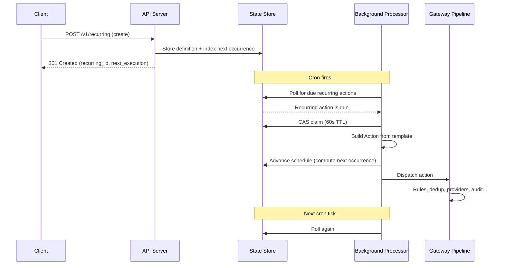

# Recurring Actions

Recurring actions let you define an action that fires on a cron schedule. Acteon stores the definition and dispatches the action automatically at each scheduled occurrence. This is useful for:

- **Daily digests** -- send a summary email to your team every morning at 9 AM
- **Periodic health checks** -- ping a service endpoint every hour
- **Weekly reports** -- generate and deliver a weekly metrics report every Monday
- **Business-hours notifications** -- send alerts only during working hours on weekdays

## How It Works

Unlike [scheduled actions](scheduled-actions.md), which delay a single dispatch, recurring actions are persistent definitions that fire repeatedly on a cron schedule. They are API-only entities -- you create them via the REST API, not through rules.



Each occurrence synthesizes a concrete `Action` from the stored template and dispatches it through the normal gateway pipeline. All existing features -- rules, deduplication, circuit breakers, LLM guardrails, audit -- apply to every occurrence.

## Concepts

### Cron Expressions

Recurring actions use standard 5-field cron expressions:

```
 ┌───────────── minute (0-59)
 │ ┌───────────── hour (0-23)
 │ │ ┌───────────── day of month (1-31)
 │ │ │ ┌───────────── month (1-12)
 │ │ │ │ ┌───────────── day of week (0-7, MON-SUN)
 │ │ │ │ │
 * * * * *
```

**Common patterns:**

| Expression | Description |
|------------|-------------|
| `*/5 * * * *` | Every 5 minutes |
| `0 * * * *` | Every hour, on the hour |
| `0 9 * * *` | Daily at 9:00 AM |
| `0 9 * * MON-FRI` | Weekdays at 9:00 AM |
| `0 9-17 * * 1-5` | Every hour during business hours (9-17, weekdays) |
| `0 9 * * 1` | Every Monday at 9:00 AM |
| `0 9 1 * *` | First day of every month at 9:00 AM |
| `0 0 * * *` | Daily at midnight |
| `30 4 * * SUN` | Every Sunday at 4:30 AM |
| `0 8 1 1,4,7,10 *` | Quarterly on the 1st at 8:00 AM |

Acteon uses the `croner` library for cron parsing, which supports standard 5-field expressions as well as extended 6-field (with seconds) and 7-field (with years) formats.

### Timezone Handling

Every recurring action has a `timezone` field (defaults to `UTC`). The cron expression is evaluated in the specified IANA timezone, which means DST transitions are handled automatically.

For example, a recurring action with `cron_expr: "0 9 * * *"` and `timezone: "US/Eastern"` fires at 9:00 AM Eastern time year-round -- at 14:00 UTC during EST and 13:00 UTC during EDT.

Valid timezone values include any IANA timezone identifier: `UTC`, `US/Eastern`, `US/Pacific`, `Europe/London`, `Europe/Berlin`, `Asia/Tokyo`, `Australia/Sydney`, etc.

### Execution Guarantees

- **At-most-once per occurrence**: Each cron tick is dispatched at most once, even in multi-instance deployments. A distributed CAS (compare-and-swap) claim with a 60-second TTL prevents duplicate dispatches.
- **No backfill**: If the server is down and misses N occurrences, only the **next future occurrence** is scheduled when the processor restarts. This prevents a storm of catch-up dispatches.
- **Error isolation**: If a dispatch fails, the recurring action remains active for the next tick. Failed occurrences are not retried.

### Lifecycle

Recurring actions have three states:

| State | `enabled` | `next_execution_at` | Description |
|-------|-----------|---------------------|-------------|
| **Active** | `true` | Set | Normal operation -- will fire at the next scheduled time |
| **Paused** | `false` | `null` | Suspended -- will not fire until resumed |
| **Completed** | `true` | `null` | Finished -- the `ends_at` date has passed or the cron expression has no future occurrences |

Transitions:

- **Active -> Paused**: Call `POST /v1/recurring/{id}/pause`
- **Paused -> Active**: Call `POST /v1/recurring/{id}/resume` (recomputes next occurrence from now)
- **Active -> Completed**: Automatic when `ends_at` is reached

### Minimum Interval

To prevent runaway schedules, Acteon enforces a minimum interval of **60 seconds** between consecutive occurrences. A cron expression that fires more frequently (e.g., every second) is rejected at creation time.

## Quick Start

Create your first recurring action with curl:

```bash
# Create a daily digest email
curl -X POST http://localhost:8080/v1/recurring \
  -H "Content-Type: application/json" \
  -d '{
    "namespace": "notifications",
    "tenant": "acme",
    "cron_expr": "0 9 * * MON-FRI",
    "timezone": "US/Eastern",
    "provider": "email",
    "action_type": "send_digest",
    "payload": {
      "to": "team@example.com",
      "subject": "Daily Digest",
      "template": "morning-digest"
    },
    "description": "Weekday morning digest"
  }'
```

Response:

```json
{
  "recurring_id": "019462a1-7b3e-7f00-a123-456789abcdef",
  "next_execution": "2026-02-10T14:00:00Z",
  "cron_expr": "0 9 * * MON-FRI",
  "timezone": "US/Eastern",
  "enabled": true
}
```

The action will fire every weekday at 9:00 AM Eastern. Each occurrence dispatches an email through the configured `email` provider.

## API Reference

All endpoints live under `/v1/recurring`. Namespace and tenant are provided as query parameters.

### `POST /v1/recurring` -- Create

Create a new recurring action definition.

**Request body:**

```json
{
  "namespace": "notifications",
  "tenant": "tenant-1",
  "cron_expr": "0 9 * * MON-FRI",
  "timezone": "US/Eastern",
  "provider": "email",
  "action_type": "send_digest",
  "payload": {"to": "team@example.com", "subject": "Daily Digest"},
  "metadata": {"source": "scheduler"},
  "dedup_key": "digest-{{recurring_id}}-{{execution_time}}",
  "description": "Weekday morning digest",
  "labels": {"team": "engineering"},
  "ends_at": "2026-12-31T23:59:59Z",
  "enabled": true
}
```

| Field | Type | Required | Description |
|-------|------|----------|-------------|
| `namespace` | string | Yes | Namespace for the recurring action |
| `tenant` | string | Yes | Tenant that owns this recurring action |
| `cron_expr` | string | Yes | Standard 5-field cron expression |
| `timezone` | string | No | IANA timezone (default: `"UTC"`) |
| `provider` | string | Yes | Target provider (e.g., `"email"`, `"webhook"`) |
| `action_type` | string | Yes | Action type discriminator |
| `payload` | object | Yes | JSON payload for the provider |
| `metadata` | object | No | Key-value metadata merged into each dispatch |
| `dedup_key` | string | No | Dedup key template (supports `{{recurring_id}}`, `{{execution_time}}`) |
| `description` | string | No | Human-readable description |
| `labels` | object | No | Arbitrary key-value labels for filtering |
| `ends_at` | string | No | RFC 3339 timestamp after which the action auto-disables |
| `enabled` | bool | No | Whether to start active (default: `true`) |

**Response (201):**

```json
{
  "recurring_id": "uuid-...",
  "next_execution": "2026-02-10T14:00:00Z",
  "cron_expr": "0 9 * * MON-FRI",
  "timezone": "US/Eastern",
  "enabled": true
}
```

**Validation errors (400):**

| Condition | Error message |
|-----------|--------------|
| Invalid cron expression | `"invalid cron expression: ..."` |
| Invalid timezone | `"invalid timezone: ..."` |
| Interval too short | `"cron interval too short: Ns between occurrences, minimum is 60s"` |
| Empty `provider` or `action_type` | `"provider must be non-empty"` / `"action_type must be non-empty"` |
| `ends_at` in the past | `"ends_at must be in the future"` |

### `GET /v1/recurring` -- List

List all recurring actions for a namespace and tenant.

**Query parameters:**

| Parameter | Type | Required | Description |
|-----------|------|----------|-------------|
| `namespace` | string | Yes | Filter by namespace |
| `tenant` | string | Yes | Filter by tenant |
| `enabled` | bool | No | Filter by enabled status |

**Response (200):**

```json
{
  "recurring_actions": [
    {
      "id": "uuid-...",
      "cron_expr": "0 9 * * MON-FRI",
      "timezone": "US/Eastern",
      "enabled": true,
      "description": "Weekday morning digest",
      "provider": "email",
      "action_type": "send_digest",
      "next_execution_at": "2026-02-10T14:00:00Z",
      "last_executed_at": "2026-02-07T14:00:00Z",
      "execution_count": 42,
      "created_at": "2026-01-01T00:00:00Z",
      "labels": {"team": "engineering"}
    }
  ]
}
```

### `GET /v1/recurring/{id}` -- Get Detail

Retrieve the full definition of a recurring action.

**Query parameters:** `namespace`, `tenant`

**Response (200):** Full `RecurringAction` object including all fields.

**Response (404):** `{"error": "recurring action not found"}`

### `PUT /v1/recurring/{id}` -- Update

Update an existing recurring action. Only provided fields are changed.

**Query parameters:** `namespace`, `tenant`

**Request body (partial):**

```json
{
  "cron_expr": "0 8 * * MON-FRI",
  "timezone": "US/Pacific",
  "description": "Updated to 8 AM Pacific"
}
```

Updatable fields: `cron_expr`, `timezone`, `enabled`, `provider`, `action_type`, `payload`, `metadata`, `dedup_key`, `description`, `labels`, `ends_at`.

If `cron_expr` or `timezone` is changed, `next_execution_at` is recomputed automatically.

**Response (200):** Updated `RecurringAction` object.

### `DELETE /v1/recurring/{id}` -- Delete

Permanently delete a recurring action and all associated state.

**Query parameters:** `namespace`, `tenant`

**Response (204):** No content.

### `POST /v1/recurring/{id}/pause` -- Pause

Suspend a recurring action. It will not fire until resumed.

**Query parameters:** `namespace`, `tenant`

**Response (200):**

```json
{
  "id": "uuid-...",
  "enabled": false,
  "next_execution_at": null
}
```

### `POST /v1/recurring/{id}/resume` -- Resume

Resume a paused recurring action. The next occurrence is computed from the current time.

**Query parameters:** `namespace`, `tenant`

**Response (200):**

```json
{
  "id": "uuid-...",
  "enabled": true,
  "next_execution_at": "2026-02-10T14:00:00Z"
}
```

### `GET /v1/recurring/{id}/history` -- Execution History

!!! note
    Execution history is planned for a future release.

## Cron Expression Reference

### Syntax

| Field | Allowed values | Special characters |
|-------|---------------|-------------------|
| Minute | 0--59 | `*` `,` `-` `/` |
| Hour | 0--23 | `*` `,` `-` `/` |
| Day of month | 1--31 | `*` `,` `-` `/` |
| Month | 1--12 or JAN--DEC | `*` `,` `-` `/` |
| Day of week | 0--7 or MON--SUN (0 and 7 are Sunday) | `*` `,` `-` `/` |

### Special characters

| Character | Meaning | Example |
|-----------|---------|---------|
| `*` | Every value | `* * * * *` = every minute |
| `,` | List | `0 9,17 * * *` = at 9 AM and 5 PM |
| `-` | Range | `0 9-17 * * *` = every hour from 9 AM to 5 PM |
| `/` | Step | `*/15 * * * *` = every 15 minutes |

### Examples

| Expression | When it fires |
|------------|--------------|
| `* * * * *` | Every minute |
| `*/5 * * * *` | Every 5 minutes |
| `0 * * * *` | Every hour, on the hour |
| `0 9 * * *` | Daily at 9:00 AM |
| `0 9 * * MON-FRI` | Weekdays at 9:00 AM |
| `0 9-17 * * 1-5` | Hourly during business hours (Mon--Fri, 9 AM--5 PM) |
| `0 9 * * 1` | Every Monday at 9:00 AM |
| `0 9 1 * *` | First of every month at 9:00 AM |
| `0 0 * * *` | Daily at midnight |
| `30 4 * * SUN` | Every Sunday at 4:30 AM |
| `0 0 1 1 *` | January 1st at midnight (annually) |
| `0 */2 * * *` | Every 2 hours |
| `0 9,12,18 * * *` | At 9 AM, noon, and 6 PM daily |

## Configuration

Enable recurring action processing in `acteon.toml`:

```toml
[background]
enable_recurring_actions = true
recurring_check_interval_seconds = 5
```

| Key | Type | Default | Description |
|-----|------|---------|-------------|
| `enable_recurring_actions` | bool | `false` | Enable the recurring actions background processor |
| `recurring_check_interval_seconds` | u64 | `5` | How often to poll for due recurring actions, in seconds |

!!! warning
    If `enable_recurring_actions` is `false`, you can still create recurring actions via the API, but they will not fire. Always enable the background processor in production.

## Client SDK Usage

### Rust

```rust
use acteon_client::ActeonClient;

let client = ActeonClient::new("http://localhost:8080");

// Create a recurring action
let result = client.create_recurring(
    "notifications", "acme",
    "0 9 * * MON-FRI", "US/Eastern",
    "email", "send_digest",
    serde_json::json!({"to": "team@example.com"}),
).await?;
println!("Created: {} (next: {})", result.recurring_id, result.next_execution);

// List recurring actions
let list = client.list_recurring("notifications", "acme", None).await?;
for ra in &list.recurring_actions {
    println!("{}: {} ({})", ra.id, ra.cron_expr, if ra.enabled { "active" } else { "paused" });
}

// Pause
client.pause_recurring(&result.recurring_id, "notifications", "acme").await?;

// Resume
client.resume_recurring(&result.recurring_id, "notifications", "acme").await?;

// Delete
client.delete_recurring(&result.recurring_id, "notifications", "acme").await?;
```

### Python

```python
from acteon_client import ActeonClient

client = ActeonClient("http://localhost:8080")

# Create a recurring action
result = client.create_recurring(
    namespace="notifications",
    tenant="acme",
    cron_expr="0 9 * * MON-FRI",
    timezone="US/Eastern",
    provider="email",
    action_type="send_digest",
    payload={"to": "team@example.com"},
    description="Weekday morning digest",
)
print(f"Created: {result.recurring_id} (next: {result.next_execution})")

# List recurring actions
recurring = client.list_recurring("notifications", "acme")
for ra in recurring:
    print(f"{ra.id}: {ra.cron_expr} ({'active' if ra.enabled else 'paused'})")

# Pause / Resume / Delete
client.pause_recurring(result.recurring_id, "notifications", "acme")
client.resume_recurring(result.recurring_id, "notifications", "acme")
client.delete_recurring(result.recurring_id, "notifications", "acme")
```

### Node.js / TypeScript

```typescript
import { ActeonClient } from "acteon-client";

const client = new ActeonClient("http://localhost:8080");

// Create a recurring action
const result = await client.createRecurring({
  namespace: "notifications",
  tenant: "acme",
  cronExpr: "0 9 * * MON-FRI",
  timezone: "US/Eastern",
  provider: "email",
  actionType: "send_digest",
  payload: { to: "team@example.com" },
  description: "Weekday morning digest",
});
console.log(`Created: ${result.recurringId} (next: ${result.nextExecution})`);

// List recurring actions
const list = await client.listRecurring("notifications", "acme");
for (const ra of list.recurringActions) {
  console.log(`${ra.id}: ${ra.cronExpr} (${ra.enabled ? "active" : "paused"})`);
}

// Pause / Resume / Delete
await client.pauseRecurring(result.recurringId, "notifications", "acme");
await client.resumeRecurring(result.recurringId, "notifications", "acme");
await client.deleteRecurring(result.recurringId, "notifications", "acme");
```

### Go

```go
client := acteon.NewClient("http://localhost:8080")

// Create a recurring action
result, err := client.CreateRecurring(ctx, &acteon.CreateRecurringRequest{
    Namespace:  "notifications",
    Tenant:     "acme",
    CronExpr:   "0 9 * * MON-FRI",
    Timezone:   "US/Eastern",
    Provider:   "email",
    ActionType: "send_digest",
    Payload:    map[string]any{"to": "team@example.com"},
    Description: "Weekday morning digest",
})
fmt.Printf("Created: %s (next: %s)\n", result.RecurringID, result.NextExecution)

// List recurring actions
list, _ := client.ListRecurring(ctx, "notifications", "acme", nil)
for _, ra := range list.RecurringActions {
    status := "active"
    if !ra.Enabled { status = "paused" }
    fmt.Printf("%s: %s (%s)\n", ra.ID, ra.CronExpr, status)
}

// Pause / Resume / Delete
client.PauseRecurring(ctx, result.RecurringID, "notifications", "acme")
client.ResumeRecurring(ctx, result.RecurringID, "notifications", "acme")
client.DeleteRecurring(ctx, result.RecurringID, "notifications", "acme")
```

### Java

```java
ActeonClient client = new ActeonClient("http://localhost:8080");

// Create a recurring action
CreateRecurringResponse result = client.createRecurring(
    CreateRecurringRequest.builder()
        .namespace("notifications")
        .tenant("acme")
        .cronExpr("0 9 * * MON-FRI")
        .timezone("US/Eastern")
        .provider("email")
        .actionType("send_digest")
        .payload(Map.of("to", "team@example.com"))
        .description("Weekday morning digest")
        .build()
);
System.out.printf("Created: %s (next: %s)%n",
    result.getRecurringId(), result.getNextExecution());

// List recurring actions
ListRecurringResponse list = client.listRecurring("notifications", "acme", null);
for (RecurringActionSummary ra : list.getRecurringActions()) {
    String status = ra.isEnabled() ? "active" : "paused";
    System.out.printf("%s: %s (%s)%n", ra.getId(), ra.getCronExpr(), status);
}

// Pause / Resume / Delete
client.pauseRecurring(result.getRecurringId(), "notifications", "acme");
client.resumeRecurring(result.getRecurringId(), "notifications", "acme");
client.deleteRecurring(result.getRecurringId(), "notifications", "acme");
```

## Admin UI

The Admin UI provides a dedicated **Recurring Actions** page for managing recurring actions visually.

### List View

The list view displays all recurring actions with:

- **Name** -- the description or a truncated ID
- **Schedule** -- the cron expression with a human-readable description (e.g., "Weekdays at 9:00 AM") and timezone if not UTC
- **Status** -- Active (green), Paused (yellow), or Completed (neutral)
- **Next Execution** -- relative timestamp of the next scheduled run
- **Last Executed** -- relative timestamp of the most recent execution, or "Never"
- **Execution Count** -- total number of successful dispatches

Filter controls let you narrow results by namespace, tenant, and status (All / Active / Paused).

Each row includes **Pause/Resume** and **Delete** action buttons.

### Create Dialog

Click the **Create** button to open the creation form with:

- **Namespace** and **Tenant** (required)
- **Cron Expression** with preset dropdown (Every hour, Daily at 9 AM, Weekly, Monthly, Every 5 minutes, Weekdays, Business hours)
- Live cron description preview showing a human-readable interpretation
- **Timezone** selector with common IANA timezones
- **Provider** and **Action Type** (required)
- **Payload** editor (JSON textarea with validation)
- **Description** (optional)
- **Optional settings**: End Date (datetime picker) and Max Executions

### Detail Drawer

Click any row to open the detail drawer with two tabs:

- **Overview** -- all fields including ID, namespace, tenant, status, schedule, timezone, provider, action type, next/last execution, execution count, created/updated timestamps, end date, description, and labels
- **Action Template** -- the JSON payload, metadata, and dedup key template

The drawer includes **Pause/Resume** and **Delete** buttons.

## Monitoring

### Prometheus Metrics

Recurring action processing exports the following metrics via the `GET /health` endpoint:

| Metric | Type | Description |
|--------|------|-------------|
| `recurring_dispatched` | Counter | Total recurring action occurrences dispatched |
| `recurring_active` | Gauge | Currently active recurring actions |
| `recurring_errors` | Counter | Failed recurring action dispatches |

### Structured Logging

All recurring action operations emit structured log events via `tracing`:

| Event | Level | Description |
|-------|-------|-------------|
| `recurring.create` | info | New recurring action created |
| `recurring.update` | info | Recurring action updated |
| `recurring.delete` | info | Recurring action deleted |
| `recurring.pause` | info | Recurring action paused |
| `recurring.resume` | info | Recurring action resumed |
| `recurring.dispatch` | info | Occurrence dispatched |
| `recurring.skip_claimed` | debug | Skipped (another instance claimed it) |
| `recurring.expired` | warn | `ends_at` reached, auto-disabled |
| `recurring.no_next` | warn | Cron has no future occurrences |
| `recurring.dispatch_error` | error | Dispatch failed |

## Best Practices

- **Use descriptive names**: Always set a `description` so recurring actions are easy to identify in the UI and logs.
- **Choose appropriate intervals**: Match the cron interval to your actual needs. A health check every 5 minutes is usually sufficient; every minute is rarely necessary.
- **Set an end date for finite jobs**: If a recurring action should only run for a limited period (e.g., a promotional campaign), set `ends_at` to auto-disable it.
- **Use labels for organization**: Labels like `team`, `environment`, or `priority` make it easier to filter and manage recurring actions at scale.
- **Prefer named timezones over UTC offsets**: Use `US/Eastern` or `Europe/London` instead of manual UTC offset calculations. This ensures correct behavior across DST transitions.
- **Use dedup keys for idempotency**: Set a `dedup_key` template (e.g., `"digest-{{recurring_id}}-{{execution_time}}"`) to prevent duplicate dispatches if the same occurrence is processed more than once.
- **Monitor execution counts**: A recurring action whose `execution_count` stops increasing may indicate a problem with the background processor or the target provider.
- **Pause before updating critical fields**: When changing the `cron_expr` or `timezone` of a production recurring action, consider pausing it first, updating, then resuming to avoid unexpected behavior during the transition.

## Limitations

- **Minimum interval**: 60 seconds. Cron expressions that fire more frequently are rejected at creation time.
- **No sub-minute scheduling**: The minimum granularity for standard cron expressions is one minute.
- **No backfill**: If the server is down and misses occurrences, they are not replayed. Only the next future occurrence is scheduled.
- **No cancellation of in-flight dispatches**: Once a dispatch is triggered, it cannot be cancelled. You can pause the recurring action to prevent future occurrences.
- **Polling latency**: The background processor polls at the configured interval (`recurring_check_interval_seconds`), so dispatches may occur up to N seconds after the scheduled time.
- **Eventual consistency**: In multi-instance deployments, there is a brief window where different instances may see slightly different state. The CAS claim pattern ensures correctness despite this.
- **Execution history**: The `GET /v1/recurring/{id}/history` endpoint is planned for a future release. In the meantime, use the audit trail to track individual dispatches by filtering on the `_recurring_id` metadata field.
