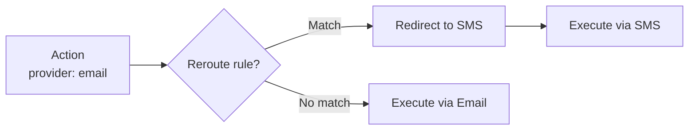

# Rerouting

Rerouting dynamically redirects actions to a different provider based on rule conditions. This is useful for failover, priority escalation, A/B testing, or content-based routing.

## How It Works



When a reroute rule matches, the action's target provider is changed before execution. The original provider is recorded in the outcome for traceability.

## Rule Configuration

```yaml title="rules/reroute.yaml"
rules:
  - name: reroute-urgent-to-sms
    priority: 1
    description: "Route urgent notifications to SMS instead of email"
    condition:
      field: action.payload.priority
      eq: "urgent"
    action:
      type: reroute
      target_provider: "sms"
```

### Parameters

| Parameter | Type | Required | Description |
|-----------|------|----------|-------------|
| `target_provider` | string | Yes | The provider to redirect to |

## Common Patterns

### Priority Escalation

```yaml
- name: escalate-critical
  priority: 1
  condition:
    field: action.payload.severity
    eq: "critical"
  action:
    type: reroute
    target_provider: "pagerduty"
```

### Failover Routing

```yaml
- name: failover-to-backup
  priority: 1
  condition:
    all:
      - field: action.provider
        eq: "primary-email"
      - field: action.metadata.primary_down
        eq: "true"
  action:
    type: reroute
    target_provider: "backup-email"
```

### Content-Based Routing

```yaml
- name: route-international-sms
  priority: 5
  condition:
    field: action.payload.phone
    starts_with: "+"
  action:
    type: reroute
    target_provider: "international-sms"
```

## Response

```json
{
  "outcome": "rerouted",
  "original_provider": "email",
  "new_provider": "sms",
  "response": {
    "status": "success",
    "body": {"sent": true}
  }
}
```

## Example: Multi-Provider Setup

```rust
let gateway = GatewayBuilder::new()
    .state(Arc::new(MemoryStateStore::new()))
    .lock(Arc::new(MemoryDistributedLock::new()))
    .rules(rules)
    .provider(Arc::new(EmailProvider))     // "email"
    .provider(Arc::new(SmsProvider))       // "sms"
    .provider(Arc::new(WebhookProvider))   // "webhook"
    .build()?;

// This action targets "email" but will be rerouted to "sms"
// if it matches the reroute-urgent-to-sms rule
let action = Action::new(
    "notifications", "tenant-1", "email", "send_notification",
    json!({"priority": "urgent", "body": "Server down!"}),
);

let outcome = gateway.dispatch(action, None).await?;
// outcome = Rerouted { original_provider: "email", new_provider: "sms", ... }
```

!!! tip
    Make sure the target provider is registered with the gateway. If the target provider doesn't exist, the action will fail with a provider error.
