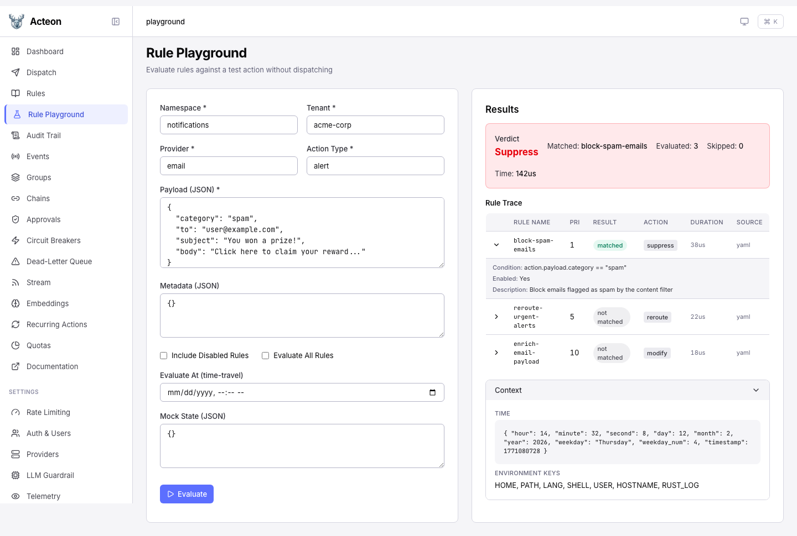
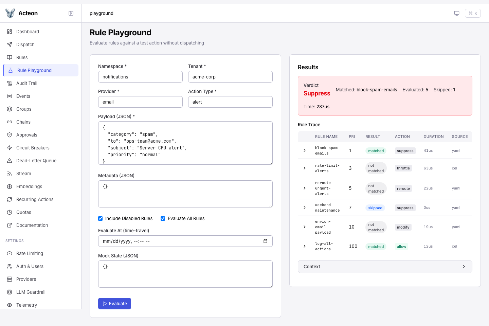
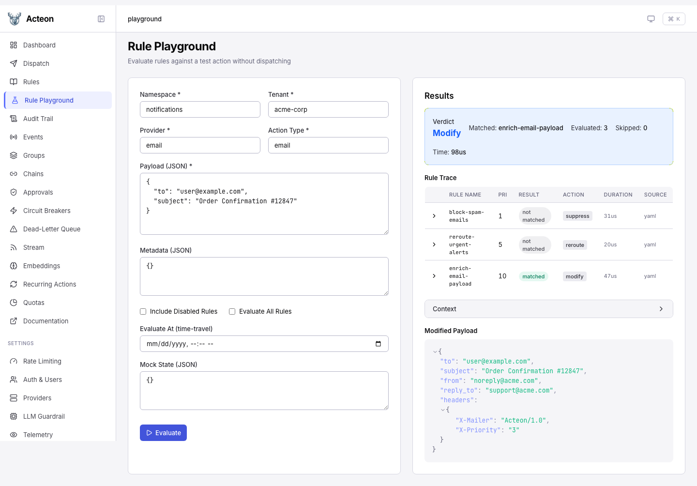

# Rule Playground

The Rule Playground provides a dedicated debugging endpoint for testing how
rules evaluate against a synthetic action, without executing any side effects.
Unlike [dry-run mode](dry-run.md) (which uses the full dispatch pipeline), the
playground focuses exclusively on rule evaluation and returns a detailed
per-rule trace.

## Admin UI

The Rule Playground is available in the Admin UI sidebar. Fill in the action
fields on the left, click **Evaluate**, and inspect the per-rule trace on the
right.



Enable **Evaluate All Rules** and **Include Disabled Rules** to see every rule
in the trace, including disabled and skipped rules:



When the matched rule is a **Modify** action, the modified payload preview
appears at the bottom of the results panel:



## API Endpoint

```
POST /v1/rules/evaluate
```

### Request Body

| Field | Type | Required | Description |
|-------|------|----------|-------------|
| `namespace` | string | yes | Namespace for the test action |
| `tenant` | string | yes | Tenant for the test action |
| `provider` | string | yes | Provider for the test action |
| `action_type` | string | yes | Action type for the test action |
| `payload` | object | yes | JSON payload to evaluate against the rules |
| `metadata` | object | no | Optional metadata key-value pairs |
| `include_disabled` | bool | no | When `true`, disabled rules appear in the trace (marked as skipped) |
| `evaluate_all` | bool | no | When `true`, evaluates every rule even after the first match |
| `evaluate_at` | string | no | ISO 8601 timestamp override for time-travel debugging |
| `mock_state` | object | no | State key overrides for testing state-dependent conditions |

### Response

| Field | Type | Description |
|-------|------|-------------|
| `verdict` | string | Final verdict: `allow`, `deny`, `suppress`, `modify`, or `error` |
| `matched_rule` | string? | Name of the first matching rule |
| `has_errors` | bool | `true` when one or more rules errored during evaluation |
| `total_rules_evaluated` | int | Number of rules whose conditions were evaluated |
| `total_rules_skipped` | int | Number of rules that were skipped |
| `evaluation_duration_us` | int | Total evaluation time in microseconds |
| `trace` | array | Per-rule trace entries in priority order |
| `context` | object | Evaluation context (time map, environment keys, timezone) |
| `modified_payload` | object? | Resulting payload after merge patch (only for `modify` verdicts) |

Each trace entry contains:

| Field | Type | Description |
|-------|------|-------------|
| `rule_name` | string | Name of the rule |
| `priority` | int | Rule priority (lower = evaluated first) |
| `enabled` | bool | Whether the rule is enabled |
| `condition_display` | string | Human-readable condition expression |
| `result` | string | `matched`, `not_matched`, `skipped`, or `error` |
| `evaluation_duration_us` | int | Time spent evaluating this rule |
| `action` | string | The action the rule would take |
| `source` | string | Where the rule was loaded from |
| `description` | string? | Optional rule description |
| `skip_reason` | string? | Reason the rule was skipped |
| `error` | string? | Error message if evaluation failed |

## Key Features

### Evaluate All Rules

By default, rule evaluation stops at the first match. Set `evaluate_all: true`
to force evaluation of every rule, which is useful for understanding the full
rule set's behavior:

```bash
curl -X POST http://localhost:8080/v1/rules/evaluate \
  -H 'Content-Type: application/json' \
  -d '{
    "namespace": "default",
    "tenant": "acme",
    "provider": "email",
    "action_type": "notification",
    "payload": {"to": "user@example.com"},
    "evaluate_all": true
  }'
```

### Time-Travel Debugging

Override the evaluation clock to test time-sensitive rules (maintenance windows,
weekday restrictions, etc.):

```json
{
  "namespace": "default",
  "tenant": "acme",
  "provider": "email",
  "action_type": "notification",
  "payload": {},
  "evaluate_at": "2026-03-15T03:00:00Z"
}
```

### Mock State

Override state keys to test state-dependent conditions without mutating real
state:

```json
{
  "namespace": "default",
  "tenant": "acme",
  "provider": "email",
  "action_type": "notification",
  "payload": {},
  "mock_state": {
    "alert_count": "5",
    "last_notified": "2026-02-12T10:00:00Z"
  }
}
```

### Error Visibility

When a rule condition errors during evaluation, the verdict is set to `"error"`
and `has_errors` is `true`. The failing rule's trace entry contains the error
message. This matches production behavior where errors before the first match
cause the engine to abort.

### Modify Payload Preview

When the matched rule is a `Modify` action, the response includes
`modified_payload` showing the result of applying the JSON merge patch to the
input payload.

### Default Fallthrough

When no rules match, a synthetic `(default fallthrough)` trace entry is
appended, making it explicit that the `allow` verdict came from no rule matching
rather than a specific rule.

## Client SDK Usage

### Rust

```rust
use acteon_client::{ActeonClient, EvaluateRulesOptions};
use acteon_core::Action;

let client = ActeonClient::new("http://localhost:8080");
let action = Action::new("ns", "tenant", "email", "send", serde_json::json!({}));

let trace = client.evaluate_rules(&action, &EvaluateRulesOptions {
    evaluate_all: true,
    ..Default::default()
}).await?;

println!("Verdict: {}", trace.verdict);
for entry in &trace.trace {
    println!("  {} -> {}", entry.rule_name, entry.result);
}
```

### Python

```python
from acteon_client import ActeonClient, EvaluateRulesRequest

client = ActeonClient("http://localhost:8080")
result = client.evaluate_rules(EvaluateRulesRequest(
    namespace="ns",
    tenant="tenant",
    provider="email",
    action_type="send",
    payload={},
    evaluate_all=True,
))

print(f"Verdict: {result.verdict}")
for entry in result.trace:
    print(f"  {entry.rule_name} -> {entry.result}")
```

### Node.js / TypeScript

```typescript
const result = await client.evaluateRules({
  namespace: "ns",
  tenant: "tenant",
  provider: "email",
  action_type: "send",
  payload: {},
  evaluate_all: true,
});

console.log(`Verdict: ${result.verdict}`);
result.trace.forEach(e => console.log(`  ${e.rule_name} -> ${e.result}`));
```

### Go

```go
resp, err := client.EvaluateRules(ctx, acteon.EvaluateRulesRequest{
    Namespace:   "ns",
    Tenant:      "tenant",
    Provider:    "email",
    ActionType:  "send",
    Payload:     map[string]interface{}{},
    EvaluateAll: true,
})
fmt.Println("Verdict:", resp.Verdict)
```

### Java

```java
EvaluateRulesResponse resp = client.evaluateRules(
    new EvaluateRulesRequest("ns", "tenant", "email", "send", Map.of())
        .evaluateAll(true)
);
System.out.println("Verdict: " + resp.getVerdict());
```

## Security Notes

- Environment variable keys are filtered to omit names containing `SECRET`,
  `PASSWORD`, `TOKEN`, `CREDENTIAL`, or `PRIVATE_KEY` (and names ending in
  `_KEY`). Values are never exposed.
- The endpoint is read-only: no state mutations, no provider calls, no audit
  records.
- Authentication and authorization apply as with any protected endpoint.
