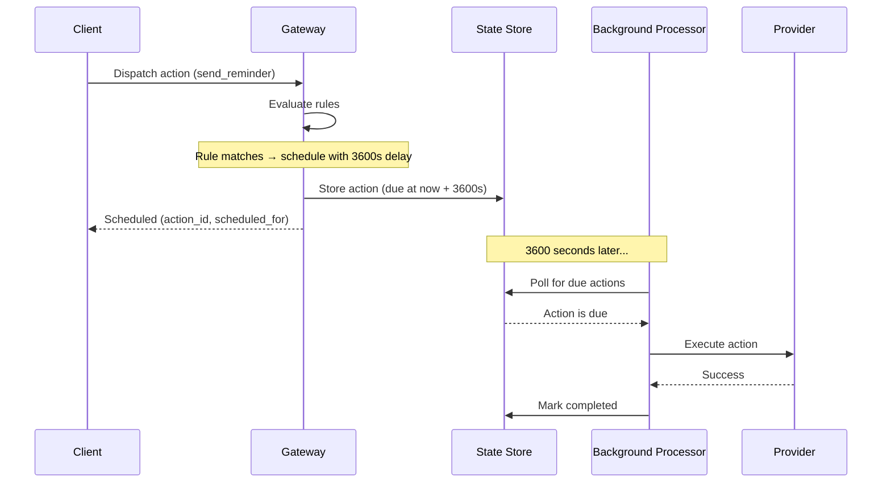

# Scheduled Actions

Scheduled actions let you delay action execution by a configurable duration. Instead of dispatching immediately, Acteon stores the action and executes it after the specified delay. This is useful for:

- **Delayed notifications** -- send a reminder email 24 hours after signup
- **Off-peak retries** -- reschedule failed actions to run during low-traffic windows
- **Escalation workflows** -- if an alert is not acknowledged within 30 minutes, escalate to the on-call manager

## How It Works



1. The client dispatches an action through the normal `POST /v1/dispatch` endpoint
2. The gateway evaluates rules -- if a `schedule` rule matches, the action is stored for later
3. The gateway returns an `ActionOutcome::Scheduled` response with the action ID and scheduled time
4. A background processor polls the state store for due actions at a configurable interval
5. When an action's scheduled time arrives, the background processor dispatches it to the provider

## Rule Configuration

### YAML

```yaml title="rules/scheduled.yaml"
rules:
  - name: delay-reminders
    priority: 10
    description: "Send reminder emails after a 1-hour delay"
    condition:
      field: action.action_type
      eq: "send_reminder"
    action:
      type: schedule
      delay_seconds: 3600

  - name: offpeak-batch-reports
    priority: 15
    description: "Delay batch reports by 6 hours to run off-peak"
    condition:
      all:
        - field: action.action_type
          eq: "generate_report"
        - field: action.metadata.priority
          eq: "low"
    action:
      type: schedule
      delay_seconds: 21600
```

### CEL

```cel
// Delay reminders by 1 hour
action.action_type == "send_reminder" ? schedule(3600) : allow()

// Delay low-priority reports by 6 hours
action.action_type == "generate_report" && action.metadata.priority == "low" ? schedule(21600) : allow()
```

### Parameters

| Parameter | Type | Required | Description |
|-----------|------|----------|-------------|
| `delay_seconds` | u64 | Yes | Delay before execution, in seconds (1--604800) |

The maximum delay is 604800 seconds (7 days).

## Response

When an action matches a `schedule` rule, the dispatch endpoint returns:

```json
{
  "outcome": "scheduled",
  "action_id": "019462a1-7b3e-7f00-a123-456789abcdef",
  "scheduled_for": "2026-01-15T12:00:00Z"
}
```

| Field | Type | Description |
|-------|------|-------------|
| `outcome` | string | Always `"scheduled"` |
| `action_id` | string | Unique identifier for the scheduled action |
| `scheduled_for` | string | RFC 3339 timestamp when the action will be dispatched |

## Server Configuration

Enable the background processor in `acteon.toml`:

```toml
[background]
enable_scheduled_actions = true
scheduled_check_interval = 5  # seconds
```

| Key | Type | Default | Description |
|-----|------|---------|-------------|
| `enable_scheduled_actions` | bool | `false` | Enable the scheduled actions background processor |
| `scheduled_check_interval` | u64 | `5` | How often to poll for due actions, in seconds |

!!! warning
    If `enable_scheduled_actions` is `false`, `schedule` rules will still match and store actions, but nothing will dispatch them. Always enable the background processor in production.

## Client SDK Usage

Scheduled actions work through the existing `dispatch()` API. No new client methods are needed -- just handle the new `Scheduled` outcome type in the response.

### Rust

```rust
use acteon_client::ActeonClient;

let client = ActeonClient::new("http://localhost:8080");

let outcome = client.dispatch(&action).await?;
match &outcome {
    ActionOutcome::Scheduled { action_id, scheduled_for } => {
        println!("Action {} scheduled for {}", action_id, scheduled_for);
    }
    ActionOutcome::Executed(resp) => {
        println!("Executed immediately: {:?}", resp);
    }
    _ => {}
}
```

### Python

```python
from acteon_client import ActeonClient

client = ActeonClient("http://localhost:8080")

outcome = client.dispatch(action)
if outcome.is_scheduled():
    print(f"Action {outcome.action_id} scheduled for {outcome.scheduled_for}")
elif outcome.is_executed():
    print(f"Executed immediately: {outcome.response}")
```

### Node.js / TypeScript

```typescript
const outcome = await client.dispatch(action);
if (outcome.type === "scheduled") {
  console.log(`Action ${outcome.actionId} scheduled for ${outcome.scheduledFor}`);
} else if (outcome.type === "executed") {
  console.log(`Executed immediately:`, outcome.response);
}
```

### Go

```go
outcome, err := client.Dispatch(ctx, action)
if err != nil {
    log.Fatal(err)
}
if outcome.IsScheduled() {
    fmt.Printf("Action %s scheduled for %s\n", outcome.ActionID, outcome.ScheduledFor)
} else if outcome.IsExecuted() {
    fmt.Println("Executed immediately:", outcome.Response)
}
```

### Java

```java
ActionOutcome outcome = client.dispatch(action);
if (outcome.isScheduled()) {
    System.out.printf("Action %s scheduled for %s%n",
        outcome.getActionId(), outcome.getScheduledFor());
} else if (outcome.isExecuted()) {
    System.out.println("Executed immediately: " + outcome.getResponse());
}
```

## Reliability

Scheduled actions use **at-least-once delivery** semantics:

- Actions are persisted to the state store before the client receives a response
- The background processor marks actions as "in-flight" before dispatching
- If the processor crashes mid-dispatch, the action will be retried on the next poll
- Successfully dispatched actions are marked as completed and will not be re-dispatched

A **24-hour grace period** applies: actions that remain in the "in-flight" state for more than 24 hours are considered stale and will be retried. This handles cases where the processor crashes after picking up an action but before marking it complete.

## Limitations

- **Maximum delay**: 7 days (604800 seconds). Longer delays are rejected at rule evaluation time.
- **No cancellation API**: Once an action is scheduled, it cannot be cancelled. A cancellation endpoint is planned for a future release.
- **Polling latency**: The background processor polls at the configured interval (`scheduled_check_interval`), so actions may be dispatched up to N seconds after their scheduled time, where N is the check interval.
- **Single processor**: The background processor runs as a single instance. High-availability deployments should use leader election or a distributed lock to prevent duplicate dispatches.
