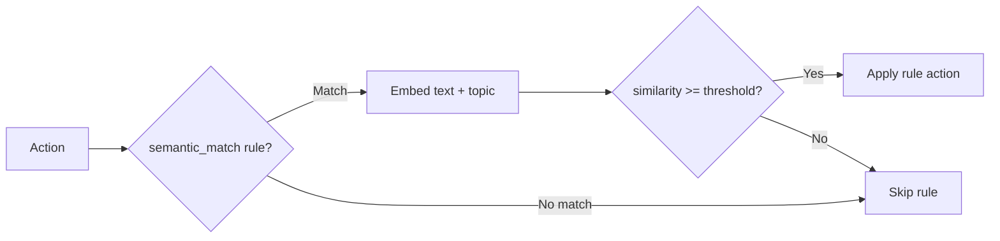

# Semantic Routing

Semantic routing uses vector embeddings and cosine similarity to match actions by meaning rather than exact field values. Instead of writing rigid string comparisons, you describe the **topic** you care about in natural language and Acteon determines whether each action's content is semantically close enough.

## How It Works



1. An action enters the rule engine and matches a `semantic_match` condition
2. The action text (a specific field or the entire payload) is sent to the configured embedding API
3. The topic description is embedded (or retrieved from cache)
4. Cosine similarity is computed between the two vectors
5. If similarity meets the threshold, the rule fires

## Configuration

### Server Configuration

```toml title="acteon.toml"
[embedding]
enabled = true
endpoint = "https://api.openai.com/v1/embeddings"
model = "text-embedding-3-small"
api_key = "ENC[AES256-GCM,...]"        # Use acteon-server encrypt
timeout_seconds = 10
fail_open = true                        # Return 0.0 on API failure

# Cache tuning
topic_cache_capacity = 10000            # Max cached topic embeddings
topic_cache_ttl_seconds = 3600          # Topic cache TTL (1 hour)
text_cache_capacity = 1000              # Max cached text embeddings
text_cache_ttl_seconds = 60             # Text cache TTL (1 minute)
```

!!! tip "Secret Management"
    Never store your embedding API key in plain text. Use `acteon-server encrypt`:

    ```bash
    export ACTEON_AUTH_KEY="<hex-encoded 256-bit key>"
    echo -n "sk-..." | acteon-server encrypt
    # Output: ENC[AES256-GCM,...]
    ```

    Paste the `ENC[...]` value into `api_key` in your `acteon.toml`.

### Rule Configuration

```yaml title="rules/semantic.yaml"
rules:
  - name: route-infra-alerts
    priority: 5
    description: "Route infrastructure alerts to the DevOps team"
    condition:
      semantic_match: "Infrastructure issues, server problems, outages"
      threshold: 0.75
      text_field: action.payload.message
    action:
      type: reroute
      target_provider: devops-pagerduty
```

### Parameters

| Parameter | Type | Required | Default | Description |
|-----------|------|----------|---------|-------------|
| `semantic_match` | string | Yes | — | Topic description to match against |
| `threshold` | float | No | `0.8` | Minimum cosine similarity (0.0 to 1.0) |
| `text_field` | string | No | — | Dot-separated field path for the text to match. When omitted, the entire action payload is stringified |

## Embedding Provider Interface

```rust
#[async_trait]
pub trait EmbeddingEvalSupport: Send + Sync {
    async fn similarity(&self, text: &str, topic: &str) -> Result<f64, RuleError>;
}
```

The built-in `EmbeddingBridge` wraps any OpenAI-compatible embedding API and adds caching, fail-open resilience, and metrics.

## Caching

Embedding API calls are expensive and add latency. Acteon uses a two-tier cache to minimize external calls:

| Tier | What it caches | Default capacity | Default TTL |
|------|---------------|-----------------|-------------|
| **Topic cache** | Embeddings for topic descriptions (from rule definitions) | 10,000 | 1 hour |
| **Text cache** | Embeddings for action text (from payloads) | 1,000 | 1 minute |

Topic embeddings change infrequently (only when rules change), so they get a long TTL and large capacity. Text embeddings are transient action data, so they get a short TTL.

Both caches provide **thundering herd protection** — concurrent requests for the same key are coalesced into a single API call.

### Cache Pre-warming

On startup, Acteon walks all loaded rules and extracts every `semantic_match` topic. These topics are embedded immediately so the first requests don't pay cold-start latency.

### Memory Footprint

Each cached embedding is a `Vec<f32>` whose size depends on the model dimension. For `text-embedding-3-small` (1536 dimensions):

| Cache | Worst case |
|-------|-----------|
| Topic cache (10,000 entries) | ~60 MB |
| Text cache (1,000 entries) | ~6 MB |

Adjust `topic_cache_capacity` and `text_cache_capacity` for your environment.

## Fail-Open Behavior

When `fail_open = true` (the default), embedding API failures return similarity `0.0` instead of propagating an error. This means `semantic_match` rules evaluate to **false** on API failure rather than killing the entire dispatch pipeline.

When `fail_open = false`, embedding errors propagate and the action dispatch fails.

!!! note
    This mirrors the `fail_open` behavior of [LLM Guardrails](llm-guardrails.md).

## Metrics

Embedding cache and error metrics are exposed via the `/metrics` and `/health` endpoints when the embedding provider is configured:

```json
{
  "embedding": {
    "topic_cache_hits": 1500,
    "topic_cache_misses": 10,
    "text_cache_hits": 800,
    "text_cache_misses": 200,
    "errors": 2,
    "fail_open_count": 2
  }
}
```

Monitor `text_cache_misses` and `errors` to tune your cache sizes and detect provider issues.

## REST API

The embedding subsystem also exposes a direct similarity endpoint for testing and debugging:

```
POST /v1/embeddings/similarity
```

See the [REST API Reference](../api/rest-api.md#post-v1embeddingssimilarity) for details.

## Use Cases

### Topic-Based Alert Routing

Route alerts to the right team based on content meaning, not exact string matches:

```yaml
rules:
  - name: route-infra
    priority: 5
    condition:
      semantic_match: "Infrastructure issues, server outages, disk failures"
      threshold: 0.75
      text_field: action.payload.description
    action:
      type: reroute
      target_provider: devops-pagerduty

  - name: route-billing
    priority: 5
    condition:
      semantic_match: "Billing problems, payment failures, subscription issues"
      threshold: 0.75
      text_field: action.payload.description
    action:
      type: reroute
      target_provider: billing-team
```

### Content-Based Suppression

Suppress noise alerts that match a known pattern:

```yaml
- name: suppress-maintenance-noise
  priority: 1
  condition:
    all:
      - field: action.action_type
        eq: "alert"
      - semantic_match: "Scheduled maintenance, planned downtime, maintenance window"
        threshold: 0.8
        text_field: action.payload.message
  action:
    type: suppress
    reason: "Matches maintenance noise pattern"
```

### Semantic Deduplication

Deduplicate alerts that say the same thing in different words:

```yaml
- name: dedup-similar-alerts
  priority: 3
  condition:
    semantic_match: "Database connection pool exhausted"
    threshold: 0.9
    text_field: action.payload.summary
  action:
    type: deduplicate
    ttl_seconds: 600
```

### Combining with Other Conditions

`semantic_match` can be used inside `all` / `any` blocks alongside standard field conditions:

```yaml
- name: urgent-infra-to-pagerduty
  priority: 2
  condition:
    all:
      - field: action.payload.severity
        eq: "critical"
      - semantic_match: "Infrastructure and server issues"
        threshold: 0.7
        text_field: action.payload.description
  action:
    type: reroute
    target_provider: pagerduty-urgent
```
