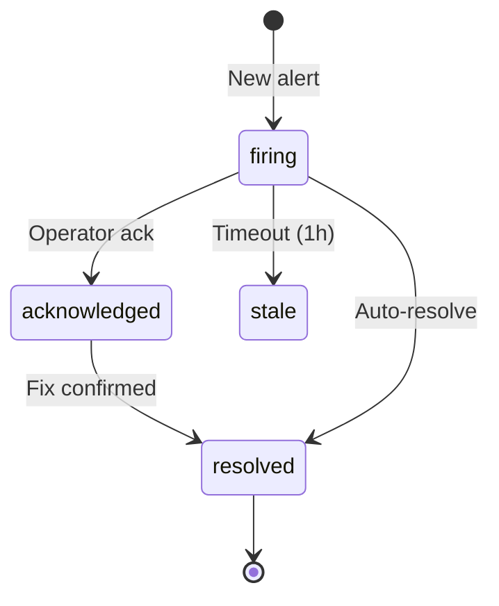
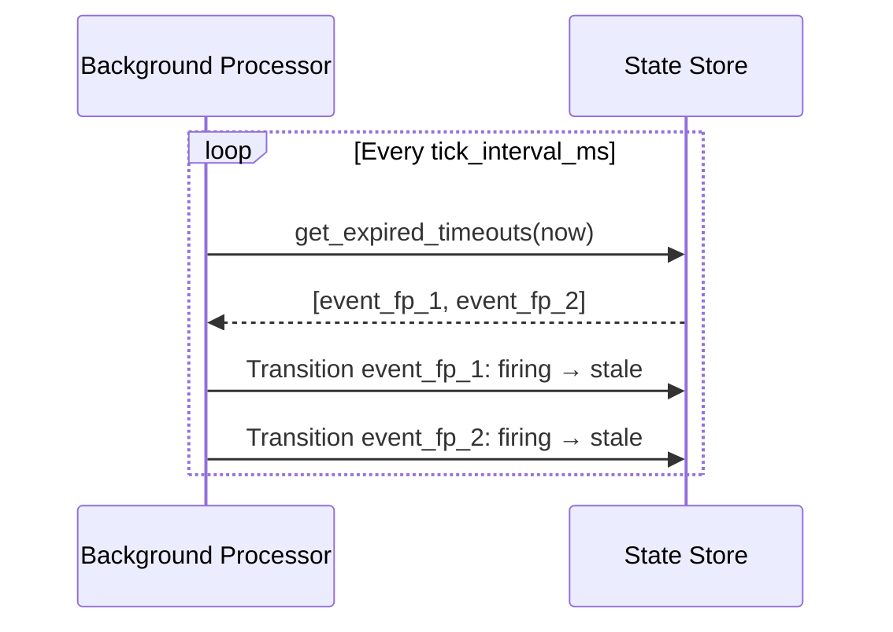

# State Machines

State machines track event lifecycles through configurable states. Events transition between states based on incoming actions, with support for automatic timeout transitions and notification triggers.

## How It Works



1. An action matching a state machine rule is fingerprinted (using configurable fields)
2. The fingerprint identifies a unique event instance in the state store
3. If no state exists, the event starts in the `initial_state`
4. Subsequent actions with the same fingerprint trigger state transitions
5. Timeouts can automatically transition events that stay too long in a state

## Configuration

### State Machine Definition

Define state machines in `acteon.toml`:

```toml title="acteon.toml"
[[state_machines]]
name = "alert"
initial_state = "firing"
states = ["firing", "acknowledged", "resolved", "stale"]

[[state_machines.transitions]]
from = "firing"
to = "acknowledged"

[[state_machines.transitions]]
from = "firing"
to = "resolved"

[[state_machines.transitions]]
from = "acknowledged"
to = "resolved"

[[state_machines.timeouts]]
state = "firing"
after_seconds = 3600
transition_to = "stale"
```

### Rule That Activates the State Machine

```yaml title="rules/state-machine.yaml"
rules:
  - name: alert-lifecycle
    priority: 5
    condition:
      field: action.action_type
      eq: "alert"
    action:
      type: state_machine
      state_machine: alert
      fingerprint_fields:
        - action_type
        - metadata.cluster
        - metadata.service
```

### Parameters

| Parameter | Type | Required | Description |
|-----------|------|----------|-------------|
| `state_machine` | string | Yes | References `[[state_machines]]` in config |
| `fingerprint_fields` | string[] | Yes | Fields used to compute unique event fingerprint |

## Fingerprinting

The fingerprint uniquely identifies an event instance. It's computed as a SHA-256 hash of the specified fields:

```
Fingerprint = SHA-256(action_type + metadata.cluster + metadata.service)

Alert A: action_type=alert, cluster=prod, service=api → "fp-abc123"
Alert B: action_type=alert, cluster=prod, service=api → "fp-abc123"  (same event)
Alert C: action_type=alert, cluster=prod, service=db  → "fp-def456"  (different event)
```

### Supported Fingerprint Fields

| Field Path | Source |
|------------|--------|
| `namespace` | Action namespace |
| `tenant` | Action tenant |
| `provider` | Action provider |
| `action_type` | Action type |
| `id` | Action ID |
| `status` | Action status |
| `metadata.key` | Metadata label value |
| `payload.field.nested` | Payload JSON field |

## State Transitions

### Allowed Transitions

Only transitions defined in the config are allowed:

```toml
[[state_machines.transitions]]
from = "firing"
to = "acknowledged"
```

Attempting an invalid transition returns an error.

### Transition Effects

Transitions can trigger notifications:

```rust
TransitionEffects {
    notify: true,                    // Send notification
    webhook_url: Some("https://..."),// Call webhook
    metadata: HashMap::new(),        // Additional metadata
}
```

### Manual Transitions via API

```bash
# Acknowledge an alert
curl -X PUT http://localhost:8080/v1/events/{fingerprint}/transition \
  -H "Content-Type: application/json" \
  -d '{
    "to_state": "acknowledged",
    "namespace": "monitoring",
    "tenant": "tenant-1"
  }'
```

## Automatic Timeouts

Events that remain in a state beyond the timeout are automatically transitioned:

```toml
[[state_machines.timeouts]]
state = "firing"
after_seconds = 3600          # 1 hour
transition_to = "stale"
```

The background processor periodically checks for timed-out events and transitions them.



## API Endpoints

### List Events

```bash
# All events
curl http://localhost:8080/v1/events

# Filter by status
curl "http://localhost:8080/v1/events?status=firing&namespace=monitoring"
```

### Get Event State

```bash
curl "http://localhost:8080/v1/events/{fingerprint}?namespace=monitoring&tenant=tenant-1"
```

### Transition Event

```bash
curl -X PUT http://localhost:8080/v1/events/{fingerprint}/transition \
  -H "Content-Type: application/json" \
  -d '{"to_state": "resolved", "namespace": "monitoring", "tenant": "tenant-1"}'
```

## Inhibition

Use state machine events to suppress dependent alerts:

```yaml
rules:
  # Track cluster-level events
  - name: cluster-state-machine
    priority: 1
    condition:
      field: action.action_type
      eq: "cluster_down"
    action:
      type: state_machine
      state_machine: alert
      fingerprint_fields:
        - action_type
        - metadata.cluster

  # Suppress pod alerts when cluster is down
  - name: inhibit-pod-alerts
    priority: 2
    condition:
      all:
        - field: action.action_type
          starts_with: "pod_"
        - call: has_active_event
          args: [cluster_down, action.metadata.cluster]
    action:
      type: suppress
      reason: "Parent cluster is down"
```

## Response

```json
{
  "outcome": "state_changed",
  "fingerprint": "fp-abc123",
  "previous_state": "firing",
  "new_state": "acknowledged",
  "notify": true
}
```

## Use Cases

### Alert Lifecycle

Track alerts from firing through acknowledgment to resolution, with stale timeouts.

### Incident Management

Model incident states: `detected → triaging → mitigating → resolved → postmortem`.

### Deployment Tracking

Track deployments: `pending → rolling_out → canary → promoted → complete`.
