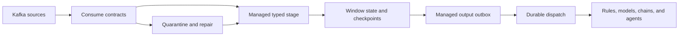

# Streams and events

Turn a stream of signals into a durable operational decision. Acteon combines
Kafka transport, event correlation, typed processing, and recoverable delivery
with the same providers and execution capabilities used by applications and agents.

## Follow the event to the action

The managed stage owns processing progress. Its output outbox owns delivery.
The receiver owns the resulting execution. These boundaries let a worker recover
without treating broker acknowledgement as proof that an external operation
has completed.

| Responsibility | Building block |
|---|---|
| Address topics, agents, and conversations | [Agentic Bus](../concepts/agentic-bus.md) |
| Correlate multiple sources by event time | [Event-time windows](event-time-windows.md) |
| Persist state, positions, and outputs together | [Stream checkpoints](stream-checkpoints.md) |
| Consume with explicit live receipt capabilities | [Kafka acknowledgements](live-kafka-acknowledgements.md) |
| Bound and recover typed callback execution | [Managed stream stages](managed-stream-stages.md) |
| Validate, retain, inspect, and repair rejected input | [Consume contracts and quarantine](stream-input-contracts.md) |
| Deliver outputs with leases, backoff, and dead letters | [Managed stream outbox](managed-stream-outbox.md) |
| Record receiver acceptance and execution linkage | [Durable dispatch](durable-dispatch.md) |

## Operate the pipeline

Inspect stage status, retained quarantine, and replay audits through scoped
operator APIs. Halt a stage, replace its worker, and resume it through audited
commands. A retry-budget reset retains the failed source anchor. Completed
checkpoints preserve progress across broker redelivery.

Stage controls govern processing; pending outbox delivery has its own lifecycle.
Callbacks interrupted before their checkpoint may run again, so keep processor
effects idempotent and route operational effects through the output path. Each
linked feature documents its retention limits and recovery semantics.

## Use the event lifecycle tools you need

For notification batching and incident state, [event grouping](event-grouping.md)
and [state machines](state-machines.md) may be sufficient. For joins across
metrics, traces, logs, or other ordered sources, use event-time windows and
managed processing. The server's [SSE event stream](event-streaming.md) serves
operational subscribers and dashboards; Kafka topics serve the bus workload.

## Run it

The [cascading observability simulation](../guides/neural-observability-detector.md)
uses three real Kafka sources, Redis checkpoints, local Laya model calls, rules,
an incident chain, and an investigator path. It exercises source replay,
quarantine repair, stage halt/resume, and delivery recovery.

The [AWS event pipeline](../guides/aws-event-pipeline.md) shows cloud-provider
routing and orchestration. The [bus migration guide](../guides/agentic-bus-migration.md)
helps move an existing messaging integration onto Acteon's primitives.
