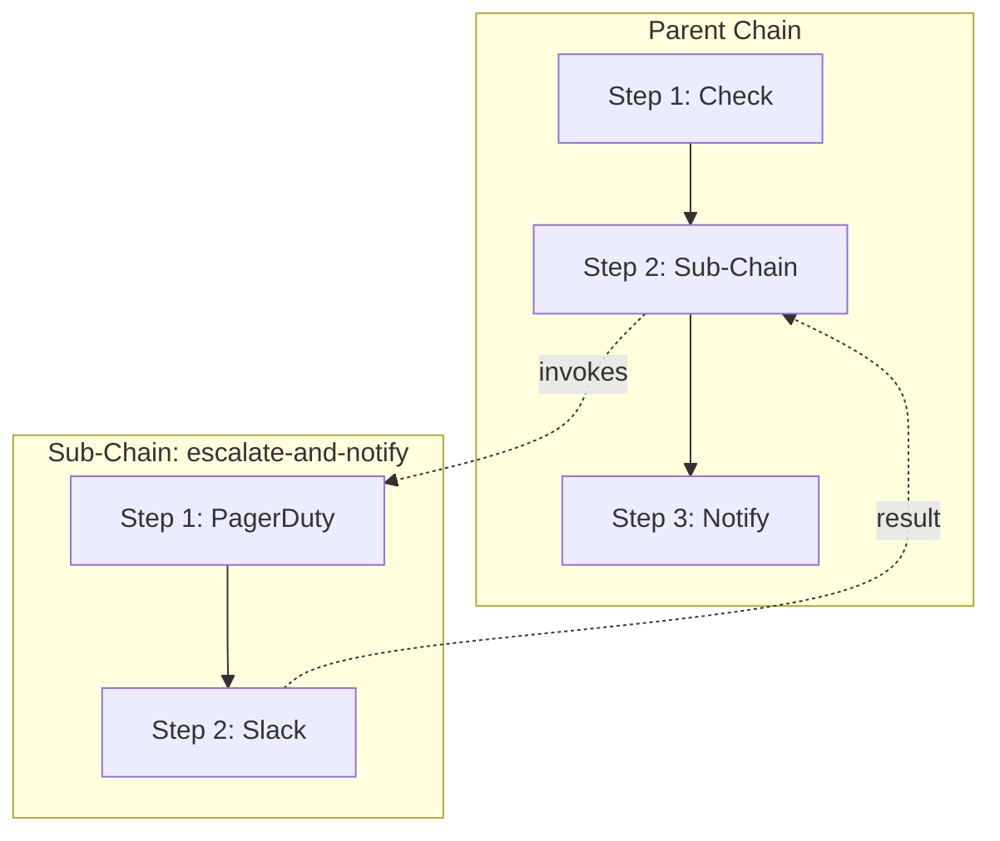

# Sub-Chains

Sub-chains let a chain step invoke another chain by name, enabling reusable workflow components. The parent chain pauses at that step until the sub-chain completes, then resumes with the sub-chain's result.

## How It Works



1. The parent chain reaches a sub-chain step
2. A new child chain execution is spawned from the referenced chain config
3. The parent enters `waiting_sub_chain` status
4. The child chain runs independently through the background processor
5. When the child completes, the parent resumes with the child's final step result
6. If the child fails, the parent applies the step's `on_failure` policy

## Configuration

### TOML

```toml title="acteon.toml"
# The parent chain
[[chains]]
name = "incident-response"
timeout_seconds = 3600

[[chains.steps]]
name = "check-severity"
provider = "monitoring-api"
action_type = "get_severity"

[[chains.steps]]
name = "escalate"
sub_chain = "escalate-and-notify"    # Invokes another chain
on_failure = "skip"                   # Skip if sub-chain fails

[[chains.steps]]
name = "resolve"
provider = "ticketing"
action_type = "close_ticket"

# The reusable sub-chain
[[chains]]
name = "escalate-and-notify"
timeout_seconds = 300

[[chains.steps]]
name = "page-oncall"
provider = "pagerduty"
action_type = "create_incident"

[[chains.steps]]
name = "notify-channel"
provider = "slack"
action_type = "post_message"
```

### Programmatic (Rust)

```rust
use acteon_core::chain::{ChainConfig, ChainStepConfig, StepFailurePolicy};

let parent = ChainConfig::new("incident-response")
    .with_step(ChainStepConfig::new(
        "check-severity", "monitoring-api", "get_severity",
        serde_json::json!({}),
    ))
    .with_step(
        ChainStepConfig::new_sub_chain("escalate", "escalate-and-notify")
            .with_on_failure(StepFailurePolicy::Skip),
    )
    .with_step(ChainStepConfig::new(
        "resolve", "ticketing", "close_ticket",
        serde_json::json!({}),
    ));

let sub_chain = ChainConfig::new("escalate-and-notify")
    .with_step(ChainStepConfig::new(
        "page-oncall", "pagerduty", "create_incident",
        serde_json::json!({}),
    ))
    .with_step(ChainStepConfig::new(
        "notify-channel", "slack", "post_message",
        serde_json::json!({}),
    ));
```

## Sub-Chain Step Parameters

| Parameter | Type | Required | Description |
|-----------|------|----------|-------------|
| `name` | string | Yes | Step identifier |
| `sub_chain` | string | Yes | Name of the chain to invoke |
| `on_failure` | string | No | Failure policy: `"abort"`, `"skip"`, `"dlq"` |
| `delay_seconds` | u64 | No | Delay before spawning the sub-chain |
| `branches` | array | No | Branch conditions evaluated after sub-chain completes |
| `default_next` | string | No | Default next step when no branch matches |

!!! note
    `sub_chain` and `provider` are mutually exclusive. A step is either a provider step or a sub-chain step.

## Template Variables

Sub-chains inherit the parent's `origin_action`, so `{{origin.*}}` templates in the sub-chain resolve to the root triggering action. The sub-chain's step results are available within the sub-chain via `{{prev.*}}` and `{{steps.NAME.*}}`.

After a sub-chain step completes, the parent chain can access the sub-chain's final result:

- `{{prev.response_body}}` — the last completed step's response body from the sub-chain
- `{{prev.success}}` — whether the sub-chain's last step succeeded

## Timeout Inheritance

The child chain's effective timeout is the **minimum** of:

1. The parent chain's remaining time (`parent.expires_at - now`)
2. The sub-chain's own `timeout_seconds` (if configured)

This ensures a sub-chain cannot outlive its parent.

## Cancellation Cascade

Cancelling a parent chain automatically cancels all running child chains. This is recursive: if a child chain has its own sub-chains, those are cancelled too.

## Cycle Detection

Acteon validates the sub-chain reference graph at startup. Cycles are rejected:

```
# This will fail validation:
# chain A → sub-chain B → sub-chain A (cycle!)
```

Self-references are also detected and rejected.

## DAG Visualization

The DAG API provides a hierarchical view of chain execution:

### Instance DAG (running/completed chain)

```
GET /v1/chains/{chain_id}/dag?namespace=...&tenant=...
```

### Definition DAG (config-only, no running instance)

```
GET /v1/chains/definitions/{name}/dag
```

Both return a `DagResponse` with nested structure for sub-chain steps:

```json
{
  "chain_name": "incident-response",
  "chain_id": "chn-abc123",
  "status": "waiting_sub_chain",
  "nodes": [
    {
      "name": "check-severity",
      "node_type": "step",
      "provider": "monitoring-api",
      "status": "completed"
    },
    {
      "name": "escalate",
      "node_type": "sub_chain",
      "sub_chain_name": "escalate-and-notify",
      "status": "waiting_sub_chain",
      "child_chain_id": "chn-def456",
      "children": {
        "chain_name": "escalate-and-notify",
        "chain_id": "chn-def456",
        "status": "running",
        "nodes": [
          { "name": "page-oncall", "node_type": "step", "status": "completed" },
          { "name": "notify-channel", "node_type": "step", "status": "pending" }
        ],
        "edges": [{ "source": "page-oncall", "target": "notify-channel" }],
        "execution_path": ["page-oncall"]
      }
    },
    {
      "name": "resolve",
      "node_type": "step",
      "provider": "ticketing",
      "status": "pending"
    }
  ],
  "edges": [
    { "source": "check-severity", "target": "escalate", "on_execution_path": true },
    { "source": "escalate", "target": "resolve", "on_execution_path": false }
  ],
  "execution_path": ["check-severity"]
}
```

## Chain List Filtering

Sub-chain executions appear in the chain list with a `parent_chain_id` field. Use the `waiting_sub_chain` status filter to find parent chains waiting on sub-chains.

## Nesting Depth

Sub-chains can be nested (a sub-chain can itself contain sub-chain steps). The DAG visualization supports up to 10 levels of nesting depth. Deeply nested chains may indicate a design issue — consider flattening the workflow.

## See Also

- [Task Chains](chains.md) — base chain concepts, configuration, and failure policies
