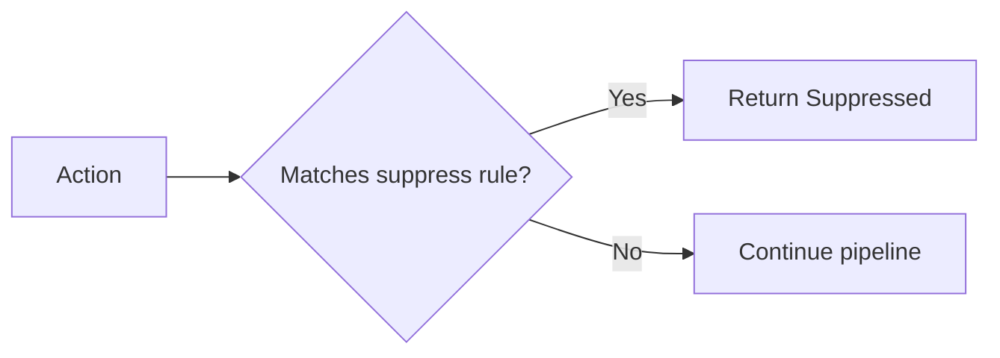

# Suppression

Suppression blocks actions from being executed entirely. Use it for spam filtering, maintenance windows, feature flags, or any scenario where actions should be silently dropped.

## How It Works



When an action matches a suppress rule, it is immediately blocked. The provider is never called. An audit record is created with the outcome `"suppressed"` and the rule name that blocked it.

## Rule Configuration

```yaml title="rules/suppress.yaml"
rules:
  - name: block-spam
    priority: 1
    description: "Block actions with spam action type"
    condition:
      field: action.action_type
      eq: "spam"
    action:
      type: suppress

  - name: maintenance-window
    priority: 2
    description: "Block non-critical actions during maintenance"
    condition:
      all:
        - field: action.metadata.priority
          eq: "low"
        - field: action.namespace
          eq: "notifications"
    action:
      type: suppress
      reason: "Maintenance window active"
```

### Parameters

| Parameter | Type | Required | Description |
|-----------|------|----------|-------------|
| `reason` | string | No | Human-readable reason recorded in audit |

## Common Patterns

### Block by Action Type

```yaml
condition:
  field: action.action_type
  eq: "spam"
action:
  type: suppress
```

### Block by Recipient

```yaml
condition:
  field: action.payload.to
  ends_with: "@test.example.com"
action:
  type: suppress
  reason: "Test email addresses blocked in production"
```

### Block by Metadata Label

```yaml
condition:
  field: action.metadata.environment
  eq: "staging"
action:
  type: suppress
  reason: "Staging actions suppressed"
```

### Inhibition (Suppress Dependent Events)

Suppress pod-level alerts when the entire cluster is down:

```yaml
rules:
  - name: inhibit-pod-alerts
    priority: 1
    condition:
      all:
        - field: action.action_type
          starts_with: "pod_"
        - call: has_active_event
          args: [cluster_down, action.metadata.cluster]
    action:
      type: suppress
      reason: "Parent cluster is down"
```

This uses the `has_active_event` expression function to check if a parent event exists in the state store.

## Response

```json
{
  "outcome": "suppressed",
  "rule": "block-spam"
}
```

## Runtime Control

Enable or disable suppress rules at runtime without reloading:

```bash
# Disable the maintenance window rule
curl -X PUT http://localhost:8080/v1/rules/maintenance-window/enabled \
  -H "Content-Type: application/json" \
  -d '{"enabled": false}'

# Re-enable it
curl -X PUT http://localhost:8080/v1/rules/maintenance-window/enabled \
  -H "Content-Type: application/json" \
  -d '{"enabled": true}'
```

## Example: Testing Suppression

```rust
const SUPPRESS_RULE: &str = r#"
rules:
  - name: block-spam
    condition:
      field: action.action_type
      eq: "spam"
    action:
      type: suppress
"#;

#[tokio::test]
async fn test_suppression() {
    let harness = SimulationHarness::start(
        SimulationConfig::builder()
            .add_recording_provider("email")
            .add_rule_yaml(SUPPRESS_RULE)
            .build()
    ).await.unwrap();

    // Spam is suppressed
    let spam = Action::new("ns", "t1", "email", "spam", json!({}));
    harness.dispatch(&spam).await.unwrap().assert_suppressed();

    // Normal action goes through
    let normal = Action::new("ns", "t1", "email", "send_email", json!({}));
    harness.dispatch(&normal).await.unwrap().assert_executed();

    // Provider never saw the spam action
    harness.provider("email").unwrap().assert_called(1);

    harness.teardown().await.unwrap();
}
```
