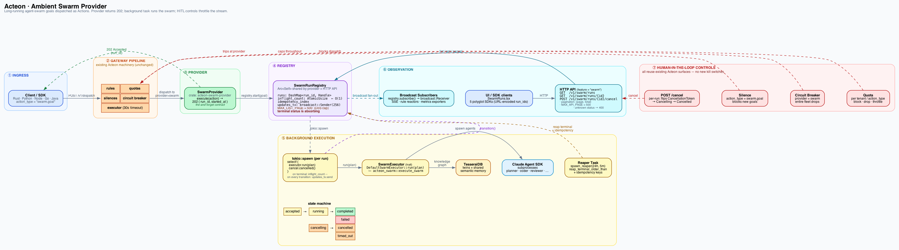

# Ambient Swarm Provider



_Source: [`swarm-provider-architecture.dot`](../images/swarm-provider-architecture.dot) — regenerate with
`dot -Tpng swarm-provider-architecture.dot -o swarm-provider-architecture.png`._

The **swarm provider** turns Acteon into an always-on runner for agent-swarm
goals. Goals are dispatched as Actions with `provider = "swarm"`; the provider
accepts each goal, spawns the long-running swarm in the background, and returns
immediately with a `run_id`. Operators observe progress through a dedicated
`/v1/swarm/runs` API and — crucially — keep full control through the same
human-in-the-loop mechanisms that govern any other Acteon action (quotas,
silences, circuit breakers, approvals).

This feature is compiled into the server binary behind the `swarm` Cargo
feature flag. Builds without the feature respond to the swarm endpoints with
`503 Service Unavailable`.

## Why the two-stage model

A swarm run takes minutes to hours. The gateway's dispatch pipeline enforces a
30-second per-provider timeout to protect its worker pool, so the provider
cannot block waiting for the run to finish. Instead the provider returns a
`202`-style receipt the moment the goal is accepted, and the actual work lives
on a background task tracked by a server-side registry. The receipt records the
provider interaction in the audit trail as "accepted"; subsequent status
transitions flow through the registry's broadcast channel and — optionally —
the SSE event stream.

## Configuring the provider

Add a `[[providers]]` block with `type = "swarm"` to your server
configuration:

```toml
[[providers]]
name = "ambient-swarm"
type = "swarm"
swarm.config_path     = "/etc/acteon/swarm.toml"
swarm.hooks_binary    = "/usr/local/bin/acteon-swarm-hook"
swarm.max_concurrent_runs = 4
```

- `swarm.config_path` points at a standard `swarm.toml` consumed by the
  `acteon-swarm` crate (roles, engine, safety, Tesserai, adversarial, eval).
- `swarm.hooks_binary` is the `acteon-swarm-hook` binary used for Claude Agent
  SDK `PreToolUse` / `PostToolUse` / `Stop` hooks.
- `swarm.max_concurrent_runs` caps inflight runs. New dispatches above the cap
  are rejected with a provider error so the quota/DLQ pipeline can triage them.

Only one swarm provider is expected per deployment, but defining multiple is
allowed — all of them share a single registry so the `/v1/swarm/runs` surface
stays unified.

## Dispatching a goal

The payload for a swarm goal is a pre-built plan plus an objective string:

```json
{
  "namespace": "research",
  "tenant": "acme",
  "provider": "ambient-swarm",
  "action_type": "swarm.goal",
  "payload": {
    "objective": "sweep open PRs for stale reviewers",
    "plan": { ... SwarmPlan JSON ... },
    "idempotency_key": "nightly-sweep-2026-04-17"
  }
}
```

Natural-language plan generation is deliberately a follow-up — the
synchronous dispatch call stays fast because plan construction happens ahead
of time (or on a separate worker). When a plan is supplied the provider
immediately returns a `SwarmGoalAccepted` body carrying the `run_id`.

## Observing runs

| Endpoint                              | Purpose                                  |
|---------------------------------------|------------------------------------------|
| `GET /v1/swarm/runs`                  | List all tracked runs, filterable by namespace/tenant/status |
| `GET /v1/swarm/runs/{run_id}`         | Fetch one run's latest snapshot          |
| `POST /v1/swarm/runs/{run_id}/cancel` | Request graceful cancellation            |

Status transitions (`accepted → running → completed / failed / cancelled /
timed_out`) are also broadcast internally through a tokio broadcast channel,
so downstream components (SSE, rule reactors, metrics exporters) can subscribe
directly rather than polling.

## Human-in-the-loop controls

Every existing Acteon mechanism for shaping or halting traffic applies:

- **Silences** on `action_type = swarm.goal` immediately stop *new* goals from
  being accepted. Inflight runs finish normally.
- **Circuit breakers** against the swarm provider's name stop the gateway from
  dispatching to it at all — a clean emergency brake.
- **Quotas** cap throughput per tenant (by action count or time window).
- **Per-run cancel** via the API flips a cancellation token observed by the
  background task; the run transitions through `cancelling` → `cancelled`.

Combined, these provide tiered operator control: cancel individual runs,
silence a problematic goal shape, trip the breaker if the whole provider
misbehaves.

## SDK support

All five first-party SDKs ship helpers:

| Language | List              | Get               | Cancel              |
|----------|-------------------|-------------------|---------------------|
| Rust     | `list_swarm_runs` | `get_swarm_run`   | `cancel_swarm_run`  |
| Python   | `list_swarm_runs` | `get_swarm_run`   | `cancel_swarm_run`  |
| Node.js  | `listSwarmRuns`   | `getSwarmRun`     | `cancelSwarmRun`    |
| Go       | `ListSwarmRuns`   | `GetSwarmRun`     | `CancelSwarmRun`    |
| Java     | `listSwarmRuns`   | `getSwarmRun`     | `cancelSwarmRun`    |

Goals themselves are dispatched through each SDK's existing `dispatch`
surface — there is no dedicated "dispatch swarm goal" call, just an `Action`
with `provider = "swarm"`.
