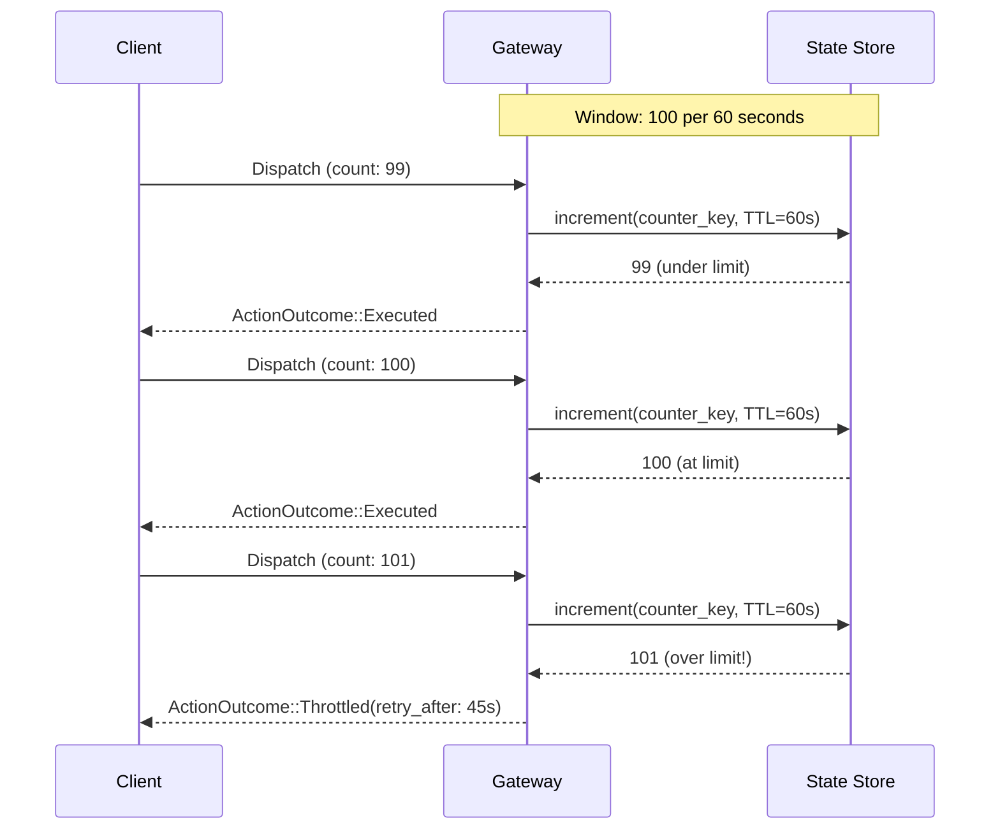

# Throttling

Throttling enforces rate limits on actions. When the limit is exceeded, actions are rejected with a `retry_after` hint telling the client when to retry.

## How It Works



1. The gateway maintains a counter per throttle rule in the state store
2. Each matching action increments the counter
3. If the counter exceeds `max_count` within `window_seconds`, the action is throttled
4. The `retry_after` duration indicates when the window resets

## Rule Configuration

```yaml title="rules/throttle.yaml"
rules:
  - name: throttle-notifications
    priority: 5
    description: "Limit notifications to 100 per minute"
    condition:
      field: action.action_type
      eq: "send_notification"
    action:
      type: throttle
      max_count: 100
      window_seconds: 60
      message: "Notification rate limit exceeded"
```

### Parameters

| Parameter | Type | Required | Description |
|-----------|------|----------|-------------|
| `max_count` | u64 | Yes | Maximum actions allowed per window |
| `window_seconds` | u64 | Yes | Window duration in seconds |
| `message` | string | No | Message included in throttled response |

## Common Patterns

### Per-Action-Type Throttling

```yaml
- name: throttle-emails
  condition:
    field: action.action_type
    eq: "send_email"
  action:
    type: throttle
    max_count: 1000
    window_seconds: 3600
```

### Per-Provider Throttling

```yaml
- name: throttle-sms-provider
  condition:
    field: action.provider
    eq: "sms"
  action:
    type: throttle
    max_count: 50
    window_seconds: 60
```

### Combined Conditions

```yaml
- name: throttle-high-priority-alerts
  condition:
    all:
      - field: action.action_type
        eq: "alert"
      - field: action.payload.severity
        eq: "critical"
  action:
    type: throttle
    max_count: 10
    window_seconds: 300
    message: "Too many critical alerts"
```

## Response

When an action is throttled:

```json
{
  "outcome": "throttled",
  "retry_after_seconds": 45
}
```

The `retry_after` value indicates the remaining time until the rate limit window resets.

## Example: Testing Throttling

```rust
const THROTTLE_RULE: &str = r#"
rules:
  - name: throttle-alerts
    condition:
      field: action.action_type
      eq: "alert"
    action:
      type: throttle
      max_count: 10
      window_seconds: 60
"#;

#[tokio::test]
async fn test_throttling() {
    let harness = SimulationHarness::start(
        SimulationConfig::builder()
            .add_recording_provider("sms")
            .add_rule_yaml(THROTTLE_RULE)
            .build()
    ).await.unwrap();

    // First 10 alerts execute
    for i in 0..10 {
        let action = Action::new("ns", "t1", "sms", "alert", json!({"seq": i}));
        harness.dispatch(&action).await.unwrap().assert_executed();
    }

    // 11th alert is throttled
    let action = Action::new("ns", "t1", "sms", "alert", json!({"seq": 10}));
    harness.dispatch(&action).await.unwrap().assert_throttled();

    // Provider received exactly 10 calls
    harness.provider("sms").unwrap().assert_called(10);

    harness.teardown().await.unwrap();
}
```

## Audit Trail

Both executed and throttled actions are recorded:

```json
// Executed (under limit)
{ "outcome": "executed", "verdict": "allow" }

// Throttled (over limit)
{ "outcome": "throttled", "matched_rule": "throttle-notifications" }
```
