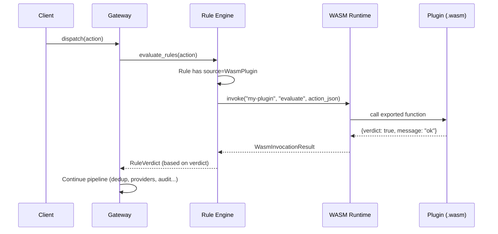

# WASM Rule Plugins

WASM rule plugins let you extend Acteon's rule engine with custom logic written
in any language that compiles to WebAssembly. Plugins run inside a sandboxed
`Wasmtime` runtime with strict resource limits, receiving an action context as
JSON and returning a boolean verdict with optional metadata.

Use cases include:

- **Custom scoring models** -- run a proprietary risk scoring function as a rule condition
- **Complex validation** -- validate payloads against schemas or business rules that don't fit declarative conditions
- **External data lookup** -- check an in-memory data structure or pre-loaded dataset without HTTP round trips
- **Domain-specific logic** -- encode industry-specific compliance checks (PCI, HIPAA, etc.) in a portable binary

## How It Works



When the rule engine encounters a rule whose source is `WasmPlugin`, it
delegates evaluation to the WASM runtime. The plugin receives the full action
context (namespace, tenant, provider, action type, payload, metadata) as a JSON
string and must return a JSON object with at minimum a `verdict` boolean.

## Quick Start

### 1. Write a Plugin (Rust Example)

Create a new Rust library with `cdylib` crate type:

```rust
// Cargo.toml
[package]
name = "my-acteon-plugin"
version = "0.1.0"
edition = "2021"

[lib]
crate-type = ["cdylib"]

[dependencies]
serde = { version = "1", features = ["derive"] }
serde_json = "1"
```

Implement the `evaluate` function:

```rust
use serde::{Deserialize, Serialize};

#[derive(Deserialize)]
struct ActionContext {
    namespace: String,
    tenant: String,
    provider: String,
    action_type: String,
    payload: serde_json::Value,
    metadata: std::collections::HashMap<String, String>,
}

#[derive(Serialize)]
struct PluginResult {
    verdict: bool,
    #[serde(skip_serializing_if = "Option::is_none")]
    message: Option<String>,
}

/// # Safety
/// Called by the Acteon WASM runtime.
#[no_mangle]
pub extern "C" fn evaluate(input_ptr: i32, input_len: i32) -> i64 {
    let input = unsafe {
        let slice = std::slice::from_raw_parts(input_ptr as *const u8, input_len as usize);
        std::str::from_utf8_unchecked(slice)
    };

    let ctx: ActionContext = match serde_json::from_str(input) {
        Ok(ctx) => ctx,
        Err(_) => return pack_result(0, 0), // false verdict on parse error
    };

    // Your custom logic here
    let verdict = ctx.payload.get("priority")
        .and_then(|v| v.as_str())
        .map(|p| p != "low")
        .unwrap_or(true);

    let result = PluginResult {
        verdict,
        message: if !verdict {
            Some("low priority actions are suppressed".into())
        } else {
            None
        },
    };

    let output = serde_json::to_vec(&result).unwrap();
    // Write output to WASM memory; runtime reads it back
    let ptr = output.as_ptr() as i32;
    let len = output.len() as i32;
    std::mem::forget(output);
    pack_result(ptr, len)
}

fn pack_result(ptr: i32, len: i32) -> i64 {
    ((ptr as i64) << 32) | (len as i64 & 0xFFFF_FFFF)
}
```

### 2. Compile to WASM

```bash
rustup target add wasm32-wasip1
cargo build --target wasm32-wasip1 --release
# Output: target/wasm32-wasip1/release/my_acteon_plugin.wasm
```

### 3. Register the Plugin

Copy the `.wasm` file to your plugin directory and configure it:

```toml
# acteon.toml
[wasm]
enabled = true
plugin_dir = "/etc/acteon/plugins"
default_memory_limit_bytes = 16777216  # 16 MB
default_timeout_ms = 100
```

Or register via the API:

```bash
curl -X POST http://localhost:8080/v1/wasm/plugins \
  -F "name=my-plugin" \
  -F "description=Suppress low-priority actions" \
  -F "wasm_file=@target/wasm32-wasip1/release/my_acteon_plugin.wasm" \
  -F "memory_limit_bytes=16777216" \
  -F "timeout_ms=100"
```

### 4. Use in a Rule

Reference the plugin in a YAML rule:

```yaml
rules:
  - name: wasm-priority-check
    priority: 10
    source: wasm_plugin
    wasm_plugin: my-plugin
    wasm_function: evaluate  # optional, defaults to "evaluate"
    action: deny
    description: "Deny low-priority actions via WASM plugin"
```

Or in a CEL rule:

```
wasm("my-plugin", "evaluate")
```

## Plugin ABI Reference

### Input Format

The WASM runtime passes a JSON string to the plugin's exported function. The
JSON schema is:

```json
{
  "namespace": "string",
  "tenant": "string",
  "provider": "string",
  "action_type": "string",
  "payload": { "...": "..." },
  "metadata": { "key": "value" }
}
```

### Output Format

The plugin must return a JSON string with:

```json
{
  "verdict": true,
  "message": "optional explanation string",
  "metadata": { "optional": "structured data" }
}
```

| Field | Type | Required | Description |
|-------|------|----------|-------------|
| `verdict` | bool | Yes | `true` = condition passes, `false` = condition fails |
| `message` | string | No | Human-readable explanation (shown in audit trail and traces) |
| `metadata` | object | No | Structured data attached to the evaluation result |

### Memory Protocol

1. The runtime allocates memory in the WASM instance and writes the input JSON
2. It calls the exported function with `(ptr: i32, len: i32)` arguments
3. The function returns an `i64` with the output pointer in the high 32 bits and length in the low 32 bits
4. The runtime reads the output JSON from WASM memory

### Required Exports

| Export | Signature | Description |
|--------|-----------|-------------|
| `evaluate` | `(i32, i32) -> i64` | Main evaluation function (name is configurable per-rule) |
| `memory` | Memory | Standard WASM linear memory export |

Optional exports:

| Export | Signature | Description |
|--------|-----------|-------------|
| `_initialize` | `() -> ()` | Called once when the plugin is loaded |
| `allocate` | `(i32) -> i32` | Custom allocator for input buffer (if not provided, runtime uses `memory.grow`) |

## Configuration Reference

### Server Configuration (`acteon.toml`)

```toml
[wasm]
enabled = false
plugin_dir = "/etc/acteon/plugins"
default_memory_limit_bytes = 16777216  # 16 MB
default_timeout_ms = 100
```

| Key | Type | Default | Description |
|-----|------|---------|-------------|
| `enabled` | bool | `false` | Enable the WASM plugin runtime |
| `plugin_dir` | string | None | Directory to scan for `.wasm` files on startup |
| `default_memory_limit_bytes` | int | `16777216` (16 MB) | Default per-plugin memory limit |
| `default_timeout_ms` | int | `100` | Default per-plugin execution timeout |

### Per-Plugin Configuration

Each plugin can override the defaults:

| Field | Type | Default | Description |
|-------|------|---------|-------------|
| `name` | string | Required | Unique plugin identifier |
| `description` | string | None | Human-readable description |
| `memory_limit_bytes` | int | Global default | Maximum memory for this plugin (max 256 MB) |
| `timeout_ms` | int | Global default | Maximum execution time (1 ms -- 30 s) |
| `enabled` | bool | `true` | Whether the plugin is active |
| `wasm_path` | string | None | Path to the `.wasm` file |

### Resource Limits

| Limit | Default | Min | Max | Description |
|-------|---------|-----|-----|-------------|
| Memory per plugin | 16 MB | - | 256 MB | Prevents unbounded host memory consumption |
| Timeout per invocation | 100 ms | 1 ms | 30 s | Prevents runaway plugins from blocking the pipeline |
| Max registered plugins | 256 | - | 256 | Prevents registry bloat |

## API Reference

All WASM plugin management endpoints live under `/v1/wasm/plugins`.

### `POST /v1/wasm/plugins` -- Register Plugin

Upload a WASM binary and register it as a plugin.

**Request (multipart/form-data):**

| Field | Type | Required | Description |
|-------|------|----------|-------------|
| `name` | string | Yes | Unique plugin name |
| `wasm_file` | file | Yes | The `.wasm` binary |
| `description` | string | No | Human-readable description |
| `memory_limit_bytes` | int | No | Memory limit override |
| `timeout_ms` | int | No | Timeout override |
| `enabled` | bool | No | Start enabled (default: `true`) |

**Response (201):**

```json
{
  "name": "my-plugin",
  "description": "Suppress low-priority actions",
  "enabled": true,
  "memory_limit_bytes": 16777216,
  "timeout_ms": 100,
  "registered_at": "2026-02-15T12:00:00Z"
}
```

### `GET /v1/wasm/plugins` -- List Plugins

**Response (200):**

```json
{
  "plugins": [
    {
      "name": "my-plugin",
      "description": "Suppress low-priority actions",
      "enabled": true,
      "memory_limit_bytes": 16777216,
      "timeout_ms": 100,
      "invocation_count": 1024,
      "last_invoked_at": "2026-02-15T11:59:00Z",
      "registered_at": "2026-02-14T10:00:00Z"
    }
  ],
  "count": 1
}
```

### `GET /v1/wasm/plugins/{name}` -- Get Plugin Detail

**Response (200):** Full plugin configuration and metrics.

**Response (404):** `{"error": "plugin not found"}`

### `DELETE /v1/wasm/plugins/{name}` -- Delete Plugin

Unregisters the plugin and releases its compiled WASM module from memory.

**Response (204):** No content.

### `POST /v1/wasm/plugins/{name}/test` -- Test Invocation

Invoke the plugin with a test payload without affecting any rules or dispatch.

**Request body:**

```json
{
  "function": "evaluate",
  "input": {
    "namespace": "test",
    "tenant": "test",
    "provider": "test",
    "action_type": "test",
    "payload": {"key": "value"},
    "metadata": {}
  }
}
```

**Response (200):**

```json
{
  "verdict": true,
  "message": "all checks passed",
  "metadata": {},
  "duration_us": 42
}
```

## Writing Plugins in Different Languages

### Go (TinyGo)

```go
//go:build tinygo.wasm

package main

import (
    "encoding/json"
    "unsafe"
)

type ActionContext struct {
    Namespace  string                 `json:"namespace"`
    Tenant     string                 `json:"tenant"`
    Provider   string                 `json:"provider"`
    ActionType string                 `json:"action_type"`
    Payload    map[string]interface{} `json:"payload"`
    Metadata   map[string]string      `json:"metadata"`
}

type PluginResult struct {
    Verdict bool    `json:"verdict"`
    Message *string `json:"message,omitempty"`
}

//export evaluate
func evaluate(inputPtr, inputLen int32) int64 {
    input := ptrToBytes(inputPtr, inputLen)
    var ctx ActionContext
    if err := json.Unmarshal(input, &ctx); err != nil {
        return packResult(falseResult())
    }

    verdict := ctx.Payload["priority"] != "low"
    result := PluginResult{Verdict: verdict}
    if !verdict {
        msg := "low priority suppressed"
        result.Message = &msg
    }

    return packResult(marshalResult(result))
}

func main() {} // required for TinyGo WASM

func ptrToBytes(ptr, len int32) []byte {
    return unsafe.Slice((*byte)(unsafe.Pointer(uintptr(ptr))), len)
}

func falseResult() (int32, int32) {
    out := []byte(`{"verdict":false}`)
    ptr := &out[0]
    return int32(uintptr(unsafe.Pointer(ptr))), int32(len(out))
}

func marshalResult(r PluginResult) (int32, int32) {
    out, _ := json.Marshal(r)
    ptr := &out[0]
    return int32(uintptr(unsafe.Pointer(ptr))), int32(len(out))
}

func packResult(ptr, len int32) int64 {
    return (int64(ptr) << 32) | int64(len)&0xFFFFFFFF
}
```

Compile with:

```bash
tinygo build -o my-plugin.wasm -target wasi .
```

### AssemblyScript

```typescript
// assembly/index.ts
import { JSON } from "json-as";

@json
class ActionContext {
  namespace!: string;
  tenant!: string;
  provider!: string;
  action_type!: string;
  payload!: Map<string, string>;
}

@json
class PluginResult {
  verdict!: boolean;
  message: string | null = null;
}

export function evaluate(inputPtr: i32, inputLen: i32): i64 {
  const input = String.UTF8.decodeUnsafe(inputPtr, inputLen);
  const ctx = JSON.parse<ActionContext>(input);

  const result = new PluginResult();
  result.verdict = ctx.action_type != "spam";
  if (!result.verdict) {
    result.message = "spam actions are blocked";
  }

  const output = JSON.stringify(result);
  const outBuf = String.UTF8.encode(output);
  const outPtr = changetype<i32>(outBuf);
  const outLen = outBuf.byteLength;

  return (i64(outPtr) << 32) | (i64(outLen) & 0xFFFFFFFF);
}
```

Compile with:

```bash
npx asc assembly/index.ts --target release -o my-plugin.wasm
```

## Rule Integration

### YAML Rules

```yaml
rules:
  # Basic WASM plugin rule
  - name: fraud-check
    priority: 5
    source: wasm_plugin
    wasm_plugin: fraud-scorer
    action: deny
    description: "Block actions flagged by the fraud detection plugin"

  # WASM plugin with custom function name
  - name: compliance-check
    priority: 10
    source: wasm_plugin
    wasm_plugin: compliance-engine
    wasm_function: check_hipaa
    action: deny
    description: "HIPAA compliance check via WASM plugin"

  # WASM plugin combined with other conditions
  - name: premium-fraud-check
    priority: 3
    source: wasm_plugin
    wasm_plugin: fraud-scorer
    conditions:
      - field: action_type
        operator: eq
        value: payment
    action: deny
    description: "Extra fraud check on payment actions"
```

### CEL Rules

```
// Simple WASM check
wasm("fraud-scorer", "evaluate")

// WASM combined with other conditions
action_type == "payment" && wasm("fraud-scorer", "evaluate")

// Negated WASM check
!wasm("spam-detector", "evaluate")
```

## Rule Playground Integration

When a WASM plugin is invoked during rule evaluation in the
[Rule Playground](rule-playground.md), the trace entry includes additional
fields:

```json
{
  "rule_name": "fraud-check",
  "result": "matched",
  "source": "wasm_plugin",
  "wasm_details": {
    "plugin": "fraud-scorer",
    "function": "evaluate",
    "verdict": true,
    "message": "high risk score: 0.92",
    "duration_us": 42,
    "memory_used_bytes": 2048576
  }
}
```

## Client SDK Usage

### Rust

```rust
use acteon_client::ActeonClient;

let client = ActeonClient::new("http://localhost:8080");

// List plugins
let plugins = client.list_wasm_plugins().await?;
for p in &plugins {
    println!("{}: {} ({})", p.name, p.description.as_deref().unwrap_or("-"),
        if p.enabled { "enabled" } else { "disabled" });
}

// Test a plugin
let result = client.test_wasm_plugin("my-plugin", "evaluate", &serde_json::json!({
    "namespace": "test",
    "tenant": "test",
    "provider": "email",
    "action_type": "notification",
    "payload": {"to": "user@example.com"},
    "metadata": {}
})).await?;
println!("Verdict: {}, Duration: {}us", result.verdict, result.duration_us);

// Delete a plugin
client.delete_wasm_plugin("my-plugin").await?;
```

### Python

```python
from acteon_client import ActeonClient

client = ActeonClient("http://localhost:8080")

# List plugins
plugins = client.list_wasm_plugins()
for p in plugins:
    print(f"{p.name}: {p.description or '-'}")

# Test a plugin
result = client.test_wasm_plugin("my-plugin", "evaluate", {
    "namespace": "test",
    "tenant": "test",
    "provider": "email",
    "action_type": "notification",
    "payload": {"to": "user@example.com"},
    "metadata": {}
})
print(f"Verdict: {result.verdict}, Duration: {result.duration_us}us")

# Delete
client.delete_wasm_plugin("my-plugin")
```

### Node.js / TypeScript

```typescript
import { ActeonClient } from "acteon-client";

const client = new ActeonClient("http://localhost:8080");

// List plugins
const plugins = await client.listWasmPlugins();
plugins.forEach(p => console.log(`${p.name}: ${p.enabled ? "on" : "off"}`));

// Test a plugin
const result = await client.testWasmPlugin("my-plugin", "evaluate", {
  namespace: "test",
  tenant: "test",
  provider: "email",
  action_type: "notification",
  payload: { to: "user@example.com" },
  metadata: {},
});
console.log(`Verdict: ${result.verdict}`);

// Delete
await client.deleteWasmPlugin("my-plugin");
```

### Go

```go
client := acteon.NewClient("http://localhost:8080")

// List plugins
plugins, err := client.ListWasmPlugins(ctx)
for _, p := range plugins {
    fmt.Printf("%s: %s\n", p.Name, p.Description)
}

// Test a plugin
result, err := client.TestWasmPlugin(ctx, "my-plugin", "evaluate", map[string]any{
    "namespace":   "test",
    "tenant":      "test",
    "provider":    "email",
    "action_type": "notification",
    "payload":     map[string]any{"to": "user@example.com"},
    "metadata":    map[string]string{},
})
fmt.Printf("Verdict: %v, Duration: %dus\n", result.Verdict, result.DurationUs)

// Delete
client.DeleteWasmPlugin(ctx, "my-plugin")
```

### Java

```java
ActeonClient client = new ActeonClient("http://localhost:8080");

// List plugins
List<WasmPlugin> plugins = client.listWasmPlugins();
plugins.forEach(p -> System.out.printf("%s: %s%n", p.getName(), p.getDescription()));

// Test a plugin
WasmTestResult result = client.testWasmPlugin(
    "my-plugin", "evaluate",
    Map.of("namespace", "test", "tenant", "test", "provider", "email",
           "action_type", "notification",
           "payload", Map.of("to", "user@example.com"),
           "metadata", Map.of())
);
System.out.printf("Verdict: %s%n", result.getVerdict());

// Delete
client.deleteWasmPlugin("my-plugin");
```

## Admin UI

The Admin UI provides a dedicated **WASM Plugins** page for managing plugins.

### Plugin List

The list view shows all registered plugins with:

- **Name** -- the unique plugin identifier
- **Description** -- human-readable purpose
- **Status** -- Enabled (green) or Disabled (neutral)
- **Invocations** -- total number of times the plugin has been invoked
- **Last Used** -- relative timestamp of the most recent invocation
- **Memory Limit** -- configured memory cap
- **Timeout** -- configured execution timeout

### Plugin Registration

Click **Register Plugin** to upload a `.wasm` file and configure:

- Plugin name (required, must be unique)
- Description (optional)
- Memory limit (defaults to global setting)
- Timeout (defaults to global setting)

### Test Invocation

Select a plugin and click **Test** to invoke it with a synthetic payload.
The result panel shows the verdict, message, metadata, and execution timing.

### Rule Playground

When the Rule Playground evaluates a rule backed by a WASM plugin, the trace
entry shows the WASM-specific details including the plugin name, function,
verdict, message, execution duration, and memory usage.

## Monitoring

### Prometheus Metrics

WASM plugin operations export the following metrics:

| Metric | Type | Description |
|--------|------|-------------|
| `wasm_invocations_total` | Counter | Total WASM plugin invocations |
| `wasm_invocation_errors` | Counter | Failed invocations (timeouts, memory exceeded, etc.) |
| `wasm_invocation_duration_us` | Histogram | Invocation latency distribution |
| `wasm_plugins_registered` | Gauge | Currently registered plugins |
| `wasm_memory_used_bytes` | Gauge | Total memory allocated across all plugins |

### Structured Logging

| Event | Level | Description |
|-------|-------|-------------|
| `wasm.plugin.register` | info | Plugin registered |
| `wasm.plugin.delete` | info | Plugin deleted |
| `wasm.plugin.invoke` | debug | Plugin invoked |
| `wasm.plugin.timeout` | warn | Plugin exceeded timeout |
| `wasm.plugin.memory_exceeded` | warn | Plugin exceeded memory limit |
| `wasm.plugin.error` | error | Plugin invocation failed |

## Security Model

### Sandboxing

WASM plugins run in a strict sandbox:

- **No filesystem access**: Plugins cannot read or write files on the host
- **No network access**: Plugins cannot make HTTP requests or open sockets
- **No system calls**: Only WASI preview-1 imports are available (clock, random)
- **Memory isolation**: Each plugin has its own linear memory, bounded by the configured limit
- **CPU isolation**: Each invocation is bounded by the configured timeout

### Resource Limits

- **Memory**: Hard cap per plugin (default 16 MB, max 256 MB). Exceeding the limit causes `WasmError::MemoryExceeded`.
- **CPU time**: Hard timeout per invocation (default 100 ms, max 30 s). Exceeding the timeout causes `WasmError::Timeout`.
- **Registry size**: Maximum 256 registered plugins to prevent resource exhaustion.

### Input/Output Validation

- The runtime validates that the plugin output is valid JSON with a `verdict` boolean
- Invalid output causes `WasmError::InvalidOutput` (the rule evaluates as an error)
- The runtime sanitizes error messages to prevent information leakage

## Troubleshooting

### Plugin fails to load

**Symptom:** `compilation error: ...`

**Causes:**
- The `.wasm` file is not a valid WebAssembly module
- The module targets an unsupported WASM feature set
- The module is too large

**Fix:** Ensure you're compiling with `--target wasm32-wasip1` (Rust) or `-target wasi` (TinyGo). Check that the WASM binary is valid with `wasm-validate`.

### Plugin times out

**Symptom:** `plugin timed out after 100ms`

**Causes:**
- The plugin logic is too complex for the configured timeout
- The plugin has an infinite loop
- The input payload is very large, causing slow deserialization

**Fix:** Increase `timeout_ms` for the plugin, or optimize the plugin logic. For large payloads, consider extracting only the relevant fields.

### Plugin exceeds memory

**Symptom:** `plugin exceeded memory limit of 16777216 bytes`

**Causes:**
- The plugin allocates large data structures
- The plugin leaks memory across invocations (if using instance pooling)
- The compiled WASM module has a large initial memory footprint

**Fix:** Increase `memory_limit_bytes`, or optimize the plugin's memory usage. Prefer stack allocation and avoid large heap allocations in hot paths.

### Invalid output

**Symptom:** `invalid plugin output: expected object with "verdict" boolean`

**Causes:**
- The plugin returns malformed JSON
- The plugin returns a JSON object without a `verdict` field
- The `verdict` field is not a boolean

**Fix:** Ensure the plugin always returns `{"verdict": true/false, ...}`. Add error handling to return a valid result even on internal errors.

### Plugin not found

**Symptom:** `plugin not found: my-plugin`

**Causes:**
- The plugin was never registered
- The plugin was deleted
- The plugin name in the rule doesn't match the registered name

**Fix:** Check registered plugins with `GET /v1/wasm/plugins` or in the Admin UI.

## Best Practices

- **Keep plugins small and fast**: WASM plugins are designed for quick condition checks (< 100 ms). Offload heavy computation elsewhere.
- **Return meaningful messages**: The `message` field appears in audit trails and the Rule Playground. Include context for why the verdict was made.
- **Version your plugins**: Use semantic versioning in plugin names (e.g., `fraud-scorer-v2`) or maintain a versioning scheme outside Acteon.
- **Test before deploying**: Use the `/v1/wasm/plugins/{name}/test` endpoint or the Admin UI test panel before referencing a plugin in production rules.
- **Set appropriate timeouts**: Default 100 ms is suitable for most cases. Only increase if your plugin genuinely needs more time.
- **Monitor invocation counts**: A plugin with zero invocations may indicate a misconfigured rule reference.
- **Use the Rule Playground**: The playground shows WASM-specific trace details, making it easy to debug plugin behavior without side effects.

## Limitations

- **No host function imports**: Plugins cannot call host functions other than WASI preview-1 basics (clock, random). No HTTP, filesystem, or custom host APIs.
- **Stateless invocations**: Each invocation gets a fresh WASM instance (no shared state between calls). Use the action metadata for state passing.
- **Single-threaded**: WASM plugins run single-threaded within the Wasmtime runtime. Concurrency is achieved at the gateway level (multiple actions invoke plugins in parallel).
- **Binary size**: Large WASM modules increase compilation time and memory usage. Keep plugins under 10 MB for best performance.
- **WASI preview-1 only**: WASI preview-2 (component model) is not yet supported.
- **No hot reloading**: Updating a plugin requires deleting and re-registering. A future release may add in-place updates.
