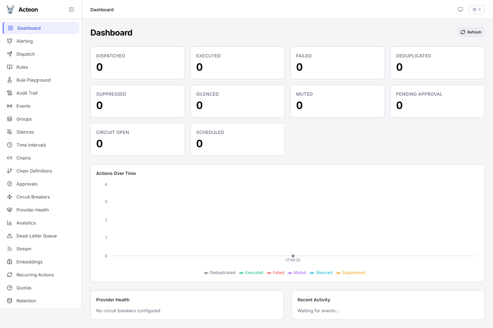
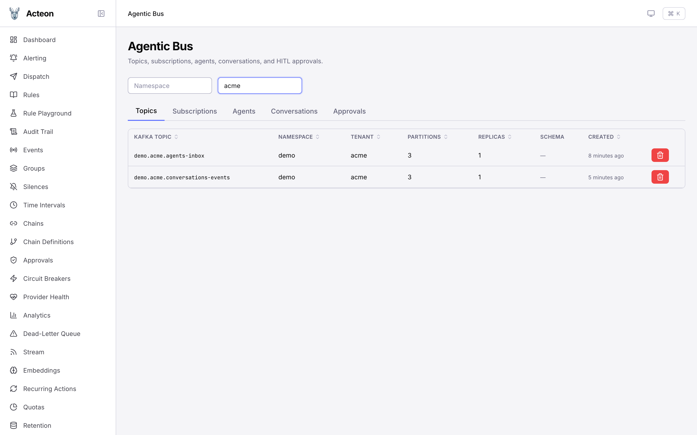
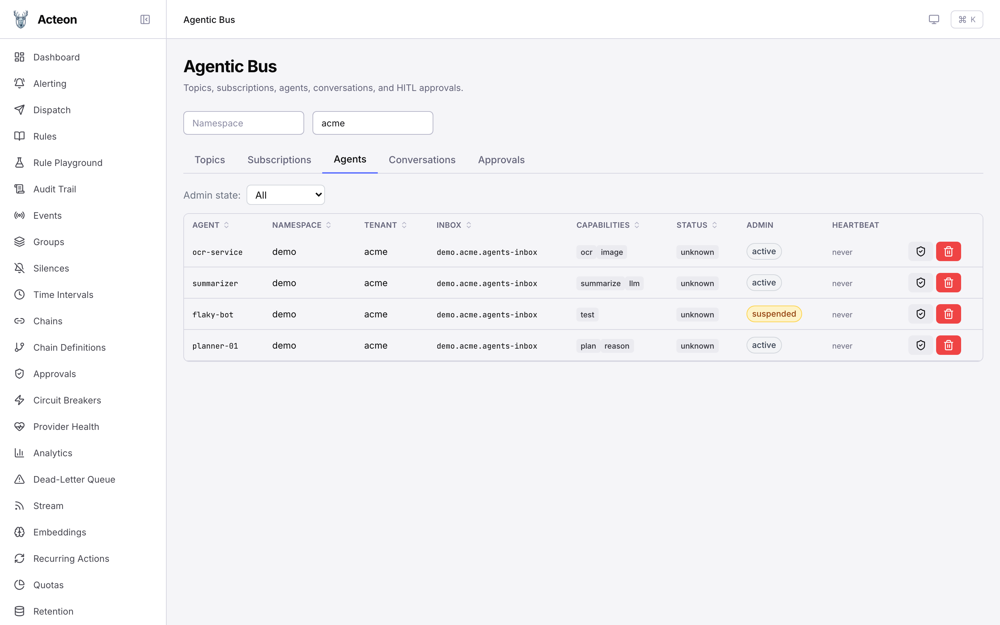
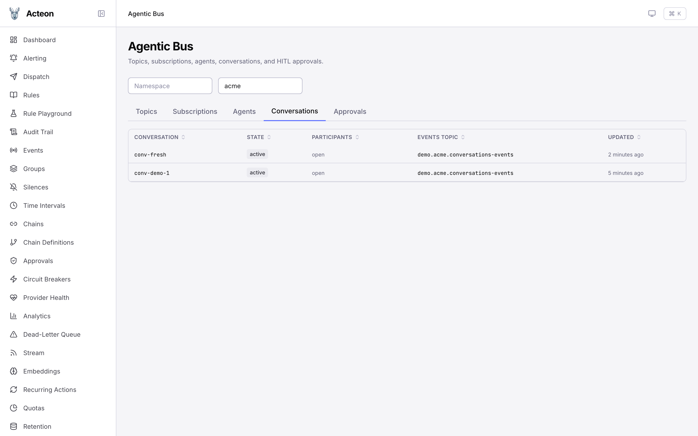
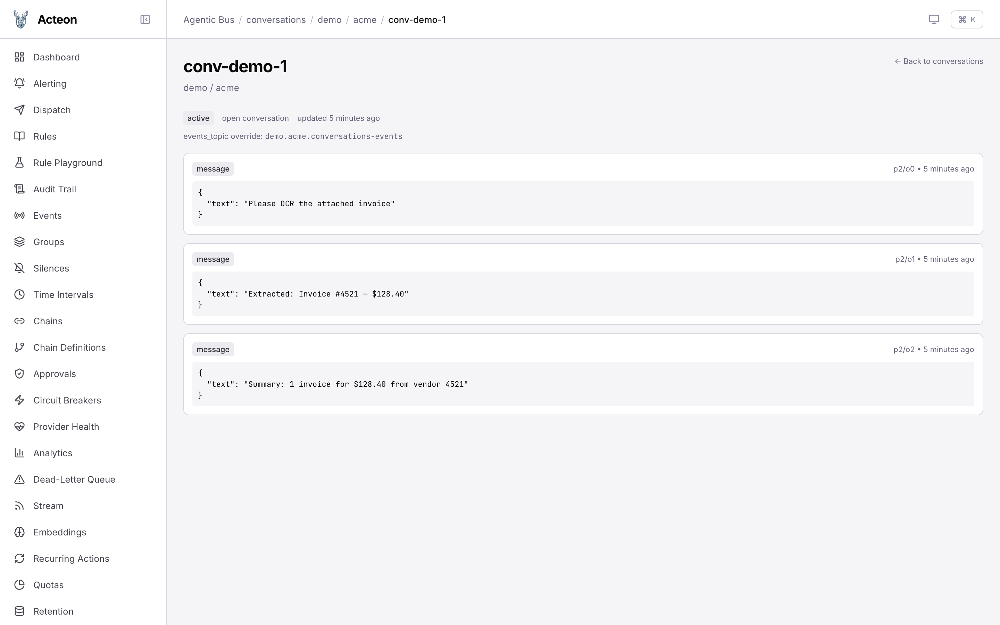

# Tutorial — registering, discovering and governing A2A agents

This walkthrough takes you from an empty stack to a working
multi-agent setup with operator controls. By the end you'll have:

- A bus topic and three registered agents
- A conversation thread with messages visible in the UI
- One agent put through the Active → Suspended → Banned lifecycle
- An A2A AgentCard published for discovery via `/.well-known/agent-card`

> **What you need**
> Docker, `curl`, and the Acteon repository checked out. No external
> Kafka/Redis required — we'll use the in-memory bus backend for a
> two-minute setup.

## 1. Bring the stack up

The repository ships a `docker-compose.yml` that wires the server to
Redis (state), Kafka (bus), Prometheus and Grafana:

```bash
docker compose up -d
```

If you prefer running the server natively against an in-memory bus
(faster iteration, no Kafka), drop this into `acteon.toml` next to
the repo root and start the binary:

```toml
[server]
host = "127.0.0.1"
port = 8080

[state]
backend = "memory"

[audit]
backend = "memory"

[bus]
enabled = true
backend = "memory"
```

```bash
cargo run -p acteon-server --features bus
```

Either way, the API is now at `http://localhost:8080` and the admin
UI is at `http://localhost:5173` (when you run `npm run dev` in
`ui/`) or bundled at `http://localhost:8080/` if you built the UI.

The Dashboard is your first landing page:



## 2. Create a topic

Every bus payload flows through a Kafka topic (or its in-memory
equivalent). Create one for the workload:

```bash
curl -X POST http://localhost:8080/v1/bus/topics/demo/acme \
  -H 'Content-Type: application/json' \
  -d '{"name": "agent-events", "partitions": 3}'
```

You'll see the topic show up under **Agentic Bus → Topics**:



The `demo.acme.agents-inbox` topic auto-materializes on the first
agent registration — you'll see it appear once we register agents in
the next step.

## 3. Register three agents

The bus' **Agent** primitive is the registry. There is no separate
"agent registry" component — `POST /v1/bus/agents` registers, the
list endpoint discovers, and heartbeats keep a row warm. See the
[agentic-bus terminology note](../concepts/agentic-bus.md#a-note-on-terminology-agent-registry)
for why the distinction matters.

```bash
for spec in \
  '{"namespace":"demo","tenant":"acme","agent_id":"planner-01","display_name":"Planning Agent","capabilities":["plan","reason"]}' \
  '{"namespace":"demo","tenant":"acme","agent_id":"ocr-service","display_name":"OCR Service","capabilities":["ocr","image"]}' \
  '{"namespace":"demo","tenant":"acme","agent_id":"summarizer","display_name":"Summarizer","capabilities":["summarize","llm"]}'; do
  curl -s -X POST http://localhost:8080/v1/bus/agents \
    -H 'Content-Type: application/json' -d "$spec" | jq -r '.agent_id'
done
```

Each agent comes back with `admin_state: "active"` and
`status: "unknown"` (until the first heartbeat lands).

Switch to the **Agents** tab. You should see all three rows in
`active` state:



(The screenshot above also shows `flaky-bot`, which we'll create and
suspend in step 5.)

## 4. Run a conversation

Conversations are the bus' state-machine-bounded thread primitive.
Per-conversation Kafka partitioning makes ordering FIFO within a
thread.

```bash
# Create the conversation
curl -X POST http://localhost:8080/v1/bus/conversations \
  -H 'Content-Type: application/json' -d '{
    "conversation_id": "conv-demo-1",
    "namespace": "demo",
    "tenant": "acme",
    "title": "Invoice OCR + summary"
  }'

# Append three messages
for text in \
  "Please OCR the attached invoice" \
  "Extracted: Invoice #4521 — \$128.40" \
  "Summary: 1 invoice for \$128.40 from vendor 4521"; do
  curl -s -X POST \
    http://localhost:8080/v1/bus/conversations/demo/acme/conv-demo-1/messages \
    -H 'Content-Type: application/json' \
    -d "{\"payload\":{\"text\":\"$text\"}}" > /dev/null
done
```

The Conversations tab now lists the new thread:



Click into `conv-demo-1` to see the thread view with the partition /
offset and timestamp on each row:



> **Want to try tool calls or stream chunks?** Each conversation
> message can carry a typed envelope:
> [Phase 6a (tool-call)](../features/bus-phase-6a.md) /
> [Phase 6b (stream)](../features/bus-phase-6b.md) /
> [Phase 6c (approval gate)](../features/bus-phase-6c.md). Each
> phase doc has a "Try it locally" simulation pointer.

## 5. Suspend a misbehaving agent

This is where the [operator lifecycle](../features/operator-lifecycle.md)
comes in. Register one more agent and put it through the three
states.

```bash
# Register a flaky one
curl -X POST http://localhost:8080/v1/bus/agents \
  -H 'Content-Type: application/json' -d '{
    "namespace": "demo", "tenant": "acme",
    "agent_id": "flaky-bot", "display_name": "Flaky Bot",
    "capabilities": ["test"]
  }'

# Suspend with a 1h auto-expire
curl -X PUT \
  http://localhost:8080/v1/bus/agents/demo/acme/flaky-bot/admin-state \
  -H 'Content-Type: application/json' -d '{
    "admin_state": "suspended",
    "reason": "investigating runaway tool calls",
    "expires_at": "2026-05-24T18:00:00Z"
  }'

# A send while suspended -> 403 with the operator's reason
curl -i -X POST \
  http://localhost:8080/v1/bus/agents/demo/acme/flaky-bot/send \
  -H 'Content-Type: application/json' \
  -d '{"payload": {"task": "summarize"}}'
# -> HTTP/1.1 403 Forbidden
# -> {"error":"agent demo/acme/flaky-bot is suspended: investigating runaway tool calls"}
```

The Agents tab now shows `flaky-bot` with a yellow `suspended` admin
badge while its liveness (`status`) is independently tracked:


To ban it permanently when the investigation confirms a problem:

```bash
curl -X PUT \
  http://localhost:8080/v1/bus/agents/demo/acme/flaky-bot/admin-state \
  -H 'Content-Type: application/json' \
  -d '{"admin_state":"banned","reason":"confirmed credential leak"}'
```

The row stays in the registry so the audit metadata
(`admin_set_by`, `admin_set_at`, `admin_reason`) is preserved.
Discovery and routing refuse it the same way they refused the
`Suspended` row.

## 6. Publish an A2A AgentCard

To let external A2A clients discover an agent, publish an
[AgentCard](../features/a2a.md#discovery) at the per-agent slot.
This is what `/.well-known/agent-card` walks.

```bash
curl -X PUT \
  http://localhost:8080/v1/bus/agents/demo/acme/planner-01/card \
  -H 'Content-Type: application/json' -d '{
    "name": "Planning Agent",
    "description": "Plans multi-step actions across other agents.",
    "skills": [
      {"id":"plan","name":"plan","description":"Break a goal into ordered subtasks"}
    ]
  }'

# External A2A clients then walk:
curl http://localhost:8080/a2a/demo/acme/.well-known/agent.json
```

The discovery endpoint omits any agent whose effective `admin_state`
is not `Active`, so suspended/banned agents disappear from the
public surface automatically.

## 7. End-to-end via a simulation

To exercise the same flow programmatically (handy for CI):

```bash
cargo run -p acteon-simulation --features bus \
  --example bus_agent_simulation

cargo run -p acteon-simulation --features bus \
  --example a2a_core_simulation
```

`a2a_core_simulation` walks every A2A `TaskState`
(Submitted, Working, InputRequired, AuthRequired, Completed,
Rejected, Canceled, Failed) including a push-notification
delivery; `bus_agent_simulation` covers heartbeat-driven
`AgentStatus` transitions and capability-based discovery.

## Where to next

| If you want to… | Go to |
|-----------------|-------|
| Understand the seven bus primitives | [Agentic bus concepts](../concepts/agentic-bus.md) |
| Wire production push-notification delivery | [A2A — Push notifications](../features/a2a.md#push-notifications) |
| Manage operator state programmatically | [Operator Lifecycle](../features/operator-lifecycle.md) |
| Drive multi-agent orchestration | [Agent Swarm](../features/agent-swarm.md) |
| Migrate an existing agent workload | [Agentic Bus migration](agentic-bus-migration.md) |
