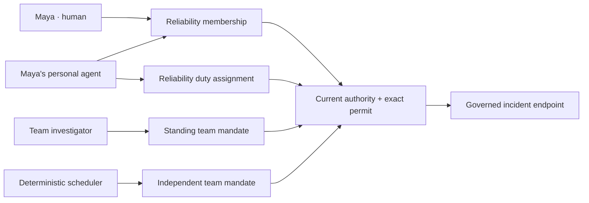

# A workforce under enforceable permits

Maya works on Reliability and Release. Her personal agent helps Reliability,
while a team investigator and a deterministic scheduler hold standing team
mandates. They share one incident endpoint, but each keeps its own identity,
mandate and permit.

This simulation runs the real Acteon server and the typed Python SDK against a
local HTTP receiver. It shows what happens when Maya leaves Reliability, a road
closes, an investigator's mandate is revoked, and the team disbands.



## The scenario

| Participant | Actual actor | Representation | Required relationship |
|---|---|---|---|
| Maya | Human `maya` | Reliability | Maya's Reliability membership |
| Personal assistant | Agent `agent/maya` | Reliability | Ownership, Maya's membership and the agent's duty assignment |
| Investigator | Agent `agent/reliability` | Reliability | Team ownership and a standing mandate |
| Scheduler | Service `scheduler` | Reliability | Its own standing mandate |
| Operator | Human `operator` | Workforce administrator | Independently configured management bounds |

Membership is not a tool grant. The operator explicitly creates each mandate
and publishes an execution permit bound to its exact revision. A mandate allows
two calls per root, each permit allows one, and the deployment ceiling allows
five. Actual root admission uses one call: the intersection of those ceilings.

The assistant's mandate pins **Maya's Reliability membership** and its own
assignment. Removing that membership stops both Maya's team work and the
assistant's dependent work. Maya's active Release membership cannot substitute
for the removed relationship. The standing investigator and scheduler continue
under their independent mandates.

## Run it

From the repository root:

```bash
cargo build -p acteon-server --no-default-features
python3 -m venv /tmp/acteon-workforce-demo
/tmp/acteon-workforce-demo/bin/pip install -e clients/python
/tmp/acteon-workforce-demo/bin/python examples/agent-workforce/run.py \
  --server target/debug/acteon-server \
  --output /tmp/agent-workforce-results.json
```

The runner chooses ephemeral ports, creates temporary authentication credentials,
starts its own server and HTTP receiver, and stops both at the end. It does not
require Redis, an external model or an external agent service. Memory is used for
this local demonstration; the platform uses the configured `StateStore` for
durable workforce and execution state. PostgreSQL restart behavior is separately
covered by real-server integration tests.

<!-- workforce-example-file: acteon.toml -->
```toml
# The runner substitutes ephemeral ports; no external state service is required.
[server]
host = "127.0.0.1"
port = 18080
[state]
backend = "memory"
[ui]
enabled = false
[auth]
enabled = true
config_path = "auth.toml"
watch = false
[auth.authority]
namespace = "auth-control"
tenant = "deployment"
source_id = "city-auth"
bootstrap = true
[[providers]]
name = "incident"
type = "webhook"
url = "http://127.0.0.1:18081/incident"
internal_hosts = ["127.0.0.1"]
[[execution_authority.scopes]]
namespace = "prod"
tenant = "acme"
bootstrap = true
publisher = {id="operations-owner",kind="human"}
subjects = [{id="operator",kind="human"},{id="maya",kind="human"},{id="agent/maya",kind="agent"},{id="agent/reliability",kind="agent"},{id="scheduler",kind="service"}]
routes = [{provider="incident",action_type="execute"}]
valid_from_ms = 0
credential_limits = {max_units=5,max_concurrent=2,deadline_ms=4102444800000}
root_max_units = 5
root_max_concurrent = 1
root_lifetime_ms = 60000
[[execution_authority.scopes.managers]]
principal = {id="operator",kind="human"}
subjects = [{id="maya",kind="human"},{id="agent/maya",kind="agent"},{id="agent/reliability",kind="agent"},{id="scheduler",kind="service"}]
routes = [{provider="incident",action_type="execute"}]
valid_from_ms = 0
limits = {max_units=5,max_concurrent=2,deadline_ms=4102444800000}
can_issue_permits = true
can_intervene = true
[execution_authority.scopes.managers.workforce]
teams = [{domain="prod",tenant="acme",id="reliability"},{domain="prod",tenant="acme",id="release"}]
job_classes = ["execute"]
can_manage_roster = true
can_issue_mandates = true
```

The runner verifies that this configuration matches the checked-in example.
The `workforce` policy independently bounds teams, principals, job classes and
management capabilities. Neither an executor credential nor an ordinary permit
issuer receives roster or mandate management rights automatically.

## Expected deliveries

| Event | Result | Cumulative webhook calls |
|---|---|---:|
| Executor attempts workforce management | HTTP 403 | 0 |
| Personal agent works; same action is retried | Executed; retry reuses admission | 1 |
| Maya, investigator and scheduler each work | Executed | 4 |
| Maya leaves Reliability; human and personal agent try again | Both refused | 4 |
| Standing investigator and scheduler work | Executed | 6 |
| Operator closes the governed resource; investigator tries again | Refused | 6 |
| Operator reopens it; investigator works | Executed | 7 |
| Investigator's mandate is revoked; investigator tries again | Refused | 7 |
| Scheduler works under its independent mandate | Executed | 8 |
| Reliability disbands; scheduler tries again | Refused | 8 |

The runner asserts the outcome and actual delivery count after every dispatch.
The JSON report includes all delivered payloads and the final typed workforce
scope. A refusal can arrive as an HTTP-success dispatch with a `failed` outcome;
applications must inspect the outcome rather than treating status 200 as proof
of execution.

## What this establishes

This is real authenticated, governed execution by four participant identities.
Forged representation fields in action payloads cannot replace the mandate
selected from durable permit bindings. Offboarding, closures, mandate revocation
and team disbandment block new effects while preserving the actual actor.
Already started effects may finish.

The participants are driven by a deterministic scenario runner. It makes zero
model invocations and does not demonstrate autonomous agent discovery or A2A
negotiation. It exercises reusable platform features, described in
[Agent workforce](../features/workforce.md), rather than adding authorization
logic to the scenario. Governed peer send, refresh, and remote cancellation are
available as host-controlled building blocks. Shared team budgets, descendant
delegation, and autonomous registry-driven peer selection remain separate
implementation phases.
